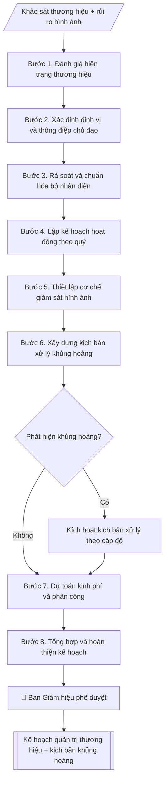

# Lập kế hoạch quản trị thương hiệu

## Định dạng và file đầu ra

Định dạng đầu ra có thể chọn theo sản phẩm/yêu cầu: .docx, .pdf. Đọc mục “Định dạng bổ sung” trong quy cách đầu ra trước khi chọn.

**Phải tạo file thực tế để tải xuống, không chỉ trả nội dung trong chat.** Định dạng mặc định của skill: **.docx**. Nếu có bảng số liệu nghiệp vụ yêu cầu file bảng tính riêng, tạo thêm Excel theo yêu cầu; không tự tạo file kiểm tra. Không chờ người dùng yêu cầu xuất file lần nữa. Ưu tiên định dạng người dùng chỉ định; đọc quy tắc xuất file tại references/quy-cach-dau-ra.md.

## Quy cách đầu ra và thông tin thiếu
Đọc [quy cách và cấu trúc sản phẩm](references/quy-cach-dau-ra.md) trước khi soạn/xuất. File giao chỉ gồm sản phẩm nghiệp vụ được yêu cầu; kiểm tra nội bộ không xuất kèm. Thiếu thông tin thì giữ nguyên trường/mục và chỗ điền theo mẫu gốc (dòng dấu chấm, dấu gạch hoặc ô trống); không tự điền dữ liệu mẫu, số 0, mã chờ xác minh hay dòng chờ ký. Mẫu chuyên ngành còn áp dụng được ưu tiên về cấu trúc, mã biểu và người ký. Bản đầy đủ: [quy tắc chung](references/quy-tac-chung.md).

## Kiểm soát áp dụng và phê duyệt
Trước khi chạy, xác định `ngay_ap_dung`, `loai_hinh_truong`, `quy_che_noi_bo`, `nguon_du_lieu`, `nguoi_kiem_duyet`; chỉ hỏi thông tin liên quan nghiệp vụ, không dùng giá trị giả định thay dữ liệu bắt buộc. Đối chiếu căn cứ pháp lý với văn bản gốc, hiệu lực, điều khoản áp dụng và chuyển tiếp. Bản đầy đủ: [quy tắc chung](references/quy-tac-chung.md).

## Giới hạn và human gate
AI hỗ trợ chuẩn bị và đối chiếu; cán bộ phụ trách kiểm tra dữ liệu/căn cứ, người có thẩm quyền duyệt và ký. Không đánh dấu đã ký, đã duyệt, đã công bố khi chưa có chứng cứ. Dữ liệu sinh viên, sức khỏe, nhân sự, tài chính chỉ dùng theo mục đích và phân quyền, che thông tin định danh khi dùng ví dụ (Luật 91/2025/QH15, hiệu lực 01/01/2026); không tải dữ liệu lên dịch vụ ngoài khi chưa có quyền. Bản đầy đủ: [quy tắc chung](references/quy-tac-chung.md).

## Khi nào dùng
Khi đơn vị phụ trách truyền thông – thương hiệu cần xây dựng kế hoạch quản trị thương hiệu
năm/quý, hoặc khi cần củng cố hình ảnh trường sau một sự kiện/chiến dịch lớn.

## Đầu vào (Input)

| Trường | Mô tả | Bắt buộc |
|---|---|---|
| `muc_tieu` | Mục tiêu thương hiệu trong kỳ (VD: tăng nhận biết trong thí sinh THPT) | Có |
| `dinh_vi` | Định vị thương hiệu mong muốn (VD: đại học ứng dụng gắn với doanh nghiệp) | Có |
| `doi_tuong` | Nhóm đối tượng trọng tâm: thí sinh, phụ huynh, doanh nghiệp, cựu sinh viên... | Có |
| `kenh` | Kênh triển khai: website, fanpage, báo chí, sự kiện... | Không |
| `ngan_sach` | Dự toán kinh phí | Không |
| `rui_ro` | Các rủi ro hình ảnh đã nhận diện cần theo dõi | Không |

## Quy trình

**Bước 1. Đánh giá hiện trạng thương hiệu**
- Làm gì: tổng hợp dữ liệu hiện có: kết quả khảo sát nhận biết/thiện cảm (nếu có), thống kê truyền thông (lượt nhắc tích cực/tiêu cực trên báo chí, mạng xã hội); lập bảng điểm mạnh – điểm yếu hình ảnh theo từng nhóm `doi_tuong`.
- Dùng input: `doi_tuong`, `muc_tieu`.
- Vai trò: Chuyên viên Phòng Truyền thông – Tuyển sinh · AI hỗ trợ: tổng hợp, chuẩn hóa dữ liệu, lập bảng biểu, định dạng · ⏱ ~1–2 giờ (ước tính)
- Lưu ý nghiệp vụ: không bịa số liệu khảo sát — chưa có số liệu thì ghi "chưa có dữ liệu" và đề xuất khảo sát bổ sung trong kế hoạch.
- → Kết quả bước: Báo cáo hiện trạng thương hiệu (điểm mạnh/yếu theo nhóm đối tượng).

**Bước 2. Xác định định vị và thông điệp chủ đạo**
- Làm gì: từ `dinh_vi`, chốt câu định vị (≤ 15 từ) + 1 thông điệp chủ đạo cho kỳ kế hoạch; kiểm tra nhất quán với chiến lược phát triển trường và không mâu thuẫn với thông điệp các chiến dịch đang chạy.
- Dùng input: `dinh_vi`, `muc_tieu` + báo cáo hiện trạng (Bước 1).
- Vai trò: Chuyên viên Phòng Truyền thông – Tuyển sinh · AI hỗ trợ: đối chiếu tự động, cảnh báo sai lệch · ⏱ ~1–2 giờ (ước tính)
- Lưu ý nghiệp vụ: định vị phải khác biệt và chứng minh được bằng thực tế đào tạo; tránh khẩu hiệu chung chung.
- → Kết quả bước: Định vị và thông điệp chủ đạo đã chốt.

**Bước 3. Rà soát và chuẩn hóa bộ nhận diện**
- Làm gì: kiểm kê logo, màu sắc, slogan, mẫu văn bản/slide/backdrop hiện hành; đối chiếu với quy định sử dụng; lập danh sách điểm chưa chuẩn (sai màu, sai tỉ lệ logo, nhiều phiên bản slogan) và đề xuất chuẩn hóa/bổ sung.
- Dùng input: định vị và thông điệp chủ đạo (Bước 2).
- Vai trò: Chuyên viên Phòng Truyền thông – Tuyển sinh · AI hỗ trợ: đối chiếu tự động, cảnh báo sai lệch, lập bảng biểu, định dạng · ⏱ ~1–2 giờ (ước tính)
- Lưu ý nghiệp vụ: mọi ấn phẩm đối ngoại phải dùng đúng 1 bộ nhận diện; đề xuất ban hành "Sổ tay nhận diện thương hiệu" nếu chưa có.
- → Kết quả bước: Bảng rà soát nhận diện (hạng mục – hiện trạng – đề xuất chuẩn hóa).

**Bước 4. Lập kế hoạch hoạt động theo quý**
- Làm gì: từ `kenh`, thiết kế chiến dịch theo quý: mỗi quý 1 chủ đề lớn; mỗi chiến dịch ghi kênh chính, nội dung trọng tâm, sự kiện thương hiệu; gắn KPI từng quý (bài đăng, lượt tiếp cận, bài báo).
- Dùng input: `kenh`, `muc_tieu` + thông điệp chủ đạo (Bước 2).
- Vai trò: Chuyên viên Phòng Truyền thông – Tuyển sinh · AI hỗ trợ: lập bảng biểu, định dạng · ⏱ ~30–60 phút (ước tính)
- Lưu ý nghiệp vụ: hoạt động phải gắn với lịch tuyển sinh và sự kiện lớn của trường trong năm; KPI đo được, không chung chung.
- → Kết quả bước: Kế hoạch hoạt động theo quý (chiến dịch – kênh – KPI).

**Bước 5. Thiết lập cơ chế giám sát hình ảnh**
- Làm gì: quy định theo dõi hằng ngày báo chí/mạng xã hội (từ khóa theo dõi, đầu mối); mẫu báo cáo tuần; bộ chỉ số đo lường: lượt nhắc tích cực/tiêu cực, mức độ nhận biết (khảo sát 6 tháng/lần).
- Dùng input: `doi_tuong`, `rui_ro`.
- Vai trò: Chuyên viên Phòng Truyền thông – Tuyển sinh · AI hỗ trợ: xử lý sơ bộ, tổng hợp · ⏱ ~30–60 phút (ước tính)
- Lưu ý nghiệp vụ: phân công người trực giám sát cụ thể theo ca/ngày; tin tiêu cực phải được phát hiện trong vòng 4 giờ làm việc.
- → Kết quả bước: Quy chế giám sát hình ảnh (từ khóa – đầu mối – mẫu báo cáo – chỉ số).

**Bước 6. Xây dựng kịch bản xử lý khủng hoảng**
- Làm gì: từ `rui_ro`, phân 3 cấp độ sự cố; mỗi cấp độ quy định: dấu hiệu nhận biết, người phát ngôn, thời hạn phản ứng (cấp 1: phản hồi trong 4 giờ; cấp 2: thông cáo trong 24 giờ; cấp 3: báo cáo BGH ngay + phối hợp cơ quan chức năng), kênh phát ngôn chính thức, mẫu thông cáo khung.
- Dùng input: `rui_ro` + cơ chế giám sát (Bước 5).
- Vai trò: Chuyên viên Phòng Truyền thông – Tuyển sinh · AI hỗ trợ: lập bảng biểu, định dạng · ⏱ ~30–60 phút (ước tính)
- Lưu ý nghiệp vụ: chỉ người phát ngôn do Hiệu trưởng chỉ định được phát ngôn chính thức; ưu tiên phản hồi minh bạch thay vì xóa bình luận tiêu cực một cách tùy tiện.
- → Kết quả bước: Kịch bản xử lý khủng hoảng 3 cấp độ (kèm mẫu thông cáo khung).

**Bước 7. Dự toán kinh phí và phân công thực hiện**
- Làm gì: từ `ngan_sach`, phân bổ kinh phí cho từng hạng mục (chuẩn hóa nhận diện, chiến dịch theo quý, giám sát, dự phòng khủng hoảng); ghi đơn vị chủ trì/phối hợp, KPI và thời hạn từng hạng mục.
- Dùng input: `ngan_sach` + kế hoạch hoạt động (Bước 4) + bảng rà soát nhận diện (Bước 3).
- Vai trò: Chuyên viên Phòng Truyền thông – Tuyển sinh · AI hỗ trợ: xử lý sơ bộ, tổng hợp · ⏱ ~1–2 giờ (ước tính)
- Lưu ý nghiệp vụ: dành 10–15% ngân sách dự phòng cho xử lý khủng hoảng; tổng phân bổ khớp ngân sách được duyệt.
- → Kết quả bước: Bảng dự toán và phân công (hạng mục – kinh phí – đơn vị – KPI – thời hạn).

**Bước 8. Tổng hợp và hoàn thiện kế hoạch**
- Làm gì: ghép các bán thành phẩm Bước 1–7 thành văn bản kế hoạch theo thể thức hành chính (số ký hiệu, nơi nhận, chữ ký); rà soát tính nhất quán: mục tiêu – định vị – hoạt động – KPI – kinh phí.
- Dùng input: toàn bộ bán thành phẩm Bước 1–7.
- Vai trò: Chuyên viên Phòng Truyền thông – Tuyển sinh · AI hỗ trợ: tổng hợp, chuẩn hóa dữ liệu, đối chiếu tự động, cảnh báo sai lệch · ⏱ ~30–60 phút (ước tính)
- Lưu ý nghiệp vụ: kiểm tra số ký hiệu văn bản không trùng; nơi nhận đầy đủ các đơn vị phối hợp.
- → Kết quả bước: Kế hoạch quản trị thương hiệu hoàn chỉnh (sẵn sàng trình phê duyệt).

## Luồng quy trình (Workflow)

## Đầu ra

File nghiệp vụ thực tế theo định dạng mặc định ở đầu skill hoặc định dạng người dùng yêu cầu, kèm liên kết tải trong phản hồi cuối.

Sản phẩm nghiệp vụ hoàn chỉnh theo [quy cách và cấu trúc](references/quy-cach-dau-ra.md), giữ các trường chưa có dữ liệu ở trạng thái trống. Không xuất kèm checklist/phụ lục kiểm tra đầu ra.

## Kiểm tra nội bộ trước khi giao

- [ ] Bố cục khớp mẫu áp dụng và cấu trúc tại references/quy-cach-dau-ra.md.
- [ ] Có đầy đủ sản phẩm: Kế hoạch quản trị thương hiệu hoàn chỉnh
- [ ] Có đầy đủ sản phẩm: Phụ lục: bảng KPI đo lường + kịch bản xử lý khủng hoảng truyền thông
- [ ] Mọi số liệu, tên, ngày tháng trong output khớp với Input đã cung cấp (không thêm bớt, không suy đoán)
- [ ] Không bịa đặt số liệu, minh chứng, trích dẫn hay căn cứ
- [ ] Đúng thể thức, định dạng văn bản theo quy định hiện hành
- [ ] Căn cứ pháp lý nêu đầy đủ, còn hiệu lực tại thời điểm lập
- [ ] Đã qua Human gate: người có thẩm quyền đã kiểm tra/ký duyệt trước khi phát hành
- [ ] Không bịa số liệu khảo sát — chưa có số liệu thì ghi "chưa có dữ liệu" và đề xuất khảo sát bổ sung trong kế hoạch.
- [ ] Định vị phải khác biệt và chứng minh được bằng thực tế đào tạo

> Tiêu chí đạt: tất cả các ô đều được đánh dấu.

## Human gate (người kiểm duyệt)
- Trưởng phòng Truyền thông (đơn vị phụ trách thương hiệu) soạn và chịu trách nhiệm nội dung.
- Ban Giám hiệu phê duyệt kế hoạch và ngân sách.
- Trong khủng hoảng: chỉ người phát ngôn do Hiệu trưởng chỉ định được phát ngôn chính thức.

## Giới hạn (guardrails)
- AI không tự phát ngôn thay trường, đặc biệt trong tình huống khủng hoảng.
- AI không bịa số liệu khảo sát thương hiệu; mọi con số phải có nguồn.
- AI không sử dụng hình ảnh, âm nhạc, tư liệu không rõ bản quyền.

## Căn cứ & lưu ý
- Quy chế phát ngôn và cung cấp thông tin của trường (văn bản nội bộ).
- Luật Báo chí khi làm việc với cơ quan báo chí.
- Không dùng tên thật của trường/cá nhân khi mô phỏng.

## Quản trị phiên bản
- Phiên bản gói `1.3.2` (cập nhật 2026-10-10); hồ sơ đầy đủ tại [references/version.json](references/version.json).
- Người phê duyệt nghiệp vụ: **chưa chỉ định**. Trạng thái: dự thảo nghiệp vụ; kiểm tra pháp lý trước thực thi. Ngày cập nhật không đồng nghĩa mọi văn bản đã được rà soát toàn văn.
- Giấy phép theo LICENSE của kho (bản quyền CES Global). Lịch sử thay đổi: CHANGELOG.md.
