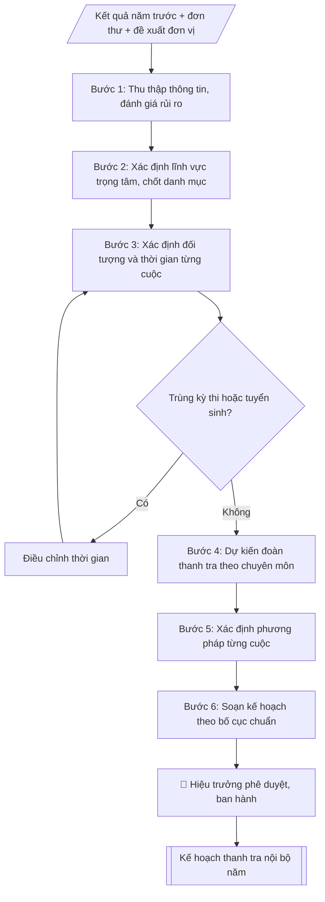

# Skill: Lập kế hoạch thanh tra nội bộ năm

## Khi nào dùng
Khi cần xây dựng kế hoạch thanh tra nội bộ hằng năm của trường: đầu năm học/năm tài chính,
khi có yêu cầu tăng cường kiểm tra một lĩnh vực có rủi ro cao, hoặc khi rà soát lại kế hoạch
giữa năm để điều chỉnh, bổ sung cuộc thanh tra đột xuất.

## Đầu vào (Input)

| Trường | Mô tả | Bắt buộc |
|---|---|---|
| `nam_ke_hoach` | Năm thực hiện thanh tra (VD: 2027) | Có |
| `linh_vuc` | Các lĩnh vực dự kiến thanh tra: đào tạo, tuyển sinh, thi cử, tài chính, quản lý sinh viên, NCKH, cơ sở vật chất... | Có |
| `doi_tuong` | Đơn vị/đối tượng cụ thể của từng cuộc thanh tra | Có |
| `thoi_gian` | Thời gian tiến hành từng cuộc (tháng hoặc quý) | Có |
| `doan_thanh_tra` | Trưởng đoàn, thành viên dự kiến của từng cuộc | Có |
| `phuong_phap` | Phương pháp: kiểm tra hồ sơ, đối chiếu số liệu, phỏng vấn, khảo sát... | Không (mặc định theo lĩnh vực) |
| `muc_dich_yeu_cau` | Mục đích, yêu cầu chung của kế hoạch | Không |

## Quy trình

**Bước 1. Thu thập thông tin đầu vào**
- Làm gì: rà soát kết quả thanh tra, kiểm tra năm trước (tồn tại chưa khắc phục, lĩnh vực nhiều năm chưa thanh tra); tổng hợp đơn thư khiếu nại, tố cáo, phản ánh; tiếp nhận đề xuất thanh tra của các đơn vị; đánh giá mức rủi ro (cao/trung bình/thấp) cho từng lĩnh vực.
- Dùng input: `linh_vuc` (danh mục dự kiến, dùng làm khung rà soát), `muc_dich_yeu_cau`.
- Vai trò: Chuyên viên Phòng Thanh tra – Pháp chế · AI hỗ trợ: tổng hợp, chuẩn hóa dữ liệu, đối chiếu tự động, cảnh báo sai lệch · ⏱ ~1–2 giờ (ước tính)
- Lưu ý nghiệp vụ: lĩnh vực rủi ro cao (tuyển sinh, thi cử, văn bằng chứng chỉ, thu chi tài chính) luôn được ưu tiên; không để lĩnh vực trọng yếu bị bỏ sót nhiều năm liên tiếp.
- → Kết quả bước: Bảng đánh giá rủi ro theo lĩnh vực + danh sách đề xuất thanh tra.

**Bước 2. Xác định lĩnh vực trọng tâm và danh mục cuộc thanh tra**
- Làm gì: chốt danh sách các cuộc thanh tra trong năm; mỗi cuộc ghi rõ nội dung, lĩnh vực, lý do lựa chọn (rủi ro cao / thanh tra định kỳ / theo đơn thư); bảo đảm các lĩnh vực trọng yếu được bao phủ.
- Dùng input: `linh_vuc`, `doi_tuong`.
- Vai trò: Chuyên viên Phòng Thanh tra – Pháp chế · AI hỗ trợ: xử lý sơ bộ, tổng hợp · ⏱ ~30–90 phút (ước tính)
- Lưu ý nghiệp vụ: số lượng cuộc phải phù hợp năng lực của đoàn; ghi rõ căn cứ lựa chọn để giải trình khi trình duyệt.
- → Kết quả bước: Danh mục cuộc thanh tra dự kiến (nội dung – lĩnh vực – lý do lựa chọn).

**Bước 3. Xác định đối tượng và thời gian từng cuộc**
- Làm gì: gán đơn vị được thanh tra và thời gian thực hiện (tháng/quý) cho từng cuộc; đối chiếu với lịch thi, mùa tuyển sinh, đợt kiểm định để loại trừ trùng lặp; nếu trùng thì điều chỉnh thời gian.
- Dùng input: `doi_tuong`, `thoi_gian`.
- Vai trò: Chuyên viên Phòng Thanh tra – Pháp chế · AI hỗ trợ: đối chiếu tự động, cảnh báo sai lệch · ⏱ ~1–2 giờ (ước tính)
- Lưu ý nghiệp vụ: không dồn nhiều cuộc vào cùng một thời điểm tại cùng một đơn vị; để dự phòng thời gian cho thanh tra đột xuất phát sinh trong năm.
- → Kết quả bước: Bảng phân công đối tượng – thời gian từng cuộc (đã loại trừ trùng lịch).

**Bước 4. Dự kiến đoàn thanh tra**
- Làm gì: với từng cuộc, chỉ định Trưởng đoàn (cán bộ Phòng Thanh tra & Pháp chế) và thành viên có chuyên môn phù hợp lĩnh vực thanh tra; ghi rõ số lượng, đơn vị công tác của từng người.
- Dùng input: `doan_thanh_tra`.
- Vai trò: Trưởng phòng Thanh tra – Pháp chế (dự kiến nhân sự đoàn thanh tra) · AI hỗ trợ: xử lý sơ bộ, tổng hợp · ⏱ ~30–90 phút (ước tính)
- Lưu ý nghiệp vụ: không để thành viên thanh tra đơn vị mình đang công tác (tránh xung đột lợi ích); thành viên phải có chuyên môn tương ứng lĩnh vực được thanh tra.
- → Kết quả bước: Danh sách đoàn thanh tra của từng cuộc.

**Bước 5. Xác định phương pháp thanh tra**
- Làm gì: chọn phương pháp cho từng cuộc: kiểm tra hồ sơ, sổ sách; đối chiếu số liệu; làm việc trực tiếp, phỏng vấn; khảo sát, lấy ý kiến các bên liên quan; nếu input không nêu thì dùng phương pháp mặc định theo lĩnh vực.
- Dùng input: `phuong_phap` (nếu có; mặc định theo lĩnh vực).
- Vai trò: Chuyên viên Phòng Thanh tra – Pháp chế · AI hỗ trợ: đối chiếu tự động, cảnh báo sai lệch · ⏱ ~0,5–1 ngày làm việc (ước tính)
- Lưu ý nghiệp vụ: lĩnh vực tài chính, văn bằng bắt buộc có đối chiếu số liệu độc lập; phỏng vấn phải có biên bản.
- → Kết quả bước: Bảng phương pháp thanh tra theo từng cuộc.

**Bước 6. Soạn kế hoạch theo bố cục chuẩn**
- Làm gì: lắp các bán thành phẩm vào bố cục chuẩn: I. Mục đích – Yêu cầu; II. Nội dung thanh tra (bảng tổng hợp các cuộc); III. Phương pháp; IV. Tổ chức thực hiện (kèm điều khoản thanh tra đột xuất).
- Dùng input: `muc_dich_yeu_cau`, `nam_ke_hoach`.
- Vai trò: Chuyên viên Phòng Thanh tra – Pháp chế · AI hỗ trợ: soạn dự thảo, tổng hợp, chuẩn hóa dữ liệu · ⏱ ~30–60 phút (ước tính)
- Lưu ý nghiệp vụ: số liệu giữa các bảng phải khớp nhau (tên cuộc, đối tượng, thời gian, đoàn); thẩm quyền ký ban hành là Hiệu trưởng.
- → Kết quả bước: Dự thảo Kế hoạch thanh tra nội bộ năm.

**Bước 7. Trình phê duyệt và triển khai**
- Làm gì: trình Hiệu trưởng ký ban hành; gửi kế hoạch đến các đơn vị được thanh tra và đơn vị liên quan để phối hợp; lưu hồ sơ theo dõi.
- Dùng input: (kết quả Bước 6).
- Vai trò: Chuyên viên Phòng Thanh tra – Pháp chế (chuẩn bị hồ sơ trình); Hiệu trưởng (người ký) ban hành · AI hỗ trợ: chuẩn bị hồ sơ trình đầy đủ, lưu trữ hồ sơ · ⏱ ~1–3 giờ (ước tính)
- Lưu ý nghiệp vụ: kế hoạch phải ban hành trước cuộc thanh tra đầu tiên trong năm; điều chỉnh, bổ sung giữa năm phải trình Hiệu trưởng phê duyệt lại.
- → Kết quả bước: Kế hoạch đã ban hành + danh sách đơn vị nhận.

## Luồng quy trình (Workflow)


```

## Đầu ra (Output)
- Kế hoạch thanh tra nội bộ năm hoàn chỉnh (markdown, sẵn sàng trình ký).
- Bảng tổng hợp các cuộc thanh tra: nội dung, đối tượng, thời gian, đoàn thanh tra.
- Ghi chú các cuộc thanh tra đột xuất có thể phát sinh trong năm.

**Cấu trúc output chuẩn:** Kế hoạch thanh tra nội bộ năm gồm các phần bắt buộc theo đúng thứ tự sau:
1. Phần đầu: quốc hiệu – tiêu ngữ, tên đơn vị lập (Phòng Thanh tra & Pháp chế), số/ký hiệu, địa danh – ngày tháng, tên văn bản "KẾ HOẠCH Thanh tra nội bộ năm ...".
2. I. Mục đích, yêu cầu (mục đích + yêu cầu).
3. II. Nội dung thanh tra: bảng STT – Nội dung thanh tra – Đối tượng – Thời gian – Đoàn thanh tra.
4. III. Phương pháp thanh tra.
5. IV. Tổ chức thực hiện: trách nhiệm Phòng Thanh tra & Pháp chế, trách nhiệm đơn vị được thanh tra, điều khoản thanh tra đột xuất.
6. Phần cuối: nơi nhận, chữ ký Hiệu trưởng.

## Checklist nghiệm thu

- [ ] Đủ các phần theo "Cấu trúc output chuẩn": Phần đầu; I. Mục đích, yêu cầu (mục đích + yêu cầu).; II. Nội dung thanh tra; III. Phương pháp thanh tra.; IV. Tổ chức thực hiện; Phần cuối
- [ ] Có đầy đủ sản phẩm: Kế hoạch thanh tra nội bộ năm hoàn chỉnh (markdown, sẵn sàng trình ký)
- [ ] Có đầy đủ sản phẩm: Bảng tổng hợp các cuộc thanh tra: nội dung, đối tượng, thời gian, đoàn thanh tra
- [ ] Mọi số liệu, tên, ngày tháng trong output khớp với Input đã cung cấp (không thêm bớt, không suy đoán)
- [ ] Không bịa đặt số liệu, minh chứng, trích dẫn hay căn cứ
- [ ] Đúng thể thức, định dạng văn bản theo quy định hiện hành
- [ ] Căn cứ pháp lý nêu đầy đủ, còn hiệu lực tại thời điểm lập
- [ ] Đã qua Human gate: người có thẩm quyền đã kiểm tra/ký duyệt trước khi phát hành
- [ ] Lĩnh vực rủi ro cao (tuyển sinh, thi cử, văn bằng chứng chỉ, thu chi tài chính) luôn được ưu tiên
- [ ] Số lượng cuộc phải phù hợp năng lực của đoàn

> Tiêu chí đạt: tất cả các ô đều được đánh dấu.

## Ví dụ mô phỏng (dữ liệu giả lập)

> Tất cả tên trường, cá nhân, số liệu dưới đây đều là **giả lập**, không liên quan tổ chức/cá nhân có thật.

### Input mẫu

| Trường | Giá trị |
|---|---|
| `nam_ke_hoach` | 2027 |
| `linh_vuc` | Tuyển sinh; thi cử; quản lý văn bằng chứng chỉ; kinh phí NCKH; quản lý sinh viên nội trú |
| `doi_tuong` | Phòng Tuyển sinh; Khoa Công nghệ thông tin; Phòng Đào tạo; Phòng KHCN; Ký túc xá sinh viên |
| `thoi_gian` | Quý I; tháng 4; tháng 6; tháng 9; tháng 11 năm 2027 |
| `doan_thanh_tra` | Mỗi đoàn 03 người: 01 Trưởng đoàn (Phòng Thanh tra & Pháp chế) + 02 thành viên chuyên môn |
| `muc_dich_yeu_cau` | Phòng ngừa, phát hiện và xử lý vi phạm; nâng cao kỷ cương trong quản lý đào tạo và tài chính |

### Output mẫu

```
TRƯỜNG ĐẠI HỌC A            CỘNG HÒA XÃ HỘI CHỦ NGHĨA VIỆT NAM
PHÒNG THANH TRA & PHÁP CHẾ               Độc lập – Tự do – Hạnh phúc
      Số: 12/KH-ĐHA-TTPC
                                                 Thành phố C, ngày 15 tháng 01 năm 2027

KẾ HOẠCH
Thanh tra nội bộ năm 2027

I. MỤC ĐÍCH, YÊU CẦU

1. Mục đích
- Phòng ngừa, phát hiện và xử lý kịp thời các vi phạm trong quản lý đào tạo,
tuyển sinh, thi cử và tài chính của Nhà trường.
- Nâng cao ý thức chấp hành pháp luật, quy chế, quy định nội bộ của các đơn vị,
cá nhân; góp phần bảo đảm chất lượng đào tạo.

2. Yêu cầu
- Thanh tra đúng nội dung, đối tượng, thời gian theo kế hoạch; không làm ảnh hưởng
đến hoạt động bình thường của đơn vị được thanh tra.
- Kết luận thanh tra khách quan, trung thực; kiến nghị xử lý đúng quy định.

II. NỘI DUNG THANH TRA

| STT | Nội dung thanh tra | Đối tượng | Thời gian | Đoàn thanh tra |
|---|---|---|---|---|
| 1 | Công tác tuyển sinh đại học năm 2026 | Phòng Tuyển sinh | Quý I/2027 | Đ/c Nguyễn Văn Hùng (Trưởng đoàn); 02 thành viên |
| 2 | Công tác tổ chức thi kết thúc học phần | Khoa Công nghệ thông tin | Tháng 4/2027 | Đ/c Lê Thị C (Trưởng đoàn); 02 thành viên |
| 3 | Quản lý và cấp phát văn bằng, chứng chỉ | Phòng Đào tạo | Tháng 6/2027 | Đ/c Nguyễn Văn Hùng (Trưởng đoàn); 02 thành viên |
| 4 | Quản lý, sử dụng kinh phí NCKH cấp trường | Phòng KHCN | Tháng 9/2027 | Đ/c Lê Thị C (Trưởng đoàn); 02 thành viên |
| 5 | Công tác quản lý sinh viên nội trú | Ký túc xá sinh viên | Tháng 11/2027 | Đ/c Trần Văn Đức (Trưởng đoàn); 02 thành viên |

III. PHƯƠNG PHÁP THANH TRA
- Kiểm tra hồ sơ, sổ sách, chứng từ liên quan.
- Đối chiếu số liệu giữa các nguồn.
- Làm việc trực tiếp, phỏng vấn cán bộ, giảng viên, sinh viên liên quan.
- Khảo sát, lấy ý kiến các bên liên quan khi cần thiết.

IV. TỔ CHỨC THỰC HIỆN

1. Phòng Thanh tra & Pháp chế chủ trì, phối hợp với các đơn vị liên quan tổ chức
thực hiện kế hoạch; báo cáo Hiệu trưởng kết quả từng cuộc thanh tra.

2. Thủ trưởng các đơn vị được thanh tra có trách nhiệm chuẩn bị hồ sơ, tài liệu và
tạo điều kiện để Đoàn thanh tra hoàn thành nhiệm vụ.

3. Ngoài các cuộc thanh tra theo kế hoạch, Hiệu trưởng có thể quyết định thanh tra
đột xuất khi phát hiện dấu hiệu vi phạm hoặc khi có đơn thư khiếu nại, tố cáo.

Nơi nhận:                                           HIỆU TRƯỞNG
- Các đơn vị được thanh tra;
- Lưu: VT, TTPC.                                        (đã ký)

                                                 PGS.TS. Trần Văn B
```

### Checklist kiểm tra kế hoạch (output kèm theo)
- [x] Mục đích, yêu cầu rõ ràng
- [x] Đủ các lĩnh vực trọng yếu (tuyển sinh, thi cử, tài chính)
- [x] Mỗi cuộc có đối tượng, thời gian, đoàn thanh tra cụ thể
- [x] Thời gian không trùng kỳ thi, mùa tuyển sinh
- [x] Điều khoản thanh tra đột xuất
- [x] Thẩm quyền ký (Hiệu trưởng) phù hợp

## Căn cứ & lưu ý
- Luật Thanh tra 2022 (Luật số 11/2022/QH15).
- Nghị định 43/2023/NĐ-CP quy định chi tiết một số điều và biện pháp thi hành Luật Thanh tra.
- Nghị định 42/2013/NĐ-CP về tổ chức và hoạt động thanh tra giáo dục.
- Điều lệ trường đại học (Quyết định 70/2014/QĐ-TTg); Quy chế tổ chức và hoạt động của trường.
- Kế hoạch thanh tra năm phải được ban hành trước khi triển khai cuộc thanh tra đầu tiên
trong năm; điều chỉnh kế hoạch giữa năm phải trình Hiệu trưởng phê duyệt lại.
- Không dùng tên thật của trường/cá nhân khi mô phỏng.
