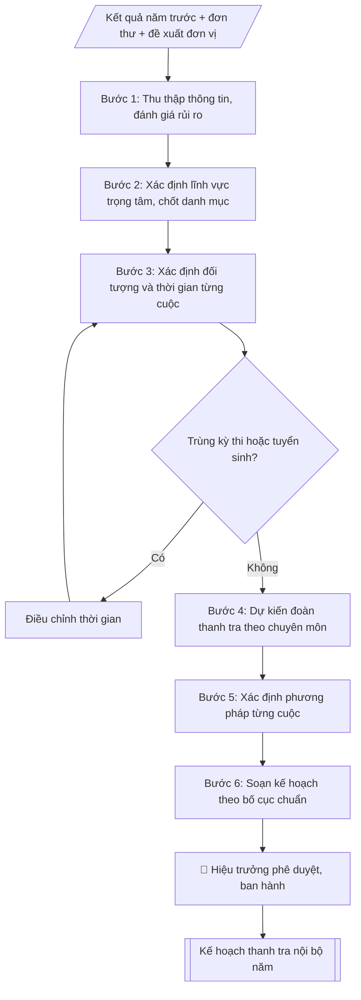

# Lập kế hoạch thanh tra nội bộ năm

## Định dạng và file đầu ra

Định dạng đầu ra có thể chọn theo sản phẩm/yêu cầu: .docx, .pdf. Đọc mục “Định dạng bổ sung” trong quy cách đầu ra trước khi chọn.

**Phải tạo file thực tế để tải xuống, không chỉ trả nội dung trong chat.** Định dạng mặc định của skill: **.docx**. Nếu có bảng số liệu nghiệp vụ yêu cầu file bảng tính riêng, tạo thêm Excel theo yêu cầu; không tự tạo file kiểm tra. Không chờ người dùng yêu cầu xuất file lần nữa. Ưu tiên định dạng người dùng chỉ định; đọc quy tắc xuất file tại references/quy-cach-dau-ra.md.

## Quy cách đầu ra và thông tin thiếu

Đọc [quy cách và cấu trúc sản phẩm](references/quy-cach-dau-ra.md) trước khi soạn/xuất. File giao chỉ gồm văn bản hoặc sản phẩm nghiệp vụ được yêu cầu; kiểm tra nội bộ không xuất kèm. Thiếu thông tin giữ nguyên trường/mục và chỗ điền theo mẫu gốc (dòng dấu chấm, dấu gạch hoặc ô trống); không tự điền dữ liệu mẫu, số 0, mã chờ xác minh hoặc dòng chờ ký. Mẫu chuyên ngành còn áp dụng được ưu tiên về cấu trúc, mã biểu và người ký. Các trường “bắt buộc” là điều kiện hoàn thiện hồ sơ, không ngăn việc soạn bản có chỗ chừa để điền. Mọi chỉ dẫn “để trống” trong skill được hiểu là không điền dữ liệu và giữ cách chừa chỗ của mẫu gốc, không phải xóa dấu chấm của mẫu.


## Kiểm soát áp dụng và phê duyệt

Trước khi chạy quy trình, xác định `ngay_ap_dung`, `loai_hinh_truong`, `quy_che_noi_bo`, `nguon_du_lieu` và `nguoi_kiem_duyet`. Chỉ yêu cầu thông tin có liên quan đến nghiệp vụ; không dùng giá trị giả định thay dữ liệu bắt buộc. Đối chiếu nội bộ hồ sơ có yếu tố pháp lý với văn bản gốc, hiệu lực, điều khoản áp dụng và chuyển tiếp; không tự đính kèm bảng kiểm tra vào file giao.

## Giới hạn và human gate

AI hỗ trợ chuẩn bị và đối chiếu. Cán bộ phụ trách kiểm tra dữ liệu/căn cứ, người có thẩm quyền duyệt và ký. Văn bản soạn chưa được coi là đã ban hành; không tự chèn nhãn trạng thái kiểm duyệt vào file giao; không đánh dấu đã ký, đã duyệt hoặc đã công bố nếu chưa có chứng cứ. Dữ liệu sinh viên, sức khỏe, nhân sự và tài chính phải hạn chế theo mục đích, phân quyền và che thông tin định danh khi dùng ví dụ. Không tải dữ liệu lên dịch vụ ngoài khi chưa có quyền. Kiểm tra Luật 91/2025/QH15 về bảo vệ dữ liệu cá nhân (hiệu lực 01/01/2026) và quy định áp dụng trước xử lý/chia sẻ dữ liệu cá nhân.

## Khi nào dùng
Khi cần xây dựng kế hoạch thanh tra nội bộ hằng năm của trường: đầu năm học/năm tài chính,
khi có yêu cầu tăng cường kiểm tra một lĩnh vực có rủi ro cao, hoặc khi rà soát lại kế hoạch
giữa năm để điều chỉnh, bổ sung cuộc thanh tra đột xuất.

## Đầu vào (Input)

| Trường | Mô tả | Bắt buộc |
|---|---|---|
| `nam_ke_hoach` | Năm thực hiện thanh tra (VD: 2027) | Có |
| `linh_vuc` | Các lĩnh vực dự kiến thanh tra: đào tạo, tuyển sinh, thi cử, tài chính, quản lý sinh viên, NCKH, cơ sở vật chất... | Có |
| `doi_tuong` | Đơn vị/đối tượng cụ thể của từng cuộc thanh tra | Có |
| `thoi_gian` | Thời gian tiến hành từng cuộc (tháng hoặc quý) | Có |
| `doan_thanh_tra` | Trưởng đoàn, thành viên dự kiến của từng cuộc | Có |
| `phuong_phap` | Phương pháp: kiểm tra hồ sơ, đối chiếu số liệu, phỏng vấn, khảo sát... | Không (mặc định theo lĩnh vực) |
| `muc_dich_yeu_cau` | Mục đích, yêu cầu chung của kế hoạch | Không |

## Quy trình

**Bước 1. Thu thập thông tin đầu vào**
- Làm gì: rà soát kết quả thanh tra, kiểm tra năm trước (tồn tại chưa khắc phục, lĩnh vực nhiều năm chưa thanh tra); tổng hợp đơn thư khiếu nại, tố cáo, phản ánh; tiếp nhận đề xuất thanh tra của các đơn vị; đánh giá mức rủi ro (cao/trung bình/thấp) cho từng lĩnh vực.
- Dùng input: `linh_vuc` (danh mục dự kiến, dùng làm khung rà soát), `muc_dich_yeu_cau`.
- Vai trò: Chuyên viên Phòng Thanh tra – Pháp chế · AI hỗ trợ: tổng hợp, chuẩn hóa dữ liệu, đối chiếu tự động, cảnh báo sai lệch · ⏱ ~1–2 giờ (ước tính)
- Lưu ý nghiệp vụ: lĩnh vực rủi ro cao (tuyển sinh, thi cử, văn bằng chứng chỉ, thu chi tài chính) luôn được ưu tiên; không để lĩnh vực trọng yếu bị bỏ sót nhiều năm liên tiếp.
- → Kết quả bước: Bảng đánh giá rủi ro theo lĩnh vực + danh sách đề xuất thanh tra.

**Bước 2. Xác định lĩnh vực trọng tâm và danh mục cuộc thanh tra**
- Làm gì: chốt danh sách các cuộc thanh tra trong năm; mỗi cuộc ghi rõ nội dung, lĩnh vực, lý do lựa chọn (rủi ro cao / thanh tra định kỳ / theo đơn thư); bảo đảm các lĩnh vực trọng yếu được bao phủ.
- Dùng input: `linh_vuc`, `doi_tuong`.
- Vai trò: Chuyên viên Phòng Thanh tra – Pháp chế · AI hỗ trợ: xử lý sơ bộ, tổng hợp · ⏱ ~30–90 phút (ước tính)
- Lưu ý nghiệp vụ: số lượng cuộc phải phù hợp năng lực của đoàn; ghi rõ căn cứ lựa chọn để giải trình khi trình duyệt.
- → Kết quả bước: Danh mục cuộc thanh tra dự kiến (nội dung – lĩnh vực – lý do lựa chọn).

**Bước 3. Xác định đối tượng và thời gian từng cuộc**
- Làm gì: gán đơn vị được thanh tra và thời gian thực hiện (tháng/quý) cho từng cuộc; đối chiếu với lịch thi, mùa tuyển sinh, đợt kiểm định để loại trừ trùng lặp; nếu trùng thì điều chỉnh thời gian.
- Dùng input: `doi_tuong`, `thoi_gian`.
- Vai trò: Chuyên viên Phòng Thanh tra – Pháp chế · AI hỗ trợ: đối chiếu tự động, cảnh báo sai lệch · ⏱ ~1–2 giờ (ước tính)
- Lưu ý nghiệp vụ: không dồn nhiều cuộc vào cùng một thời điểm tại cùng một đơn vị; để dự phòng thời gian cho thanh tra đột xuất phát sinh trong năm.
- → Kết quả bước: Bảng phân công đối tượng – thời gian từng cuộc (đã loại trừ trùng lịch).

**Bước 4. Dự kiến đoàn thanh tra**
- Làm gì: với từng cuộc, chỉ định Trưởng đoàn (cán bộ Phòng Thanh tra & Pháp chế) và thành viên có chuyên môn phù hợp lĩnh vực thanh tra; ghi rõ số lượng, đơn vị công tác của từng người.
- Dùng input: `doan_thanh_tra`.
- Vai trò: Trưởng phòng Thanh tra – Pháp chế (dự kiến nhân sự đoàn thanh tra) · AI hỗ trợ: xử lý sơ bộ, tổng hợp · ⏱ ~30–90 phút (ước tính)
- Lưu ý nghiệp vụ: không để thành viên thanh tra đơn vị mình đang công tác (tránh xung đột lợi ích); thành viên phải có chuyên môn tương ứng lĩnh vực được thanh tra.
- → Kết quả bước: Danh sách đoàn thanh tra của từng cuộc.

**Bước 5. Xác định phương pháp thanh tra**
- Làm gì: chọn phương pháp cho từng cuộc: kiểm tra hồ sơ, sổ sách; đối chiếu số liệu; làm việc trực tiếp, phỏng vấn; khảo sát, lấy ý kiến các bên liên quan; nếu input không nêu thì dùng phương pháp mặc định theo lĩnh vực.
- Dùng input: `phuong_phap` (nếu có; mặc định theo lĩnh vực).
- Vai trò: Chuyên viên Phòng Thanh tra – Pháp chế · AI hỗ trợ: đối chiếu tự động, cảnh báo sai lệch · ⏱ ~0,5–1 ngày làm việc (ước tính)
- Lưu ý nghiệp vụ: lĩnh vực tài chính, văn bằng bắt buộc có đối chiếu số liệu độc lập; phỏng vấn phải có biên bản.
- → Kết quả bước: Bảng phương pháp thanh tra theo từng cuộc.

**Bước 6. Soạn kế hoạch theo bố cục chuẩn**
- Làm gì: lắp các bán thành phẩm vào bố cục chuẩn: I. Mục đích – Yêu cầu; II. Nội dung thanh tra (bảng tổng hợp các cuộc); III. Phương pháp; IV. Tổ chức thực hiện (kèm điều khoản thanh tra đột xuất).
- Dùng input: `muc_dich_yeu_cau`, `nam_ke_hoach`.
- Vai trò: Chuyên viên Phòng Thanh tra – Pháp chế · AI hỗ trợ: soạn dự thảo, tổng hợp, chuẩn hóa dữ liệu · ⏱ ~30–60 phút (ước tính)
- Lưu ý nghiệp vụ: số liệu giữa các bảng phải khớp nhau (tên cuộc, đối tượng, thời gian, đoàn); thẩm quyền ký ban hành là Hiệu trưởng.
- → Kết quả bước: Dự thảo Kế hoạch thanh tra nội bộ năm.

**Bước 7. Trình phê duyệt và triển khai**
- Làm gì: trình Hiệu trưởng ký ban hành; gửi kế hoạch đến các đơn vị được thanh tra và đơn vị liên quan để phối hợp; lưu hồ sơ theo dõi.
- Dùng input: (kết quả Bước 6).
- Vai trò: Chuyên viên Phòng Thanh tra – Pháp chế (chuẩn bị hồ sơ trình); Hiệu trưởng (người ký) ban hành · AI hỗ trợ: chuẩn bị hồ sơ trình đầy đủ, lưu trữ hồ sơ · ⏱ ~1–3 giờ (ước tính)
- Lưu ý nghiệp vụ: kế hoạch phải ban hành trước cuộc thanh tra đầu tiên trong năm; điều chỉnh, bổ sung giữa năm phải trình Hiệu trưởng phê duyệt lại.
- → Kết quả bước: Kế hoạch đã ban hành + danh sách đơn vị nhận.

## Luồng quy trình (Workflow)


```

## Đầu ra

File nghiệp vụ thực tế theo định dạng mặc định ở đầu skill hoặc định dạng người dùng yêu cầu, kèm liên kết tải trong phản hồi cuối.

Sản phẩm nghiệp vụ hoàn chỉnh theo [quy cách và cấu trúc](references/quy-cach-dau-ra.md), giữ các trường chưa có dữ liệu ở trạng thái trống. Không xuất kèm checklist/phụ lục kiểm tra đầu ra.

## Kiểm tra nội bộ trước khi giao

- [ ] Bố cục khớp mẫu áp dụng và cấu trúc tại references/quy-cach-dau-ra.md.
- [ ] Có đầy đủ sản phẩm: Kế hoạch thanh tra nội bộ năm hoàn chỉnh (markdown, sẵn sàng trình ký)
- [ ] Có đầy đủ sản phẩm: Bảng tổng hợp các cuộc thanh tra: nội dung, đối tượng, thời gian, đoàn thanh tra
- [ ] Mọi số liệu, tên, ngày tháng trong output khớp với Input đã cung cấp (không thêm bớt, không suy đoán)
- [ ] Không bịa đặt số liệu, minh chứng, trích dẫn hay căn cứ
- [ ] Đúng thể thức, định dạng văn bản theo quy định hiện hành
- [ ] Căn cứ pháp lý nêu đầy đủ, còn hiệu lực tại thời điểm lập
- [ ] Đã qua Human gate: người có thẩm quyền đã kiểm tra/ký duyệt trước khi phát hành
- [ ] Lĩnh vực rủi ro cao (tuyển sinh, thi cử, văn bằng chứng chỉ, thu chi tài chính) luôn được ưu tiên
- [ ] Số lượng cuộc phải phù hợp năng lực của đoàn

> Tiêu chí đạt: tất cả các ô đều được đánh dấu.

## Căn cứ & lưu ý
- Luật Thanh tra 2022 (Luật số 11/2022/QH15).
- Nghị định 43/2023/NĐ-CP quy định chi tiết một số điều và biện pháp thi hành Luật Thanh tra.
- ~~Nghị định 42/2013/NĐ-CP về tổ chức và hoạt động thanh tra giáo dục~~ — **[HẾT HIỆU LỰC]** Đã bị bãi bỏ toàn bộ bởi Nghị định 03/2024/NĐ-CP (quy định về cơ quan thực hiện chức năng thanh tra chuyên ngành); không dùng làm căn cứ. Về tổ chức bộ máy thanh tra chuyên ngành, đối chiếu NĐ 03/2024/NĐ-CP; về hoạt động thanh tra, áp dụng Luật Thanh tra 2022 và Nghị định 43/2023/NĐ-CP. [CẦN XÁC MINH: đối chiếu văn bản gốc tại ngày nghiệp vụ]
- Điều lệ trường đại học (Quyết định 70/2014/QĐ-TTg); Quy chế tổ chức và hoạt động của trường.
- Kế hoạch thanh tra năm phải được ban hành trước khi triển khai cuộc thanh tra đầu tiên
trong năm; điều chỉnh kế hoạch giữa năm phải trình Hiệu trưởng phê duyệt lại.
- Không dùng tên thật của trường/cá nhân khi mô phỏng.

## Quản trị phiên bản

- Phiên bản gói: `1.3.1`; ngày cập nhật: `2026-10-10`.
- Kho nguồn: https://github.com/phamtruong91/university-skills-framework
- Người duy trì trên GitHub: `phamtruong91` (Phạm Văn Trường). Người phê duyệt nghiệp vụ: **chưa chỉ định**.
- Commit nguồn trước cập nhật: `346719e6b0318ed034b4b016703f79733aa575e7`. Commit chứa phiên bản này xem bằng `git log -1 -- skills/ke-hoach-thanh-tra-nam`; không tự gán SHA chưa tạo.
- Giấy phép: theo LICENSE của kho; bản quyền CES Global.
- Lịch sử 1.1.0: bổ sung metadata giao diện, kiểm soát áp dụng, quản trị phiên bản.
- Trạng thái: dự thảo nghiệp vụ; kiểm tra pháp lý trước thực thi. Ngày cập nhật không đồng nghĩa mọi văn bản đã được rà soát toàn văn.
