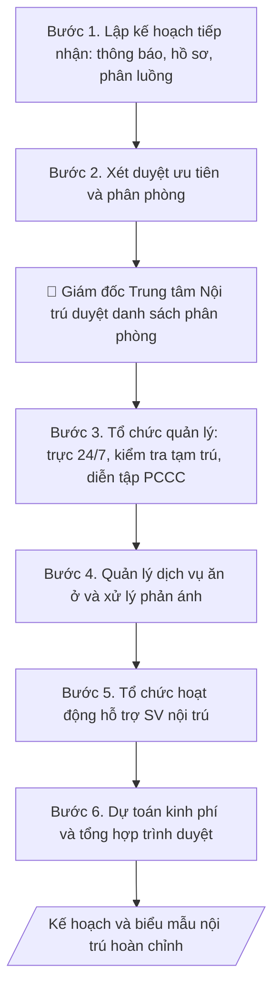

# Kế hoạch tiếp nhận & quản lý nội trú

## Kiểm soát áp dụng và phê duyệt

Trước khi chạy quy trình, xác định `ngay_ap_dung`, `loai_hinh_truong`, `quy_che_noi_bo`, `nguon_du_lieu` và `nguoi_kiem_duyet`. Chỉ yêu cầu thông tin có liên quan đến nghiệp vụ; không dùng giá trị giả định thay dữ liệu bắt buộc. Hồ sơ có yếu tố pháp lý phải kèm văn bản gốc, tình trạng hiệu lực, điều khoản áp dụng và chuyển tiếp.

## Giới hạn và human gate

AI hỗ trợ chuẩn bị và đối chiếu. Cán bộ phụ trách kiểm tra dữ liệu/căn cứ, người có thẩm quyền duyệt và ký. Mọi đầu ra mặc định là **DỰ THẢO – CHỜ KIỂM DUYỆT**; không đánh dấu đã ký, đã duyệt hoặc đã công bố nếu chưa có chứng cứ. Dữ liệu sinh viên, sức khỏe, nhân sự và tài chính phải hạn chế theo mục đích, phân quyền và che thông tin định danh khi dùng ví dụ. Không tải dữ liệu lên dịch vụ ngoài khi chưa có quyền. Kiểm tra Luật 91/2025/QH15 về bảo vệ dữ liệu cá nhân (hiệu lực 01/01/2026) và quy định áp dụng trước xử lý/chia sẻ dữ liệu cá nhân.


## Khi nào dùng
Đầu năm học (hoặc đầu học kỳ), Trung tâm Nội trú/Ký túc xá cần lập kế hoạch tiếp nhận sinh viên
mới, sắp xếp chỗ ở, tổ chức quản lý an ninh trật tự, dịch vụ ăn ở – căng tin, PCCC và các hoạt
động hỗ trợ SV nội trú trong năm.

## Đầu vào (Input)

| Trường | Mô tả | Bắt buộc |
|---|---|---|
| `nam_hoc` | Năm học áp dụng | Có |
| `quy_mo` | Sức chứa, số phòng, số tòa nhà của trung tâm | Có |
| `chi_tieu_tiep_nhan` | Số SV dự kiến tiếp nhận (tân SV, SV cũ đăng ký lại) | Có |
| `tieu_chi_uu_tien` | Thứ tự ưu tiên xét chỗ ở (diện chính sách, SV năm nhất, SV xa nhà...) | Có |
| `nhan_su` | Ban quản lý, bảo vệ, nhân viên phục vụ | Có |
| `dich_vu` | Căng tin, giặt là, wifi, y tế... hiện có | Không |

## Quy trình

**Bước 1. Lập kế hoạch tiếp nhận**
- Làm gì: xây dựng thông báo đăng ký chỗ ở (thời gian, địa điểm, hồ sơ: đơn đăng ký,
  bản sao giấy báo nhập học/CCCD, ảnh 3x4); lập lịch tiếp nhận theo đợt, phân luồng
  tân SV theo khoa/khóa để tránh ùn tắc ngày nhập học; đối chiếu `chi_tieu_tiep_nhan`
  với `quy_mo` để giữ chỗ dự phòng cho đợt bổ sung.
- Dùng input: `nam_hoc`, `quy_mo`, `chi_tieu_tiep_nhan`.
- Vai trò: Cán bộ Trung tâm Nội trú · AI hỗ trợ: soạn thông báo đăng ký chỗ ở, lập lịch tiếp nhận theo đợt và phân luồng khoa/khóa · ⏱ 1–2 giờ (ước tính)
- Lưu ý nghiệp vụ: không tiếp nhận vượt sức chứa — giữ tối thiểu 5–10% chỗ dự phòng;
  lịch tiếp nhận phải khớp lịch nhập học chung của trường; thông báo công khai trước
  ít nhất 2 tuần.
- → Kết quả bước: thông báo đăng ký chỗ ở + lịch tiếp nhận chi tiết theo đợt/khoa.

**Bước 2. Xét duyệt ưu tiên và phân phòng**
- Làm gì: áp dụng `tieu_chi_uu_tien` để xét duyệt (phối hợp Phòng CTSV xác nhận diện
  chính sách); lập danh sách phân phòng theo nguyên tắc cùng khoa/khóa/lớp;
  công khai danh sách đúng thời hạn để SV kịp chuẩn bị.
- Dùng input: `tieu_chi_uu_tien`, `chi_tieu_tiep_nhan`.
- Vai trò: Hội đồng xét duyệt · AI hỗ trợ: sắp xếp danh sách theo tiêu chí ưu tiên đã phê duyệt · ⏱ 2–4 giờ (ước tính)
- Lưu ý nghiệp vụ: AI không tự quyết danh sách ưu tiên thay hội đồng xét duyệt —
  chỉ hỗ trợ sắp xếp theo tiêu chí đã phê duyệt; mọi trường hợp đặc cách phải có
  văn bản chấp thuận; không công khai thông tin cá nhân nhạy cảm của SV trong danh
  sách (chỉ công khai mã SV, phòng).
- → Kết quả bước: danh sách phân phòng dự thảo (mã SV – phòng – tòa nhà).

**Bước 3. Tổ chức quản lý an ninh trật tự và PCCC**
- Làm gì: ban hành/phổ biến nội quy nội trú; phân công trực ban quản lý – bảo vệ 24/7
  (chia ca); lập lịch kiểm tra tạm trú định kỳ; tổ chức diễn tập PCCC toàn trung tâm
  đầu năm học; kiểm tra hệ thống báo cháy, bình chữa cháy, lối thoát hiểm.
- Dùng input: `nhan_su`, `quy_mo`.
- Vai trò: Giám đốc Trung tâm Nội trú · AI hỗ trợ: lập lịch trực 24/7 và kế hoạch diễn tập PCCC, bảo vệ và ban quản lý triển khai, kiểm tra thực tế · ⏱ 0,5–1 ngày làm việc (ước tính)
- Lưu ý nghiệp vụ: diễn tập PCCC phải có phương án và biên bản, phối hợp cảnh sát PCCC
  địa phương khi có thể; kiểm tra tạm trú đúng quy định, không kiểm tra đột xuất ngoài
  giờ gây ảnh hưởng SV.
- → Kết quả bước: lịch trực 24/7 + kế hoạch diễn tập PCCC + nội quy nội trú.

**Bước 4. Quản lý dịch vụ ăn ở**
- Làm gì: quản lý căng tin (kiểm tra VSATTP định kỳ và đột xuất), nước sinh hoạt, điện,
  wifi, vệ sinh khu vực chung; thiết lập cơ chế tiếp nhận và xử lý phản ánh của SV
  (hộp thư góp ý, hotline) với thời hạn xử lý cam kết.
- Dùng input: `dich_vu`, `nhan_su`.
- Vai trò: Cán bộ Trung tâm Nội trú · AI hỗ trợ: soạn quy định quản lý dịch vụ và cơ chế xử lý phản ánh, ban quản lý kiểm tra VSATTP thực tế · ⏱ 2–3 giờ (ước tính)
- Lưu ý nghiệp vụ: cam kết thời hạn xử lý phản ánh cụ thể (VD: 48 giờ) và công khai
  kết quả xử lý; căng tin vi phạm VSATTP phải có chế tài theo hợp đồng đã ký.
- → Kết quả bước: quy định quản lý dịch vụ + cơ chế tiếp nhận, xử lý phản ánh của SV.

**Bước 5. Tổ chức hoạt động hỗ trợ SV nội trú**
- Làm gì: lập lịch sinh hoạt đầu khóa cho SV nội trú (phổ biến nội quy, hướng dẫn
  sinh hoạt); tổ chức câu lạc bộ/sự kiện gắn kết; rà soát SV khó khăn để hỗ trợ
  (miễn/giảm phí, học bổng chỗ ở).
- Dùng input: `chi_tieu_tiep_nhan` (quy mô SV để bố trí hoạt động), `nam_hoc`.
- Vai trò: Cán bộ Trung tâm Nội trú · AI hỗ trợ: lập lịch hoạt động hỗ trợ, Đoàn Thanh niên và Phòng CTSV tổ chức, bảo mật danh tính SV được hỗ trợ · ⏱ 2–3 giờ (ước tính)
- Lưu ý nghiệp vụ: hoạt động hỗ trợ SV khó khăn phải bảo mật thông tin cá nhân —
  không công khai danh tính SV được hỗ trợ; phối hợp Phòng CTSV và Đoàn Thanh niên.
- → Kết quả bước: lịch hoạt động hỗ trợ SV nội trú trong năm.

**Bước 6. Dự toán kinh phí và tổng hợp trình duyệt**
- Làm gì: dự toán kinh phí sửa chữa, PCCC, hoạt động hỗ trợ; gộp chỉ tiêu (Bước 1),
  phân phòng (Bước 2), quản lý (Bước 3), dịch vụ (Bước 4), hoạt động (Bước 5) thành
  kế hoạch hoàn chỉnh; trình Giám đốc Trung tâm Nội trú phê duyệt kế hoạch và danh
  sách phân phòng; trình lãnh đạo trường phê duyệt kinh phí.
- Dùng input: `nam_hoc`, toàn bộ dự thảo các bước 1–5.
- Vai trò: Giám đốc Trung tâm Nội trú · AI hỗ trợ: tổng hợp dự toán kinh phí và kế hoạch hoàn chỉnh, Giám đốc Trung tâm và lãnh đạo trường phê duyệt · ⏱ 1–2 ngày làm việc (ước tính)
- Lưu ý nghiệp vụ: kinh phí sửa chữa, đầu tư phải được lãnh đạo trường phê duyệt
  riêng trước khi triển khai; kế hoạch đính kèm 3 biểu mẫu: đơn đăng ký chỗ ở,
  danh sách phân phòng, nội quy nội trú.
- → Kết quả bước: kế hoạch tiếp nhận & quản lý nội trú năm học hoàn chỉnh
  + bộ biểu mẫu đính kèm, đã phê duyệt.

## Luồng quy trình (Workflow)



## Đầu ra (Output)
- Kế hoạch tiếp nhận & quản lý nội trú năm học (markdown).
- Biểu mẫu: đơn đăng ký chỗ ở, danh sách phân phòng, nội quy nội trú.

**Cấu trúc output chuẩn:** khung mẫu cố định của kế hoạch, các phần theo đúng thứ tự:
1. Tiêu đề: tên trung tâm + trường + "Kế hoạch tiếp nhận và quản lý nội trú
   năm học..." (căn giữa).
2. I. Chỉ tiêu: số SV tiếp nhận (tân SV, SV cũ), sức chứa, số chỗ dự phòng.
3. II. Tiến độ tiếp nhận: lịch theo đợt nhập học, phân luồng theo khoa/khóa,
   hồ sơ yêu cầu.
4. III. Phân phòng: thứ tự tiêu chí ưu tiên, nguyên tắc xếp phòng (cùng khoa/khóa),
   thời hạn công khai danh sách.
5. IV. An ninh trật tự – PCCC: trực bảo vệ 24/7, kiểm tra tạm trú, diễn tập PCCC.
6. V. Dịch vụ ăn ở: căng tin (VSATTP), điện – nước – wifi, cơ chế xử lý phản ánh
   của SV (thời hạn cam kết).
7. VI. Hoạt động hỗ trợ SV nội trú: sinh hoạt đầu khóa, câu lạc bộ, hỗ trợ SV
   khó khăn.
8. VII. Kinh phí dự kiến: tổng mức và các khoản chính.
9. Chữ ký duyệt: Giám đốc Trung tâm Nội trú (kinh phí: lãnh đạo trường phê duyệt).

## Checklist nghiệm thu

- [ ] Đủ 9 phần theo "Cấu trúc output chuẩn": tiêu đề, I. Chỉ tiêu, II. Tiến độ tiếp nhận, III. Phân phòng, IV. An ninh – PCCC, V. Dịch vụ ăn ở, VI. Hoạt động hỗ trợ, VII. Kinh phí dự kiến, chữ ký duyệt.
- [ ] Số liệu trong output khớp với Input đã cho (chỉ tiêu tiếp nhận, sức chứa, tiêu chí ưu tiên, nhân sự).
- [ ] Không bịa đặt số liệu, minh chứng, trích dẫn.
- [ ] Đúng thể thức kế hoạch hành chính; lịch tiếp nhận khớp lịch nhập học chung của trường; thông báo công khai trước ít nhất 2 tuần.
- [ ] Căn cứ pháp lý đầy đủ, còn hiệu lực (Quy chế công tác sinh viên nội trú của Bộ GD&ĐT, nội quy KTX của trường).
- [ ] Đã qua Human gate: Giám đốc Trung tâm Nội trú duyệt kế hoạch và danh sách phân phòng; lãnh đạo trường duyệt kinh phí.
- [ ] Chỉ tiêu tiếp nhận không vượt sức chứa; giữ tối thiểu 5–10% chỗ dự phòng.
- [ ] Danh sách phân phòng tuân thủ thứ tự ưu tiên đã phê duyệt; công khai chỉ mã SV và phòng, không công khai thông tin cá nhân nhạy cảm.
- [ ] Kèm đủ 3 biểu mẫu: đơn đăng ký chỗ ở, danh sách phân phòng, nội quy nội trú.

Tiêu chí đạt = tất cả các ô được đánh dấu.

## Ví dụ mô phỏng (dữ liệu giả lập)

> Tất cả tên trường, cá nhân, số liệu dưới đây đều là **giả lập**, không liên quan tổ chức/cá nhân có thật.

### Input mẫu

| Trường | Giá trị |
|---|---|
| `nam_hoc` | 2026–2027 |
| `quy_mo` | 02 tòa nhà, 240 phòng, sức chứa 1.920 SV |
| `chi_tieu_tiep_nhan` | 1.500 SV (1.100 tân SV + 400 SV cũ đăng ký lại) |
| `tieu_chi_uu_tien` | 1. Diện chính sách; 2. Tân SV năm nhất; 3. SV có hộ khẩu xa |
| `nhan_su` | 06 cán bộ quản lý, 12 bảo vệ (3 ca), 08 nhân viên phục vụ |

### Output mẫu

```
TRUNG TÂM NỘI TRÚ — TRƯỜNG ĐẠI HỌC A
KẾ HOẠCH TIẾP NHẬN VÀ QUẢN LÝ NỘI TRÚ NĂM HỌC 2026–2027

I. CHỈ TIÊU: tiếp nhận 1.500 SV (sức chứa 1.920; dự phòng 420 chỗ cho đợt bổ sung).
II. TIẾN ĐỘ TIẾP NHẬN (đợt nhập học 20–25/08/2026)
- 20–22/08: tân SV khối Kinh tế, CNTT (dự kiến 700 SV).
- 23–25/08: tân SV các khoa còn lại + SV cũ đăng ký lại.
- Hồ sơ: đơn đăng ký, bản sao giấy báo nhập học/CCCD, ảnh 3x4.
III. PHÂN PHÒNG: ưu tiên (1) diện chính sách, (2) tân SV năm nhất, (3) SV xa nhà;
xếp cùng khoa/khóa; công khai danh sách trước 28/08/2026.
IV. AN NINH – PCCC
- Trực bảo vệ 24/7 (3 ca); kiểm tra tạm trú định kỳ hằng tháng.
- Diễn tập PCCC toàn trung tâm: 05/09/2026.
V. DỊCH VỤ: căng tin đạt VSATTP (kiểm tra đột xuất hằng tháng); xử lý phản ánh
của SV trong 48 giờ qua hộp thư/hotline trung tâm.
VI. HOẠT ĐỘNG HỖ TRỢ: sinh hoạt đầu khóa cho SV nội trú (đầu tháng 9); câu lạc bộ
thể thao, đọc sách; rà soát hỗ trợ SV khó khăn (giữ kín danh tính).
VII. KINH PHÍ DỰ KIẾN: 320 triệu đồng (sửa chữa, PCCC, hoạt động).

Duyệt:                                      GIÁM ĐỐC TRUNG TÂM NỘI TRÚ
                                                    [CHỜ KÝ]
```

## Human gate
- **Giám đốc Trung tâm Nội trú** phê duyệt kế hoạch và danh sách phân phòng.
- **Phòng Công tác sinh viên** phối hợp xác nhận diện ưu tiên chính sách.
- **Lãnh đạo trường** phê duyệt kinh phí sửa chữa, đầu tư.

## Giới hạn
- AI không tự quyết danh sách ưu tiên thay hội đồng xét duyệt.
- Không công khai thông tin cá nhân của SV nội trú.

## Căn cứ & lưu ý
- Quy chế công tác sinh viên nội trú của Bộ GD&ĐT; nội quy KTX của trường.
- Không dùng tên thật của trường/cá nhân khi mô phỏng.

## Quản trị phiên bản

- Phiên bản gói: `1.1.0`; ngày cập nhật: `2026-10-09`.
- Kho nguồn: https://github.com/phamtruong91/dh-skills
- Người duy trì trên GitHub: `phamtruong91` (Phạm Văn Trường). Người phê duyệt nghiệp vụ: **chưa chỉ định**.
- Commit nguồn trước cập nhật: `78fd1d51b8acd1a724d9b9af6c488460bc7551ad`. Commit chứa phiên bản này xem bằng `git log -1 -- skills/ke-hoach-tiep-nhan-quan-ly-noi-tru`; không tự gán SHA chưa tạo.
- Giấy phép: theo LICENSE của kho; bản quyền CES Global.
- Lịch sử 1.1.0: bổ sung metadata giao diện, kiểm soát áp dụng, quản trị phiên bản.
- Trạng thái: dự thảo nghiệp vụ; kiểm tra pháp lý trước thực thi. Ngày cập nhật không đồng nghĩa mọi văn bản đã được rà soát toàn văn.
