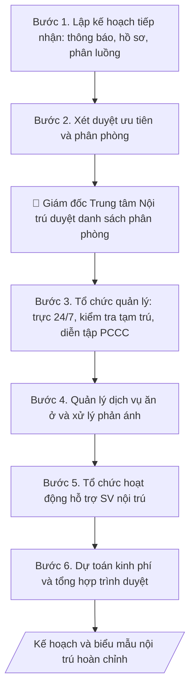

# Kế hoạch tiếp nhận & quản lý nội trú

## Định dạng và file đầu ra

Định dạng đầu ra có thể chọn theo sản phẩm/yêu cầu: .docx, .pdf. Đọc mục “Định dạng bổ sung” trong quy cách đầu ra trước khi chọn.

**Phải tạo file thực tế để tải xuống, không chỉ trả nội dung trong chat.** Định dạng mặc định của skill: **.docx**. Nếu có bảng số liệu nghiệp vụ yêu cầu file bảng tính riêng, tạo thêm Excel theo yêu cầu; không tự tạo file kiểm tra. Không chờ người dùng yêu cầu xuất file lần nữa. Ưu tiên định dạng người dùng chỉ định; đọc quy tắc xuất file tại references/quy-cach-dau-ra.md.

## Quy cách đầu ra và thông tin thiếu
Khi dựng file Word/Excel, áp dụng mục “Thể thức và bảng biểu khi dựng file” trong quy cách đầu ra (cỡ chữ từng thành phần, bảng nhiều trang, số trang, phụ lục). Đọc [quy cách và cấu trúc sản phẩm](references/quy-cach-dau-ra.md) trước khi soạn/xuất. File giao chỉ gồm sản phẩm nghiệp vụ được yêu cầu; kiểm tra nội bộ không xuất kèm. Thiếu thông tin thì giữ nguyên trường/mục và chỗ điền theo mẫu gốc (dòng dấu chấm, dấu gạch hoặc ô trống); không tự điền dữ liệu mẫu, số 0, mã chờ xác minh hay dòng chờ ký. Mẫu chuyên ngành còn áp dụng được ưu tiên về cấu trúc, mã biểu và người ký. Bản đầy đủ: [quy tắc chung](references/quy-tac-chung.md).

Khi người dùng yêu cầu bộ slide (.pptx), đọc mục “Xuất PowerPoint (.pptx) khi được yêu cầu” trong quy cách đầu ra.

## Kiểm soát áp dụng và phê duyệt
Trước khi chạy, xác định `ngay_ap_dung`, `loai_hinh_truong`, `quy_che_noi_bo`, `nguon_du_lieu`, `nguoi_kiem_duyet`; chỉ hỏi thông tin liên quan nghiệp vụ, không dùng giá trị giả định thay dữ liệu bắt buộc. Đối chiếu căn cứ pháp lý với văn bản gốc, hiệu lực, điều khoản áp dụng và chuyển tiếp. Bản đầy đủ: [quy tắc chung](references/quy-tac-chung.md).

## Giới hạn và human gate
AI hỗ trợ chuẩn bị và đối chiếu; cán bộ phụ trách kiểm tra dữ liệu/căn cứ, người có thẩm quyền duyệt và ký. Không đánh dấu đã ký, đã duyệt, đã công bố khi chưa có chứng cứ. Dữ liệu sinh viên, sức khỏe, nhân sự, tài chính chỉ dùng theo mục đích và phân quyền, che thông tin định danh khi dùng ví dụ (Luật 91/2025/QH15, hiệu lực 01/01/2026); không tải dữ liệu lên dịch vụ ngoài khi chưa có quyền. Bản đầy đủ: [quy tắc chung](references/quy-tac-chung.md).

## Khi nào dùng
Đầu năm học (hoặc đầu học kỳ), Trung tâm Nội trú/Ký túc xá cần lập kế hoạch tiếp nhận sinh viên
mới, sắp xếp chỗ ở, tổ chức quản lý an ninh trật tự, dịch vụ ăn ở – căng tin, PCCC và các hoạt
động hỗ trợ SV nội trú trong năm.

## Đầu vào (Input)

| Trường | Mô tả | Bắt buộc |
|---|---|---|
| `nam_hoc` | Năm học áp dụng | Có |
| `quy_mo` | Sức chứa, số phòng, số tòa nhà của trung tâm | Có |
| `chi_tieu_tiep_nhan` | Số SV dự kiến tiếp nhận (tân SV, SV cũ đăng ký lại) | Có |
| `tieu_chi_uu_tien` | Thứ tự ưu tiên xét chỗ ở (diện chính sách, SV năm nhất, SV xa nhà...) | Có |
| `nhan_su` | Ban quản lý, bảo vệ, nhân viên phục vụ | Có |
| `dich_vu` | Căng tin, giặt là, wifi, y tế... hiện có | Không |

## Quy trình

**Bước 1. Lập kế hoạch tiếp nhận**
- Làm gì: xây dựng thông báo đăng ký chỗ ở (thời gian, địa điểm, hồ sơ: đơn đăng ký,
  bản sao giấy báo nhập học/CCCD, ảnh 3x4); lập lịch tiếp nhận theo đợt, phân luồng
  tân SV theo khoa/khóa để tránh ùn tắc ngày nhập học; đối chiếu `chi_tieu_tiep_nhan`
  với `quy_mo` để giữ chỗ dự phòng cho đợt bổ sung.
- Dùng input: `nam_hoc`, `quy_mo`, `chi_tieu_tiep_nhan`.
- Vai trò: Cán bộ Trung tâm Nội trú · AI hỗ trợ: soạn thông báo đăng ký chỗ ở, lập lịch tiếp nhận theo đợt và phân luồng khoa/khóa · ⏱ 1–2 giờ (ước tính)
- Lưu ý nghiệp vụ: không tiếp nhận vượt sức chứa — giữ tối thiểu 5–10% chỗ dự phòng;
  lịch tiếp nhận phải khớp lịch nhập học chung của trường; thông báo công khai trước
  ít nhất 2 tuần.
- → Kết quả bước: thông báo đăng ký chỗ ở + lịch tiếp nhận chi tiết theo đợt/khoa.

**Bước 2. Xét duyệt ưu tiên và phân phòng**
- Làm gì: áp dụng `tieu_chi_uu_tien` để xét duyệt (phối hợp Phòng CTSV xác nhận diện
  chính sách); lập danh sách phân phòng theo nguyên tắc cùng khoa/khóa/lớp;
  công khai danh sách đúng thời hạn để SV kịp chuẩn bị.
- Dùng input: `tieu_chi_uu_tien`, `chi_tieu_tiep_nhan`.
- Vai trò: Hội đồng xét duyệt · AI hỗ trợ: sắp xếp danh sách theo tiêu chí ưu tiên đã phê duyệt · ⏱ 2–4 giờ (ước tính)
- Lưu ý nghiệp vụ: AI không tự quyết danh sách ưu tiên thay hội đồng xét duyệt —
  chỉ hỗ trợ sắp xếp theo tiêu chí đã phê duyệt; mọi trường hợp đặc cách phải có
  văn bản chấp thuận; không công khai thông tin cá nhân nhạy cảm của SV trong danh
  sách (chỉ công khai mã SV, phòng).
- → Kết quả bước: danh sách phân phòng dự thảo (mã SV – phòng – tòa nhà).

**Bước 3. Tổ chức quản lý an ninh trật tự và PCCC**
- Làm gì: ban hành/phổ biến nội quy nội trú; phân công trực ban quản lý – bảo vệ 24/7
  (chia ca); lập lịch kiểm tra tạm trú định kỳ; tổ chức diễn tập PCCC toàn trung tâm
  đầu năm học; kiểm tra hệ thống báo cháy, bình chữa cháy, lối thoát hiểm.
- Dùng input: `nhan_su`, `quy_mo`.
- Vai trò: Giám đốc Trung tâm Nội trú · AI hỗ trợ: lập lịch trực 24/7 và kế hoạch diễn tập PCCC, bảo vệ và ban quản lý triển khai, kiểm tra thực tế · ⏱ 0,5–1 ngày làm việc (ước tính)
- Lưu ý nghiệp vụ: diễn tập PCCC phải có phương án và biên bản, phối hợp cảnh sát PCCC
  địa phương khi có thể; kiểm tra tạm trú đúng quy định, không kiểm tra đột xuất ngoài
  giờ gây ảnh hưởng SV.
- → Kết quả bước: lịch trực 24/7 + kế hoạch diễn tập PCCC + nội quy nội trú.

**Bước 4. Quản lý dịch vụ ăn ở**
- Làm gì: quản lý căng tin (kiểm tra VSATTP định kỳ và đột xuất), nước sinh hoạt, điện,
  wifi, vệ sinh khu vực chung; thiết lập cơ chế tiếp nhận và xử lý phản ánh của SV
  (hộp thư góp ý, hotline) với thời hạn xử lý cam kết.
- Dùng input: `dich_vu`, `nhan_su`.
- Vai trò: Cán bộ Trung tâm Nội trú · AI hỗ trợ: soạn quy định quản lý dịch vụ và cơ chế xử lý phản ánh, ban quản lý kiểm tra VSATTP thực tế · ⏱ 2–3 giờ (ước tính)
- Lưu ý nghiệp vụ: cam kết thời hạn xử lý phản ánh cụ thể (VD: 48 giờ) và công khai
  kết quả xử lý; căng tin vi phạm VSATTP phải có chế tài theo hợp đồng đã ký.
- → Kết quả bước: quy định quản lý dịch vụ + cơ chế tiếp nhận, xử lý phản ánh của SV.

**Bước 5. Tổ chức hoạt động hỗ trợ SV nội trú**
- Làm gì: lập lịch sinh hoạt đầu khóa cho SV nội trú (phổ biến nội quy, hướng dẫn
  sinh hoạt); tổ chức câu lạc bộ/sự kiện gắn kết; rà soát SV khó khăn để hỗ trợ
  (miễn/giảm phí, học bổng chỗ ở).
- Dùng input: `chi_tieu_tiep_nhan` (quy mô SV để bố trí hoạt động), `nam_hoc`.
- Vai trò: Cán bộ Trung tâm Nội trú · AI hỗ trợ: lập lịch hoạt động hỗ trợ, Đoàn Thanh niên và Phòng CTSV tổ chức, bảo mật danh tính SV được hỗ trợ · ⏱ 2–3 giờ (ước tính)
- Lưu ý nghiệp vụ: hoạt động hỗ trợ SV khó khăn phải bảo mật thông tin cá nhân —
  không công khai danh tính SV được hỗ trợ; phối hợp Phòng CTSV và Đoàn Thanh niên.
- → Kết quả bước: lịch hoạt động hỗ trợ SV nội trú trong năm.

**Bước 6. Dự toán kinh phí và tổng hợp trình duyệt**
- Làm gì: dự toán kinh phí sửa chữa, PCCC, hoạt động hỗ trợ; gộp chỉ tiêu (Bước 1),
  phân phòng (Bước 2), quản lý (Bước 3), dịch vụ (Bước 4), hoạt động (Bước 5) thành
  kế hoạch hoàn chỉnh; trình Giám đốc Trung tâm Nội trú phê duyệt kế hoạch và danh
  sách phân phòng; trình lãnh đạo trường phê duyệt kinh phí.
- Dùng input: `nam_hoc`, toàn bộ dự thảo các bước 1–5.
- Vai trò: Giám đốc Trung tâm Nội trú · AI hỗ trợ: tổng hợp dự toán kinh phí và kế hoạch hoàn chỉnh, Giám đốc Trung tâm và lãnh đạo trường phê duyệt · ⏱ 1–2 ngày làm việc (ước tính)
- Lưu ý nghiệp vụ: kinh phí sửa chữa, đầu tư phải được lãnh đạo trường phê duyệt
  riêng trước khi triển khai; kế hoạch đính kèm 3 biểu mẫu: đơn đăng ký chỗ ở,
  danh sách phân phòng, nội quy nội trú.
- → Kết quả bước: kế hoạch tiếp nhận & quản lý nội trú năm học hoàn chỉnh
  + bộ biểu mẫu đính kèm, đã phê duyệt.

## Luồng quy trình (Workflow)

## Đầu ra

File nghiệp vụ thực tế theo định dạng mặc định ở đầu skill hoặc định dạng người dùng yêu cầu, kèm liên kết tải trong phản hồi cuối.

Sản phẩm nghiệp vụ hoàn chỉnh theo [quy cách và cấu trúc](references/quy-cach-dau-ra.md), giữ các trường chưa có dữ liệu ở trạng thái trống. Không xuất kèm checklist/phụ lục kiểm tra đầu ra.

## Kiểm tra nội bộ trước khi giao

- [ ] Bố cục khớp mẫu áp dụng và cấu trúc tại references/quy-cach-dau-ra.md.
- [ ] Số liệu trong output khớp với Input đã cho (chỉ tiêu tiếp nhận, sức chứa, tiêu chí ưu tiên, nhân sự).
- [ ] Không bịa đặt số liệu, minh chứng, trích dẫn.
- [ ] Đúng thể thức kế hoạch hành chính; lịch tiếp nhận khớp lịch nhập học chung của trường; thông báo công khai trước ít nhất 2 tuần.
- [ ] Căn cứ pháp lý đầy đủ, còn hiệu lực (Quy chế công tác sinh viên nội trú của Bộ GD&ĐT, nội quy KTX của trường).
- [ ] Đã qua Human gate: Giám đốc Trung tâm Nội trú duyệt kế hoạch và danh sách phân phòng; lãnh đạo trường duyệt kinh phí.
- [ ] Chỉ tiêu tiếp nhận không vượt sức chứa; giữ tối thiểu 5–10% chỗ dự phòng.
- [ ] Danh sách phân phòng tuân thủ thứ tự ưu tiên đã phê duyệt; công khai chỉ mã SV và phòng, không công khai thông tin cá nhân nhạy cảm.
- [ ] Kèm đủ 3 biểu mẫu: đơn đăng ký chỗ ở, danh sách phân phòng, nội quy nội trú.

Tiêu chí đạt = tất cả các ô được đánh dấu.

## Human gate
- **Giám đốc Trung tâm Nội trú** phê duyệt kế hoạch và danh sách phân phòng.
- **Phòng Công tác sinh viên** phối hợp xác nhận diện ưu tiên chính sách.
- **Lãnh đạo trường** phê duyệt kinh phí sửa chữa, đầu tư.

## Giới hạn
- AI không tự quyết danh sách ưu tiên thay hội đồng xét duyệt.
- Không công khai thông tin cá nhân của SV nội trú.

## Căn cứ & lưu ý
- Quy chế công tác sinh viên nội trú của Bộ GD&ĐT; nội quy KTX của trường.
- Không dùng tên thật của trường/cá nhân khi mô phỏng.

## Quản trị phiên bản
- Phiên bản gói `1.3.2` (cập nhật 2026-10-10); hồ sơ đầy đủ tại [references/version.json](references/version.json).
- Người phê duyệt nghiệp vụ: **chưa chỉ định**. Trạng thái: dự thảo nghiệp vụ; kiểm tra pháp lý trước thực thi. Ngày cập nhật không đồng nghĩa mọi văn bản đã được rà soát toàn văn.
- Giấy phép theo LICENSE của kho (bản quyền CES Global). Lịch sử thay đổi: CHANGELOG.md.
