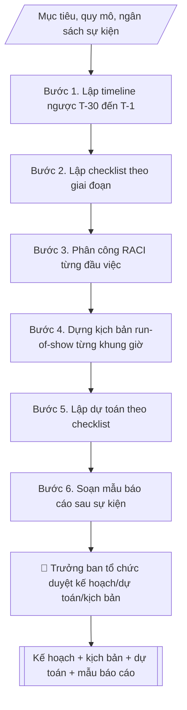

# Kế hoạch tổ chức sự kiện

## Kiểm soát áp dụng và phê duyệt

Trước khi chạy quy trình, xác định `ngay_ap_dung`, `loai_hinh_truong`, `quy_che_noi_bo`, `nguon_du_lieu` và `nguoi_kiem_duyet`. Chỉ yêu cầu thông tin có liên quan đến nghiệp vụ; không dùng giá trị giả định thay dữ liệu bắt buộc. Hồ sơ có yếu tố pháp lý phải kèm văn bản gốc, tình trạng hiệu lực, điều khoản áp dụng và chuyển tiếp.

## Giới hạn và human gate

AI hỗ trợ chuẩn bị và đối chiếu. Cán bộ phụ trách kiểm tra dữ liệu/căn cứ, người có thẩm quyền duyệt và ký. Mọi đầu ra mặc định là **DỰ THẢO – CHỜ KIỂM DUYỆT**; không đánh dấu đã ký, đã duyệt hoặc đã công bố nếu chưa có chứng cứ. Dữ liệu sinh viên, sức khỏe, nhân sự và tài chính phải hạn chế theo mục đích, phân quyền và che thông tin định danh khi dùng ví dụ. Không tải dữ liệu lên dịch vụ ngoài khi chưa có quyền. Kiểm tra Luật 91/2025/QH15 về bảo vệ dữ liệu cá nhân (hiệu lực 01/01/2026) và quy định áp dụng trước xử lý/chia sẻ dữ liệu cá nhân.


## Khi nào dùng
Khi tổ chức hội nghị, hội thảo, lễ khai giảng/bế giảng, ngày hội việc làm, lễ kỷ niệm...
Dùng chung cho mọi phòng/khoa/trung tâm — không phụ thuộc tên đơn vị.

## Đầu vào (Input)

| Trường | Mô tả | Bắt buộc |
|---|---|---|
| `ten_su_kien` | Tên sự kiện | Có |
| `muc_tieu` | Mục tiêu, kết quả mong đợi | Có |
| `quy_mo` | Số lượng khách/dại biểu dự kiến, đối tượng | Có |
| `thoi_gian` | Ngày giờ tổ chức | Có |
| `dia_diem` | Địa điểm dự kiến | Có |
| `ngan_sach` | Ngân sách dự kiến (nếu có) | Không |
| `don_vi_phoi_hop` | Các đơn vị/cá nhân phối hợp | Không |

## Quy trình

**Bước 1. Lập timeline ngược**
- Làm gì: lấy `thoi_gian` làm ngày T, lùi lại các mốc T-30, T-14, T-7, T-3, T-1; mỗi mốc
  ghi rõ việc phải hoàn thành; kiểm tra các mốc có rơi vào cuối tuần/ngày lễ không
  để điều chỉnh sớm.
- Dùng input: `thoi_gian`, `ten_su_kien`, `quy_mo`
- Vai trò: Trưởng ban tổ chức · AI hỗ trợ: lập timeline ngược từ ngày T, kiểm tra cuối tuần/ngày lễ · ⏱ ~10–15 phút (ước tính)
- Lưu ý nghiệp vụ: việc phụ thuộc lẫn nhau phải xếp đúng thứ tự (VD chốt danh sách
  doanh nghiệp trước khi in backdrop có logo); mốc T-1 chỉ dành cho kiểm tra lần cuối,
  không xếp việc mới.
- → Kết quả bước: "timeline ngược" (mốc thời gian + việc phải xong ở mỗi mốc).

**Bước 2. Lập checklist theo giai đoạn**
- Làm gì: chi tiết hóa timeline thành checklist theo 6 giai đoạn: chuẩn bị → truyền thông
  → hậu cần → đón tiếp → diễn ra → tổng kết; mỗi đầu việc ghi đầu mối thực hiện
  và deadline cụ thể.
- Dùng input: kết quả bước 1 (timeline ngược), `don_vi_phoi_hop`, `dia_diem`
- Vai trò: Đơn vị chủ trì sự kiện (Ban tổ chức) · AI hỗ trợ: chi tiết hóa checklist 6 giai đoạn, gán đầu mối và deadline · ⏱ ~20–30 phút (ước tính)
- Lưu ý nghiệp vụ: mỗi đầu việc phải có đúng một đầu mối (tránh "cả làng cùng làm,
  không ai chịu"); deadline của checklist phải khớp với mốc timeline ở bước 1.
- → Kết quả bước: "checklist công việc theo giai đoạn" (việc + đầu mối + deadline).

**Bước 3. Phân công RACI**
- Làm gì: với từng đầu việc trong checklist (bước 2), xác định R (người thực hiện),
  A (người chịu trách nhiệm cuối), C (tham vấn), I (được thông báo).
- Dùng input: kết quả bước 2 (checklist), `don_vi_phoi_hop`
- Vai trò: Trưởng ban tổ chức (chốt người chịu trách nhiệm cuối — A) · AI hỗ trợ: gợi ý phân công RACI · ⏱ ~20–30 phút (ước tính)
- Lưu ý nghiệp vụ: mỗi đầu việc chỉ có đúng một A; A nên là trưởng ban tổ chức hoặc
  người có thẩm quyền quyết; không để đầu việc nào thiếu A.
- → Kết quả bước: "bảng phân công RACI".

**Bước 4. Dựng kịch bản run-of-show**
- Làm gì: chi tiết từng khung giờ trong ngày diễn ra: nội dung, người điều hành/MC,
  yêu cầu âm thanh–ánh sáng, ghi chú rủi ro và phương án dự phòng.
- Dùng input: `thoi_gian`, `dia_diem`, `quy_mo`, kết quả bước 2–3
- Vai trò: Đơn vị chủ trì sự kiện (Ban tổ chức) · AI hỗ trợ: dựng kịch bản run-of-show từng khung giờ, ghi rủi ro và phương án dự phòng · ⏱ ~20–30 phút (ước tính)
- Lưu ý nghiệp vụ: mỗi khung giờ phải có người điều hành cụ thể; ghi rõ thiết bị dự
  phòng (mic, máy chiếu) cho các tiết mục quan trọng; tính thời gian chuyển cảnh
  và dự phòng trễ giờ.
- → Kết quả bước: "kịch bản run-of-show chi tiết" (giờ + nội dung + điều hành +
  ghi chú rủi ro).

**Bước 5. Lập dự toán**
- Làm gì: từ checklist (bước 2) và kịch bản (bước 4), liệt kê từng hạng mục chi phí
  (số lượng × đơn giá ước tính) + khoản dự phòng; tổng hợp và đối chiếu với `ngan_sach`
  (nếu có).
- Dùng input: `ngan_sach`, kết quả bước 2, 4
- Vai trò: Đơn vị chủ trì sự kiện (lấy báo giá thực tế, đối chiếu ngân sách) · AI hỗ trợ: lập bảng dự toán ước tính từ checklist và kịch bản · ⏱ ~30 phút–1 giờ (ước tính)
- Lưu ý nghiệp vụ: mọi số liệu chỉ là ước tính — đơn vị phải lấy báo giá thực tế;
  không cam kết chi vượt thẩm quyền; khoản dự phòng thường để 10–15% tổng.
- → Kết quả bước: "bảng dự toán kinh phí" (hạng mục + số tiền + tổng).

**Bước 6. Soạn mẫu báo cáo sau sự kiện**
- Làm gì: soạn mẫu báo cáo gồm: số lượng tham dự thực tế, kết quả so với `muc_tieu`,
  vấn đề phát sinh, bài học kinh nghiệm; để trống các ô để điền sau khi sự kiện diễn ra.
- Dùng input: `muc_tieu`, `quy_mo`, kết quả bước 1–5
- Vai trò: Đơn vị chủ trì sự kiện (Ban tổ chức) · AI hỗ trợ: soạn mẫu báo cáo sau sự kiện, gắn trường đối chiếu mục tiêu · ⏱ ~10–15 phút (ước tính)
- Lưu ý nghiệp vụ: mẫu phải có trường đối chiếu kết quả với mục tiêu ban đầu để đánh giá
  hiệu quả; mục bài học kinh nghiệm là bắt buộc để cải tiến lần tổ chức sau.
- → Kết quả bước: "mẫu báo cáo tổng kết sau sự kiện" → cùng các sản phẩm trước tạo
  Output cuối.
## Luồng quy trình (Workflow)


## Đầu ra (Output)
- Timeline và checklist công việc.
- Bảng phân công RACI.
- Kịch bản run-of-show.
- Dự toán kinh phí.
- Mẫu báo cáo tổng kết sau sự kiện.

**Cấu trúc output chuẩn** (sản phẩm chính: Kế hoạch tổ chức sự kiện):
1. Thông tin sự kiện (tên, mục tiêu, quy mô, thời gian, địa điểm, ngân sách).
2. Timeline ngược (mốc + việc phải xong).
3. Checklist theo giai đoạn (việc + đầu mối + deadline).
4. Bảng phân công RACI.
5. Kịch bản run-of-show (giờ + nội dung + điều hành + ghi chú rủi ro).
6. Dự toán kinh phí.
7. Mẫu báo cáo sau sự kiện.

## Checklist nghiệm thu

- [ ] Đủ 7 phần theo Cấu trúc output chuẩn: thông tin sự kiện, timeline ngược, checklist, RACI, run-of-show, dự toán, mẫu báo cáo sau sự kiện.
- [ ] Timeline ngược tính từ `thoi_gian`; các mốc không rơi vào cuối tuần/ngày lễ (hoặc đã điều chỉnh); việc phụ thuộc nhau xếp đúng thứ tự; mốc T-1 chỉ dành cho kiểm tra lần cuối.
- [ ] Checklist: mỗi đầu việc có đúng một đầu mối và deadline cụ thể; deadline khớp với mốc timeline.
- [ ] RACI: mỗi đầu việc có đúng một A (người chịu trách nhiệm cuối), không đầu việc nào thiếu A.
- [ ] Run-of-show: mỗi khung giờ có nội dung, người điều hành/MC, yêu cầu âm thanh–ánh sáng, ghi chú rủi ro và phương án dự phòng; đã tính thời gian chuyển cảnh và dự phòng trễ giờ.
- [ ] Dự toán liệt kê từng hạng mục (số lượng × đơn giá ước tính) + khoản dự phòng 10–15%; tổng đã đối chiếu với `ngan_sach`.
- [ ] Mẫu báo cáo sau sự kiện có trường đối chiếu kết quả với mục tiêu ban đầu và mục bài học kinh nghiệm bắt buộc.
- [ ] Mọi số liệu dự toán là ước tính — đơn vị đã lấy báo giá thực tế; không cam kết chi vượt thẩm quyền.
- [ ] Đã qua Human gate: trưởng ban tổ chức duyệt kế hoạch, dự toán, kịch bản trước khi triển khai.

> Tiêu chí đạt: tất cả các ô được đánh dấu.

## Ví dụ mô phỏng (dữ liệu giả lập)

> Tất cả tên sự kiện, nhân vật, số liệu dưới đây đều là **giả lập**.

### Input mẫu

| Trường | Giá trị |
|---|---|
| `ten_su_kien` | Ngày hội việc làm sinh viên 2027 |
| `muc_tieu` | Kết nối 500 SV với 20 doanh nghiệp; ít nhất 100 lượt phỏng vấn thử |
| `quy_mo` | 500 sinh viên, 20 doanh nghiệp |
| `thoi_gian` | 08h00 – 16h00, ngày 20/03/2027 |
| `dia_diem` | Sân trường + Hội trường A, Trường Đại học A |
| `ngan_sach` | 160 triệu đồng (giả lập) |
| `don_vi_phoi_hop` | Phòng CTSV (chủ trì), Đoàn Thanh niên, Phòng QTTB |

### Output mẫu

```
KẾ HOẠCH TỔ CHỨC — Ngày hội việc làm sinh viên 2027 (giả lập)

1. Thông tin sự kiện
Mục tiêu: kết nối 500 SV với 20 doanh nghiệp; ít nhất 100 lượt phỏng vấn thử.
Quy mô: 500 sinh viên, 20 doanh nghiệp. Thời gian: 08h00 – 16h00, ngày 20/03/2027.
Địa điểm: Sân trường + Hội trường A, Trường Đại học A.
Ngân sách: 160 triệu đồng. Phối hợp: Phòng CTSV (chủ trì), Đoàn Thanh niên, Phòng QTTB.

2. Timeline ngược
- T-30 (18/02): chốt danh sách 20 DN, ký xác nhận tham gia
- T-14 (06/03): hoàn thành truyền thông (poster, fanpage, email SV)
- T-7 (13/03): khảo sát mặt bằng, chốt sơ đồ gian hàng
- T-3 (17/03): tổng duyệt âm thanh, backdrop, bàn ghế
- T-1 (19/03): lắp đặt gian hàng, kiểm tra lần cuối

3. Checklist theo giai đoạn (trích)
| Giai đoạn | Đầu việc | Đầu mối | Deadline |
|---|---|---|---|
| Chuẩn bị | Mời và chốt danh sách DN | Phòng CTSV | T-30 |
| Truyền thông | Poster, fanpage, email SV | Đoàn Thanh niên | T-14 |
| Hậu cần | Sân khấu, âm thanh, bàn ghế | Phòng QTTB | T-3 |

4. RACI (trích)
| Đầu việc | R | A | C | I |
|---|---|---|---|---|
| Mời doanh nghiệp | Phòng CTSV | Trưởng ban TC | BGH | Các khoa |
| Sân khấu, âm thanh | Phòng QTTB | Trưởng ban TC | — | MC |

5. Run-of-show (trích)
| Giờ | Nội dung | Điều hành | Ghi chú |
|---|---|---|---|
| 08h00–08h30 | Khai mạc, phát biểu | MC + đại diện BGH | Mic dự phòng |
| 08h30–11h30 | Gian hàng DN + PV thử | Điều phối viên | Nước uống tại mỗi gian |
| 14h00–16h00 | Talkshow "Kỹ năng phỏng vấn" | Khách mời DN | Livestream fanpage |

6. Dự toán (giả lập)
backdrop 25tr, âm thanh 30tr, gian hàng 60tr, truyền thông 20tr, dự phòng 25tr
— TỔNG 160 triệu đồng.

7. Mẫu báo cáo sau sự kiện
- Số lượng tham dự thực tế: ...... (mục tiêu: 500 SV, 20 DN)
- Kết quả vs mục tiêu: ...... lượt phỏng vấn thử (mục tiêu: ≥ 100)
- Vấn đề phát sinh: ......
- Bài học kinh nghiệm: ......
```

## Human gate (người kiểm duyệt)
- **Trưởng ban tổ chức / thủ trưởng đơn vị chủ trì** duyệt kế hoạch, dự toán, kịch bản
  trước khi triển khai.
- Ban Giám hiệu duyệt đối với sự kiện cấp trường hoặc có khách mời cấp cao.

## Giới hạn (guardrails)
- Không tự đặt dịch vụ (địa điểm, catering, âm thanh...) hay ký hợp đồng thay.
- Không tự gửi thư mời, thông báo cho khách mời/đại biểu.
- Không cam kết ngân sách vượt thẩm quyền của đơn vị.
- Mọi số liệu dự toán là ước tính — đơn vị phải lấy báo giá thực tế.

## Căn cứ & lưu ý
- Theo quy chế tổ chức sự kiện và quy chế chi tiêu nội bộ của trường.
- Không dùng tên thật của trường/cá nhân khi mô phỏng.

## Quản trị phiên bản

- Phiên bản gói: `1.1.0`; ngày cập nhật: `2026-10-09`.
- Kho nguồn: https://github.com/phamtruong91/dh-skills
- Người duy trì trên GitHub: `phamtruong91` (Phạm Văn Trường). Người phê duyệt nghiệp vụ: **chưa chỉ định**.
- Commit nguồn trước cập nhật: `78fd1d51b8acd1a724d9b9af6c488460bc7551ad`. Commit chứa phiên bản này xem bằng `git log -1 -- skills/ke-hoach-to-chuc-su-kien`; không tự gán SHA chưa tạo.
- Giấy phép: theo LICENSE của kho; bản quyền CES Global.
- Lịch sử 1.1.0: bổ sung metadata giao diện, kiểm soát áp dụng, quản trị phiên bản.
- Trạng thái: dự thảo nghiệp vụ; kiểm tra pháp lý trước thực thi. Ngày cập nhật không đồng nghĩa mọi văn bản đã được rà soát toàn văn.
