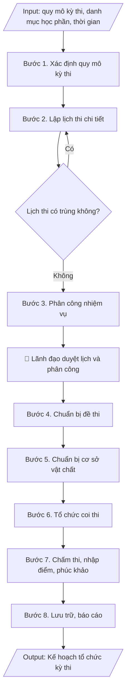

# Skill: Kế hoạch tổ chức kỳ thi

## Khi nào dùng
Khi cần lập kế hoạch tổng thể cho một kỳ thi: thi kết thúc học phần, thi tốt nghiệp,
thi tuyển sinh sau đại học.

## Đầu vào (Input)

| Trường | Mô tả | Bắt buộc |
|---|---|---|
| `ky_thi` | Tên kỳ thi (VD: thi kết thúc học phần học kỳ 1 năm học 2026–2027) | Có |
| `thoi_gian` | Thời gian diễn ra (từ ngày – đến ngày) | Có |
| `so_luong_thi_sinh` | Số lượng thí sinh dự kiến | Có |
| `danh_muc_mon_thi` | Danh sách học phần thi (mã HP, tên HP, hình thức thi) | Có |
| `don_vi_phoi_hop` | Các phòng/khoa tham gia (Đào tạo, Khảo thí, Thanh tra, Quản trị...) | Không |
| `nguoi_ky` | Hiệu trưởng / Phó Hiệu trưởng phụ trách đào tạo | Có |

## Quy trình

**Bước 1. Xác định quy mô kỳ thi**
- Làm gì: Thu thập từ Phòng Đào tạo: danh sách sinh viên đủ điều kiện dự thi theo từng học phần, danh mục học phần thi (mã HP, tên HP, hình thức thi), khung thời gian học vụ; từ Phòng Khảo thí & ĐBCL: số phòng thi khả dụng, số cán bộ có thể huy động. Tổng hợp thành bảng quy mô: tổng số thí sinh, số học phần, số ca thi ước tính, số phòng thi cần dùng, số lượt cán bộ coi/chấm thi cần huy động.
- Dùng input: `ky_thi`, `thoi_gian`, `so_luong_thi_sinh`, `danh_muc_mon_thi`, `don_vi_phoi_hop`.
- Vai trò: Chuyên viên Phòng Đào tạo & Phòng Khảo thí & ĐBCL · AI hỗ trợ: tổng hợp bảng quy mô sơ bộ từ số liệu các đơn vị, đối chiếu danh sách thí sinh · ⏱ ~2 giờ (ước tính)
- Lưu ý nghiệp vụ: kiểm tra các học phần có hình thức thi đặc thù (vấn đáp, thực hành, thi trên máy) để bố trí ca thi và phòng thi riêng; số thí sinh phải khớp giữa danh sách học vụ và danh sách đăng ký thi.
- → Kết quả bước: Bảng tổng hợp quy mô kỳ thi (số thí sinh, số học phần, số ca thi, nhu cầu phòng thi và nhân sự).

**Bước 2. Lập lịch thi chi tiết**
- Làm gì: Xếp từng học phần vào ca thi – ngày thi – phòng thi cụ thể: học phần đông sinh viên thi trước; không xếp 02 học phần có chung sinh viên trong cùng một ca bằng cách đối chiếu danh sách sinh viên đăng ký từng học phần; chốt lịch, trình lãnh đạo duyệt và công bố trên hệ thống học vụ/cổng thông tin trước ít nhất 07 ngày so với ngày thi đầu tiên.
- Dùng input: `thoi_gian`, `danh_muc_mon_thi`, `so_luong_thi_sinh`.
- Vai trò: Chuyên viên Phòng Đào tạo · AI hỗ trợ: xếp lịch sơ bộ theo quy tắc không trùng ca, rà soát trùng ca học phần của cùng sinh viên · ⏱ ~4 giờ (ước tính)
- Lưu ý nghiệp vụ: bẫy thường gặp — sinh viên học lại/học cải thiện đăng ký nhiều học phần rất dễ bị trùng ca; mọi thay đổi lịch sau công bố phải thông báo lại bằng văn bản đến sinh viên và các đơn vị.
- → Kết quả bước: Dự thảo lịch thi chi tiết (Phụ lục 01) đã rà soát không trùng lịch thí sinh.

**Bước 3. Phân công nhiệm vụ**
- Làm gì: Căn cứ số ca thi và số phòng thi, lập danh sách cán bộ coi thi (02 cán bộ/phòng/ca), cán bộ chấm thi theo từng học phần, cán bộ thanh tra độc lập, thư ký hội đồng; gửi văn bản đề nghị các khoa cử cán bộ; tổng hợp danh sách, kiểm tra không phân công cán bộ có người thân dự thi vào học phần đó; ban hành quyết định phân công kèm theo kế hoạch.
- Dùng input: `don_vi_phoi_hop`, `nguoi_ky`.
- Vai trò: Phòng Khảo thí & ĐBCL (tổng hợp, rà soát), Hiệu trưởng/Phó Hiệu trưởng ký ban hành · AI hỗ trợ: lập bảng phân công sơ bộ, kiểm tra xung đột lợi ích trong danh sách · ⏱ ~1 ngày làm việc (ước tính)
- Lưu ý nghiệp vụ: cán bộ coi thi phải được phổ biến quy chế thi trước kỳ thi; tránh phân công 01 cán bộ coi 02 ca liên tiếp quá sức; cán bộ chấm thi phải đúng chuyên môn học phần.
- → Kết quả bước: Quyết định phân công nhiệm vụ + bảng phân công chi tiết (Phụ lục 02).

**Bước 4. Chuẩn bị đề thi**
- Làm gì: Rút đề từ ngân hàng đề thi theo đúng ma trận đề đã duyệt (tỷ lệ nhận biết/thông hiểu/vận dụng); in sao đủ số lượng theo số thí sinh từng ca (+ dự phòng 5%); niêm phong từng túi đề, lập biên bản niêm phong; bàn giao đề thi cho trưởng điểm thi/trưởng ca trước giờ thi có biên bản giao nhận; toàn bộ quá trình bảo mật tuyệt đối.
- Dùng input: `danh_muc_mon_thi`, `so_luong_thi_sinh`.
- Vai trò: Cán bộ khảo thí (Phòng Khảo thí & ĐBCL) · AI hỗ trợ: kiểm tra ma trận đề, thống kê số lượng in sao theo từng ca trước khi niêm phong · ⏱ ~2 ngày làm việc (ước tính)
- Lưu ý nghiệp vụ: đề dự phòng niêm phong riêng, chỉ mở khi có sự cố; mọi khâu in sao phải có người giám sát, không để đề thi ra khỏi khu vực bảo mật; kiểm tra số lượng đề theo từng ca trước khi niêm phong.
- → Kết quả bước: Bộ đề thi đã niêm phong + biên bản niêm phong/bàn giao đề thi.

**Bước 5. Chuẩn bị cơ sở vật chất**
- Làm gì: Khảo sát thực tế và chốt danh sách phòng thi đủ tiêu chuẩn (ánh sáng, bàn ghế, đồng hồ treo tường, khoảng cách chống quay cóp); chuẩn bị hệ thống âm thanh gọi giờ, tủ thuốc/y tế trực, phương án an ninh trật tự và điện dự phòng; dán sơ đồ phòng thi và danh sách thí sinh trước mỗi phòng trước ngày thi 01 ngày.
- Dùng input: `thoi_gian`, `don_vi_phoi_hop`.
- Vai trò: Cán bộ Phòng Quản trị – Thiết bị (phối hợp Phòng Khảo thí & ĐBCL) · AI hỗ trợ: tổng hợp checklist tiêu chuẩn phòng thi, lập danh sách phòng dự kiến từ cơ sở dữ liệu CSVC · ⏱ ~1 ngày làm việc (ước tính)
- Lưu ý nghiệp vụ: kiểm tra thực tế từng phòng trước kỳ thi 02 ngày; phòng thi trắc nghiệm cần bố trí giãn cách chỗ ngồi; chuẩn bị phòng thi dự phòng cho trường hợp phát sinh.
- → Kết quả bước: Biên bản kiểm tra cơ sở vật chất + sơ đồ bố trí phòng thi.

**Bước 6. Tổ chức coi thi**
- Làm gì: Tổ chức họp phổ biến quy chế thi cho toàn bộ cán bộ coi thi trước ca thi đầu tiên; giám sát việc gọi thí sinh vào phòng, kiểm tra giấy tờ tùy thân, phát đề đúng giờ; xử lý vi phạm quy chế tại chỗ đúng thẩm quyền (khiển trách/cảnh cáo/đình chỉ) và lập biên bản vi phạm; tổng hợp tình hình từng ca thi báo cáo ban chỉ đạo kỳ thi.
- Dùng input: `ky_thi`, `don_vi_phoi_hop`.
- Vai trò: Cán bộ coi thi · AI hỗ trợ: chuẩn bị tài liệu phổ biến quy chế trước ca thi, tổng hợp tình hình từng ca sau khi thi · ⏱ theo lịch thi (ước tính)
- Lưu ý nghiệp vụ: cán bộ coi thi không được mang thiết bị điện tử vào phòng thi; mọi trường hợp đình chỉ thi phải báo ngay trưởng ban chỉ đạo; biên bản vi phạm phải có chữ ký xác nhận của thí sinh.
- → Kết quả bước: Biên bản phòng thi từng ca + báo cáo nhanh tình hình coi thi.

**Bước 7. Chấm thi – nhập điểm – phúc khảo**
- Làm gì: Thu bài thi về kho tập trung, rọc phách trước khi chấm; tổ chức chấm tập trung tại Phòng Khảo thí (bài tự luận chấm 02 vòng độc lập, chênh lệch điểm xử lý theo quy chế); nhập điểm vào hệ thống quản lý học vụ, đối chiếu số bài/số điểm, kiểm tra ngẫu nhiên 10% số bài sau nhập; công bố điểm; tiếp nhận đơn phúc khảo trong thời hạn quy định, tổ chức chấm phúc khảo và ban hành quyết định công nhận kết quả.
- Dùng input: `danh_muc_mon_thi`, `so_luong_thi_sinh`.
- Vai trò: Hội đồng chấm thi / Cán bộ chấm thi · AI hỗ trợ: nhập điểm vào hệ thống, đối chiếu số bài/số điểm, cảnh báo điểm bất thường · ⏱ ~5–7 ngày làm việc (ước tính)
- Lưu ý nghiệp vụ: người chấm vòng 2 không được biết điểm vòng 1; kiểm tra điểm bất thường (điểm liệt hàng loạt, điểm cao bất thường) trước khi công bố.
- → Kết quả bước: Bảng điểm chính thức + quyết định công nhận kết quả phúc khảo (nếu có).

**Bước 8. Lưu trữ – báo cáo**
- Làm gì: Đóng gói, niêm phong bài thi theo từng học phần; lưu trữ bài thi và bảng điểm gốc theo thời hạn quy định của trường; lập báo cáo tổng kết kỳ thi (quy mô, kỷ luật thi, kết quả, tồn tại, kiến nghị); trình lãnh đạo ký duyệt và lưu hồ sơ kỳ thi.
- Dùng input: `ky_thi`, `nguoi_ky`.
- Vai trò: Phòng Khảo thí & ĐBCL (lập báo cáo), Lãnh đạo trường ký duyệt · AI hỗ trợ: soạn dự thảo báo cáo tổng kết từ số liệu kỳ thi · ⏱ ~1 ngày làm việc (ước tính)
- Lưu ý nghiệp vụ: báo cáo tổng kết kỳ thi là minh chứng kiểm định cho tiêu chí về công tác khảo thí — phải lưu đầy đủ, mã hóa theo quy tắc của trường.
- → Kết quả bước: Hồ sơ kỳ thi đã lưu trữ + báo cáo tổng kết kỳ thi.

## Luồng quy trình (Workflow)


## Đầu ra (Output)
- Văn bản kế hoạch tổ chức kỳ thi hoàn chỉnh.
- Phụ lục: lịch thi chi tiết + bảng phân công nhiệm vụ.

**Cấu trúc output chuẩn:** văn bản kế hoạch gồm các phần bắt buộc theo đúng thứ tự:
1. Quốc hiệu, tên cơ quan ban hành, số/ký hiệu văn bản, địa danh và ngày tháng năm ban hành;
2. Tên loại văn bản (KẾ HOẠCH) + trích yếu nội dung;
3. Phần I – Mục đích, yêu cầu (tổ chức nghiêm túc đúng quy chế; thời gian, quy mô kỳ thi);
4. Phần II – Nội dung (lịch thi; phân công nhiệm vụ; đề thi; cơ sở vật chất; chấm thi – công bố điểm – phúc khảo);
5. Phần III – Tổ chức thực hiện (phân công trách nhiệm từng đơn vị: Khảo thí & ĐBCL, Đào tạo, các khoa, Thanh tra & Pháp chế);
6. Nơi nhận;
7. Chức vụ người ký, chữ ký, họ tên người ký;
8. Phụ lục 01 – Lịch thi chi tiết; Phụ lục 02 – Bảng phân công nhiệm vụ.

## Checklist nghiệm thu

- [ ] Đủ 8 phần theo "Cấu trúc output chuẩn": quốc hiệu + số/ký hiệu + địa danh, ngày tháng; tên loại văn bản (KẾ HOẠCH) + trích yếu; Phần I – Mục đích, yêu cầu; Phần II – Nội dung; Phần III – Tổ chức thực hiện; Nơi nhận; chức vụ/chữ ký/họ tên người ký; Phụ lục 01 (lịch thi chi tiết) + Phụ lục 02 (bảng phân công nhiệm vụ).
- [ ] Số liệu trong kế hoạch khớp với Input: tổng số thí sinh, số học phần, khung thời gian (`ky_thi`, `thoi_gian`, `so_luong_thi_sinh`, `danh_muc_mon_thi`).
- [ ] Không bịa đặt số liệu thí sinh, học phần, phòng thi, nhân sự coi/chấm thi.
- [ ] Đúng thể thức văn bản hành chính theo Nghị định 30/2020/NĐ-CP.
- [ ] Căn cứ pháp lý (Thông tư 08/2021/TT-BGDĐT, quy chế thi của trường) đầy đủ, còn hiệu lực.
- [ ] Đã qua Human gate: người có thẩm quyền theo quy trình đã duyệt.
- [ ] Lịch thi không trùng ca đối với sinh viên đăng ký nhiều học phần (kể cả học lại/học cải thiện); công bố trước ít nhất 07 ngày so với ngày thi đầu tiên.
- [ ] Cán bộ chấm thi đúng chuyên môn học phần; không phân công cán bộ có người thân dự thi vào học phần đó.
- [ ] Đề thi rút đúng ma trận đề đã duyệt, in sao đủ số lượng (+ dự phòng 5%), niêm phong từng túi đề, có biên bản niêm phong/bàn giao.

Tiêu chí đạt = tất cả các ô được đánh dấu.

## Ví dụ mô phỏng (dữ liệu giả lập)

> Tất cả tên trường, cá nhân, số liệu dưới đây đều là **giả lập**, không liên quan tổ chức/cá nhân có thật.

### Input mẫu

| Trường | Giá trị |
|---|---|
| `ky_thi` | Thi kết thúc học phần học kỳ 1, năm học 2026–2027 |
| `thoi_gian` | Từ 15/12/2026 đến 03/01/2027 |
| `so_luong_thi_sinh` | 4.850 sinh viên |
| `danh_muc_mon_thi` | 120 học phần (85 trắc nghiệm, 35 tự luận) |
| `nguoi_ky` | Phó Hiệu trưởng phụ trách đào tạo |

### Output mẫu

```
TRƯỜNG ĐẠI HỌC A            CỘNG HÒA XÃ HỘI CHỦ NGHĨA VIỆT NAM
PHÒNG KHẢO THÍ & ĐBCL                    Độc lập – Tự do – Hạnh phúc
      Số: 78/KH-ĐHA-KTĐBCL
                                                 Thành phố C, ngày 09 tháng 10 năm 2026

KẾ HOẠCH
Tổ chức thi kết thúc học phần học kỳ 1, năm học 2026–2027

I. MỤC ĐÍCH, YÊU CẦU
1. Tổ chức kỳ thi nghiêm túc, đúng quy chế, đảm bảo đánh giá đúng kết quả học tập.
2. Thời gian: từ 15/12/2026 đến 03/01/2027; quy mô: 4.850 sinh viên, 120 học phần.

II. NỘI DUNG
1. Lịch thi: chi tiết theo Phụ lục 01 (công bố trước ngày 08/12/2026).
2. Phân công nhiệm vụ (Phụ lục 02):
   - Ban chỉ đạo kỳ thi: Phó Hiệu trưởng phụ trách đào tạo làm Trưởng ban;
   - Cán bộ coi thi: 240 lượt (mỗi phòng 02 cán bộ);
   - Chấm thi: tổ chức chấm tập trung tại Phòng Khảo thí, tự luận chấm 02 vòng độc lập;
   - Thanh tra thi: Phòng Thanh tra & Pháp chế cử 06 cán bộ.
3. Đề thi: rút từ ngân hàng đề thi, in sao và niêm phong trước ngày 12/12/2026.
4. Cơ sở vật chất: Phòng Quản trị – Thiết bị chuẩn bị 60 phòng thi, hệ thống âm thanh,
   y tế trực trong suốt kỳ thi.
5. Chấm thi – công bố điểm: hoàn thành chấm và nhập điểm trước 10/01/2027;
   nhận đơn phúc khảo từ 11/01 đến 15/01/2027.

III. TỔ CHỨC THỰC HIỆN
- Phòng Khảo thí & ĐBCL: đầu mối, chịu trách nhiệm toàn bộ kỳ thi.
- Phòng Đào tạo: cung cấp danh sách thí sinh, lịch học vụ.
- Các khoa: cử cán bộ coi/chấm thi theo phân công; phổ biến quy chế đến sinh viên.
- Phòng Thanh tra & Pháp chế: thanh tra độc lập trong suốt kỳ thi.

Nơi nhận:                                          KT. HIỆU TRƯỞNG
- Ban Giám hiệu;                                    PHÓ HIỆU TRƯỞNG
- Các phòng, khoa;
- Lưu: VT, KTĐBCL.                                      (đã ký)

                                                 PGS.TS. Trần Văn B
```

**Phụ lục 01 – Lịch thi (trích mẫu giả lập)**

| Ngày | Ca | Học phần | Hình thức | Phòng | Số SV |
|---|---|---|---|---|---|
| 15/12/2026 | Sáng | CNTT101 – Nhập môn lập trình | Trắc nghiệm | A101–A106 | 320 |
| 15/12/2026 | Chiều | KT201 – Kinh tế vi mô | Tự luận | B201–B205 | 280 |

## Căn cứ & lưu ý
- Quy chế đào tạo trình độ đại học (Thông tư 08/2021/TT-BGDĐT).
- Quy chế thi kết thúc học phần của Trường Đại học A (giả lập).
- Lịch thi phải công bố sớm để sinh viên chủ động ôn tập; mọi thay đổi lịch thi phải thông báo lại.
- Không dùng tên thật của trường/cá nhân khi mô phỏng.
