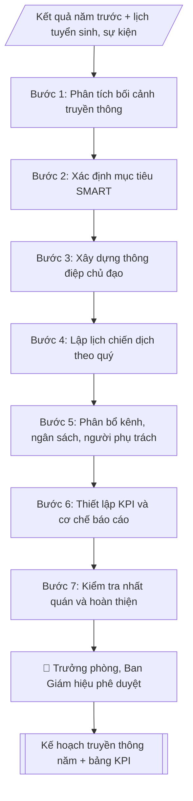

# Kế hoạch truyền thông năm

## Kiểm soát áp dụng và phê duyệt

Trước khi chạy quy trình, xác định `ngay_ap_dung`, `loai_hinh_truong`, `quy_che_noi_bo`, `nguon_du_lieu` và `nguoi_kiem_duyet`. Chỉ yêu cầu thông tin có liên quan đến nghiệp vụ; không dùng giá trị giả định thay dữ liệu bắt buộc. Hồ sơ có yếu tố pháp lý phải kèm văn bản gốc, tình trạng hiệu lực, điều khoản áp dụng và chuyển tiếp.

## Giới hạn và human gate

AI hỗ trợ chuẩn bị và đối chiếu. Cán bộ phụ trách kiểm tra dữ liệu/căn cứ, người có thẩm quyền duyệt và ký. Mọi đầu ra mặc định là **DỰ THẢO – CHỜ KIỂM DUYỆT**; không đánh dấu đã ký, đã duyệt hoặc đã công bố nếu chưa có chứng cứ. Dữ liệu sinh viên, sức khỏe, nhân sự và tài chính phải hạn chế theo mục đích, phân quyền và che thông tin định danh khi dùng ví dụ. Không tải dữ liệu lên dịch vụ ngoài khi chưa có quyền. Kiểm tra Luật 91/2025/QH15 về bảo vệ dữ liệu cá nhân (hiệu lực 01/01/2026) và quy định áp dụng trước xử lý/chia sẻ dữ liệu cá nhân.


## Khi nào dùng
Khi Phòng Truyền thông và Tuyển sinh cần lập kế hoạch truyền thông năm học: định hướng thương hiệu,
các đợt chiến dịch (tuyển sinh, khai giảng, kỷ niệm...), phân bổ kênh và ngân sách, KPI đánh giá.

## Đầu vào (Input)

| Trường | Mô tả | Bắt buộc |
|---|---|---|
| `nam_hoc` | Năm học áp dụng (VD: 2026–2027) | Có |
| `muc_tieu` | Mục tiêu truyền thông (nhận diện thương hiệu, chỉ tiêu tuyển sinh...) | Có |
| `thong_diep_chu_dao` | 1–3 thông điệp chủ đạo của năm | Có |
| `doi_tuong` | Nhóm đối tượng chính (thí sinh THPT, phụ huynh, doanh nghiệp, cựu SV...) | Có |
| `kenh` | Các kênh sử dụng (website, fanpage, TikTok, báo chí, sự kiện...) | Có |
| `chien_dich` | Danh sách chiến dịch dự kiến theo thời gian | Có |
| `ngan_sach` | Ngân sách dự kiến theo từng chiến dịch/kênh | Không |
| `kpi` | Chỉ tiêu đo lường (reach, engagement, lead, bài báo...) | Có |

## Quy trình

**Bước 1. Phân tích bối cảnh truyền thông**
- Làm gì: tổng kết kết quả truyền thông năm trước (số liệu reach, engagement, lead, bài báo); xác định điểm mạnh, điểm yếu; rà soát cơ hội năm tới: các đợt tuyển sinh, sự kiện lớn của trường, xu hướng kênh; phân tích đặc điểm đối tượng mục tiêu.
- Dùng input: `nam_hoc`, `doi_tuong`.
- Vai trò: Chuyên viên Phòng Truyền thông – Tuyển sinh · AI hỗ trợ: đối chiếu tự động, cảnh báo sai lệch, tính toán, phân tích số liệu · ⏱ ~30–60 phút (ước tính)
- Lưu ý nghiệp vụ: số liệu năm trước phải có nguồn xác thực; mỗi cơ hội phải gắn với mốc thời gian cụ thể mới đưa vào lịch được.
- → Kết quả bước: Báo cáo phân tích bối cảnh (điểm mạnh/yếu, cơ hội, lịch mốc quan trọng).

**Bước 2. Xác định mục tiêu SMART**
- Làm gì: viết mục tiêu truyền thông năm theo tiêu chí SMART (cụ thể, đo được, khả thi, liên quan, có thời hạn), gắn với mục tiêu chung của trường (VD: chỉ tiêu tuyển sinh).
- Dùng input: `muc_tieu`, `doi_tuong`.
- Vai trò: Chuyên viên Phòng Truyền thông – Tuyển sinh · AI hỗ trợ: soạn dự thảo · ⏱ ~30–90 phút (ước tính)
- Lưu ý nghiệp vụ: mỗi mục tiêu phải có chỉ số đo được; không đặt mục tiêu chung chung kiểu "nâng cao hình ảnh".
- → Kết quả bước: Bộ mục tiêu SMART của năm.

**Bước 3. Xây dựng thông điệp chủ đạo**
- Làm gì: chốt 1–3 thông điệp chủ đạo của năm theo brand voice của trường (trẻ trung, học thuật); mỗi thông điệp gắn với đối tượng và mục tiêu cụ thể.
- Dùng input: `thong_diep_chu_dao`, `doi_tuong`, `muc_tieu`.
- Vai trò: Chuyên viên Phòng Truyền thông – Tuyển sinh · AI hỗ trợ: lập bảng biểu, định dạng · ⏱ ~30–60 phút (ước tính)
- Lưu ý nghiệp vụ: thông điệp phải nhất quán và dùng xuyên suốt các chiến dịch; tránh thông điệp hứa hẹn quá mức, không có căn cứ.
- → Kết quả bước: Bộ thông điệp chủ đạo của năm.

**Bước 4. Lập lịch chiến dịch theo quý**
- Làm gì: chia năm thành các chiến dịch theo quý, gắn với mốc tuyển sinh (mở đợt, xét tuyển, nhập học) và sự kiện của trường (khai giảng, kỷ niệm...); mỗi chiến dịch ghi mục tiêu riêng.
- Dùng input: `chien_dich`, `nam_hoc`.
- Vai trò: Chuyên viên Phòng Truyền thông – Tuyển sinh · AI hỗ trợ: xử lý sơ bộ, tổng hợp · ⏱ ~30–60 phút (ước tính)
- Lưu ý nghiệp vụ: bám lịch tuyển sinh của Bộ GD&ĐT và lịch năm học của trường; không dồn quá nhiều chiến dịch vào cùng một thời điểm.
- → Kết quả bước: Lịch chiến dịch theo quý.

**Bước 5. Phân bổ kênh, ngân sách và người phụ trách**
- Làm gì: với từng chiến dịch: chọn kênh chính/phụ, phân bổ ngân sách, chỉ định đơn vị/người phụ trách; tổng ngân sách không vượt thẩm quyền phê duyệt.
- Dùng input: `kenh`, `ngan_sach` (nếu có), `chien_dich`.
- Vai trò: Chuyên viên Phòng Truyền thông – Tuyển sinh · AI hỗ trợ: xử lý sơ bộ, tổng hợp · ⏱ ~1–2 giờ (ước tính)
- Lưu ý nghiệp vụ: kênh phải phù hợp đối tượng (Gen Z → TikTok/YouTube; phụ huynh → fanpage/báo điện tử); cân đối ngân sách giữa các chiến dịch, ưu tiên cao điểm tuyển sinh.
- → Kết quả bước: Bảng phân bổ kênh – ngân sách – phụ trách theo chiến dịch.

**Bước 6. Thiết lập KPI và cơ chế báo cáo**
- Làm gì: với từng chiến dịch, đặt KPI cụ thể (reach, engagement, lead, bài báo...); thiết lập cơ chế báo cáo định kỳ (tháng/quý) và đầu mối tổng hợp.
- Dùng input: `kpi`.
- Vai trò: Chuyên viên Phòng Truyền thông – Tuyển sinh · AI hỗ trợ: tổng hợp, chuẩn hóa dữ liệu · ⏱ ~30–60 phút (ước tính)
- Lưu ý nghiệp vụ: KPI phải đo được bằng công cụ sẵn có; mỗi KPI phải gắn với một mục tiêu ở Bước 2.
- → Kết quả bước: Bảng KPI theo chiến dịch + lịch báo cáo định kỳ.

**Bước 7. Kiểm tra nhất quán và hoàn thiện**
- Làm gì: kiểm tra chuỗi mục tiêu → thông điệp → chiến dịch → kênh → KPI có nhất quán không; ngân sách trong thẩm quyền phê duyệt; hoàn thiện văn bản kế hoạch theo cấu trúc chuẩn.
- Dùng input: (kết quả các Bước 1–6).
- Vai trò: Chuyên viên Phòng Truyền thông – Tuyển sinh · AI hỗ trợ: đối chiếu tự động, cảnh báo sai lệch · ⏱ ~1–2 giờ (ước tính)
- Lưu ý nghiệp vụ: phát hiện mâu thuẫn (VD: KPI không đo được mục tiêu) thì quay lại bước tương ứng điều chỉnh, không cố lấp.
- → Kết quả bước: Dự thảo Kế hoạch truyền thông năm.

## Luồng quy trình (Workflow)


```

## Đầu ra (Output)
- Kế hoạch truyền thông năm hoàn chỉnh (markdown): mục tiêu, thông điệp, lịch chiến dịch theo quý, phân bổ kênh/ngân sách, KPI.
- Bảng KPI theo dõi định kỳ.

**Cấu trúc output chuẩn:** Kế hoạch truyền thông năm gồm các phần bắt buộc theo đúng thứ tự sau:
1. Tiêu đề: "KẾ HOẠCH TRUYỀN THÔNG NĂM HỌC ..." + tên trường (+ ghi chú giả lập nếu mô phỏng).
2. I. Mục tiêu (bộ mục tiêu SMART).
3. II. Thông điệp chủ đạo (1–3 thông điệp).
4. III. Lịch chiến dịch theo quý: bảng Quý – Chiến dịch – Kênh chính – Ngân sách – KPI.
5. IV. Đo lường (cơ chế báo cáo tháng/quý, đầu mối tổng hợp).

## Checklist nghiệm thu

- [ ] Đủ các phần theo "Cấu trúc output chuẩn": Tiêu đề; I. Mục tiêu (bộ mục tiêu SMART).; II. Thông điệp chủ đạo (1; III. Lịch chiến dịch theo quý; IV. Đo lường (cơ chế báo cáo tháng/quý, đầu…
- [ ] Có đầy đủ sản phẩm: Kế hoạch truyền thông năm hoàn chỉnh (markdown): mục tiêu, thông điệp, lịch chiến dịch…
- [ ] Có đầy đủ sản phẩm: Bảng KPI theo dõi định kỳ
- [ ] Mọi số liệu, tên, ngày tháng trong output khớp với Input đã cung cấp (không thêm bớt, không suy đoán)
- [ ] Không bịa đặt số liệu, minh chứng, trích dẫn hay căn cứ
- [ ] Đúng thể thức, định dạng văn bản theo quy định hiện hành
- [ ] Căn cứ pháp lý nêu đầy đủ, còn hiệu lực tại thời điểm lập
- [ ] Đã qua Human gate: người có thẩm quyền đã kiểm tra/ký duyệt trước khi phát hành
- [ ] Số liệu năm trước phải có nguồn xác thực
- [ ] Mỗi mục tiêu phải có chỉ số đo được

> Tiêu chí đạt: tất cả các ô đều được đánh dấu.

## Ví dụ mô phỏng (dữ liệu giả lập)

> Tất cả tên trường, cá nhân, số liệu dưới đây đều là **giả lập**, không liên quan tổ chức/cá nhân có thật.

### Input mẫu

| Trường | Giá trị |
|---|---|
| `nam_hoc` | 2026–2027 |
| `muc_tieu` | Tăng 20% lượng thí sinh đăng ký tư vấn tuyển sinh so với năm trước |
| `thong_diep_chu_dao` | "A — Nơi tri thức gặp tương lai"; "Học thật, làm thật" |
| `doi_tuong` | Học sinh THPT lớp 12, phụ huynh, giáo viên THPT |
| `kenh` | Website, fanpage, TikTok, YouTube, báo điện tử, ngày hội tư vấn |
| `chien_dich` | Q1: Khởi động thương hiệu; Q2: Cao điểm tư vấn tuyển sinh; Q3: Xét tuyển & nhập học; Q4: Kỷ niệm 20 năm thành lập |
| `ngan_sach` | 800 triệu đồng (giả lập) |
| `kpi` | 50.000 lượt đăng ký tư vấn; 200 bài báo; 1 triệu lượt xem video |

### Output mẫu

```
KẾ HOẠCH TRUYỀN THÔNG NĂM HỌC 2026–2027
Trường Đại học A (dữ liệu giả lập)

I. MỤC TIÊU
- Tăng 20% lượng thí sinh đăng ký tư vấn tuyển sinh so với năm học trước.

II. THÔNG ĐIỆP CHỦ ĐẠO
1. "A — Nơi tri thức gặp tương lai"
2. "Học thật, làm thật"

III. LỊCH CHIẾN DỊCH THEO QUÝ
| Quý | Chiến dịch | Kênh chính | Ngân sách (giả lập) | KPI |
|-----|-----------|-----------|--------------------|-----|
| Q1 | Khởi động thương hiệu | Website, fanpage, báo điện tử | 150 trđ | 50 bài báo |
| Q2 | Cao điểm tư vấn tuyển sinh | TikTok, YouTube, ngày hội tư vấn | 350 trđ | 30.000 đăng ký tư vấn |
| Q3 | Xét tuyển & nhập học | Website, fanpage, email | 150 trđ | 20.000 đăng ký tư vấn |
| Q4 | Kỷ niệm 20 năm thành lập | Báo chí, sự kiện, video | 150 trđ | 1 triệu lượt xem video |

IV. ĐO LƯỜNG
- Báo cáo kết quả theo tháng; tổng kết quý trình Ban Giám hiệu.
```

## Human gate (người kiểm duyệt)
- Trưởng phòng Truyền thông và Tuyển sinh duyệt kế hoạch trước khi trình.
- Ban Giám hiệu phê duyệt kế hoạch và ngân sách.
- Không triển khai chiến dịch khi chưa được phê duyệt.

## Giới hạn (guardrails)
- Không tự phát hành/đăng tải bất kỳ nội dung nào.
- Không cam kết ngân sách vượt thẩm quyền của phòng.
- Không sử dụng số liệu, hình ảnh chưa được xác thực nguồn.
- Không đưa ra tuyên bố so sánh với trường khác khi chưa có căn cứ.

## Căn cứ & lưu ý
- Brand voice của trường: trẻ trung, học thuật — áp dụng thống nhất cho mọi ấn phẩm.
- Kế hoạch năm cần bám lịch tuyển sinh của Bộ GD&ĐT và lịch năm học của trường.
- Không dùng tên thật của trường/cá nhân khi mô phỏng.

## Quản trị phiên bản

- Phiên bản gói: `1.1.0`; ngày cập nhật: `2026-10-09`.
- Kho nguồn: https://github.com/phamtruong91/dh-skills
- Người duy trì trên GitHub: `phamtruong91` (Phạm Văn Trường). Người phê duyệt nghiệp vụ: **chưa chỉ định**.
- Commit nguồn trước cập nhật: `78fd1d51b8acd1a724d9b9af6c488460bc7551ad`. Commit chứa phiên bản này xem bằng `git log -1 -- skills/ke-hoach-truyen-thong-nam`; không tự gán SHA chưa tạo.
- Giấy phép: theo LICENSE của kho; bản quyền CES Global.
- Lịch sử 1.1.0: bổ sung metadata giao diện, kiểm soát áp dụng, quản trị phiên bản.
- Trạng thái: dự thảo nghiệp vụ; kiểm tra pháp lý trước thực thi. Ngày cập nhật không đồng nghĩa mọi văn bản đã được rà soát toàn văn.
