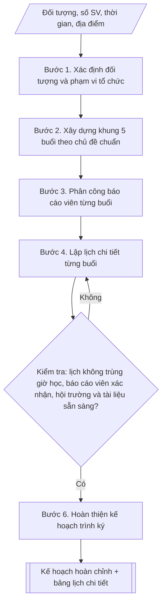

# Kế hoạch Tuần sinh hoạt công dân

## Kiểm soát áp dụng và phê duyệt

Trước khi chạy quy trình, xác định `ngay_ap_dung`, `loai_hinh_truong`, `quy_che_noi_bo`, `nguon_du_lieu` và `nguoi_kiem_duyet`. Chỉ yêu cầu thông tin có liên quan đến nghiệp vụ; không dùng giá trị giả định thay dữ liệu bắt buộc. Hồ sơ có yếu tố pháp lý phải kèm văn bản gốc, tình trạng hiệu lực, điều khoản áp dụng và chuyển tiếp.

## Giới hạn và human gate

AI hỗ trợ chuẩn bị và đối chiếu. Cán bộ phụ trách kiểm tra dữ liệu/căn cứ, người có thẩm quyền duyệt và ký. Mọi đầu ra mặc định là **DỰ THẢO – CHỜ KIỂM DUYỆT**; không đánh dấu đã ký, đã duyệt hoặc đã công bố nếu chưa có chứng cứ. Dữ liệu sinh viên, sức khỏe, nhân sự và tài chính phải hạn chế theo mục đích, phân quyền và che thông tin định danh khi dùng ví dụ. Không tải dữ liệu lên dịch vụ ngoài khi chưa có quyền. Kiểm tra Luật 91/2025/QH15 về bảo vệ dữ liệu cá nhân (hiệu lực 01/01/2026) và quy định áp dụng trước xử lý/chia sẻ dữ liệu cá nhân.


## Khi nào dùng
Khi đầu khóa học / đầu năm học cần tổ chức "Tuần sinh hoạt công dân" cho sinh viên mới
trúng tuyển hoặc toàn thể sinh viên, nhằm quán triệt nội quy – quy chế, giáo dục pháp
luật, định hướng kỹ năng học tập bậc đại học và tổ chức sinh hoạt Đoàn – Hội.

## Đầu vào (Input)

| Trường | Mô tả | Bắt buộc |
|---|---|---|
| `doi_tuong` | Sinh viên khóa mới (tân sinh viên) / toàn thể sinh viên các khóa | Có |
| `so_luong_sv` | Số lượng sinh viên tham dự dự kiến | Có |
| `thoi_gian` | Ngày bắt đầu – kết thúc (thường 5 ngày, đầu năm học) | Có |
| `dia_diem` | Hội trường / giảng đường / sân trường | Có |
| `chu_de` | Danh sách chủ đề theo từng buổi (mặc định 5 chủ đề chuẩn) | Không |
| `bao_cao_vien` | Danh sách báo cáo viên dự kiến (lãnh đạo trường, phòng ban, khách mời) | Không |
| `diem_danh` | Hình thức điểm danh (quét mã QR / ký tên / điểm danh điện tử) | Không (mặc định: quét mã QR) |

## Quy trình

**Bước 1. Xác định đối tượng và phạm vi tổ chức**
- Làm gì: xác định đối tượng là tân sinh viên (bắt buộc 100% tham dự, tính điểm rèn luyện)
  hay sinh viên toàn trường (chia theo khoa, từng buổi); chốt tổng số sinh viên tham dự dự kiến.
- Dùng input: `doi_tuong`, `so_luong_sv`.
- Vai trò: Trưởng Phòng Công tác sinh viên · AI hỗ trợ: tổng hợp dự thảo phạm vi · ⏱ ~1–2 giờ (ước tính)
- Lưu ý nghiệp vụ: với tân sinh viên, kết quả tuần sinh hoạt công dân là tiêu chí đánh giá
  rèn luyện học kỳ I — phải thông báo rõ yêu cầu tham dự ngay từ đầu.
- → Kết quả bước: phạm vi tổ chức đã chốt (đối tượng, số lượng, yêu cầu tham dự).

**Bước 2. Xây dựng khung 5 buổi theo chủ đề chuẩn**
- Làm gì: dựng khung 5 buổi: Buổi 1 – Nội quy, quy chế đào tạo (quy chế tín chỉ, thi – kiểm
  tra, học phí, nghỉ học, bảo lưu); Buổi 2 – Rèn luyện, học bổng, chính sách sinh viên (đánh
  giá rèn luyện, các loại học bổng, miễn giảm, vay vốn, KTX, BHYT); Buổi 3 – An ninh, pháp
  luật, an toàn giao thông (an ninh trật tự, phòng chống ma túy – tệ nạn, ATGT, PCCC, an toàn
  không gian mạng); Buổi 4 – Kỹ năng học đại học (phương pháp học, quản lý thời gian, thuyết
  trình, làm việc nhóm, định hướng nghề nghiệp, giao lưu cựu sinh viên); Buổi 5 – Sinh hoạt
  Đoàn – Hội (giới thiệu tổ chức, CLB – đội – nhóm, đăng ký tham gia, tổng kết và phát động
  thi đua).
- Dùng input: `chu_de` (nếu không có thì dùng 5 chủ đề chuẩn).
- Vai trò: Chuyên viên Phòng Công tác sinh viên · AI hỗ trợ: soạn dự thảo khung 5 buổi theo chủ đề chuẩn · ⏱ ~1–2 giờ (ước tính)
- Lưu ý nghiệp vụ: mỗi buổi phải có mục tiêu đầu ra rõ ràng cho sinh viên; tránh trùng lặp
  nội dung giữa các buổi.
- → Kết quả bước: khung nội dung 5 buổi (chủ đề, mục tiêu từng buổi).

**Bước 3. Phân công báo cáo viên từng buổi**
- Làm gì: phân công báo cáo viên phù hợp từng chủ đề: lãnh đạo Phòng Đào tạo, Phòng CTSV,
  Phòng Tài chính; đại diện Công an địa phương / Cảnh sát giao thông (buổi pháp luật); giảng
  viên kỹ năng; Ban Thường vụ Đoàn – Hội Sinh viên; xác nhận tham gia của từng báo cáo viên.
- Dùng input: `bao_cao_vien`.
- Vai trò: Chuyên viên Phòng Công tác sinh viên · AI hỗ trợ: lập danh sách đề xuất · ⏱ ~2–4 ngày làm việc (ước tính)
- Lưu ý nghiệp vụ: báo cáo viên khách mời (công an, CSGT) cần liên hệ, xác nhận trước ít nhất
  2 tuần; có phương án dự phòng khi báo cáo viên bận đột xuất.
- → Kết quả bước: danh sách báo cáo viên theo từng buổi (đã xác nhận tham gia).

**Bước 4. Lập lịch chi tiết từng buổi**
- Làm gì: lập bảng lịch chi tiết: ngày, giờ, nội dung/chủ đề, báo cáo viên, đối tượng, địa
  điểm, hình thức tổ chức (trực tiếp / trực tuyến / kết hợp), tài liệu phát cho sinh viên;
  chốt hình thức điểm danh (mặc định quét mã QR đầu – cuối mỗi buổi) và bài đánh giá cuối tuần.
- Dùng input: `thoi_gian`, `dia_diem`, `diem_danh`.
- Vai trò: Chuyên viên Phòng Công tác sinh viên · AI hỗ trợ: soạn dự thảo bảng lịch chi tiết từng buổi · ⏱ ~2–3 giờ (ước tính)
- Lưu ý nghiệp vụ: chia ca theo khoa nếu số lượng vượt sức chứa hội trường; bài thu hoạch/
  trắc nghiệm cuối tuần tối thiểu 70% câu đúng được tính hoàn thành.
- → Kết quả bước: bảng lịch chi tiết từng buổi + quy định điểm danh, đánh giá.

**Bước 5. Kiểm tra điều kiện tổ chức**
- Làm gì: kiểm tra lịch không trùng giờ học chính khóa; báo cáo viên đã xác nhận; hội trường
  – âm thanh – ánh sáng – trình chiếu sẵn sàng; tài liệu in đủ số lượng theo đầu sinh viên.
- Dùng input: kết quả bước 3–4.
- Vai trò: Chuyên viên Phòng Công tác sinh viên · AI hỗ trợ: rà soát kỹ thuật, tổng hợp và lưu trữ hồ sơ · ⏱ ~nửa ngày làm việc (ước tính)
- Lưu ý nghiệp vụ: kiểm tra thực tế tại địa điểm trước ngày khai mạc; chưa đạt thì quay lại
  điều chỉnh lịch (bước 4).
- → Kết quả bước: biên bản kiểm tra điều kiện tổ chức (đạt/chưa đạt theo từng hạng mục).

**Bước 6. Hoàn thiện kế hoạch trình ký**
- Làm gì: soạn văn bản kế hoạch đầy đủ các phần (căn cứ, mục đích – yêu cầu, thời gian – địa
  điểm – đối tượng, nội dung, tổ chức thực hiện, kinh phí) kèm bảng lịch chi tiết từng buổi;
  trình ký và triển khai.
- Dùng input: kết quả các bước 1–5.
- Vai trò: Trưởng Phòng Công tác sinh viên · AI hỗ trợ: soạn văn bản kế hoạch · ⏱ ~3–5 giờ (ước tính, chưa kể thời gian chờ duyệt)
- Lưu ý nghiệp vụ: văn bản phải có số/ký hiệu, được phê duyệt trước ngày khai mạc ít nhất
  1 tuần.
- → Kết quả bước: văn bản kế hoạch Tuần sinh hoạt công dân hoàn chỉnh + bảng lịch chi tiết
  từng buổi, sẵn sàng trình ký.

## Luồng quy trình (Workflow)


## Đầu ra (Output)
- Văn bản kế hoạch Tuần sinh hoạt công dân hoàn chỉnh (căn cứ, mục đích – yêu cầu,
  thời gian – địa điểm, nội dung, tổ chức thực hiện, kinh phí).
- Bảng lịch chi tiết từng buổi: ngày, giờ, nội dung/chủ đề, báo cáo viên, đối tượng,
  địa điểm, hình thức.

**Cấu trúc output chuẩn:** khung cố định của Kế hoạch Tuần sinh hoạt công dân:
1. Tiêu đề hành chính: Quốc hiệu – Tiêu ngữ; tên đơn vị; số, ký hiệu; địa danh, ngày tháng
   năm.
2. Tên kế hoạch: "KẾ HOẠCH" + "Tổ chức Tuần sinh hoạt công dân cho ..." (`doi_tuong`, năm học).
3. I. Căn cứ (quy chế công tác sinh viên, kế hoạch năm học).
4. II. Mục đích – yêu cầu (từng điểm: mục tiêu, yêu cầu 100% tham dự, tính điểm rèn luyện).
5. III. Thời gian – địa điểm – đối tượng (`thoi_gian`, `dia_diem`, `doi_tuong`, `so_luong_sv`).
6. IV. Nội dung chi tiết (khung 5 buổi; chi tiết xem bảng lịch kèm theo).
7. V. Tổ chức thực hiện (phân công từng đơn vị: Phòng CTSV, Phòng Đào tạo, Đoàn – Hội SV,
   các Khoa, Phòng Quản trị – Thiết bị).
8. VI. Kinh phí (dự kiến theo hạng mục + nguồn kinh phí).
9. Nơi nhận + chữ ký.

## Checklist nghiệm thu

- [ ] Đủ 9 phần theo "Cấu trúc output chuẩn": tiêu đề hành chính; tên kế hoạch; I. Căn cứ; II. Mục đích – yêu cầu; III. Thời gian – địa điểm – đối tượng; IV. Nội dung chi tiết; V. Tổ chức thực hiện; VI. Kinh phí; Nơi nhận + chữ ký.
- [ ] Kèm bảng lịch chi tiết đủ 5 buổi: ngày, giờ, nội dung/chủ đề, báo cáo viên, đối tượng, địa điểm, hình thức.
- [ ] Đối tượng, số lượng sinh viên, thời gian, địa điểm trong output khớp với Input đã cho.
- [ ] Không bịa đặt số liệu, tên báo cáo viên, trích dẫn quy chế.
- [ ] Đúng thể thức văn bản kế hoạch: số/ký hiệu, địa danh, ngày tháng năm.
- [ ] Căn cứ pháp lý (quy chế công tác sinh viên, kế hoạch năm học) còn hiệu lực.
- [ ] Đã qua Human gate: kế hoạch được phê duyệt trước ngày khai mạc ít nhất 1 tuần.
- [ ] Khung 5 buổi đúng chủ đề chuẩn, không trùng lặp nội dung giữa các buổi; ghi rõ quy định điểm danh (quét mã QR đầu – cuối buổi) và ngưỡng hoàn thành (bài thu hoạch/trắc nghiệm ≥ 70%).

Tiêu chí đạt = tất cả các ô được đánh dấu.


## Ví dụ mô phỏng (dữ liệu giả lập)

> Tất cả tên trường, cá nhân, số liệu dưới đây đều là **giả lập**, không liên quan tổ chức/cá nhân có thật.

### Input mẫu

| Trường | Giá trị |
|---|---|
| `doi_tuong` | Tân sinh viên khóa K15 (niên khóa 2026–2030) |
| `so_luong_sv` | 1.850 sinh viên |
| `thoi_gian` | 14/9/2026 – 18/9/2026 (5 ngày, sáng 8h00–11h00) |
| `dia_diem` | Hội trường A (600 chỗ) + 3 giảng đường B1, B2, B3 (chia ca theo khoa) |
| `diem_danh` | Quét mã QR đầu giờ và cuối giờ |

### Output mẫu

```
TRƯỜNG ĐẠI HỌC A            CỘNG HÒA XÃ HỘI CHỦ NGHĨA VIỆT NAM
PHÒNG CÔNG TÁC SINH VIÊN                Độc lập – Tự do – Hạnh phúc
       Số: 28/KH-ĐHA-CTSV
                                                 Thành phố C, ngày 01 tháng 9 năm 2026

KẾ HOẠCH
Tổ chức Tuần sinh hoạt công dân cho tân sinh viên khóa K15, năm học 2026–2027

I. CĂN CỨ
- Quy chế công tác sinh viên của Trường Đại học A;
- Kế hoạch năm học 2026–2027 của Nhà trường.

II. MỤC ĐÍCH – YÊU CẦU
1. Giúp tân sinh viên nắm vững nội quy, quy chế đào tạo, chế độ chính sách,
quy định pháp luật và kỹ năng học tập bậc đại học.
2. 100% tân sinh viên tham dự đủ các buổi; kết quả học tập tuần sinh hoạt
công dân được tính vào điểm rèn luyện học kỳ I năm học 2026–2027.
3. Tổ chức nghiêm túc, thiết thực, tránh hình thức.

III. THỜI GIAN – ĐỊA ĐIỂM – ĐỐI TƯỢNG
- Thời gian: từ ngày 14/9/2026 đến ngày 18/9/2026 (buổi sáng 8h00–11h00).
- Địa điểm: Hội trường A và các giảng đường B1, B2, B3 (chia theo khoa).
- Đối tượng: 1.850 tân sinh viên khóa K15.

IV. NỘI DUNG CHI TIẾT
(xem Bảng lịch chi tiết từng buổi dưới đây)

V. TỔ CHỨC THỰC HIỆN
1. Phòng Công tác sinh viên: đầu mối xây dựng nội dung, điều phối báo cáo
viên, điểm danh, chấm bài thu hoạch, tổng hợp kết quả.
2. Phòng Đào tạo: chuẩn bị nội dung quy chế đào tạo, cử báo cáo viên.
3. Đoàn Thanh niên – Hội Sinh viên: tổ chức buổi sinh hoạt Đoàn – Hội,
giới thiệu câu lạc bộ, đội, nhóm.
4. Các Khoa: thông báo, đôn đốc sinh viên tham dự đầy đủ, cử cán bộ quản
lý sinh viên theo dõi từng buổi.
5. Phòng Quản trị – Thiết bị: chuẩn bị hội trường, âm thanh, ánh sáng,
máy chiếu.

VI. KINH PHÍ
- Dự kiến 45.000.000 đồng (tài liệu, nước uống, thù lao báo cáo viên,
trang trí hội trường), trích từ kinh phí hoạt động CTSV năm 2026.

Nơi nhận:                                    KT. HIỆU TRƯỞNG
- Ban Giám hiệu (b/c);                       PHÓ HIỆU TRƯỞNG
- Các Khoa, Phòng, Đoàn – Hội SV;
- Lưu: VT, CTSV.                                 [CHỜ KÝ]

                                         TS. Vũ Thị Lan
```

### Bảng lịch chi tiết từng buổi

| Buổi / Ngày | Nội dung / Chủ đề | Báo cáo viên | Đối tượng | Địa điểm | Hình thức |
|---|---|---|---|---|---|
| Buổi 1 – 14/9 | Khai mạc; Nội quy – Quy chế đào tạo tín chỉ, thi – kiểm tra, học phí | TS. Vũ Thị Lan (Phó Hiệu trưởng); Trưởng phòng Đào tạo | Toàn khóa K15 | Hội trường A + B1, B2, B3 | Trực tiếp, phát tài liệu |
| Buổi 2 – 15/9 | Đánh giá rèn luyện; học bổng khuyến khích – tài trợ – chính sách; BHYT, KTX | Trưởng phòng CTSV; Trưởng phòng Tài chính | Toàn khóa K15 | Hội trường A + B1, B2, B3 | Trực tiếp + hỏi đáp |
| Buổi 3 – 16/9 | An ninh – pháp luật; phòng chống ma túy, tệ nạn xã hội; ATGT; PCCC; an toàn không gian mạng | Đại diện Công an quận; cán bộ Cảnh sát giao thông; giảng viên Khoa Luật | Toàn khóa K15 | Hội trường A + B1, B2, B3 | Trực tiếp, chiếu clip tình huống |
| Buổi 4 – 17/9 | Kỹ năng học đại học: phương pháp học, quản lý thời gian, thuyết trình, làm việc nhóm; giao lưu cựu sinh viên | Giảng viên kỹ năng mềm; 02 cựu sinh viên tiêu biểu | Toàn khóa K15 | Hội trường A + B1, B2, B3 | Trực tiếp, giao lưu |
| Buổi 5 – 18/9 | Sinh hoạt Đoàn – Hội: giới thiệu tổ chức, CLB – đội – nhóm; đăng ký tham gia; tổng kết, phát động thi đua | Bí thư Đoàn trường; Chủ tịch Hội Sinh viên | Toàn khóa K15 | Sân trường + Hội trường A | Trực tiếp, gian hàng CLB |

*Ghi chú: cuối tuần sinh viên làm bài trắc nghiệm 20 câu (đạt ≥ 14/20 được tính
hoàn thành); điểm danh bằng quét mã QR đầu giờ và cuối giờ mỗi buổi.*

## Căn cứ & lưu ý
- Quy chế công tác sinh viên của trường; kế hoạch năm học của Nhà trường.
- Kết quả Tuần sinh hoạt công dân là một tiêu chí trong đánh giá kết quả rèn luyện
  học kỳ I của sinh viên.
- Lịch tổ chức không trùng với lịch học chính khóa; báo cáo viên khách mời (công an,
  cảnh sát giao thông) cần liên hệ, xác nhận trước ít nhất 2 tuần.
- Không dùng tên thật của trường/cá nhân khi mô phỏng.

## Quản trị phiên bản

- Phiên bản gói: `1.1.0`; ngày cập nhật: `2026-10-09`.
- Kho nguồn: https://github.com/phamtruong91/dh-skills
- Người duy trì trên GitHub: `phamtruong91` (Phạm Văn Trường). Người phê duyệt nghiệp vụ: **chưa chỉ định**.
- Commit nguồn trước cập nhật: `78fd1d51b8acd1a724d9b9af6c488460bc7551ad`. Commit chứa phiên bản này xem bằng `git log -1 -- skills/ke-hoach-tuan-shcd`; không tự gán SHA chưa tạo.
- Giấy phép: theo LICENSE của kho; bản quyền CES Global.
- Lịch sử 1.1.0: bổ sung metadata giao diện, kiểm soát áp dụng, quản trị phiên bản.
- Trạng thái: dự thảo nghiệp vụ; kiểm tra pháp lý trước thực thi. Ngày cập nhật không đồng nghĩa mọi văn bản đã được rà soát toàn văn.
