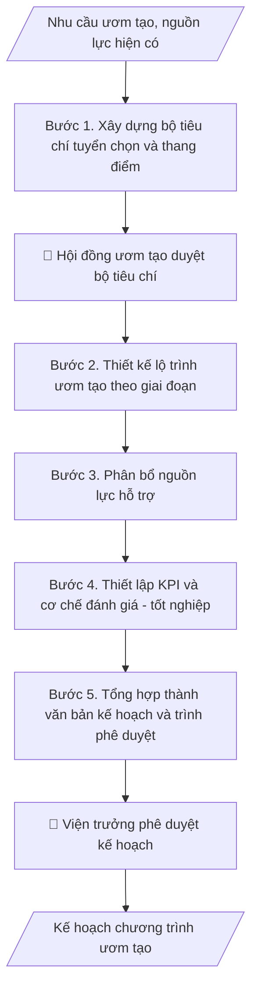

# Kế hoạch ươm tạo ĐMST

## Định dạng và file đầu ra

Định dạng đầu ra có thể chọn theo sản phẩm/yêu cầu: .docx, .pdf. Đọc mục “Định dạng bổ sung” trong quy cách đầu ra trước khi chọn.

**Phải tạo file thực tế để tải xuống, không chỉ trả nội dung trong chat.** Định dạng mặc định của skill: **.docx**. Nếu có bảng số liệu nghiệp vụ yêu cầu file bảng tính riêng, tạo thêm Excel theo yêu cầu; không tự tạo file kiểm tra. Không chờ người dùng yêu cầu xuất file lần nữa. Ưu tiên định dạng người dùng chỉ định; đọc quy tắc xuất file tại references/quy-cach-dau-ra.md.

## Quy cách đầu ra và thông tin thiếu
Khi dựng file Word/Excel, áp dụng mục “Thể thức và bảng biểu khi dựng file” trong quy cách đầu ra (cỡ chữ từng thành phần, bảng nhiều trang, số trang, phụ lục). Đọc [quy cách và cấu trúc sản phẩm](references/quy-cach-dau-ra.md) trước khi soạn/xuất. File giao chỉ gồm sản phẩm nghiệp vụ được yêu cầu; kiểm tra nội bộ không xuất kèm. Thiếu thông tin thì giữ nguyên trường/mục và chỗ điền theo mẫu gốc (dòng dấu chấm, dấu gạch hoặc ô trống); không tự điền dữ liệu mẫu, số 0, mã chờ xác minh hay dòng chờ ký. Mẫu chuyên ngành còn áp dụng được ưu tiên về cấu trúc, mã biểu và người ký. Bản đầy đủ: [quy tắc chung](references/quy-tac-chung.md).

Khi người dùng yêu cầu bộ slide (.pptx), đọc mục “Xuất PowerPoint (.pptx) khi được yêu cầu” trong quy cách đầu ra.

## Kiểm soát áp dụng và phê duyệt
Trước khi chạy, xác định `ngay_ap_dung`, `loai_hinh_truong`, `quy_che_noi_bo`, `nguon_du_lieu`, `nguoi_kiem_duyet`; chỉ hỏi thông tin liên quan nghiệp vụ, không dùng giá trị giả định thay dữ liệu bắt buộc. Đối chiếu căn cứ pháp lý với văn bản gốc, hiệu lực, điều khoản áp dụng và chuyển tiếp. Bản đầy đủ: [quy tắc chung](references/quy-tac-chung.md).

## Giới hạn và human gate
AI hỗ trợ chuẩn bị và đối chiếu; cán bộ phụ trách kiểm tra dữ liệu/căn cứ, người có thẩm quyền duyệt và ký. Không đánh dấu đã ký, đã duyệt, đã công bố khi chưa có chứng cứ. Dữ liệu sinh viên, sức khỏe, nhân sự, tài chính chỉ dùng theo mục đích và phân quyền, che thông tin định danh khi dùng ví dụ (Luật 91/2025/QH15, hiệu lực 01/01/2026); không tải dữ liệu lên dịch vụ ngoài khi chưa có quyền. Bản đầy đủ: [quy tắc chung](references/quy-tac-chung.md).

## Khi nào dùng
Khi Viện ĐMST & CGCN tổ chức chương trình ươm tạo (startup sinh viên, giảng viên, dự án spin-off):
cần kế hoạch gồm tiêu chí tuyển chọn, lộ trình các giai đoạn, nguồn lực hỗ trợ và chỉ tiêu đầu ra.

## Đầu vào (Input)

| Trường | Mô tả | Bắt buộc |
|---|---|---|
| `ten_chuong_trinh` | Tên chương trình ươm tạo + đợt/năm | Có |
| `doi_tuong` | Sinh viên / giảng viên / startup ngoài / hỗn hợp | Có |
| `linh_vuc_uu_tien` | Các lĩnh vực ưu tiên (VD: AI, nông nghiệp thông minh...) | Không |
| `nguon_luc` | Mentor, phòng lab, vốn mồi, hỗ trợ pháp lý... hiện có | Có |
| `thoi_gian` | Thời gian mỗi giai đoạn và toàn chương trình | Có |
| `chi_tieu` | Số lượng dự án tuyển, tỷ lệ tốt nghiệp mong muốn | Không |

## Quy trình

**Bước 1. Xây dựng bộ tiêu chí tuyển chọn và thang điểm**
- Làm gì: Thiết kế bộ tiêu chí chấm thang 100 điểm: tính đổi mới sáng tạo, tính khả thi
  kỹ thuật, năng lực đội ngũ, tiềm năng thị trường, phù hợp lĩnh vực ưu tiên; mỗi tiêu
  chí có trọng số và rubric mô tả các mức điểm để giám khảo chấm nhất quán; đặt ngưỡng
  trúng tuyển.
- Dùng input: `ten_chuong_trinh`, `doi_tuong`, `linh_vuc_uu_tien`, `chi_tieu` (số lượng
  tuyển → mức ngưỡng điểm phù hợp).
- Vai trò: Hội đồng tuyển chọn · AI hỗ trợ: soạn bộ tiêu chí, thang điểm và rubric dự thảo · ⏱ 2–3 giờ (ước tính)
- Lưu ý nghiệp vụ: trọng số phải phản ánh mục tiêu chương trình (ươm tạo trong trường
  thì coi trọng tính đổi mới + đội ngũ hơn doanh thu tức thì); rubric phải cụ thể, tránh
  tiêu chí định tính chung chung khó chấm.
- → Kết quả bước: Bộ tiêu chí + thang điểm 100 + rubric chấm + ngưỡng trúng tuyển
  (dự thảo trình hội đồng ươm tạo duyệt).

**Bước 2. Thiết kế lộ trình ươm tạo theo giai đoạn**
- Làm gì: Chia chương trình thành 4 giai đoạn khớp `thoi_gian`: (1) Tuyển chọn — các mốc
  phát động/nhận hồ sơ/chấm/phỏng vấn/công bố; (2) Ươm tạo — hoàn thiện MVP, lịch đào tạo
  kỹ năng, mentor 1-1; (3) Tăng tốc — kết nối thị trường, tập gọi vốn; (4) Tốt nghiệp —
  demo day, đánh giá. Mỗi giai đoạn ghi: thời gian, mục tiêu đầu ra, tiêu chí "qua cửa"
  để sang giai đoạn tiếp theo.
- Dùng input: `thoi_gian`, `chi_tieu`, `doi_tuong`.
- Vai trò: Chuyên viên ươm tạo · AI hỗ trợ: thiết kế timeline 4 giai đoạn dự thảo, ban tổ chức chốt mốc và tiêu chí qua cửa · ⏱ 2–3 giờ (ước tính)
- Lưu ý nghiệp vụ: mỗi giai đoạn phải có "cửa kiểm tra" (gate) với tiêu chí rõ ràng —
  dự án không đạt thì dừng hỗ trợ hoặc kéo dài có điều kiện, tránh nuôi dự án không triển
  vọng; mốc thời gian phải chừa đệm cho tuyển chọn (thường 6–8 tuần).
- → Kết quả bước: Timeline chi tiết 4 giai đoạn (mốc thời gian, đầu ra, tiêu chí qua cửa).

**Bước 3. Phân bổ nguồn lực hỗ trợ**
- Làm gì: Từ `nguon_luc` hiện có: ghép mentor cho từng dự án theo lĩnh vực chuyên môn, lập
  lịch dùng lab/phòng làm việc chung, gói hỗ trợ pháp lý–kế toán (đăng ký doanh nghiệp,
  SHTT), thiết kế cơ chế giải ngân vốn mồi theo mốc (tỷ lệ % từng đợt gắn với KPI giai đoạn).
- Dùng input: `nguon_luc`, `chi_tieu` (số dự án tuyển → chia nguồn lực cho vừa).
- Vai trò: Chuyên viên ươm tạo · AI hỗ trợ: lập bảng phân bổ nguồn lực dự thảo, ban tổ chức xác nhận mentor và lịch lab · ⏱ 1–2 giờ (ước tính)
- Lưu ý nghiệp vụ: vốn mồi giải ngân theo mốc đạt được, không cấp một lần; mentor phải
  cam kết thời gian tối thiểu (VD: 2 giờ/tuần/dự án); kiểm tra tổng cam kết không vượt
  nguồn lực thực có.
- → Kết quả bước: Bảng phân bổ nguồn lực (ghép mentor–dự án, lịch lab, lịch giải ngân
  vốn mồi theo mốc).

**Bước 4. Thiết lập KPI và cơ chế đánh giá – tốt nghiệp**
- Làm gì: Đặt KPI đầu ra định lượng (số dự án tốt nghiệp, số MVP hoàn thiện, số dự án gọi
  được vốn, việc làm tạo ra) gắn với `chi_tieu`; thiết kế tiêu chí đánh giá cuối kỳ,
  format demo day (thành phần ban giám khảo, thang điểm), chính sách hỗ trợ sau ươm tạo
  (mạng lưới alumni, ưu đãi dùng lab).
- Dùng input: `chi_tieu`, `thoi_gian`.
- Vai trò: Hội đồng tuyển chọn · AI hỗ trợ: đề xuất KPI và quy chế đánh giá cuối kỳ · ⏱ 1–2 giờ (ước tính)
- Lưu ý nghiệp vụ: KPI phải đo được và có mốc thời gian; quy định rõ điều kiện "tốt
  nghiệp" so với "chưa đạt" và quyền lợi khác nhau của 2 nhóm.
- → Kết quả bước: Bộ KPI đầu ra + quy chế đánh giá cuối kỳ, demo day và tốt nghiệp.

**Bước 5. Tổng hợp thành văn bản kế hoạch và trình phê duyệt**
- Làm gì: Ghép kết quả các bước 1–4 thành văn bản kế hoạch hoàn chỉnh theo cấu trúc chuẩn;
  kiểm tra tính khả thi tổng thể (nguồn lực có đủ cho số dự án tuyển không, tổng vốn mồi
  cam kết có vượt ngân sách không); trình hội đồng ươm tạo và viện trưởng phê duyệt.
- Dùng input: `ten_chuong_trinh`, `doi_tuong` (tiêu đề, đối tượng chương trình).
- Vai trò: Viện trưởng · AI hỗ trợ: ghép văn bản và kiểm tra chéo tính khả thi · ⏱ 1–2 giờ (ước tính)
- Lưu ý nghiệp vụ: kiểm tra chéo lần cuối — số mentor đủ cho số dự án, lịch lab không
  chồng chéo, mốc giải ngân khớp timeline; kế hoạch phải ban hành trước khi phát động
  tuyển chọn.
- → Kết quả bước: Văn bản kế hoạch chương trình ươm tạo hoàn chỉnh (trình phê duyệt).

## Luồng quy trình (Workflow)

## Đầu ra

File nghiệp vụ thực tế theo định dạng mặc định ở đầu skill hoặc định dạng người dùng yêu cầu, kèm liên kết tải trong phản hồi cuối.

Sản phẩm nghiệp vụ hoàn chỉnh theo [quy cách và cấu trúc](references/quy-cach-dau-ra.md), giữ các trường chưa có dữ liệu ở trạng thái trống. Không xuất kèm checklist/phụ lục kiểm tra đầu ra.

## Kiểm tra nội bộ trước khi giao

- [ ] Bố cục khớp mẫu áp dụng và cấu trúc tại references/quy-cach-dau-ra.md.
- [ ] Số liệu khớp với Input: số dự án tuyển, nguồn lực (mentor, lab, vốn mồi), thời gian.
- [ ] Không bịa đặt cam kết gọi vốn, cam kết đầu tư hay nguồn lực không có thật.
- [ ] Bộ tiêu chí thang 100 điểm có trọng số và rubric cụ thể cho từng mức điểm, ngưỡng trúng tuyển rõ ràng.
- [ ] Mỗi giai đoạn có "cửa kiểm tra" với tiêu chí qua cửa rõ ràng; dự án không đạt thì dừng hỗ trợ hoặc kéo dài có điều kiện.
- [ ] Tổng cam kết nguồn lực (mentor, lịch lab, vốn mồi giải ngân theo mốc) không vượt nguồn lực thực có.
- [ ] KPI định lượng được, có mốc thời gian; quy định rõ điều kiện tốt nghiệp so với chưa đạt và quyền lợi khác nhau.
- [ ] Kế hoạch ban hành trước khi phát động tuyển chọn.
- [ ] Đã qua Human gate: hội đồng ươm tạo duyệt bộ tiêu chí, viện trưởng phê duyệt kế hoạch và danh sách trúng tuyển.

Tiêu chí đạt = tất cả các ô được đánh dấu.

## Human gate (người kiểm duyệt)
- **Hội đồng ươm tạo** chấm tuyển chọn và đánh giá tốt nghiệp theo thang điểm đã duyệt.
- **Viện trưởng** phê duyệt danh sách trúng tuyển và quyết định giải ngân vốn mồi theo mốc.

## Giới hạn (guardrails)
- KHÔNG cam kết khả năng gọi vốn thành công cho dự án ươm tạo.
- KHÔNG quyết định đầu tư/góp vốn thay mặt nhà trường khi chưa có phê duyệt thẩm quyền.
- KHÔNG tiết lộ ý tưởng/dữ liệu của dự án này cho dự án khác khi chưa được đồng ý.

## Căn cứ & lưu ý
- Quy chế hoạt động vườn ươm/cơ sở ươm tạo của trường (nếu có); quy định quản lý vốn mồi.
- Mọi số liệu trong ví dụ đều giả lập.
- Không dùng tên thật của trường/cá nhân/tổ chức khi mô phỏng.

## Quản trị phiên bản
- Phiên bản gói `1.3.2` (cập nhật 2026-10-10); hồ sơ đầy đủ tại [references/version.json](references/version.json).
- Người phê duyệt nghiệp vụ: **chưa chỉ định**. Trạng thái: dự thảo nghiệp vụ; kiểm tra pháp lý trước thực thi. Ngày cập nhật không đồng nghĩa mọi văn bản đã được rà soát toàn văn.
- Giấy phép theo LICENSE của kho (bản quyền CES Global). Lịch sử thay đổi: CHANGELOG.md.
