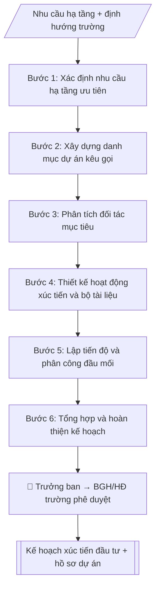

# Kế hoạch xúc tiến đầu tư

## Định dạng và file đầu ra

Định dạng đầu ra có thể chọn theo sản phẩm/yêu cầu: .docx, .pdf. Đọc mục “Định dạng bổ sung” trong quy cách đầu ra trước khi chọn.

**Phải tạo file thực tế để tải xuống, không chỉ trả nội dung trong chat.** Định dạng mặc định của skill: **.docx**. Nếu có bảng số liệu nghiệp vụ yêu cầu file bảng tính riêng, tạo thêm Excel theo yêu cầu; không tự tạo file kiểm tra. Không chờ người dùng yêu cầu xuất file lần nữa. Ưu tiên định dạng người dùng chỉ định; đọc quy tắc xuất file tại references/quy-cach-dau-ra.md.

## Quy cách đầu ra và thông tin thiếu
Khi dựng file Word/Excel, áp dụng mục “Thể thức và bảng biểu khi dựng file” trong quy cách đầu ra (cỡ chữ từng thành phần, bảng nhiều trang, số trang, phụ lục). Đọc [quy cách và cấu trúc sản phẩm](references/quy-cach-dau-ra.md) trước khi soạn/xuất. File giao chỉ gồm sản phẩm nghiệp vụ được yêu cầu; kiểm tra nội bộ không xuất kèm. Thiếu thông tin thì giữ nguyên trường/mục và chỗ điền theo mẫu gốc (dòng dấu chấm, dấu gạch hoặc ô trống); không tự điền dữ liệu mẫu, số 0, mã chờ xác minh hay dòng chờ ký. Mẫu chuyên ngành còn áp dụng được ưu tiên về cấu trúc, mã biểu và người ký. Bản đầy đủ: [quy tắc chung](references/quy-tac-chung.md).

## Kiểm soát áp dụng và phê duyệt
Trước khi chạy, xác định `ngay_ap_dung`, `loai_hinh_truong`, `quy_che_noi_bo`, `nguon_du_lieu`, `nguoi_kiem_duyet`; chỉ hỏi thông tin liên quan nghiệp vụ, không dùng giá trị giả định thay dữ liệu bắt buộc. Đối chiếu căn cứ pháp lý với văn bản gốc, hiệu lực, điều khoản áp dụng và chuyển tiếp. Bản đầy đủ: [quy tắc chung](references/quy-tac-chung.md).

## Giới hạn và human gate
AI hỗ trợ chuẩn bị và đối chiếu; cán bộ phụ trách kiểm tra dữ liệu/căn cứ, người có thẩm quyền duyệt và ký. Không đánh dấu đã ký, đã duyệt, đã công bố khi chưa có chứng cứ. Dữ liệu sinh viên, sức khỏe, nhân sự, tài chính chỉ dùng theo mục đích và phân quyền, che thông tin định danh khi dùng ví dụ (Luật 91/2025/QH15, hiệu lực 01/01/2026); không tải dữ liệu lên dịch vụ ngoài khi chưa có quyền. Bản đầy đủ: [quy tắc chung](references/quy-tac-chung.md).

## Khi nào dùng
Khi Ban Xúc tiến đầu tư và Phát triển hạ tầng cần lập kế hoạch thu hút đầu tư cho trường:
kêu gọi đầu tư hạ tầng, hợp tác công–tư, tài trợ, liên doanh liên kết.

## Đầu vào (Input)

| Trường | Mô tả | Bắt buộc |
|---|---|---|
| `nam_ke_hoach` | Năm / giai đoạn kế hoạch | Có |
| `dinh_huong` | Định hướng phát triển hạ tầng, nhu cầu vốn của trường | Có |
| `danh_muc_du_an` | Các dự án kêu gọi đầu tư: tên, quy mô, hình thức (PPP, tài trợ, thuê...) | Có |
| `doi_tac_muc_tieu` | Nhóm đối tác mục tiêu (doanh nghiệp, quỹ, tổ chức quốc tế) | Có |
| `hoat_dong_xuc_tien` | Hội nghị, roadshow, tài liệu quảng bá dự kiến | Không |

## Quy trình

**Bước 1. Xác định nhu cầu hạ tầng ưu tiên**
- Làm gì: từ `dinh_huong`, rà soát quy hoạch/chiến lược phát triển trường, liệt kê nhu cầu hạ tầng (giảng đường, ký túc xá, lab, khu đổi mới sáng tạo...); xếp hạng ưu tiên theo tiêu chí: cấp bách – tác động đào tạo – khả thi vốn.
- Dùng input: `dinh_huong`, `nam_ke_hoach`.
- Vai trò: Chuyên viên Ban Xúc tiến đầu tư · AI hỗ trợ: đối chiếu tự động, cảnh báo sai lệch · ⏱ ~1–2 giờ (ước tính)
- Lưu ý nghiệp vụ: chỉ đưa vào danh mục kêu gọi những dự án đã có chủ trương sơ bộ; dự án chưa rõ nhu cầu thì để vào danh mục theo dõi riêng.
- → Kết quả bước: Danh sách nhu cầu hạ tầng đã xếp hạng ưu tiên.

**Bước 2. Xây dựng danh mục dự án kêu gọi**
- Làm gì: từ `danh_muc_du_an`, mỗi dự án lập phiếu tóm tắt: tên, quy mô, tổng mức đầu tư dự kiến (ghi rõ cơ sở ước tính), hình thức hợp tác đề xuất (PPP/tài trợ/thuê...), tiến độ dự kiến; phân loại: dự án trọng điểm / dự án tiềm năng.
- Dùng input: `danh_muc_du_an` + danh sách ưu tiên (Bước 1).
- Vai trò: Chuyên viên Ban Xúc tiến đầu tư · AI hỗ trợ: tính toán, phân tích số liệu, lập bảng biểu, định dạng · ⏱ ~30–60 phút (ước tính)
- Lưu ý nghiệp vụ: mọi số liệu ở mức "dự kiến" và phải ghi rõ như vậy; không cam kết ưu đãi hay điều khoản cụ thể ở giai đoạn này.
- → Kết quả bước: Danh mục dự án kêu gọi (phiếu tóm tắt 1–2 trang/dự án).

**Bước 3. Phân tích đối tác mục tiêu**
- Làm gì: từ `doi_tac_muc_tieu`, với từng nhóm đối tác (doanh nghiệp bất động sản, quỹ đầu tư giáo dục, tập đoàn công nghệ, tổ chức quốc tế) phân tích: ngành nghề, năng lực tài chính, tiền lệ hợp tác giáo dục; lập danh sách đối tác cụ thể cần tiếp cận (longlist → shortlist).
- Dùng input: `doi_tac_muc_tieu` + danh mục dự án (Bước 2).
- Vai trò: Chuyên viên Ban Xúc tiến đầu tư · AI hỗ trợ: tính toán, phân tích số liệu, lập bảng biểu, định dạng · ⏱ ~30–60 phút (ước tính)
- Lưu ý nghiệp vụ: ưu tiên đối tác đã có tiền lệ đầu tư giáo dục; kiểm tra uy tín qua thông tin công khai trước khi đưa vào shortlist.
- → Kết quả bước: Bảng phân tích đối tác + shortlist tiếp cận.

**Bước 4. Thiết kế hoạt động xúc tiến và bộ tài liệu**
- Làm gì: từ `hoat_dong_xuc_tien`, chi tiết hóa từng hoạt động: hội nghị xúc tiến (thời gian, quy mô khách mời, chương trình), gặp song phương (danh sách, lịch), tài liệu quảng bá; biên soạn profile dự án song ngữ Việt – Anh cho từng dự án trọng điểm (tóm tắt 1–2 trang: quy mô, tổng mức, hình thức, liên hệ).
- Dùng input: `hoat_dong_xuc_tien` + danh mục dự án (Bước 2) + shortlist đối tác (Bước 3).
- Vai trò: Chuyên viên Ban Xúc tiến đầu tư · AI hỗ trợ: soạn dự thảo, lập bảng biểu, định dạng · ⏱ ~1–2 giờ (ước tính)
- Lưu ý nghiệp vụ: profile song ngữ phải do người có năng lực biên dịch kiểm tra; thông tin mật của trường không đưa vào tài liệu công khai khi chưa có thỏa thuận bảo mật.
- → Kết quả bước: Kế hoạch hoạt động xúc tiến chi tiết + bộ profile dự án song ngữ.

**Bước 5. Lập tiến độ và phân công đầu mối**
- Làm gì: gắn từng hoạt động vào mốc thời gian trong `nam_ke_hoach` (theo quý); mỗi dự án/hoạt động ghi đầu mối chịu trách nhiệm, đơn vị phối hợp (Phòng QTTB, Phòng TCKT, Phòng Pháp chế); quy định chế độ báo cáo tiến độ.
- Dùng input: `nam_ke_hoach` + kế hoạch hoạt động (Bước 4).
- Vai trò: Chuyên viên Ban Xúc tiến đầu tư · AI hỗ trợ: lập bảng biểu, định dạng · ⏱ ~30–60 phút (ước tính)
- Lưu ý nghiệp vụ: Phòng Pháp chế phải rà soát hình thức hợp tác trước khi tiếp xúc đối tác chính thức; mốc hội nghị xúc tiến cần chốt trước ít nhất 3 tháng để chuẩn bị.
- → Kết quả bước: Bảng tiến độ và phân công (hoạt động – thời gian – đầu mối – phối hợp).

**Bước 6. Tổng hợp và hoàn thiện kế hoạch**
- Làm gì: ghép các bán thành phẩm Bước 1–5 thành văn bản kế hoạch theo thể thức (số ký hiệu, nơi nhận, chữ ký); rà soát nhất quán: định hướng – danh mục – đối tác – hoạt động – tiến độ.
- Dùng input: toàn bộ bán thành phẩm Bước 1–5.
- Vai trò: Chuyên viên Ban Xúc tiến đầu tư · AI hỗ trợ: tổng hợp, chuẩn hóa dữ liệu, đối chiếu tự động, cảnh báo sai lệch · ⏱ ~30–60 phút (ước tính)
- Lưu ý nghiệp vụ: kiểm tra số ký hiệu không trùng; nơi nhận gồm Ban Giám hiệu và các đơn vị phối hợp.
- → Kết quả bước: Kế hoạch xúc tiến đầu tư hoàn chỉnh (sẵn sàng trình phê duyệt).

## Luồng quy trình (Workflow)

## Đầu ra

File nghiệp vụ thực tế theo định dạng mặc định ở đầu skill hoặc định dạng người dùng yêu cầu, kèm liên kết tải trong phản hồi cuối.

Sản phẩm nghiệp vụ hoàn chỉnh theo [quy cách và cấu trúc](references/quy-cach-dau-ra.md), giữ các trường chưa có dữ liệu ở trạng thái trống. Không xuất kèm checklist/phụ lục kiểm tra đầu ra.

## Kiểm tra nội bộ trước khi giao

- [ ] Bố cục khớp mẫu áp dụng và cấu trúc tại references/quy-cach-dau-ra.md.
- [ ] Có đầy đủ sản phẩm: Kế hoạch xúc tiến đầu tư (định hướng, danh mục dự án, đối tác, hoạt động, tiến độ)
- [ ] Có đầy đủ sản phẩm: Bộ hồ sơ giới thiệu dự án (tóm tắt 1–2 trang/dự án)
- [ ] Mọi số liệu, tên, ngày tháng trong output khớp với Input đã cung cấp (không thêm bớt, không suy đoán)
- [ ] Không bịa đặt số liệu, minh chứng, trích dẫn hay căn cứ
- [ ] Đúng thể thức, định dạng văn bản theo quy định hiện hành
- [ ] Căn cứ pháp lý nêu đầy đủ, còn hiệu lực tại thời điểm lập
- [ ] Đã qua Human gate: người có thẩm quyền đã kiểm tra/ký duyệt trước khi phát hành
- [ ] Chỉ đưa vào danh mục kêu gọi những dự án đã có chủ trương sơ bộ
- [ ] Mọi số liệu ở mức "dự kiến" và phải ghi rõ như vậy

> Tiêu chí đạt: tất cả các ô đều được đánh dấu.

## Human gate
- Trưởng Ban duyệt kế hoạch; Ban Giám hiệu/Hội đồng trường phê duyệt danh mục và chủ trương kêu gọi.
- Phòng Pháp chế rà soát hình thức hợp tác trước khi tiếp xúc đối tác chính thức.

## Giới hạn
- Không cam kết ưu đãi, điều khoản hợp tác vượt thẩm quyền khi chưa được phê duyệt.
- Không cung cấp thông tin mật của trường cho đối tác khi chưa có thỏa thuận bảo mật.
- Mọi số liệu dự án ở mức "dự kiến" cho đến khi có phê duyệt đầu tư chính thức.

## Căn cứ & lưu ý
- Luật Đầu tư, Luật PPP (đối tác công – tư), quy định về quản lý tài sản công và quy chế nội bộ.
- Không dùng tên thật của trường/cá nhân khi mô phỏng.

## Quản trị phiên bản
- Phiên bản gói `1.3.2` (cập nhật 2026-10-10); hồ sơ đầy đủ tại [references/version.json](references/version.json).
- Người phê duyệt nghiệp vụ: **chưa chỉ định**. Trạng thái: dự thảo nghiệp vụ; kiểm tra pháp lý trước thực thi. Ngày cập nhật không đồng nghĩa mọi văn bản đã được rà soát toàn văn.
- Giấy phép theo LICENSE của kho (bản quyền CES Global). Lịch sử thay đổi: CHANGELOG.md.
