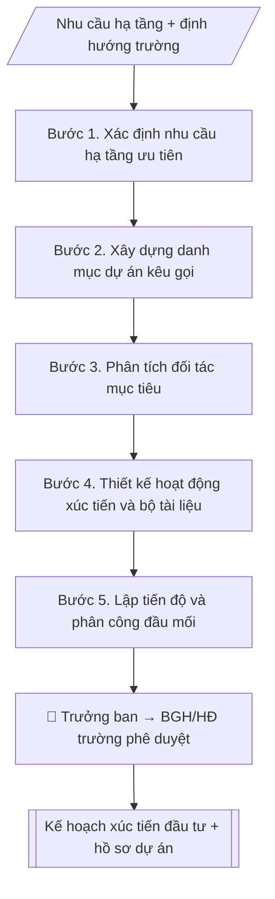

# Kế hoạch xúc tiến đầu tư

## Kiểm soát áp dụng và phê duyệt

Trước khi chạy quy trình, xác định `ngay_ap_dung`, `loai_hinh_truong`, `quy_che_noi_bo`, `nguon_du_lieu` và `nguoi_kiem_duyet`. Chỉ yêu cầu thông tin có liên quan đến nghiệp vụ; không dùng giá trị giả định thay dữ liệu bắt buộc. Hồ sơ có yếu tố pháp lý phải kèm văn bản gốc, tình trạng hiệu lực, điều khoản áp dụng và chuyển tiếp.

## Giới hạn và human gate

AI hỗ trợ chuẩn bị và đối chiếu. Cán bộ phụ trách kiểm tra dữ liệu/căn cứ, người có thẩm quyền duyệt và ký. Mọi đầu ra mặc định là **DỰ THẢO – CHỜ KIỂM DUYỆT**; không đánh dấu đã ký, đã duyệt hoặc đã công bố nếu chưa có chứng cứ. Dữ liệu sinh viên, sức khỏe, nhân sự và tài chính phải hạn chế theo mục đích, phân quyền và che thông tin định danh khi dùng ví dụ. Không tải dữ liệu lên dịch vụ ngoài khi chưa có quyền. Kiểm tra Luật 91/2025/QH15 về bảo vệ dữ liệu cá nhân (hiệu lực 01/01/2026) và quy định áp dụng trước xử lý/chia sẻ dữ liệu cá nhân.


## Khi nào dùng
Khi Ban Xúc tiến đầu tư và Phát triển hạ tầng cần lập kế hoạch thu hút đầu tư cho trường:
kêu gọi đầu tư hạ tầng, hợp tác công–tư, tài trợ, liên doanh liên kết.

## Đầu vào (Input)

| Trường | Mô tả | Bắt buộc |
|---|---|---|
| `nam_ke_hoach` | Năm / giai đoạn kế hoạch | Có |
| `dinh_huong` | Định hướng phát triển hạ tầng, nhu cầu vốn của trường | Có |
| `danh_muc_du_an` | Các dự án kêu gọi đầu tư: tên, quy mô, hình thức (PPP, tài trợ, thuê...) | Có |
| `doi_tac_muc_tieu` | Nhóm đối tác mục tiêu (doanh nghiệp, quỹ, tổ chức quốc tế) | Có |
| `hoat_dong_xuc_tien` | Hội nghị, roadshow, tài liệu quảng bá dự kiến | Không |

## Quy trình

**Bước 1. Xác định nhu cầu hạ tầng ưu tiên**
- Làm gì: từ `dinh_huong`, rà soát quy hoạch/chiến lược phát triển trường, liệt kê nhu cầu hạ tầng (giảng đường, ký túc xá, lab, khu đổi mới sáng tạo...); xếp hạng ưu tiên theo tiêu chí: cấp bách – tác động đào tạo – khả thi vốn.
- Dùng input: `dinh_huong`, `nam_ke_hoach`.
- Vai trò: Chuyên viên Ban Xúc tiến đầu tư · AI hỗ trợ: đối chiếu tự động, cảnh báo sai lệch · ⏱ ~1–2 giờ (ước tính)
- Lưu ý nghiệp vụ: chỉ đưa vào danh mục kêu gọi những dự án đã có chủ trương sơ bộ; dự án chưa rõ nhu cầu thì để vào danh mục theo dõi riêng.
- → Kết quả bước: Danh sách nhu cầu hạ tầng đã xếp hạng ưu tiên.

**Bước 2. Xây dựng danh mục dự án kêu gọi**
- Làm gì: từ `danh_muc_du_an`, mỗi dự án lập phiếu tóm tắt: tên, quy mô, tổng mức đầu tư dự kiến (ghi rõ cơ sở ước tính), hình thức hợp tác đề xuất (PPP/tài trợ/thuê...), tiến độ dự kiến; phân loại: dự án trọng điểm / dự án tiềm năng.
- Dùng input: `danh_muc_du_an` + danh sách ưu tiên (Bước 1).
- Vai trò: Chuyên viên Ban Xúc tiến đầu tư · AI hỗ trợ: tính toán, phân tích số liệu, lập bảng biểu, định dạng · ⏱ ~30–60 phút (ước tính)
- Lưu ý nghiệp vụ: mọi số liệu ở mức "dự kiến" và phải ghi rõ như vậy; không cam kết ưu đãi hay điều khoản cụ thể ở giai đoạn này.
- → Kết quả bước: Danh mục dự án kêu gọi (phiếu tóm tắt 1–2 trang/dự án).

**Bước 3. Phân tích đối tác mục tiêu**
- Làm gì: từ `doi_tac_muc_tieu`, với từng nhóm đối tác (doanh nghiệp bất động sản, quỹ đầu tư giáo dục, tập đoàn công nghệ, tổ chức quốc tế) phân tích: ngành nghề, năng lực tài chính, tiền lệ hợp tác giáo dục; lập danh sách đối tác cụ thể cần tiếp cận (longlist → shortlist).
- Dùng input: `doi_tac_muc_tieu` + danh mục dự án (Bước 2).
- Vai trò: Chuyên viên Ban Xúc tiến đầu tư · AI hỗ trợ: tính toán, phân tích số liệu, lập bảng biểu, định dạng · ⏱ ~30–60 phút (ước tính)
- Lưu ý nghiệp vụ: ưu tiên đối tác đã có tiền lệ đầu tư giáo dục; kiểm tra uy tín qua thông tin công khai trước khi đưa vào shortlist.
- → Kết quả bước: Bảng phân tích đối tác + shortlist tiếp cận.

**Bước 4. Thiết kế hoạt động xúc tiến và bộ tài liệu**
- Làm gì: từ `hoat_dong_xuc_tien`, chi tiết hóa từng hoạt động: hội nghị xúc tiến (thời gian, quy mô khách mời, chương trình), gặp song phương (danh sách, lịch), tài liệu quảng bá; biên soạn profile dự án song ngữ Việt – Anh cho từng dự án trọng điểm (tóm tắt 1–2 trang: quy mô, tổng mức, hình thức, liên hệ).
- Dùng input: `hoat_dong_xuc_tien` + danh mục dự án (Bước 2) + shortlist đối tác (Bước 3).
- Vai trò: Chuyên viên Ban Xúc tiến đầu tư · AI hỗ trợ: soạn dự thảo, lập bảng biểu, định dạng · ⏱ ~1–2 giờ (ước tính)
- Lưu ý nghiệp vụ: profile song ngữ phải do người có năng lực biên dịch kiểm tra; thông tin mật của trường không đưa vào tài liệu công khai khi chưa có thỏa thuận bảo mật.
- → Kết quả bước: Kế hoạch hoạt động xúc tiến chi tiết + bộ profile dự án song ngữ.

**Bước 5. Lập tiến độ và phân công đầu mối**
- Làm gì: gắn từng hoạt động vào mốc thời gian trong `nam_ke_hoach` (theo quý); mỗi dự án/hoạt động ghi đầu mối chịu trách nhiệm, đơn vị phối hợp (Phòng QTTB, Phòng TCKT, Phòng Pháp chế); quy định chế độ báo cáo tiến độ.
- Dùng input: `nam_ke_hoach` + kế hoạch hoạt động (Bước 4).
- Vai trò: Chuyên viên Ban Xúc tiến đầu tư · AI hỗ trợ: lập bảng biểu, định dạng · ⏱ ~30–60 phút (ước tính)
- Lưu ý nghiệp vụ: Phòng Pháp chế phải rà soát hình thức hợp tác trước khi tiếp xúc đối tác chính thức; mốc hội nghị xúc tiến cần chốt trước ít nhất 3 tháng để chuẩn bị.
- → Kết quả bước: Bảng tiến độ và phân công (hoạt động – thời gian – đầu mối – phối hợp).

**Bước 6. Tổng hợp và hoàn thiện kế hoạch**
- Làm gì: ghép các bán thành phẩm Bước 1–5 thành văn bản kế hoạch theo thể thức (số ký hiệu, nơi nhận, chữ ký); rà soát nhất quán: định hướng – danh mục – đối tác – hoạt động – tiến độ.
- Dùng input: toàn bộ bán thành phẩm Bước 1–5.
- Vai trò: Chuyên viên Ban Xúc tiến đầu tư · AI hỗ trợ: tổng hợp, chuẩn hóa dữ liệu, đối chiếu tự động, cảnh báo sai lệch · ⏱ ~30–60 phút (ước tính)
- Lưu ý nghiệp vụ: kiểm tra số ký hiệu không trùng; nơi nhận gồm Ban Giám hiệu và các đơn vị phối hợp.
- → Kết quả bước: Kế hoạch xúc tiến đầu tư hoàn chỉnh (sẵn sàng trình phê duyệt).

## Luồng quy trình (Workflow)



## Đầu ra (Output)
- Kế hoạch xúc tiến đầu tư (định hướng, danh mục dự án, đối tác, hoạt động, tiến độ).
- Bộ hồ sơ giới thiệu dự án (tóm tắt 1–2 trang/dự án).

**Cấu trúc output chuẩn** (khung mẫu cố định của sản phẩm chính — Kế hoạch xúc tiến đầu tư):
1. Phần mở đầu hành chính (tên trường, đơn vị, số ký hiệu, ngày tháng).
2. Tên kế hoạch + năm/giai đoạn.
3. Định hướng (nhu cầu hạ tầng ưu tiên, tổng nhu cầu vốn).
4. Danh mục dự án kêu gọi (bảng: STT – dự án – quy mô – tổng mức đầu tư dự kiến – hình thức).
5. Đối tác mục tiêu (nhóm đối tác + tiêu chí lựa chọn).
6. Hoạt động xúc tiến (theo quý: hoạt động – quy mô – thời gian).
7. Tổ chức thực hiện (đơn vị chủ trì, phối hợp, chế độ báo cáo).
8. Nơi nhận, chữ ký.
- Kèm theo: Bộ hồ sơ giới thiệu dự án (tóm tắt 1–2 trang/dự án, song ngữ Việt – Anh).

## Checklist nghiệm thu

- [ ] Đủ các phần theo "Cấu trúc output chuẩn": Phần mở đầu hành chính (tên trường, đơn vị,…; Tên kế hoạch + năm/giai đoạn.; Định hướng (nhu cầu hạ tầng ưu tiên, tổng…; Danh mục dự án kêu gọi (bảng; Đối tác mục tiêu (nhóm đối tác + tiêu chí…; Hoạt động xúc tiến (theo quý; …
- [ ] Có đầy đủ sản phẩm: Kế hoạch xúc tiến đầu tư (định hướng, danh mục dự án, đối tác, hoạt động, tiến độ)
- [ ] Có đầy đủ sản phẩm: Bộ hồ sơ giới thiệu dự án (tóm tắt 1–2 trang/dự án)
- [ ] Mọi số liệu, tên, ngày tháng trong output khớp với Input đã cung cấp (không thêm bớt, không suy đoán)
- [ ] Không bịa đặt số liệu, minh chứng, trích dẫn hay căn cứ
- [ ] Đúng thể thức, định dạng văn bản theo quy định hiện hành
- [ ] Căn cứ pháp lý nêu đầy đủ, còn hiệu lực tại thời điểm lập
- [ ] Đã qua Human gate: người có thẩm quyền đã kiểm tra/ký duyệt trước khi phát hành
- [ ] Chỉ đưa vào danh mục kêu gọi những dự án đã có chủ trương sơ bộ
- [ ] Mọi số liệu ở mức "dự kiến" và phải ghi rõ như vậy

> Tiêu chí đạt: tất cả các ô đều được đánh dấu.

## Ví dụ mô phỏng (dữ liệu giả lập)

> Tất cả tên trường, cá nhân, số liệu dưới đây đều là **giả lập**, không liên quan tổ chức/cá nhân có thật.

### Input mẫu

| Trường | Giá trị |
|---|---|
| `nam_ke_hoach` | 2027 |
| `dinh_huong` | Mở rộng ký túc xá 2.000 chỗ; xây Trung tâm Đổi mới sáng tạo 5 tầng |
| `danh_muc_du_an` | 1. KTX sinh viên 2.000 chỗ — 180 tỷ đồng — hình thức PPP. 2. Trung tâm Đổi mới sáng tạo — 120 tỷ đồng — tài trợ + đối ứng. |
| `doi_tac_muc_tieu` | Doanh nghiệp bất động sản, quỹ đầu tư giáo dục, tập đoàn công nghệ |
| `hoat_dong_xuc_tien` | Hội nghị xúc tiến Q1/2027; 10 cuộc gặp song phương; profile dự án song ngữ |

### Output mẫu

```
TRƯỜNG ĐẠI HỌC A            CỘNG HÒA XÃ HỘI CHỦ NGHĨA VIỆT NAM
BAN XÚC TIẾN ĐẦU TƯ & PT HẠ TẦNG         Độc lập – Tự do – Hạnh phúc
      Số: 05/KH-ĐHA-XTĐT
                                                 Thành phố C, ngày 09 tháng 10 năm 2026

                    KẾ HOẠCH XÚC TIẾN ĐẦU TƯ NĂM 2027

I. ĐỊNH HƯỚNG
Tập trung thu hút đầu tư cho 02 dự án hạ tầng trọng điểm: ký túc xá sinh viên
và Trung tâm Đổi mới sáng tạo, tổng nhu cầu vốn khoảng 300 tỷ đồng.

II. DANH MỤC DỰ ÁN KÊU GỌI

| STT | Dự án | Quy mô | Tổng mức đầu tư (dự kiến) | Hình thức |
|-----|-------|--------|---------------------------|-----------|
| 1 | Ký túc xá sinh viên | 2.000 chỗ ở | 180 tỷ đồng | Đối tác công – tư (PPP) |
| 2 | Trung tâm Đổi mới sáng tạo | 5 tầng, 8.000 m² sàn | 120 tỷ đồng | Tài trợ + vốn đối ứng |

III. ĐỐI TÁC MỤC TIÊU
- Doanh nghiệp bất động sản có kinh nghiệm dự án giáo dục.
- Quỹ đầu tư giáo dục, tổ chức quốc tế.
- Tập đoàn công nghệ (cho Trung tâm Đổi mới sáng tạo).

IV. HOẠT ĐỘNG XÚC TIẾN
- Quý I/2027: Hội nghị xúc tiến đầu tư (dự kiến 80 khách mời).
- Quý I–II/2027: 10 cuộc gặp song phương với đối tác tiềm năng.
- Xây dựng bộ profile dự án song ngữ Việt – Anh.

V. TỔ CHỨC THỰC HIỆN
Ban Xúc tiến đầu tư và Phát triển hạ tầng chủ trì, phối hợp Phòng QTTB và Phòng TCKT./.

Nơi nhận:                                       TRƯỞNG BAN
- Ban Giám hiệu (b/c);                              [CHỜ KÝ]
- Lưu: VT, XTĐT.
                                              TS. Phạm Văn D
```

## Human gate
- Trưởng Ban duyệt kế hoạch; Ban Giám hiệu/Hội đồng trường phê duyệt danh mục và chủ trương kêu gọi.
- Phòng Pháp chế rà soát hình thức hợp tác trước khi tiếp xúc đối tác chính thức.

## Giới hạn
- Không cam kết ưu đãi, điều khoản hợp tác vượt thẩm quyền khi chưa được phê duyệt.
- Không cung cấp thông tin mật của trường cho đối tác khi chưa có thỏa thuận bảo mật.
- Mọi số liệu dự án ở mức "dự kiến" cho đến khi có phê duyệt đầu tư chính thức.

## Căn cứ & lưu ý
- Luật Đầu tư, Luật PPP (đối tác công – tư), quy định về quản lý tài sản công và quy chế nội bộ.
- Không dùng tên thật của trường/cá nhân khi mô phỏng.

## Quản trị phiên bản

- Phiên bản gói: `1.1.0`; ngày cập nhật: `2026-10-09`.
- Kho nguồn: https://github.com/phamtruong91/dh-skills
- Người duy trì trên GitHub: `phamtruong91` (Phạm Văn Trường). Người phê duyệt nghiệp vụ: **chưa chỉ định**.
- Commit nguồn trước cập nhật: `78fd1d51b8acd1a724d9b9af6c488460bc7551ad`. Commit chứa phiên bản này xem bằng `git log -1 -- skills/ke-hoach-xuc-tien-dau-tu`; không tự gán SHA chưa tạo.
- Giấy phép: theo LICENSE của kho; bản quyền CES Global.
- Lịch sử 1.1.0: bổ sung metadata giao diện, kiểm soát áp dụng, quản trị phiên bản.
- Trạng thái: dự thảo nghiệp vụ; kiểm tra pháp lý trước thực thi. Ngày cập nhật không đồng nghĩa mọi văn bản đã được rà soát toàn văn.
