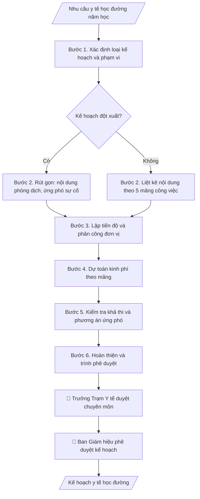

# Soạn kế hoạch y tế học đường

## Kiểm soát áp dụng và phê duyệt

Trước khi chạy quy trình, xác định `ngay_ap_dung`, `loai_hinh_truong`, `quy_che_noi_bo`, `nguon_du_lieu` và `nguoi_kiem_duyet`. Chỉ yêu cầu thông tin có liên quan đến nghiệp vụ; không dùng giá trị giả định thay dữ liệu bắt buộc. Hồ sơ có yếu tố pháp lý phải kèm văn bản gốc, tình trạng hiệu lực, điều khoản áp dụng và chuyển tiếp.

## Giới hạn và human gate

AI hỗ trợ chuẩn bị và đối chiếu. Cán bộ phụ trách kiểm tra dữ liệu/căn cứ, người có thẩm quyền duyệt và ký. Mọi đầu ra mặc định là **DỰ THẢO – CHỜ KIỂM DUYỆT**; không đánh dấu đã ký, đã duyệt hoặc đã công bố nếu chưa có chứng cứ. Dữ liệu sinh viên, sức khỏe, nhân sự và tài chính phải hạn chế theo mục đích, phân quyền và che thông tin định danh khi dùng ví dụ. Không tải dữ liệu lên dịch vụ ngoài khi chưa có quyền. Kiểm tra Luật 91/2025/QH15 về bảo vệ dữ liệu cá nhân (hiệu lực 01/01/2026) và quy định áp dụng trước xử lý/chia sẻ dữ liệu cá nhân.


## Khi nào dùng
Khi Trạm Y tế lập kế hoạch công tác năm học (khám sức khỏe đầu năm, tiêm chủng, phòng chống dịch,
vệ sinh trường học) hoặc kế hoạch đột xuất khi có dịch bệnh / sự cố y tế trong trường.

## Đầu vào (Input)

| Trường | Mô tả | Bắt buộc |
|---|---|---|
| `nam_hoc` | Năm học áp dụng kế hoạch | Có |
| `quy_mo` | Số lượng CBVC và sinh viên cần chăm sóc | Có |
| `noi_dung_chinh` | Các mảng công việc: khám sức khỏe, phòng dịch, vệ sinh, truyền thông sức khỏe, BHYT | Có |
| `nguon_luc` | Nhân sự trạm y tế, trang thiết bị, kinh phí dự kiến | Có |
| `phoi_hop` | Các đơn vị phối hợp (CTSV, KTX, Quản trị, Đoàn Thanh niên...) | Không |
| `dot_xuat` | Có / Không — nếu là kế hoạch đột xuất phòng chống dịch | Không (mặc định: Không) |

## Quy trình

**Bước 1. Xác định loại kế hoạch và phạm vi**
- Làm gì: xác định đây là kế hoạch năm học (định kỳ) hay kế hoạch đột xuất (dịch bệnh,
  ngộ độc thực phẩm, tai nạn); rà soát `quy_mo` (số CBVC, SV cần chăm sóc) và đối chiếu
  với kế hoạch năm trước để kế thừa những việc còn dở dang.
- Dùng input: `dot_xuat`, `nam_hoc`, `quy_mo`.
- Vai trò: Cán bộ Trạm Y tế · AI hỗ trợ: soạn khung phân loại kế hoạch · ⏱ 30–60 phút (ước tính)
- Lưu ý nghiệp vụ: kế hoạch đột xuất không thay thế kế hoạch năm — phải ghi rõ phạm vi
  áp dụng (thời gian, đối tượng, địa bàn) và cơ chế quay lại kế hoạch thường kỳ sau khi
  hết dịch/sự cố.
- → Kết quả bước: loại kế hoạch, phạm vi áp dụng và danh mục việc kế thừa từ năm trước.

**Bước 2. Liệt kê nội dung theo 5 mảng công việc**
- Làm gì: cụ thể hóa `noi_dung_chinh` thành danh mục công việc theo 5 mảng: (1) khám sức
  khỏe (tân SV, định kỳ CBVC); (2) phòng chống dịch bệnh (giám sát, khử khuẩn, tiêm chủng);
  (3) vệ sinh môi trường (VSATTP căn tin, nước uống, KTX, giảng đường); (4) truyền thông
  sức khỏe; (5) BHYT. Nếu `dot_xuat` = Có thì rút gọn, chỉ giữ mảng phòng dịch và ứng phó
  sự cố, bỏ các việc định kỳ chưa cấp thiết.
- Dùng input: `noi_dung_chinh`, `dot_xuat`.
- Vai trò: Trưởng Trạm Y tế · AI hỗ trợ: cụ thể hóa danh mục công việc theo 5 mảng · ⏱ 1–2 giờ (ước tính)
- Lưu ý nghiệp vụ: mỗi việc phải gắn với quy định y tế trường học tương ứng (không đưa
  việc ngoài chức năng của Trạm Y tế); việc đột xuất ưu tiên theo mức độ nguy cơ dịch tễ.
- → Kết quả bước: danh mục công việc chi tiết theo 5 mảng (hoặc danh mục rút gọn
  cho kế hoạch đột xuất).

**Bước 3. Lập tiến độ và phân công**
- Làm gì: gắn mỗi công việc ở Bước 2 với thời gian thực hiện (tháng/quý), đơn vị chủ trì
  (Trạm Y tế) và đơn vị phối hợp (`phoi_hop`: CTSV, KTX, Quản trị, Đoàn Thanh niên...);
  sắp xếp tránh dồn nhiều việc khám/tập trung đông người vào cùng một thời điểm.
- Dùng input: `phoi_hop`, danh mục công việc (Bước 2).
- Vai trò: Cán bộ Trạm Y tế · AI hỗ trợ: lập bảng tiến độ – phân công dự thảo · ⏱ 1–2 giờ (ước tính)
- Lưu ý nghiệp vụ: việc cần huy động SV đông (khám tân SV, tiêm chủng) phải thống nhất
  trước với đơn vị phối hợp về địa điểm và nhân sự hỗ trợ; ghi rõ đầu mối liên hệ
  từng đơn vị.
- → Kết quả bước: bảng tiến độ – phân công (công việc – thời gian – chủ trì –
  phối hợp).

**Bước 4. Dự toán kinh phí**
- Làm gì: lập dự toán theo từng mảng: thuốc, vật tư y tế tiêu hao, hóa chất khử khuẩn,
  vắc-xin, in ấn tài liệu truyền thông; tổng hợp theo `nguon_luc` và ghi rõ nguồn kinh phí
  (chi thường xuyên / nguồn thu sự nghiệp / hỗ trợ khác).
- Dùng input: `nguon_luc`, bảng tiến độ (Bước 3).
- Vai trò: Cán bộ Trạm Y tế · AI hỗ trợ: tính dự toán theo từng mảng · ⏱ 1–2 giờ (ước tính)
- Lưu ý nghiệp vụ: đơn giá tham khảo giá thị trường tại thời điểm lập, ghi rõ là dự toán;
  kinh phí tiêm chủng tự nguyện phải tách riêng phần người tham gia đóng góp (nếu có);
  tổng dự toán không vượt khung được giao.
- → Kết quả bước: bảng dự toán kinh phí theo mảng + tổng mức và nguồn kinh phí.

**Bước 5. Kiểm tra khả thi và phương án ứng phó**
- Làm gì: đối chiếu khối lượng công việc với nhân sự, trang thiết bị hiện có trong
  `nguon_luc` (VD: 01 bác sĩ + 03 y sĩ có kham nổi 12.500 SV khám đầu năm trong 1 tháng
  không); bổ sung phương án ứng phó sự cố y tế (ngộ độc, tai nạn, ca dịch mới) với
  đầu mối xử lý và tuyến chuyển viện.
- Dùng input: `nguon_luc`, toàn bộ dự thảo các bước 2–4.
- Vai trò: Trưởng Trạm Y tế · AI hỗ trợ: đối chiếu khối lượng công việc với nhân sự · ⏱ 1–2 giờ (ước tính)
- Lưu ý nghiệp vụ: nếu nhân sự không đủ, phải đề xuất thuê ngoài/phối hợp y tế địa
  phương ngay trong kế hoạch thay vì để thiếu khi triển khai; phương án ứng phó phải
  có số điện thoại đường dây nóng và quy trình báo cáo nhanh.
- → Kết quả bước: kế hoạch dự thảo đã kiểm tra tính khả thi, có phương án ứng phó
  sự cố.

**Bước 6. Hoàn thiện và trình phê duyệt**
- Làm gì: gộp mục tiêu, nội dung – tiến độ, tổ chức thực hiện và dự toán thành văn bản
  hành chính đúng thể thức (số văn bản, ngày tháng, chữ ký, nơi nhận); Trưởng Trạm Y tế
  duyệt nội dung chuyên môn trước, sau đó trình Ban Giám hiệu phê duyệt kế hoạch
  và kinh phí.
- Dùng input: `nam_hoc`, `nguon_luc` (ký hiệu người ký theo thẩm quyền).
- Vai trò: Trưởng Trạm Y tế và Ban Giám hiệu · AI hỗ trợ: soạn văn bản đúng thể thức · ⏱ 1–2 giờ (ước tính)
- Lưu ý nghiệp vụ: số văn bản lấy theo sổ văn bản đi của Trạm, không tự đặt; kế hoạch
  chỉ được triển khai sau khi Ban Giám hiệu phê duyệt (riêng kế hoạch đột xuất có thể
  triển khai biện pháp khẩn cấp trước, hoàn thiện thủ tục sau — ghi rõ trong văn bản).
- → Kết quả bước: kế hoạch y tế học đường hoàn chỉnh, sẵn sàng trình ký và triển khai.

## Luồng quy trình (Workflow)


## Đầu ra (Output)
- Kế hoạch y tế học đường hoàn chỉnh (markdown), sẵn sàng trình ký.
- Bảng tiến độ + dự toán kinh phí kèm theo.

**Cấu trúc output chuẩn:** khung mẫu cố định của kế hoạch, các phần theo đúng thứ tự:
1. Quốc hiệu – tiêu ngữ (căn giữa, phía phải).
2. Tên đơn vị ban hành + số văn bản (phía trái).
3. Địa danh, ngày/tháng/năm ban hành (phía phải).
4. Tên loại văn bản "KẾ HOẠCH" + trích yếu nội dung (căn giữa).
5. Phần căn cứ: văn bản quy phạm về y tế trường học; tình hình thực tế (quy mô CBVC/SV).
6. I. Mục tiêu: chỉ tiêu đo được của năm học (tỷ lệ khám, mục tiêu phòng dịch).
7. II. Nội dung và tiến độ: từng việc theo mảng — thời gian, đơn vị chủ trì/phối hợp,
   kinh phí từng việc.
8. III. Tổ chức thực hiện: trách nhiệm của Trạm Y tế và các đơn vị phối hợp;
   tổng kinh phí và nguồn kinh phí.
9. Chữ ký: Trưởng Trạm Y tế (kèm "[CHỜ KÝ]" khi là bản mô phỏng).
10. Nơi nhận + nơi lưu hồ sơ.

## Checklist nghiệm thu

- [ ] Đủ 10 phần theo "Cấu trúc output chuẩn": quốc hiệu – tiêu ngữ, tên đơn vị + số văn bản, địa danh ngày ban hành, tên loại văn bản + trích yếu, phần căn cứ, mục tiêu, nội dung và tiến độ, tổ chức thực hiện, chữ ký, nơi nhận + lưu hồ sơ.
- [ ] Nội dung khớp với Input: quy mô CBVC/SV, nguồn lực, đơn vị phối hợp.
- [ ] Không bịa đặt số liệu dịch bệnh, kinh phí hay năng lực nhân sự; đơn giá trong dự toán ghi rõ là dự toán.
- [ ] Mỗi việc gắn với quy định y tế trường học tương ứng; kế hoạch đột xuất ghi rõ phạm vi áp dụng và cơ chế quay lại kế hoạch thường kỳ.
- [ ] Khối lượng công việc đối chiếu được với nhân sự, trang thiết bị hiện có; thiếu nhân sự thì có phương án thuê ngoài/phối hợp y tế địa phương.
- [ ] Phương án ứng phó sự cố có đầu mối xử lý, số điện thoại đường dây nóng và quy trình báo cáo nhanh.
- [ ] Kinh phí tiêm chủng tự nguyện tách riêng phần người tham gia đóng góp; tổng dự toán không vượt khung được giao.
- [ ] Đúng thể thức: số văn bản lấy theo sổ văn bản đi của trạm.
- [ ] Đã qua Human gate: trưởng trạm y tế duyệt chuyên môn, ban giám hiệu phê duyệt kế hoạch và kinh phí.

Tiêu chí đạt = tất cả các ô được đánh dấu.

## Ví dụ mô phỏng (dữ liệu giả lập)

> Tất cả tên trường, cá nhân, số liệu dưới đây đều là **giả lập**, không liên quan tổ chức/cá nhân có thật.

### Input mẫu

| Trường | Giá trị |
|---|---|
| `nam_hoc` | 2026–2027 |
| `quy_mo` | 420 CBVC, 12.500 sinh viên |
| `noi_dung_chinh` | 1. Khám sức khỏe tân sinh viên (tháng 9). 2. Tiêm nhắc vắc-xin cúm cho CBVC (tháng 10). 3. Phun khử khuẩn KTX, giảng đường mỗi học kỳ. 4. Kiểm tra VSATTP căn tin 2 lần/năm. 5. Truyền thông phòng chống sốt xuất huyết. |
| `nguon_luc` | 01 bác sĩ, 03 y sĩ; kinh phí 180 triệu đồng |
| `phoi_hop` | Phòng CTSV, Ban Quản lý KTX, Phòng Quản trị – Thiết bị, Đoàn Thanh niên |

### Output mẫu

```
TRƯỜNG ĐẠI HỌC A            CỘNG HÒA XÃ HỘI CHỦ NGHĨA VIỆT NAM
TRẠM Y TẾ                                 Độc lập – Tự do – Hạnh phúc
      Số: 12/KH-ĐHA-TYT
                                                 Thành phố C, ngày 15 tháng 8 năm 2026

                          KẾ HOẠCH
              Công tác y tế học đường năm học 2026–2027

Căn cứ quy định về y tế trường học của Bộ Y tế và Bộ Giáo dục và Đào tạo;
Xét tình hình thực tế công tác chăm sóc sức khỏe tại Trường Đại học A
(quy mô 420 CBVC và 12.500 sinh viên),

Trạm Y tế xây dựng Kế hoạch công tác y tế học đường năm học 2026–2027 như sau:

I. MỤC TIÊU
- 100% tân sinh viên được khám sức khỏe đầu năm;
- Không để dịch bệnh lây lan trong trường; xử lý kịp thời mọi sự cố y tế.

II. NỘI DUNG VÀ TIẾN ĐỘ

1. Khám sức khỏe tân sinh viên (tháng 9/2026): Trạm Y tế chủ trì, phối hợp
Phòng CTSV; kinh phí 60 triệu đồng.
2. Tiêm nhắc vắc-xin cúm cho CBVC (tháng 10/2026): đăng ký tự nguyện; kinh phí
40 triệu đồng.
3. Phun khử khuẩn KTX, giảng đường (cuối mỗi học kỳ): phối hợp Ban Quản lý KTX,
Phòng Quản trị – Thiết bị; kinh phí 30 triệu đồng.
4. Kiểm tra VSATTP căn tin, nguồn nước (2 lần/năm): phối hợp Phòng Quản trị;
kinh phí 20 triệu đồng.
5. Truyền thông phòng chống sốt xuất huyết (tháng 8–11/2026): tờ rơi, loa phát
thanh, phối hợp Đoàn Thanh niên; kinh phí 30 triệu đồng.

III. TỔ CHỨC THỰC HIỆN
Trạm Y tế chịu trách nhiệm triển khai; các đơn vị phối hợp theo phân công trên.
Tổng kinh phí: 180 triệu đồng (từ nguồn chi thường xuyên).

Nơi nhận:                                          TRƯỞNG TRẠM Y TẾ
- Ban Giám hiệu (b/c);                                 [CHỜ KÝ]
- Các đơn vị phối hợp;
- Lưu: VT, TYT.                                   BS. Hoàng Thị B
```

## Human gate (người kiểm duyệt)
- Trưởng Trạm Y tế duyệt nội dung chuyên môn trước khi trình.
- Ban Giám hiệu phê duyệt kế hoạch và kinh phí trước khi triển khai.

## Giới hạn (guardrails)
- **Tuyệt đối không** chẩn đoán bệnh, kê đơn thuốc hay đưa ra phác đồ điều trị thay bác sĩ;
  skill chỉ hỗ trợ công tác kế hoạch – hành chính y tế học đường.
- **Tuyệt đối không** tiết lộ, tổng hợp hay xuất hồ sơ sức khỏe cá nhân của CBVC/sinh viên
  ra khỏi phạm vi quản lý của Trạm Y tế.
- Mọi số liệu dịch bệnh trong ví dụ đều giả lập, không dùng làm căn cứ y tế thật.

## Căn cứ & lưu ý
- Quy định về y tế trường học của Bộ Y tế và Bộ GD&ĐT; Luật Khám bệnh, chữa bệnh; Luật BHYT.
- Không dùng tên thật của trường/cá nhân khi mô phỏng.

## Quản trị phiên bản

- Phiên bản gói: `1.1.0`; ngày cập nhật: `2026-10-09`.
- Kho nguồn: https://github.com/phamtruong91/dh-skills
- Người duy trì trên GitHub: `phamtruong91` (Phạm Văn Trường). Người phê duyệt nghiệp vụ: **chưa chỉ định**.
- Commit nguồn trước cập nhật: `78fd1d51b8acd1a724d9b9af6c488460bc7551ad`. Commit chứa phiên bản này xem bằng `git log -1 -- skills/ke-hoach-y-te-hoc-duong`; không tự gán SHA chưa tạo.
- Giấy phép: theo LICENSE của kho; bản quyền CES Global.
- Lịch sử 1.1.0: bổ sung metadata giao diện, kiểm soát áp dụng, quản trị phiên bản.
- Trạng thái: dự thảo nghiệp vụ; kiểm tra pháp lý trước thực thi. Ngày cập nhật không đồng nghĩa mọi văn bản đã được rà soát toàn văn.
