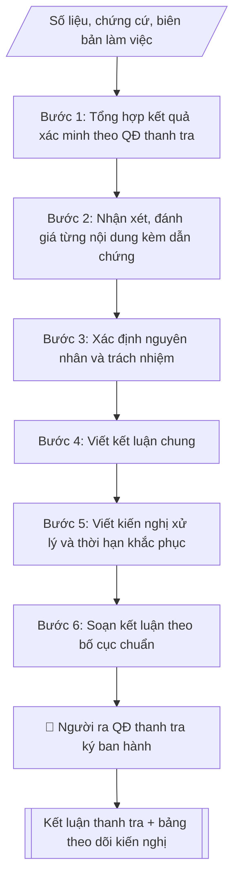

# Skill: Soạn kết luận thanh tra

## Khi nào dùng
Khi một cuộc thanh tra nội bộ đã hoàn tất việc xác minh, thu thập chứng cứ và cần ban hành
kết luận chính thức: nêu rõ căn cứ, nội dung đã thanh tra, nhận xét đánh giá từng nội dung,
kết luận chung và kiến nghị xử lý, khắc phục.

## Đầu vào (Input)

| Trường | Mô tả | Bắt buộc |
|---|---|---|
| `so_quyet_dinh` | Số, ký hiệu, ngày ban hành quyết định thanh tra | Có |
| `doi_tuong_thanh_tra` | Đơn vị/cá nhân được thanh tra | Có |
| `noi_dung_thanh_tra` | Các nội dung đã thanh tra (theo quyết định thanh tra) | Có |
| `ket_qua_xac_minh` | Số liệu, chứng cứ, biên bản làm việc thu thập được | Có |
| `nhan_xet_danh_gia` | Nhận xét, đánh giá ưu điểm và tồn tại của từng nội dung | Có |
| `kien_nghi_xu_ly` | Kiến nghị xử lý, khắc phục, thời hạn báo cáo kết quả khắc phục | Có |
| `nguoi_ky` | Người ra quyết định thanh tra (Hiệu trưởng) | Có |

## Quy trình

**Bước 1. Tổng hợp kết quả xác minh theo quyết định thanh tra**
- Làm gì: hệ thống hóa số liệu, chứng cứ, biên bản làm việc đã thu thập; đối chiếu từng nội dung với quyết định thanh tra để bảo đảm không bỏ sót nội dung, không kết luận vượt phạm vi; đánh dấu chứng cứ còn thiếu hoặc chưa được xác minh.
- Dùng input: `so_quyet_dinh`, `noi_dung_thanh_tra`, `ket_qua_xac_minh`, `doi_tuong_thanh_tra`.
- Vai trò: Chuyên viên Phòng Thanh tra – Pháp chế · AI hỗ trợ: tổng hợp, chuẩn hóa dữ liệu, đối chiếu tự động, cảnh báo sai lệch · ⏱ ~1–2 giờ (ước tính)
- Lưu ý nghiệp vụ: chỉ dùng chứng cứ đã được xác minh; nội dung không có chứng cứ thì ghi rõ "chưa đủ cơ sở kết luận", tuyệt đối không suy diễn.
- → Kết quả bước: Bảng đối chiếu nội dung – chứng cứ (đầy đủ / còn thiếu).

**Bước 2. Nhận xét, đánh giá từng nội dung**
- Làm gì: với từng nội dung đã thanh tra, viết nhận xét gồm ưu điểm và tồn tại/hạn chế; mỗi nhận xét gắn số liệu, dẫn chứng cụ thể lấy từ bảng đối chiếu Bước 1.
- Dùng input: `nhan_xet_danh_gia` (làm khung; bổ sung dẫn chứng cụ thể).
- Vai trò: Chuyên viên Phòng Thanh tra – Pháp chế · AI hỗ trợ: soạn dự thảo, đối chiếu tự động, cảnh báo sai lệch · ⏱ ~1–2 giờ (ước tính)
- Lưu ý nghiệp vụ: tồn tại nào không có dẫn chứng thì không đưa vào kết luận; phân biệt tồn tại do vi phạm quy định với tồn tại do quy định chưa rõ; tránh nhận xét chung chung, thiếu căn cứ.
- → Kết quả bước: Bản nhận xét, đánh giá từng nội dung kèm dẫn chứng.

**Bước 3. Xác định nguyên nhân và trách nhiệm**
- Làm gì: phân tích nguyên nhân khách quan, chủ quan của từng tồn tại; xác định trách nhiệm của tập thể, cá nhân (đơn vị trực tiếp thực hiện, cấp quản lý) gắn với từng tồn tại cụ thể.
- Dùng input: `ket_qua_xac_minh`, `nhan_xet_danh_gia`.
- Vai trò: Chuyên viên Phòng Thanh tra – Pháp chế · AI hỗ trợ: tính toán, phân tích số liệu · ⏱ ~30–90 phút (ước tính)
- Lưu ý nghiệp vụ: trách nhiệm phải gắn với vai trò, nhiệm vụ cụ thể, không quy chụp chung; phân biệt trách nhiệm trực tiếp và trách nhiệm quản lý.
- → Kết quả bước: Bảng tồn tại – nguyên nhân – trách nhiệm.

**Bước 4. Viết kết luận chung**
- Làm gì: tổng hợp thành đánh giá tổng thể về mức độ tuân thủ pháp luật, quy chế, quy định nội bộ của đối tượng được thanh tra; nêu ngắn gọn ưu điểm chính và tồn tại chính.
- Dùng input: `doi_tuong_thanh_tra` (kết hợp kết quả Bước 2, 3).
- Vai trò: Chuyên viên Phòng Thanh tra – Pháp chế · AI hỗ trợ: soạn dự thảo, tổng hợp, chuẩn hóa dữ liệu · ⏱ ~30–60 phút (ước tính)
- Lưu ý nghiệp vụ: kết luận chung không được đưa nội dung mới chưa có ở phần nhận xét, đánh giá.
- → Kết quả bước: Đoạn kết luận chung.

**Bước 5. Viết kiến nghị xử lý**
- Làm gì: với từng tồn tại, viết kiến nghị: biện pháp khắc phục cụ thể, đơn vị/cá nhân thực hiện, thời hạn báo cáo kết quả khắc phục; kiến nghị kiểm điểm trách nhiệm tập thể, cá nhân; xử lý kỷ luật nếu có dấu hiệu vi phạm nghiêm trọng.
- Dùng input: `kien_nghi_xu_ly`.
- Vai trò: Chuyên viên Phòng Thanh tra – Pháp chế · AI hỗ trợ: soạn dự thảo · ⏱ ~30–60 phút (ước tính)
- Lưu ý nghiệp vụ: kiến nghị phải đúng thẩm quyền của người ra quyết định thanh tra, khả thi, có thời hạn cụ thể; không kiến nghị vượt thẩm quyền.
- → Kết quả bước: Danh sách kiến nghị xử lý (biện pháp – đơn vị thực hiện – thời hạn).

**Bước 6. Soạn kết luận theo bố cục chuẩn**
- Làm gì: lắp các bán thành phẩm vào bố cục: phần căn cứ (quyết định thanh tra, báo cáo kết quả xác minh) → I. Nội dung đã thanh tra → II. Nhận xét, đánh giá → III. Kết luận → IV. Kiến nghị xử lý → nơi nhận, chữ ký.
- Dùng input: `so_quyet_dinh`, `nguoi_ky`.
- Vai trò: Chuyên viên Phòng Thanh tra – Pháp chế · AI hỗ trợ: soạn dự thảo, đối chiếu tự động, cảnh báo sai lệch · ⏱ ~30–60 phút (ước tính)
- Lưu ý nghiệp vụ: kiểm tra nhất quán số liệu giữa các phần; tên đối tượng, số quyết định viết thống nhất toàn văn bản.
- → Kết quả bước: Dự thảo Kết luận thanh tra.

**Bước 7. Trình ký, ban hành và theo dõi**
- Làm gì: trình người ra quyết định thanh tra ký; gửi kết luận đến đối tượng được thanh tra và đơn vị liên quan; lập bảng theo dõi thực hiện kiến nghị (tồn tại – kiến nghị – đơn vị – thời hạn – trạng thái).
- Dùng input: `nguoi_ky`.
- Vai trò: Chuyên viên Phòng Thanh tra – Pháp chế (chuẩn bị hồ sơ trình); Hiệu trưởng (người ký) ban hành · AI hỗ trợ: lập bảng biểu, định dạng, chuẩn bị hồ sơ trình đầy đủ · ⏱ ~1–3 giờ (ước tính)
- Lưu ý nghiệp vụ: theo dõi đến khi kiến nghị hoàn thành; quá thời hạn phải đôn đốc và báo cáo người ra quyết định.
- → Kết quả bước: Kết luận thanh tra đã ban hành + bảng theo dõi kiến nghị.

## Luồng quy trình (Workflow)


```

## Đầu ra (Output)
- Kết luận thanh tra hoàn chỉnh (markdown, sẵn sàng trình ký).
- Bảng tổng hợp tồn tại – nguyên nhân – trách nhiệm – kiến nghị xử lý.

**Cấu trúc output chuẩn:** Kết luận thanh tra gồm các phần bắt buộc theo đúng thứ tự sau:
1. Phần đầu: quốc hiệu – tiêu ngữ, tên đơn vị lập, số/ký hiệu, địa danh – ngày tháng, tên văn bản "KẾT LUẬN THANH TRA" + trích yếu (về nội dung gì, tại đơn vị nào).
2. Phần căn cứ: quyết định thanh tra (số, ký hiệu, ngày), báo cáo kết quả xác minh của Đoàn thanh tra.
3. I. Nội dung đã thanh tra (liệt kê theo quyết định thanh tra).
4. II. Nhận xét, đánh giá: từng nội dung gồm ưu điểm – tồn tại kèm số liệu, dẫn chứng.
5. III. Kết luận: đánh giá tổng thể mức độ tuân thủ; nguyên nhân; trách nhiệm tập thể, cá nhân.
6. IV. Kiến nghị xử lý: biện pháp khắc phục, đơn vị/cá nhân thực hiện, thời hạn báo cáo kết quả.
7. Phần cuối: nơi nhận, chữ ký của người ra quyết định thanh tra.

## Checklist nghiệm thu

- [ ] Đủ các phần theo "Cấu trúc output chuẩn": Phần đầu; Phần căn cứ; I. Nội dung đã thanh tra (liệt kê theo quyết…; II. Nhận xét, đánh giá; III. Kết luận; IV. Kiến nghị xử lý; …
- [ ] Có đầy đủ sản phẩm: Kết luận thanh tra hoàn chỉnh (markdown, sẵn sàng trình ký)
- [ ] Có đầy đủ sản phẩm: Bảng tổng hợp tồn tại – nguyên nhân – trách nhiệm – kiến nghị xử lý
- [ ] Mọi số liệu, tên, ngày tháng trong output khớp với Input đã cung cấp (không thêm bớt, không suy đoán)
- [ ] Không bịa đặt số liệu, minh chứng, trích dẫn hay căn cứ
- [ ] Đúng thể thức, định dạng văn bản theo quy định hiện hành
- [ ] Căn cứ pháp lý nêu đầy đủ, còn hiệu lực tại thời điểm lập
- [ ] Đã qua Human gate: người có thẩm quyền đã kiểm tra/ký duyệt trước khi phát hành
- [ ] Chỉ dùng chứng cứ đã được xác minh
- [ ] Tồn tại nào không có dẫn chứng thì không đưa vào kết luận

> Tiêu chí đạt: tất cả các ô đều được đánh dấu.

## Ví dụ mô phỏng (dữ liệu giả lập)

> Tất cả tên trường, cá nhân, số liệu dưới đây đều là **giả lập**, không liên quan tổ chức/cá nhân có thật.

### Input mẫu

| Trường | Giá trị |
|---|---|
| `so_quyet_dinh` | Quyết định số 58/QĐ-ĐHA-TTPC ngày 01/4/2027 của Hiệu trưởng về thanh tra công tác tổ chức thi |
| `doi_tuong_thanh_tra` | Khoa Công nghệ thông tin |
| `noi_dung_thanh_tra` | 1. Công tác chuẩn bị và tổ chức coi thi kết thúc học phần học kỳ I năm học 2026–2027. 2. Công tác chấm thi và quản lý bài thi. |
| `ket_qua_xac_minh` | Kiểm tra 12 phòng thi, 120 bài thi mẫu; 05 biên bản coi thi ghi thiếu thông tin; 03/120 bài chấm chưa đúng thang điểm chi tiết |
| `nhan_xet_danh_gia` | Ưu điểm: tổ chức coi thi nghiêm túc, đúng quy chế. Tồn tại: biên bản coi thi ghi thiếu thông tin; một số bài chấm chưa đúng thang điểm chi tiết |
| `kien_nghi_xu_ly` | Khoa rút kinh nghiệm, tập huấn nghiệp vụ coi thi – chấm thi; báo cáo khắc phục trong 30 ngày |
| `nguoi_ky` | Hiệu trưởng |

### Output mẫu

```
TRƯỜNG ĐẠI HỌC A            CỘNG HÒA XÃ HỘI CHỦ NGHĨA VIỆT NAM
PHÒNG THANH TRA & PHÁP CHẾ               Độc lập – Tự do – Hạnh phúc
      Số: 09/KL-ĐHA-TTPC
                                                 Thành phố C, ngày 20 tháng 5 năm 2027

KẾT LUẬN THANH TRA
Về công tác tổ chức thi kết thúc học phần học kỳ I năm học 2026–2027
tại Khoa Công nghệ thông tin

Căn cứ Quyết định số 58/QĐ-ĐHA-TTPC ngày 01/4/2027 của Hiệu trưởng Trường Đại học
A về việc thanh tra công tác tổ chức thi kết thúc học phần tại Khoa Công
nghệ thông tin;

Căn cứ báo cáo kết quả xác minh của Đoàn thanh tra;

Hiệu trưởng Trường Đại học A kết luận như sau:

I. NỘI DUNG ĐÃ THANH TRA

1. Công tác chuẩn bị và tổ chức coi thi kết thúc học phần học kỳ I năm học
2026–2027 tại Khoa Công nghệ thông tin.

2. Công tác chấm thi và quản lý bài thi của Khoa.

II. NHẬN XÉT, ĐÁNH GIÁ

1. Về công tác chuẩn bị và tổ chức coi thi
- Ưu điểm: Khoa đã xây dựng kế hoạch tổ chức thi cụ thể, phân công cán bộ coi thi
rõ ràng; 12/12 phòng thi được kiểm tra đều thực hiện đúng quy chế thi, không phát
hiện gian lận trong thi cử.
- Tồn tại: 05 biên bản coi thi ghi thiếu thông tin về số lượng bài thi thu (chiếm
khoảng 8% tổng số biên bản được kiểm tra).

2. Về công tác chấm thi và quản lý bài thi
- Ưu điểm: bài thi được bảo quản, bàn giao đúng quy định; tiến độ chấm thi, nhập
điểm bảo đảm thời hạn.
- Tồn tại: 03/120 bài thi kiểm tra mẫu (2,5%) chấm chưa đúng thang điểm chi tiết
đã ban hành, làm chênh lệch điểm thành phần từ 0,25 đến 0,5 điểm.

III. KẾT LUẬN

Khoa Công nghệ thông tin đã cơ bản thực hiện đúng quy chế về tổ chức thi kết thúc
học phần. Tuy nhiên còn một số tồn tại, hạn chế nêu tại Mục II. Nguyên nhân chủ
quan là do một số cán bộ coi thi, chấm thi chưa nghiên cứu kỹ quy chế và thang
điểm chi tiết; công tác kiểm tra, giám sát của Khoa chưa thường xuyên. Trách nhiệm
thuộc về các cá nhân trực tiếp thực hiện và Ban Chủ nhiệm Khoa trong công tác
quản lý.

IV. KIẾN NGHỊ XỬ LÝ

1. Yêu cầu Khoa Công nghệ thông tin:
   a) Tổ chức rút kinh nghiệm, tập huấn nghiệp vụ coi thi, chấm thi cho toàn thể
   cán bộ tham gia công tác thi;
   b) Rà soát, điều chỉnh điểm các bài thi chấm chưa đúng thang điểm chi tiết;
   c) Báo cáo kết quả khắc phục về Phòng Thanh tra & Pháp chế trong thời hạn
   30 ngày kể từ ngày ban hành Kết luận này.

2. Giao Phòng Đào tạo phối hợp với Phòng Thanh tra & Pháp chế tăng cường kiểm tra
đột xuất công tác coi thi, chấm thi trong các học kỳ tiếp theo.

Nơi nhận:                                           HIỆU TRƯỞNG
- Khoa CNTT (thực hiện);
- Phòng Đào tạo (phối hợp);
- Lưu: VT, TTPC.                                        (đã ký)

                                                 PGS.TS. Trần Văn B
```

### Bảng tổng hợp tồn tại – kiến nghị (output kèm theo)

| Tồn tại | Nguyên nhân | Trách nhiệm | Kiến nghị |
|---|---|---|---|
| 05 biên bản coi thi ghi thiếu thông tin | Cán bộ coi thi chưa nghiên cứu kỹ quy chế | Cá nhân coi thi; Ban Chủ nhiệm Khoa | Tập huấn nghiệp vụ; báo cáo khắc phục trong 30 ngày |
| 03/120 bài chấm chưa đúng thang điểm chi tiết | Chấm thi thiếu đối chiếu thang điểm | Cá nhân chấm thi; Ban Chủ nhiệm Khoa | Rà soát, điều chỉnh điểm; rút kinh nghiệm |

## Căn cứ & lưu ý
- Luật Thanh tra 2022; Nghị định 43/2023/NĐ-CP.
- Kết luận thanh tra phải bám sát nội dung quyết định thanh tra; không kết luận vượt
phạm vi hoặc dựa trên chứng cứ chưa được xác minh.
- Mọi nhận xét về tồn tại phải có số liệu, dẫn chứng cụ thể; kiến nghị xử lý phải
đúng thẩm quyền và khả thi.
- Không dùng tên thật của trường/cá nhân khi mô phỏng.
