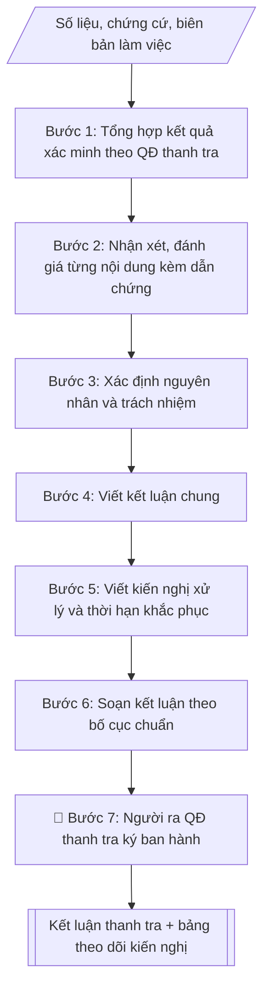

# Soạn kết luận thanh tra

## Định dạng và file đầu ra

Định dạng đầu ra có thể chọn theo sản phẩm/yêu cầu: .docx, .pdf. Đọc mục “Định dạng bổ sung” trong quy cách đầu ra trước khi chọn.

**Phải tạo file thực tế để tải xuống, không chỉ trả nội dung trong chat.** Định dạng mặc định của skill: **.docx**. Nếu có bảng số liệu nghiệp vụ yêu cầu file bảng tính riêng, tạo thêm Excel theo yêu cầu; không tự tạo file kiểm tra. Không chờ người dùng yêu cầu xuất file lần nữa. Ưu tiên định dạng người dùng chỉ định; đọc quy tắc xuất file tại references/quy-cach-dau-ra.md.

## Quy cách đầu ra và thông tin thiếu
Khi dựng file Word/Excel, áp dụng mục “Thể thức và bảng biểu khi dựng file” trong quy cách đầu ra (cỡ chữ từng thành phần, bảng nhiều trang, số trang, phụ lục). Đọc [quy cách và cấu trúc sản phẩm](references/quy-cach-dau-ra.md) trước khi soạn/xuất. File giao chỉ gồm sản phẩm nghiệp vụ được yêu cầu; kiểm tra nội bộ không xuất kèm. Thiếu thông tin thì giữ nguyên trường/mục và chỗ điền theo mẫu gốc (dòng dấu chấm, dấu gạch hoặc ô trống); không tự điền dữ liệu mẫu, số 0, mã chờ xác minh hay dòng chờ ký. Mẫu chuyên ngành còn áp dụng được ưu tiên về cấu trúc, mã biểu và người ký. Bản đầy đủ: [quy tắc chung](references/quy-tac-chung.md).

## Kiểm soát áp dụng và phê duyệt
Trước khi chạy, xác định `ngay_ap_dung`, `loai_hinh_truong`, `quy_che_noi_bo`, `nguon_du_lieu`, `nguoi_kiem_duyet`; chỉ hỏi thông tin liên quan nghiệp vụ, không dùng giá trị giả định thay dữ liệu bắt buộc. Đối chiếu căn cứ pháp lý với văn bản gốc, hiệu lực, điều khoản áp dụng và chuyển tiếp. Bản đầy đủ: [quy tắc chung](references/quy-tac-chung.md).

## Giới hạn và human gate
AI hỗ trợ chuẩn bị và đối chiếu; cán bộ phụ trách kiểm tra dữ liệu/căn cứ, người có thẩm quyền duyệt và ký. Không đánh dấu đã ký, đã duyệt, đã công bố khi chưa có chứng cứ. Dữ liệu sinh viên, sức khỏe, nhân sự, tài chính chỉ dùng theo mục đích và phân quyền, che thông tin định danh khi dùng ví dụ (Luật 91/2025/QH15, hiệu lực 01/01/2026); không tải dữ liệu lên dịch vụ ngoài khi chưa có quyền. Bản đầy đủ: [quy tắc chung](references/quy-tac-chung.md).

## Khi nào dùng
Khi một cuộc thanh tra nội bộ đã hoàn tất việc xác minh, thu thập chứng cứ và cần ban hành
kết luận chính thức: nêu rõ căn cứ, nội dung đã thanh tra, nhận xét đánh giá từng nội dung,
kết luận chung và kiến nghị xử lý, khắc phục.

## Đầu vào (Input)

| Trường | Mô tả | Bắt buộc |
|---|---|---|
| `so_quyet_dinh` | Số, ký hiệu, ngày ban hành quyết định thanh tra | Có |
| `doi_tuong_thanh_tra` | Đơn vị/cá nhân được thanh tra | Có |
| `noi_dung_thanh_tra` | Các nội dung đã thanh tra (theo quyết định thanh tra) | Có |
| `ket_qua_xac_minh` | Số liệu, chứng cứ, biên bản làm việc thu thập được | Có |
| `nhan_xet_danh_gia` | Nhận xét, đánh giá ưu điểm và tồn tại của từng nội dung | Có |
| `kien_nghi_xu_ly` | Kiến nghị xử lý, khắc phục, thời hạn báo cáo kết quả khắc phục | Có |
| `nguoi_ky` | Người ra quyết định thanh tra (Hiệu trưởng) | Có |

## Quy trình

**Bước 1. Tổng hợp kết quả xác minh theo quyết định thanh tra**
- Làm gì: hệ thống hóa số liệu, chứng cứ, biên bản làm việc đã thu thập; đối chiếu từng nội dung với quyết định thanh tra để bảo đảm không bỏ sót nội dung, không kết luận vượt phạm vi; đánh dấu chứng cứ còn thiếu hoặc chưa được xác minh.
- Dùng input: `so_quyet_dinh`, `noi_dung_thanh_tra`, `ket_qua_xac_minh`, `doi_tuong_thanh_tra`.
- Vai trò: Chuyên viên Phòng Thanh tra – Pháp chế · AI hỗ trợ: tổng hợp, chuẩn hóa dữ liệu, đối chiếu tự động, cảnh báo sai lệch · ⏱ ~1–2 giờ (ước tính)
- Lưu ý nghiệp vụ: chỉ dùng chứng cứ đã được xác minh; nội dung không có chứng cứ thì ghi rõ "chưa đủ cơ sở kết luận", tuyệt đối không suy diễn.
- → Kết quả bước: Bảng đối chiếu nội dung – chứng cứ (đầy đủ / còn thiếu).

**Bước 2. Nhận xét, đánh giá từng nội dung**
- Làm gì: với từng nội dung đã thanh tra, viết nhận xét gồm ưu điểm và tồn tại/hạn chế; mỗi nhận xét gắn số liệu, dẫn chứng cụ thể lấy từ bảng đối chiếu Bước 1.
- Dùng input: `nhan_xet_danh_gia` (làm khung; bổ sung dẫn chứng cụ thể).
- Vai trò: Chuyên viên Phòng Thanh tra – Pháp chế · AI hỗ trợ: soạn dự thảo, đối chiếu tự động, cảnh báo sai lệch · ⏱ ~1–2 giờ (ước tính)
- Lưu ý nghiệp vụ: tồn tại nào không có dẫn chứng thì không đưa vào kết luận; phân biệt tồn tại do vi phạm quy định với tồn tại do quy định chưa rõ; tránh nhận xét chung chung, thiếu căn cứ.
- → Kết quả bước: Bản nhận xét, đánh giá từng nội dung kèm dẫn chứng.

**Bước 3. Xác định nguyên nhân và trách nhiệm**
- Làm gì: phân tích nguyên nhân khách quan, chủ quan của từng tồn tại; xác định trách nhiệm của tập thể, cá nhân (đơn vị trực tiếp thực hiện, cấp quản lý) gắn với từng tồn tại cụ thể.
- Dùng input: `ket_qua_xac_minh`, `nhan_xet_danh_gia`.
- Vai trò: Chuyên viên Phòng Thanh tra – Pháp chế · AI hỗ trợ: tính toán, phân tích số liệu · ⏱ ~30–90 phút (ước tính)
- Lưu ý nghiệp vụ: trách nhiệm phải gắn với vai trò, nhiệm vụ cụ thể, không quy chụp chung; phân biệt trách nhiệm trực tiếp và trách nhiệm quản lý.
- → Kết quả bước: Bảng tồn tại – nguyên nhân – trách nhiệm.

**Bước 4. Viết kết luận chung**
- Làm gì: tổng hợp thành đánh giá tổng thể về mức độ tuân thủ pháp luật, quy chế, quy định nội bộ của đối tượng được thanh tra; nêu ngắn gọn ưu điểm chính và tồn tại chính.
- Dùng input: `doi_tuong_thanh_tra` (kết hợp kết quả Bước 2, 3).
- Vai trò: Chuyên viên Phòng Thanh tra – Pháp chế · AI hỗ trợ: soạn dự thảo, tổng hợp, chuẩn hóa dữ liệu · ⏱ ~30–60 phút (ước tính)
- Lưu ý nghiệp vụ: kết luận chung không được đưa nội dung mới chưa có ở phần nhận xét, đánh giá.
- → Kết quả bước: Đoạn kết luận chung.

**Bước 5. Viết kiến nghị xử lý**
- Làm gì: với từng tồn tại, viết kiến nghị: biện pháp khắc phục cụ thể, đơn vị/cá nhân thực hiện, thời hạn báo cáo kết quả khắc phục; kiến nghị kiểm điểm trách nhiệm tập thể, cá nhân; xử lý kỷ luật nếu có dấu hiệu vi phạm nghiêm trọng.
- Dùng input: `kien_nghi_xu_ly`.
- Vai trò: Chuyên viên Phòng Thanh tra – Pháp chế · AI hỗ trợ: soạn dự thảo · ⏱ ~30–60 phút (ước tính)
- Lưu ý nghiệp vụ: kiến nghị phải đúng thẩm quyền của người ra quyết định thanh tra, khả thi, có thời hạn cụ thể; không kiến nghị vượt thẩm quyền.
- → Kết quả bước: Danh sách kiến nghị xử lý (biện pháp – đơn vị thực hiện – thời hạn).

**Bước 6. Soạn kết luận theo bố cục chuẩn**
- Làm gì: lắp các bán thành phẩm vào bố cục: phần căn cứ (quyết định thanh tra, báo cáo kết quả xác minh) → I. Nội dung đã thanh tra → II. Nhận xét, đánh giá → III. Kết luận → IV. Kiến nghị xử lý → nơi nhận, chữ ký.
- Dùng input: `so_quyet_dinh`, `nguoi_ky`.
- Vai trò: Chuyên viên Phòng Thanh tra – Pháp chế · AI hỗ trợ: soạn dự thảo, đối chiếu tự động, cảnh báo sai lệch · ⏱ ~30–60 phút (ước tính)
- Lưu ý nghiệp vụ: kiểm tra nhất quán số liệu giữa các phần; tên đối tượng, số quyết định viết thống nhất toàn văn bản.
- → Kết quả bước: Dự thảo Kết luận thanh tra.

**Bước 7. Trình ký, ban hành và theo dõi**
- Làm gì: trình người ra quyết định thanh tra ký; gửi kết luận đến đối tượng được thanh tra và đơn vị liên quan; lập bảng theo dõi thực hiện kiến nghị (tồn tại – kiến nghị – đơn vị – thời hạn – trạng thái).
- Dùng input: `nguoi_ky`.
- Vai trò: Chuyên viên Phòng Thanh tra – Pháp chế (chuẩn bị hồ sơ trình); Hiệu trưởng (người ký) ban hành · AI hỗ trợ: lập bảng biểu, định dạng, chuẩn bị hồ sơ trình đầy đủ · ⏱ ~1–3 giờ (ước tính)
- Lưu ý nghiệp vụ: theo dõi đến khi kiến nghị hoàn thành; quá thời hạn phải đôn đốc và báo cáo người ra quyết định.
- → Kết quả bước: Kết luận thanh tra đã ban hành + bảng theo dõi kiến nghị.

## Luồng quy trình (Workflow)


```

## Đầu ra

File nghiệp vụ thực tế theo định dạng mặc định ở đầu skill hoặc định dạng người dùng yêu cầu, kèm liên kết tải trong phản hồi cuối.

Sản phẩm nghiệp vụ hoàn chỉnh theo [quy cách và cấu trúc](references/quy-cach-dau-ra.md), giữ các trường chưa có dữ liệu ở trạng thái trống. Không xuất kèm checklist/phụ lục kiểm tra đầu ra.

## Kiểm tra nội bộ trước khi giao

- [ ] Bố cục khớp mẫu áp dụng và cấu trúc tại references/quy-cach-dau-ra.md.
- [ ] Có đầy đủ sản phẩm: Kết luận thanh tra hoàn chỉnh (sẵn sàng trình ký)
- [ ] Có đầy đủ sản phẩm: Bảng tổng hợp tồn tại – nguyên nhân – trách nhiệm – kiến nghị xử lý
- [ ] Mọi số liệu, tên, ngày tháng trong output khớp với Input đã cung cấp (không thêm bớt, không suy đoán)
- [ ] Không bịa đặt số liệu, minh chứng, trích dẫn hay căn cứ
- [ ] Đúng thể thức, định dạng văn bản theo quy định hiện hành
- [ ] Căn cứ pháp lý nêu đầy đủ, còn hiệu lực tại thời điểm lập
- [ ] Đã qua Human gate: người có thẩm quyền đã kiểm tra/ký duyệt trước khi phát hành
- [ ] Chỉ dùng chứng cứ đã được xác minh
- [ ] Tồn tại nào không có dẫn chứng thì không đưa vào kết luận

> Tiêu chí đạt: tất cả các ô đều được đánh dấu.

## Căn cứ & lưu ý
- Luật Thanh tra số 84/2025/QH15 (hiệu lực 01/07/2025; Luật 11/2022/QH15 hết hiệu lực từ ngày đó, trừ khoản 1 và 3 Điều 64 Luật 2025) và Nghị định 216/2025/NĐ-CP (ký 05/08/2025; theo nguồn thứ cấp thay thế NĐ 43/2023/NĐ-CP và NĐ 03/2024/NĐ-CP). Hồ sơ thanh tra bắt đầu trước 01/07/2025 cần kiểm tra điều khoản chuyển tiếp. [CẦN XÁC MINH: đối chiếu văn bản gốc tại Công báo]
- Kết luận thanh tra phải bám sát nội dung quyết định thanh tra; không kết luận vượt
phạm vi hoặc dựa trên chứng cứ chưa được xác minh.
- Mọi nhận xét về tồn tại phải có số liệu, dẫn chứng cụ thể; kiến nghị xử lý phải
đúng thẩm quyền và khả thi.
- Không dùng tên thật của trường/cá nhân khi mô phỏng.

## Quản trị phiên bản
- Phiên bản gói `1.3.2` (cập nhật 2026-10-10); hồ sơ đầy đủ tại [references/version.json](references/version.json).
- Người phê duyệt nghiệp vụ: **chưa chỉ định**. Trạng thái: dự thảo nghiệp vụ; kiểm tra pháp lý trước thực thi. Ngày cập nhật không đồng nghĩa mọi văn bản đã được rà soát toàn văn.
- Giấy phép theo LICENSE của kho (bản quyền CES Global). Lịch sử thay đổi: CHANGELOG.md.
