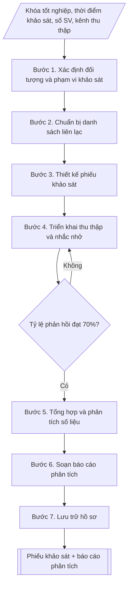

# Skill: Khảo sát tình trạng việc làm sinh viên sau tốt nghiệp

## Khi nào dùng
Khi Phòng Công tác sinh viên (hoặc bộ phận hỗ trợ sinh viên) cần:
- Thiết kế phiếu khảo sát tình trạng việc làm của sinh viên đã tốt nghiệp (thường theo khóa tốt nghiệp năm N, khảo sát sau 6–12 tháng);
- Thu thập, tổng hợp và phân tích kết quả khảo sát;
- Lập báo cáo phân tích phục vụ báo cáo năm học, kiểm định chất lượng chương trình đào tạo, cải tiến công tác hỗ trợ việc làm.

## Đầu vào (Input)

| Trường | Mô tả | Bắt buộc |
|---|---|---|
| `khoa_tot_nghiep` | Năm tốt nghiệp của đối tượng khảo sát (ví dụ: 2025) | Có |
| `thoi_diem_khao_sat` | Thời điểm khảo sát so với tốt nghiệp (sau 6 tháng / sau 12 tháng) | Có |
| `tong_sv_tn` | Tổng số sinh viên tốt nghiệp của khóa | Có |
| `nganh_dao_tao` | Danh sách ngành đào tạo cần khảo sát (hoặc "toàn trường") | Có |
| `kenh_thu_thap` | Hình thức thu thập: biểu mẫu trực tuyến / điện thoại / trực tiếp / kết hợp | Không (mặc định: biểu mẫu trực tuyến + điện thoại) |
| `so_cau_hoi` | Số câu hỏi của phiếu khảo sát | Không (mặc định: 8–10) |
| `don_vi_bao_cao` | Đơn vị trình báo cáo (ví dụ: Phòng CTSV trình Ban Giám hiệu) | Không |

## Quy trình

**Bước 1. Xác định đối tượng và phạm vi khảo sát**
- Làm gì: chốt khóa tốt nghiệp năm N, toàn bộ sinh viên tốt nghiệp các ngành đào tạo (hoặc
  danh sách ngành cụ thể); xác định thời điểm khảo sát (sau 6 tháng và/hoặc sau 12 tháng tốt
  nghiệp).
- Dùng input: `khoa_tot_nghiep`, `thoi_diem_khao_sat`, `tong_sv_tn`, `nganh_dao_tao`.
- Vai trò: Trưởng Phòng Công tác sinh viên · AI hỗ trợ: soạn khung dự thảo · ⏱ ~1–2 giờ (ước tính)
- Lưu ý nghiệp vụ: khảo sát sau 12 tháng cho số liệu việc làm ổn định hơn sau 6 tháng; phạm
  vi phải bao phủ đủ các ngành để so sánh được với nhau.
- → Kết quả bước: khung đối tượng và phạm vi khảo sát đã chốt.

**Bước 2. Chuẩn bị danh sách liên lạc**
- Làm gì: trích xuất họ tên, ngành đào tạo, số điện thoại, email của sinh viên khóa tốt nghiệp
  từ phần mềm quản lý đào tạo; rà soát, cập nhật thông tin liên hệ (loại bỏ trùng lặp, số
  không liên lạc được).
- Dùng input: `tong_sv_tn`, `nganh_dao_tao`.
- Vai trò: Chuyên viên Phòng Công tác sinh viên · AI hỗ trợ: rà soát kỹ thuật, tổng hợp và lưu trữ hồ sơ · ⏱ ~1–2 ngày làm việc (ước tính)
- Lưu ý nghiệp vụ: bảo mật thông tin cá nhân; danh sách là cơ sở tính tỷ lệ phản hồi nên phải
  chính xác.
- → Kết quả bước: danh sách liên lạc sinh viên tốt nghiệp đã rà soát, cập nhật.

**Bước 3. Thiết kế phiếu khảo sát**
- Làm gì: thiết kế phiếu 8–10 câu hỏi, đảm bảo đủ 5 nhóm nội dung bắt buộc: (a) tình trạng
  việc làm hiện tại (đã có việc làm / đang tìm việc / đang học tiếp / chưa tìm việc); (b) mức
  độ phù hợp với ngành đào tạo (đúng ngành / gần ngành / trái ngành); (c) mức thu nhập hiện
  tại theo khoảng; (d) thời gian tìm được việc làm đầu tiên sau tốt nghiệp; (e) đánh giá
  chương trình đào tạo và đề xuất cải tiến (mức độ trang bị kiến thức/kỹ năng, hỗ trợ của nhà
  trường); kèm phần thông tin người trả lời.
- Dùng input: `so_cau_hoi`, `thoi_diem_khao_sat`.
- Vai trò: Chuyên viên Phòng Công tác sinh viên · AI hỗ trợ: soạn dự thảo phiếu khảo sát đủ 5 nhóm nội dung bắt buộc · ⏱ ~2–3 giờ (ước tính)
- Lưu ý nghiệp vụ: câu hỏi đóng là chính để dễ tổng hợp; câu hỏi mở chỉ dành cho đề xuất cải
  tiến; thử nghiệm phiếu với 10–20 người trước khi phát hành chính thức.
- → Kết quả bước: phiếu khảo sát mẫu hoàn chỉnh (kèm phần thông tin người trả lời).

**Bước 4. Triển khai thu thập và nhắc nhở**
- Làm gì: gửi phiếu qua email/zalo/SMS theo `kenh_thu_thap`; gọi điện thoại nhắc nhở đối
  tượng chưa trả lời theo đợt; theo dõi tỷ lệ phản hồi hằng ngày.
- Dùng input: `kenh_thu_thap`, danh sách liên lạc (kết quả bước 2), phiếu khảo sát (kết quả
  bước 3).
- Vai trò: Chuyên viên Phòng Công tác sinh viên · AI hỗ trợ: tổng hợp và đối chiếu dữ liệu thu thập được · ⏱ ~2–3 tuần (ước tính)
- Lưu ý nghiệp vụ: đặt chỉ tiêu tỷ lệ phản hồi tối thiểu 70%; nếu chưa đạt thì tiếp tục nhắc
  nhở, mở rộng kênh (gọi điện trực tiếp) trước khi chốt dữ liệu.
- → Kết quả bước: tập dữ liệu phản hồi hợp lệ (đạt tối thiểu 70% tổng số SV tốt nghiệp).

**Bước 5. Tổng hợp và phân tích số liệu**
- Làm gì: tính tỷ lệ có việc làm sau 6–12 tháng = số có việc làm / số trả lời; tính tỷ lệ đúng
  ngành (đúng ngành + gần ngành) theo từng ngành đào tạo; tính thu nhập bình quân (lấy điểm
  giữa các khoảng) và phân bố theo khoảng; thống kê thời gian tìm việc (dưới 1 tháng, 1–3
  tháng, 3–6 tháng, trên 6 tháng); tổng hợp ý kiến đánh giá và đề xuất cải tiến theo nhóm chủ
  đề.
- Dùng input: tập dữ liệu phản hồi (kết quả bước 4).
- Vai trò: Chuyên viên Phòng Công tác sinh viên · AI hỗ trợ: tính toán, đối chiếu và tổng hợp số liệu phân tích · ⏱ ~3–5 giờ (ước tính)
- Lưu ý nghiệp vụ: loại phiếu trả lời không hợp lệ (thiếu thông tin bắt buộc) trước khi tính;
  công thức tính phải thống nhất với các năm trước để so sánh được.
- → Kết quả bước: bộ bảng phân tích (tỷ lệ việc làm, đúng ngành, thu nhập, thời gian tìm
  việc, ý kiến theo nhóm chủ đề).

**Bước 6. Soạn báo cáo phân tích**
- Làm gì: trình bày số liệu theo bảng/biểu đồ; so sánh với năm trước (nếu có); viết nhận xét,
  đánh giá ưu điểm/hạn chế; đề xuất cải tiến công tác đào tạo và hỗ trợ việc làm.
- Dùng input: `don_vi_bao_cao`, bộ bảng phân tích (kết quả bước 5).
- Vai trò: Trưởng Phòng Công tác sinh viên · AI hỗ trợ: soạn dự thảo · ⏱ ~3–5 giờ (ước tính)
- Lưu ý nghiệp vụ: chỉ công bố số liệu tổng hợp, bảo mật thông tin cá nhân người trả lời;
  nhận xét phải gắn với số liệu cụ thể.
- → Kết quả bước: báo cáo phân tích tình trạng việc làm hoàn chỉnh.

**Bước 7. Lưu trữ hồ sơ**
- Làm gì: lưu phiếu khảo sát, dữ liệu gốc và báo cáo vào hồ sơ công tác sinh viên năm học
  theo quy định lưu trữ.
- Dùng input: kết quả bước 3–6.
- Vai trò: Chuyên viên Phòng Công tác sinh viên · AI hỗ trợ: rà soát kỹ thuật, tổng hợp và lưu trữ hồ sơ · ⏱ ~30 phút – 1 giờ (ước tính)
- Lưu ý nghiệp vụ: dữ liệu gốc phải lưu để phục vụ kiểm định chất lượng và đối chiếu các năm
  sau.
- → Kết quả bước: hồ sơ khảo sát việc làm đã lưu trữ đầy đủ (phiếu, dữ liệu gốc, báo cáo).

## Luồng quy trình (Workflow)

## Đầu ra (Output)
- Phiếu khảo sát mẫu hoàn chỉnh (8–10 câu hỏi, kèm phần thông tin người trả lời).
- Báo cáo phân tích tình trạng việc làm: bảng số liệu chi tiết, nhận xét đánh giá, đề xuất cải tiến.

**Cấu trúc output chuẩn:** khung cố định của hai sản phẩm chính:
A. Phiếu khảo sát mẫu:
1. Tiêu đề phiếu: "PHIẾU KHẢO SÁT TÌNH TRẠNG VIỆC LÀM SINH VIÊN TỐT NGHIỆP" + ghi chú đối
   tượng (khóa tốt nghiệp, thời điểm khảo sát).
2. Phần I. Thông tin chung: họ tên, năm sinh, số điện thoại, ngành đào tạo, lớp, năm tốt
   nghiệp, xếp loại tốt nghiệp.
3. Phần II. Tình trạng việc làm: (a) tình trạng hiện tại; (b) mức độ phù hợp với ngành đào
   tạo; (c) thu nhập hiện tại theo khoảng; (d) thời gian tìm được việc làm đầu tiên; (e) kênh
   tìm việc; (f) đánh giá mức độ trang bị của chương trình đào tạo (thang điểm); (g) đề xuất
   cải tiến.
B. Báo cáo phân tích:
1. Tiêu đề báo cáo + kỳ khảo sát (khóa tốt nghiệp, thời điểm sau tốt nghiệp).
2. Thông tin chung: tổng số SV tốt nghiệp, số phiếu thu về hợp lệ, tỷ lệ phản hồi.
3. Tình trạng việc làm (bảng số lượng, tỷ lệ).
4. Mức độ phù hợp với ngành đào tạo (bảng số lượng, tỷ lệ).
5. Thu nhập bình quân + phân bố theo khoảng.
6. Thời gian tìm việc (bảng + nhận xét).
7. Đánh giá chương trình đào tạo.
8. Đề xuất cải tiến.

## Checklist nghiệm thu

- [ ] Đủ cả hai sản phẩm theo "Cấu trúc output chuẩn": (A) phiếu khảo sát mẫu — tiêu đề + Phần I. Thông tin chung + Phần II. Tình trạng việc làm đủ các nhóm (a) tình trạng hiện tại, (b) phù hợp ngành đào tạo, (c) thu nhập, (d) thời gian tìm việc, (e) kênh tìm việc, (f) đánh giá chương trình, (g) đề xuất cải tiến; (B) báo cáo phân tích đủ 8 phần (tiêu đề + thông tin chung + việc làm + đúng ngành + thu nhập + thời gian tìm việc + đánh giá chương trình + đề xuất cải tiến).
- [ ] Khóa tốt nghiệp, thời điểm khảo sát, tổng số sinh viên, ngành đào tạo trong output khớp với Input đã cho.
- [ ] Không bịa đặt số liệu; các tỷ lệ được tính từ tập dữ liệu phản hồi hợp lệ (đã loại phiếu không hợp lệ trước khi tính).
- [ ] Đúng định dạng: phiếu 8–10 câu hỏi, câu hỏi đóng là chính, câu mở chỉ dành cho đề xuất cải tiến.
- [ ] Căn cứ (Thông tư 12/2017/TT-BGDĐT) còn hiệu lực; bảo mật thông tin cá nhân, chỉ công bố số liệu tổng hợp.
- [ ] Đã qua Human gate: báo cáo được đơn vị phụ trách duyệt trước khi trình Ban Giám hiệu.
- [ ] Tỷ lệ phản hồi tối thiểu 70% tổng số sinh viên tốt nghiệp; công thức tính thống nhất với các năm trước để so sánh được.
- [ ] Nhận xét gắn với số liệu cụ thể; đề xuất cải tiến gắn với ý kiến người trả lời theo nhóm chủ đề.

Tiêu chí đạt = tất cả các ô được đánh dấu.

## Ví dụ mô phỏng (dữ liệu giả lập)

> Tất cả tên trường, cá nhân, số liệu dưới đây đều là **giả lập**, không liên quan tổ chức/cá nhân có thật.

### Input mẫu

| Trường | Giá trị |
|---|---|
| `khoa_tot_nghiep` | 2025 |
| `thoi_diem_khao_sat` | Sau 12 tháng |
| `tong_sv_tn` | 2.450 sinh viên tốt nghiệp năm 2025 |
| `nganh_dao_tao` | Toàn trường (12 ngành đào tạo) |
| `kenh_thu_thap` | Biểu mẫu trực tuyến + điện thoại |

### Output mẫu

#### 1. Phiếu khảo sát mẫu

**PHIẾU KHẢO SÁT TÌNH TRẠNG VIỆC LÀM SINH VIÊN TỐT NGHIỆP**
*(Dành cho sinh viên tốt nghiệp năm 2025 — khảo sát sau 12 tháng tốt nghiệp)*

Phần I — Thông tin chung
1. Họ và tên: ....................  Năm sinh: ......  Số điện thoại: ....................
2. Ngành đào tạo: ....................  Lớp: ............
3. Năm tốt nghiệp: 2025.  Xếp loại tốt nghiệp: Xuất sắc / Giỏi / Khá / Trung bình.

Phần II — Tình trạng việc làm
4. Hiện nay anh/chị đang trong tình trạng nào? (chọn 1)
   ☐ Đã có việc làm ổn định  ☐ Đang tìm việc  ☐ Đang học tiếp (thạc sĩ, văn bằng 2...)
   ☐ Tạm thời chưa tìm việc (lý do: ....................)
5. Công việc hiện tại có phù hợp với ngành đào tạo không? (chỉ trả lời nếu đã có việc làm)
   ☐ Đúng ngành đào tạo  ☐ Gần ngành đào tạo  ☐ Trái ngành đào tạo
6. Thu nhập bình quân hiện tại (chỉ trả lời nếu đã có việc làm):
   ☐ Dưới 8 triệu đồng/tháng  ☐ 8 – dưới 12 triệu  ☐ 12 – dưới 18 triệu
   ☐ 18 – dưới 25 triệu  ☐ Từ 25 triệu trở lên
7. Sau khi tốt nghiệp, anh/chị mất bao lâu để tìm được việc làm đầu tiên?
   ☐ Có việc ngay trước khi tốt nghiệp  ☐ Dưới 1 tháng  ☐ 1 – 3 tháng
   ☐ 3 – 6 tháng  ☐ 6 – 12 tháng  ☐ Trên 12 tháng
8. Anh/chị tìm việc qua kênh nào? (chọn tối đa 2)
   ☐ Giới thiệu của nhà trường/ngày hội việc làm  ☐ Người quen giới thiệu
   ☐ Trang tuyển dụng trực tuyến  ☐ Tự ứng tuyển trực tiếp  ☐ Khác: ............
9. Anh/chị đánh giá mức độ trang bị kiến thức, kỹ năng của chương trình đào tạo đáp ứng yêu cầu công việc (thang điểm 1–5): ☐1 ☐2 ☐3 ☐4 ☐5
10. Đề xuất của anh/chị để nhà trường cải thiện công tác đào tạo và hỗ trợ việc làm:
    ...........................................................................................................................

#### 2. Báo cáo phân tích (tóm tắt)

**BÁO CÁO KẾT QUẢ KHẢO SÁT TÌNH TRẠNG VIỆC LÀM SINH VIÊN TỐT NGHIỆP NĂM 2025**
*(Khảo sát sau 12 tháng tốt nghiệp — dữ liệu giả lập)*

1. Thông tin chung: tổng số sinh viên tốt nghiệp năm 2025: 2.450; số phiếu thu về hợp lệ: 1.785 (tỷ lệ phản hồi 72,9%).

2. Tình trạng việc làm:

| Tình trạng | Số lượng (giả lập) | Tỷ lệ (giả lập) |
|---|---|---|
| Đã có việc làm ổn định | 1.470 | 82,4% |
| Đang học tiếp | 143 | 8,0% |
| Đang tìm việc | 107 | 6,0% |
| Tạm thời chưa tìm việc | 65 | 3,6% |

3. Mức độ phù hợp với ngành đào tạo (trong số 1.470 SV có việc làm):

| Mức độ | Số lượng (giả lập) | Tỷ lệ (giả lập) |
|---|---|---|
| Đúng ngành đào tạo | 985 | 67,0% |
| Gần ngành đào tạo | 308 | 21,0% |
| Trái ngành đào tạo | 177 | 12,0% |

4. Thu nhập bình quân: khoảng 13,2 triệu đồng/tháng (giả lập). Phân bố: dưới 8 triệu: 12,5%; 8 – dưới 12 triệu: 34,6%; 12 – dưới 18 triệu: 36,4%; 18 – dưới 25 triệu: 12,2%; từ 25 triệu trở lên: 4,3%.

5. Thời gian tìm việc: có việc ngay trước tốt nghiệp: 18,7%; dưới 1 tháng: 25,3%; 1–3 tháng: 31,4%; 3–6 tháng: 16,1%; trên 6 tháng: 8,5%. Như vậy 75,4% sinh viên có việc làm trong vòng 3 tháng sau tốt nghiệp.

6. Đánh giá chương trình đào tạo: điểm trung bình 4,1/5. Ý kiến phổ biến: tăng thời lượng thực hành, thực tập tại doanh nghiệp; bổ sung kỹ năng mềm, ngoại ngữ, tin học ứng dụng.

7. Đề xuất cải tiến (giả lập, rút từ báo cáo):
   - Mở rộng mạng lưới doanh nghiệp đối tác, tăng số lượng ngày hội việc làm hằng năm từ 1 lên 2 lần;
   - Đưa nội dung kỹ năng tìm việc (CV, phỏng vấn) vào học phần kỹ năng mềm bắt buộc;
   - Thiết lập kênh tư vấn việc làm trực tuyến cho sinh viên năm cuối và cựu sinh viên.

## Căn cứ & lưu ý
- Khảo sát việc làm sinh viên sau tốt nghiệp là nội dung bắt buộc trong báo cáo hằng năm và phục vụ kiểm định chất lượng chương trình đào tạo (Thông tư 12/2017/TT-BGDĐT về kiểm định chất lượng cơ sở giáo dục đại học).
- Bảo mật thông tin cá nhân của người trả lời; chỉ công bố số liệu tổng hợp.
- Không dùng tên thật của trường/cá nhân khi mô phỏng; mọi số liệu trong ví dụ đều giả lập.
