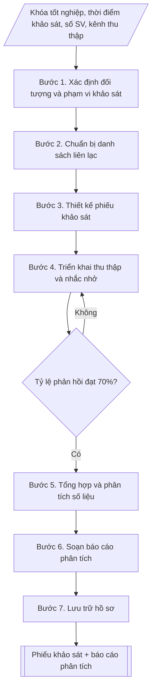

# Khảo sát tình trạng việc làm sinh viên sau tốt nghiệp

## Định dạng và file đầu ra
Định dạng đầu ra có thể chọn theo sản phẩm/yêu cầu: .docx, .pdf. Đọc mục “Định dạng bổ sung” trong quy cách đầu ra trước khi chọn.

**Phải tạo file thực tế để tải xuống, không chỉ trả nội dung trong chat.** Định dạng mặc định của skill: **.docx**. Nếu có bảng số liệu nghiệp vụ yêu cầu file bảng tính riêng, tạo thêm Excel theo yêu cầu; không tự tạo file kiểm tra. Không chờ người dùng yêu cầu xuất file lần nữa. Ưu tiên định dạng người dùng chỉ định; đọc quy tắc xuất file tại references/quy-cach-dau-ra.md.

## Quy cách đầu ra và thông tin thiếu
Đọc [quy cách và cấu trúc sản phẩm](references/quy-cach-dau-ra.md) trước khi soạn/xuất. File giao chỉ gồm sản phẩm nghiệp vụ được yêu cầu; kiểm tra nội bộ không xuất kèm. Thiếu thông tin thì giữ nguyên trường/mục và chỗ điền theo mẫu gốc (dòng dấu chấm, dấu gạch hoặc ô trống); không tự điền dữ liệu mẫu, số 0, mã chờ xác minh hay dòng chờ ký. Mẫu chuyên ngành còn áp dụng được ưu tiên về cấu trúc, mã biểu và người ký. Bản đầy đủ: [quy tắc chung](references/quy-tac-chung.md).

## Kiểm soát áp dụng và phê duyệt
Trước khi chạy, xác định `ngay_ap_dung`, `loai_hinh_truong`, `quy_che_noi_bo`, `nguon_du_lieu`, `nguoi_kiem_duyet`; chỉ hỏi thông tin liên quan nghiệp vụ, không dùng giá trị giả định thay dữ liệu bắt buộc. Đối chiếu căn cứ pháp lý với văn bản gốc, hiệu lực, điều khoản áp dụng và chuyển tiếp. Bản đầy đủ: [quy tắc chung](references/quy-tac-chung.md).

Nếu có cập nhật pháp lý dưới đây, đọc [căn cứ và điều kiện áp dụng](references/phap-ly.md) trước khi làm. Quy trình dưới đây giữ nghiệp vụ từ bản gốc; mọi viện dẫn văn bản, mẫu biểu, điều khoản phải theo căn cứ đã chọn trong phap-ly.md, không theo văn bản cũ.

## Giới hạn và human gate
AI hỗ trợ chuẩn bị và đối chiếu; cán bộ phụ trách kiểm tra dữ liệu/căn cứ, người có thẩm quyền duyệt và ký. Không đánh dấu đã ký, đã duyệt, đã công bố khi chưa có chứng cứ. Dữ liệu sinh viên, sức khỏe, nhân sự, tài chính chỉ dùng theo mục đích và phân quyền, che thông tin định danh khi dùng ví dụ (Luật 91/2025/QH15, hiệu lực 01/01/2026); không tải dữ liệu lên dịch vụ ngoài khi chưa có quyền. Bản đầy đủ: [quy tắc chung](references/quy-tac-chung.md).

## Khi nào dùng
Khi Phòng Công tác sinh viên (hoặc bộ phận hỗ trợ sinh viên) cần:
- Thiết kế phiếu khảo sát tình trạng việc làm của sinh viên đã tốt nghiệp (thường theo khóa tốt nghiệp năm N, khảo sát sau 6–12 tháng);
- Thu thập, tổng hợp và phân tích kết quả khảo sát;
- Lập báo cáo phân tích phục vụ báo cáo năm học, kiểm định chất lượng chương trình đào tạo, cải tiến công tác hỗ trợ việc làm.

## Đầu vào (Input)
| Trường | Mô tả | Bắt buộc |
|---|---|---|
| `khoa_tot_nghiep` | Năm tốt nghiệp của đối tượng khảo sát (ví dụ: 2025) | Có |
| `thoi_diem_khao_sat` | Thời điểm khảo sát so với tốt nghiệp (sau 6 tháng / sau 12 tháng) | Có |
| `tong_sv_tn` | Tổng số sinh viên tốt nghiệp của khóa | Có |
| `nganh_dao_tao` | Danh sách ngành đào tạo cần khảo sát (hoặc "toàn trường") | Có |
| `kenh_thu_thap` | Hình thức thu thập: biểu mẫu trực tuyến / điện thoại / trực tiếp / kết hợp | Không (mặc định: biểu mẫu trực tuyến + điện thoại) |
| `so_cau_hoi` | Số câu hỏi của phiếu khảo sát | Không (mặc định: 8–10) |
| `don_vi_bao_cao` | Đơn vị trình báo cáo (ví dụ: Phòng CTSV trình Ban Giám hiệu) | Không |

## Quy trình
**Ràng buộc pháp lý khi thực hiện** (trích references/phap-ly.md; đối chiếu toàn văn và hiệu lực tại ngày nghiệp vụ):
- Thông tư 20/2026/TT-BGDĐT, hiệu lực 15/05/2026: Yêu cầu ngày hoàn tất tự đánh giá, ngày đăng ký đánh giá ngoài, khung tiêu chuẩn và minh chứng. Điều 51: chỉ cơ sở đã tự đánh giá VÀ đăng ký đánh giá ngoài trước 15/05/2026 được tiếp tục khung 12/2017, hoàn tất chậm nhất 31/12/2026. Ngoài chuyển tiếp dùng 20/2026; không chuyển thang điểm cơ học.
- Trước Bước 1: chọn căn cứ theo đối tượng, loại hình trường và chuyển tiếp; lập bảng văn bản / điều khoản / lý do áp dụng / bằng chứng. Thiếu văn bản gốc hoặc điều khoản thì ghi nhận nội bộ [CẦN XÁC MINH] (không đưa vào file giao), để trống phần tương ứng, chưa kết luận tuân thủ.
- Các con số, thời hạn, số điều, số mức xếp loại, hệ số và mẫu biểu nêu trong các bước dưới đây được giữ từ quy trình gốc (trước cập nhật pháp lý); chỉ dùng khi đã đối chiếu đúng với căn cứ đã chọn, khác thì theo căn cứ. Danh sách điểm cần đối chiếu: docs/DIEM_CAN_DOI_CHIEU_PHAP_LY.md.

**Bước 1. Xác định đối tượng và phạm vi khảo sát**
- Làm gì: chốt khóa tốt nghiệp năm N, toàn bộ sinh viên tốt nghiệp các ngành đào tạo (hoặc
  danh sách ngành cụ thể); xác định thời điểm khảo sát (sau 6 tháng và/hoặc sau 12 tháng tốt
  nghiệp).
- Dùng input: `khoa_tot_nghiep`, `thoi_diem_khao_sat`, `tong_sv_tn`, `nganh_dao_tao`.
- Vai trò: Trưởng Phòng Công tác sinh viên · AI hỗ trợ: soạn khung dự thảo · ⏱ ~1–2 giờ (ước tính)
- Lưu ý nghiệp vụ: khảo sát sau 12 tháng cho số liệu việc làm ổn định hơn sau 6 tháng; phạm
  vi phải bao phủ đủ các ngành để so sánh được với nhau.
- → Kết quả bước: khung đối tượng và phạm vi khảo sát đã chốt.

**Bước 2. Chuẩn bị danh sách liên lạc**
- Làm gì: trích xuất họ tên, ngành đào tạo, số điện thoại, email của sinh viên khóa tốt nghiệp
  từ phần mềm quản lý đào tạo; rà soát, cập nhật thông tin liên hệ (loại bỏ trùng lặp, số
  không liên lạc được).
- Dùng input: `tong_sv_tn`, `nganh_dao_tao`.
- Vai trò: Chuyên viên Phòng Công tác sinh viên · AI hỗ trợ: rà soát kỹ thuật, tổng hợp và lưu trữ hồ sơ · ⏱ ~1–2 ngày làm việc (ước tính)
- Lưu ý nghiệp vụ: bảo mật thông tin cá nhân; danh sách là cơ sở tính tỷ lệ phản hồi nên phải
  chính xác.
- → Kết quả bước: danh sách liên lạc sinh viên tốt nghiệp đã rà soát, cập nhật.

**Bước 3. Thiết kế phiếu khảo sát**
- Làm gì: thiết kế phiếu 8–10 câu hỏi, đảm bảo đủ 5 nhóm nội dung bắt buộc: (a) tình trạng
  việc làm hiện tại (đã có việc làm / đang tìm việc / đang học tiếp / chưa tìm việc); (b) mức
  độ phù hợp với ngành đào tạo (đúng ngành / gần ngành / trái ngành); (c) mức thu nhập hiện
  tại theo khoảng; (d) thời gian tìm được việc làm đầu tiên sau tốt nghiệp; (e) đánh giá
  chương trình đào tạo và đề xuất cải tiến (mức độ trang bị kiến thức/kỹ năng, hỗ trợ của nhà
  trường); kèm phần thông tin người trả lời.
- Dùng input: `so_cau_hoi`, `thoi_diem_khao_sat`.
- Vai trò: Chuyên viên Phòng Công tác sinh viên · AI hỗ trợ: soạn dự thảo phiếu khảo sát đủ 5 nhóm nội dung bắt buộc · ⏱ ~2–3 giờ (ước tính)
- Lưu ý nghiệp vụ: câu hỏi đóng là chính để dễ tổng hợp; câu hỏi mở chỉ dành cho đề xuất cải
  tiến; thử nghiệm phiếu với 10–20 người trước khi phát hành chính thức.
- → Kết quả bước: phiếu khảo sát mẫu hoàn chỉnh (kèm phần thông tin người trả lời).

**Bước 4. Triển khai thu thập và nhắc nhở**
- Làm gì: gửi phiếu qua email/zalo/SMS theo `kenh_thu_thap`; gọi điện thoại nhắc nhở đối
  tượng chưa trả lời theo đợt; theo dõi tỷ lệ phản hồi hằng ngày.
- Dùng input: `kenh_thu_thap`, danh sách liên lạc (kết quả bước 2), phiếu khảo sát (kết quả
  bước 3).
- Vai trò: Chuyên viên Phòng Công tác sinh viên · AI hỗ trợ: tổng hợp và đối chiếu dữ liệu thu thập được · ⏱ ~2–3 tuần (ước tính)
- Lưu ý nghiệp vụ: đặt chỉ tiêu tỷ lệ phản hồi tối thiểu 70%; nếu chưa đạt thì tiếp tục nhắc
  nhở, mở rộng kênh (gọi điện trực tiếp) trước khi chốt dữ liệu.
- → Kết quả bước: tập dữ liệu phản hồi hợp lệ (đạt tối thiểu 70% tổng số SV tốt nghiệp).

**Bước 5. Tổng hợp và phân tích số liệu**
- Làm gì: tính tỷ lệ có việc làm sau 6–12 tháng = số có việc làm / số trả lời; tính tỷ lệ đúng
  ngành (đúng ngành + gần ngành) theo từng ngành đào tạo; tính thu nhập bình quân (lấy điểm
  giữa các khoảng) và phân bố theo khoảng; thống kê thời gian tìm việc (dưới 1 tháng, 1–3
  tháng, 3–6 tháng, trên 6 tháng); tổng hợp ý kiến đánh giá và đề xuất cải tiến theo nhóm chủ
  đề.
- Dùng input: tập dữ liệu phản hồi (kết quả bước 4).
- Vai trò: Chuyên viên Phòng Công tác sinh viên · AI hỗ trợ: tính toán, đối chiếu và tổng hợp số liệu phân tích · ⏱ ~3–5 giờ (ước tính)
- Lưu ý nghiệp vụ: loại phiếu trả lời không hợp lệ (thiếu thông tin bắt buộc) trước khi tính;
  công thức tính phải thống nhất với các năm trước để so sánh được.
- → Kết quả bước: bộ bảng phân tích (tỷ lệ việc làm, đúng ngành, thu nhập, thời gian tìm
  việc, ý kiến theo nhóm chủ đề).

**Bước 6. Soạn báo cáo phân tích**
- Làm gì: trình bày số liệu theo bảng/biểu đồ; so sánh với năm trước (nếu có); viết nhận xét,
  đánh giá ưu điểm/hạn chế; đề xuất cải tiến công tác đào tạo và hỗ trợ việc làm.
- Dùng input: `don_vi_bao_cao`, bộ bảng phân tích (kết quả bước 5).
- Vai trò: Trưởng Phòng Công tác sinh viên · AI hỗ trợ: soạn dự thảo · ⏱ ~3–5 giờ (ước tính)
- Lưu ý nghiệp vụ: chỉ công bố số liệu tổng hợp, bảo mật thông tin cá nhân người trả lời;
  nhận xét phải gắn với số liệu cụ thể.
- → Kết quả bước: báo cáo phân tích tình trạng việc làm hoàn chỉnh.

**Bước 7. Lưu trữ hồ sơ**
- Làm gì: lưu phiếu khảo sát, dữ liệu gốc và báo cáo vào hồ sơ công tác sinh viên năm học
  theo quy định lưu trữ.
- Dùng input: kết quả bước 3–6.
- Vai trò: Chuyên viên Phòng Công tác sinh viên · AI hỗ trợ: rà soát kỹ thuật, tổng hợp và lưu trữ hồ sơ · ⏱ ~30 phút – 1 giờ (ước tính)
- Lưu ý nghiệp vụ: dữ liệu gốc phải lưu để phục vụ kiểm định chất lượng và đối chiếu các năm
  sau.
- → Kết quả bước: hồ sơ khảo sát việc làm đã lưu trữ đầy đủ (phiếu, dữ liệu gốc, báo cáo).

## Luồng quy trình (Workflow)

## Đầu ra
- Phiếu khảo sát mẫu hoàn chỉnh (8–10 câu hỏi, kèm phần thông tin người trả lời).
- Báo cáo phân tích tình trạng việc làm: bảng số liệu chi tiết, nhận xét đánh giá, đề xuất cải tiến.

File nghiệp vụ thực tế theo định dạng mặc định ở đầu skill hoặc định dạng người dùng yêu cầu, kèm liên kết tải trong phản hồi cuối.

Sản phẩm nghiệp vụ hoàn chỉnh theo [quy cách và cấu trúc](references/quy-cach-dau-ra.md), giữ các trường chưa có dữ liệu ở trạng thái trống. Không xuất kèm checklist/phụ lục kiểm tra đầu ra.

## Kiểm tra nội bộ trước khi giao
Các tiêu chí sau dùng để tự đối chiếu; không sao chép vào file xuất. Mục thiếu dữ liệu được để trống, không đánh dấu đã đạt hoặc đã duyệt.

- [ ] Đủ các phần và đúng bố cục theo cấu trúc tại references/quy-cach-dau-ra.md (không theo cấu trúc của bản gốc).
- [ ] Khóa tốt nghiệp, thời điểm khảo sát, tổng số sinh viên, ngành đào tạo trong output khớp với Input đã cho.
- [ ] Không bịa đặt số liệu; các tỷ lệ được tính từ tập dữ liệu phản hồi hợp lệ (đã loại phiếu không hợp lệ trước khi tính).
- [ ] Đúng định dạng: phiếu 8–10 câu hỏi, câu hỏi đóng là chính, câu mở chỉ dành cho đề xuất cải tiến.
- [ ] Căn cứ (văn bản hiện hành nêu tại phap-ly.md) còn hiệu lực; bảo mật thông tin cá nhân, chỉ công bố số liệu tổng hợp.
- [ ] Đã qua Human gate: báo cáo được đơn vị phụ trách duyệt trước khi trình Ban Giám hiệu.
- [ ] Tỷ lệ phản hồi tối thiểu 70% tổng số sinh viên tốt nghiệp; công thức tính thống nhất với các năm trước để so sánh được.
- [ ] Nhận xét gắn với số liệu cụ thể; đề xuất cải tiến gắn với ý kiến người trả lời theo nhóm chủ đề.

## Căn cứ & lưu ý
- Căn cứ hiện hành: xem [căn cứ và điều kiện áp dụng](references/phap-ly.md); phải đối chiếu văn bản gốc, hiệu lực và chuyển tiếp tại ngày nghiệp vụ.
- Bảo mật thông tin cá nhân của người trả lời; chỉ công bố số liệu tổng hợp.
- Không dùng tên thật của trường/cá nhân khi mô phỏng; mọi số liệu trong ví dụ đều giả lập.

## Tư liệu đối chiếu
Bản gốc trước cập nhật pháp lý (kèm ví dụ giả lập) lưu tại `references/quy-trinh-lich-su.md`, chỉ để đối chiếu hồ sơ lịch sử; không dùng căn cứ, mẫu hay số liệu trong đó làm chỉ dẫn hiện hành.

## Quản trị phiên bản
- Phiên bản gói `1.3.2` (cập nhật 2026-10-10); hồ sơ đầy đủ tại [references/version.json](references/version.json).
- Người phê duyệt nghiệp vụ: **chưa chỉ định**. Trạng thái: dự thảo nghiệp vụ; kiểm tra pháp lý trước thực thi. Ngày cập nhật không đồng nghĩa mọi văn bản đã được rà soát toàn văn.
- Giấy phép theo LICENSE của kho (bản quyền CES Global). Lịch sử thay đổi: CHANGELOG.md.
