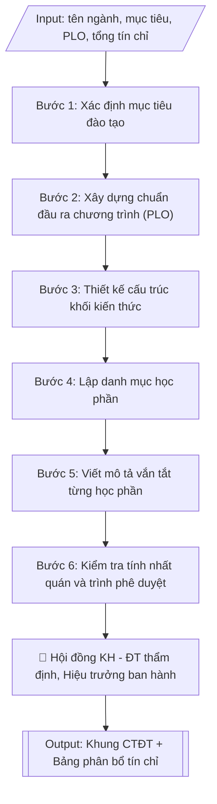

# Xây dựng khung chương trình đào tạo

## Định dạng và file đầu ra
Định dạng đầu ra có thể chọn theo sản phẩm/yêu cầu: .docx, .pdf. Đọc mục “Định dạng bổ sung” trong quy cách đầu ra trước khi chọn.

**Phải tạo file thực tế để tải xuống, không chỉ trả nội dung trong chat.** Định dạng mặc định của skill: **.docx**. Nếu có bảng số liệu nghiệp vụ yêu cầu file bảng tính riêng, tạo thêm Excel theo yêu cầu; không tự tạo file kiểm tra. Không chờ người dùng yêu cầu xuất file lần nữa. Ưu tiên định dạng người dùng chỉ định; đọc quy tắc xuất file tại references/quy-cach-dau-ra.md.

## Quy cách đầu ra và thông tin thiếu
Đọc [quy cách và cấu trúc sản phẩm](references/quy-cach-dau-ra.md) trước khi soạn/xuất. File giao chỉ gồm sản phẩm nghiệp vụ được yêu cầu; kiểm tra nội bộ không xuất kèm. Thiếu thông tin thì giữ nguyên trường/mục và chỗ điền theo mẫu gốc (dòng dấu chấm, dấu gạch hoặc ô trống); không tự điền dữ liệu mẫu, số 0, mã chờ xác minh hay dòng chờ ký. Mẫu chuyên ngành còn áp dụng được ưu tiên về cấu trúc, mã biểu và người ký. Bản đầy đủ: [quy tắc chung](references/quy-tac-chung.md).

## Kiểm soát áp dụng và phê duyệt
Trước khi chạy, xác định `ngay_ap_dung`, `loai_hinh_truong`, `quy_che_noi_bo`, `nguon_du_lieu`, `nguoi_kiem_duyet`; chỉ hỏi thông tin liên quan nghiệp vụ, không dùng giá trị giả định thay dữ liệu bắt buộc. Đối chiếu căn cứ pháp lý với văn bản gốc, hiệu lực, điều khoản áp dụng và chuyển tiếp. Bản đầy đủ: [quy tắc chung](references/quy-tac-chung.md).

Nếu có cập nhật pháp lý dưới đây, đọc [căn cứ và điều kiện áp dụng](references/phap-ly.md) trước khi làm. Quy trình dưới đây giữ nghiệp vụ từ bản gốc; mọi viện dẫn văn bản, mẫu biểu, điều khoản phải theo căn cứ đã chọn trong phap-ly.md, không theo văn bản cũ.

## Giới hạn và human gate
AI hỗ trợ chuẩn bị và đối chiếu; cán bộ phụ trách kiểm tra dữ liệu/căn cứ, người có thẩm quyền duyệt và ký. Không đánh dấu đã ký, đã duyệt, đã công bố khi chưa có chứng cứ. Dữ liệu sinh viên, sức khỏe, nhân sự, tài chính chỉ dùng theo mục đích và phân quyền, che thông tin định danh khi dùng ví dụ (Luật 91/2025/QH15, hiệu lực 01/01/2026); không tải dữ liệu lên dịch vụ ngoài khi chưa có quyền. Bản đầy đủ: [quy tắc chung](references/quy-tac-chung.md).

## Khi nào dùng
Khi cần xây dựng mới, rà soát hoặc cập nhật khung chương trình đào tạo (CTĐT) của một ngành
trình độ đại học: xác lập mục tiêu đào tạo, chuẩn đầu ra chương trình (PLO), cấu trúc các khối
kiến thức, tổng số tín chỉ và danh mục học phần.

## Đầu vào (Input)
| Trường | Mô tả | Bắt buộc |
|---|---|---|
| `ten_nganh` | Tên ngành đào tạo | Có |
| `ma_nganh` | Mã ngành theo danh mục | Không |
| `trinh_do` | Trình độ đào tạo (đại học) | Có |
| `thoi_gian_dao_tao` | Thời gian đào tạo (năm / học kỳ) | Không (mặc định: 4 năm – 8 học kỳ) |
| `muc_tieu_dao_tao` | Mục tiêu chung và mục tiêu cụ thể của CTĐT | Có |
| `plo` | Danh sách chuẩn đầu ra chương trình (PLO), phân 3 nhóm: kiến thức / kỹ năng / mức tự chủ và trách nhiệm | Có |
| `tong_tin_chi` | Tổng số tín chỉ của CTĐT | Có |
| `khoi_kien_thuc` | Cấu trúc các khối kiến thức và số tín chỉ từng khối | Có |
| `danh_muc_hoc_phan` | Danh sách học phần: mã, tên, số tín chỉ, học kỳ, mô tả vắn tắt | Có |
| `don_vi_xay_dung` | Khoa/bộ môn chủ trì xây dựng | Có |

## Quy trình
**Ràng buộc pháp lý khi thực hiện** (trích references/phap-ly.md; đối chiếu toàn văn và hiệu lực tại ngày nghiệp vụ):
- Thông tư 54/2026/TT-BGDĐT, hiệu lực 30/06/2026: Phân loại xây dựng chương trình, chuẩn đầu ra hay mở ngành; yêu cầu chuẩn ngành/trình độ, trạng thái chương trình và ngày tiếp nhận hồ sơ. Đọc toàn văn và điều khoản chuyển tiếp trước khi đổi chuẩn/mẫu; chưa xác minh toàn văn thì ghi điều kiện chưa xác nhận, không tự đặt thời hạn chuyển đổi.
- Trước Bước 1: chọn căn cứ theo đối tượng, loại hình trường và chuyển tiếp; lập bảng văn bản / điều khoản / lý do áp dụng / bằng chứng. Thiếu văn bản gốc hoặc điều khoản thì ghi nhận nội bộ [CẦN XÁC MINH] (không đưa vào file giao), để trống phần tương ứng, chưa kết luận tuân thủ.

**Bước 1. Xác định mục tiêu đào tạo**
- Làm gì: viết mục tiêu chung (phẩm chất, năng lực của người tốt nghiệp) và các mục tiêu cụ
  thể từ `muc_tieu_dao_tao`; đối chiếu từng mục tiêu với sứ mệnh, tầm nhìn của trường và nhu
  cầu xã hội đã xác định; đảm bảo mục tiêu cụ thể có thể đo lường được qua chuẩn đầu ra ở
  Bước 2.
- Dùng input: `ten_nganh`, `muc_tieu_dao_tao`, `don_vi_xay_dung`.
- Vai trò: Chuyên viên đơn vị xây dựng CTĐT (khoa/bộ môn) · AI hỗ trợ: soạn dự thảo mục tiêu, kiểm tra tính đo lường được · ⏱ ~45 phút (ước tính)
- Lưu ý nghiệp vụ: bẫy thường gặp là mục tiêu chung chung kiểu "đào tạo nguồn nhân lực chất
  lượng cao" mà không nói rõ "chất lượng cao" là gì; mỗi mục tiêu cụ thể phải ánh xạ được
  sang ít nhất một nhóm PLO ở Bước 2.
- → Kết quả bước: mục tiêu chung và các mục tiêu cụ thể của CTĐT, có ghi căn cứ gắn với
  sứ mệnh trường.

**Bước 2. Xây dựng chuẩn đầu ra chương trình (PLO)**
- Làm gì: cụ thể hóa mục tiêu Bước 1 thành danh sách `plo` theo 3 nhóm: (a) kiến thức,
  (b) kỹ năng, (c) mức tự chủ và trách nhiệm; mỗi PLO viết bằng động từ hành động có thể đo
  lường được; đánh số PLO1, PLO2...; lập bảng ánh xạ mục tiêu → PLO để không sót mục tiêu.
- Dùng input: `plo`, kết quả Bước 1 (mục tiêu đào tạo).
- Vai trò: Chuyên viên đơn vị xây dựng CTĐT (khoa/bộ môn) · AI hỗ trợ: soạn danh sách PLO, kiểm tra ánh xạ mục tiêu → PLO · ⏱ ~1 giờ (ước tính)
- Lưu ý nghiệp vụ: PLO phải dùng động từ đo lường được (phân tích, thiết kế, đánh giá) —
  tránh động từ mơ hồ (hiểu, nắm được); số lượng PLO vừa phải (thường 8–12), quá nhiều gây
  khó kiểm chứng khi kiểm định.
- → Kết quả bước: danh sách PLO đánh số, phân 3 nhóm, kèm bảng ánh xạ mục tiêu → PLO.

**Bước 3. Thiết kế cấu trúc khối kiến thức**
- Làm gì: phân bổ `tong_tin_chi` vào các khối trong `khoi_kien_thuc` — kiến thức giáo dục đại
  cương; kiến thức cơ sở ngành; kiến thức chuyên ngành; thực tập; khóa luận/đồ án tốt nghiệp;
  tính tỷ lệ % từng khối; kiểm tra tổng các khối bằng đúng `tong_tin_chi` và tỷ lệ các khối
  hợp lý theo quy định (khối chuyên ngành phải chiếm tỷ trọng lớn nhất).
- Dùng input: `tong_tin_chi`, `khoi_kien_thuc`.
- Vai trò: Chuyên viên đơn vị xây dựng CTĐT (khoa/bộ môn) · AI hỗ trợ: tính phân bổ tín chỉ theo khối, kiểm tra tổng khớp · ⏱ ~45 phút (ước tính)
- Lưu ý nghiệp vụ: bẫy số học — tổng tín chỉ các khối không khớp tổng công bố là lỗi phổ biến
  nhất; kiểm tra quy định tối thiểu/tối đa của từng khối theo chuẩn chương trình đào tạo.
- → Kết quả bước: bảng phân bổ tín chỉ theo khối kiến thức (số tín chỉ, tỷ lệ %, tổng 100%).

**Bước 4. Lập danh mục học phần**
- Làm gì: từ `danh_muc_hoc_phan`, với mỗi học phần ghi: mã, tên, số tín chỉ (lý thuyết –
  thực hành), học kỳ bố trí, học phần tiên quyết (nếu có); sắp xếp theo tiến trình học tập
  từ đại cương đến chuyên sâu; kiểm tra tổng tín chỉ các học phần khớp với bảng phân bổ ở
  Bước 3 và mỗi khối kiến thức đều có đủ học phần.
- Dùng input: `danh_muc_hoc_phan`, kết quả Bước 3 (bảng phân bổ tín chỉ).
- Vai trò: Chuyên viên đơn vị xây dựng CTĐT (khoa/bộ môn) · AI hỗ trợ: lập danh mục học phần, kiểm tra tiến trình và học phần tiên quyết · ⏱ ~1 giờ (ước tính)
- Lưu ý nghiệp vụ: học phần tiên quyết phải được bố trí ở học kỳ trước học phần phụ thuộc —
  bẫy phổ biến là xếp tiên quyết cùng học kỳ hoặc sau; tên và mã học phần phải thống nhất
  tuyệt đối với đề cương chi tiết từng học phần.
- → Kết quả bước: danh mục học phần hoàn chỉnh (mã, tên, tín chỉ, học kỳ, tiên quyết) sắp
  xếp theo tiến trình.

**Bước 5. Viết mô tả vắn tắt từng học phần**
- Làm gì: với mỗi học phần trong danh mục Bước 4, viết mô tả 3–5 dòng: nội dung cốt lõi và
  năng lực người học đạt được sau học phần; đảm bảo mô tả thể hiện được đóng góp của học
  phần vào các PLO ở Bước 2.
- Dùng input: `danh_muc_hoc_phan`, kết quả Bước 2 (danh sách PLO).
- Vai trò: Chuyên viên đơn vị xây dựng CTĐT (khoa/bộ môn) · AI hỗ trợ: viết mô tả vắn tắt, kiểm tra đóng góp vào PLO · ⏱ ~1 giờ (ước tính)
- Lưu ý nghiệp vụ: mô tả vắn tắt là cơ sở để giảng viên soạn đề cương chi tiết — phải đủ
  cụ thể về nội dung, tránh mô tả chung chung áp dụng được cho mọi học phần; mỗi mô tả nên
  gợi được PLO mà học phần đóng góp.
- → Kết quả bước: bảng danh mục học phần đã bổ sung cột mô tả vắn tắt.

**Bước 6. Kiểm tra tính nhất quán và trình phê duyệt**
- Làm gì: đối chiếu chéo toàn bộ khung: PLO có bao phủ hết mục tiêu đào tạo không; tổng tín
  chỉ các khối và các học phần có khớp nhau không; mỗi PLO có học phần đóng góp không; lấy
  ý kiến Hội đồng khoa học – đào tạo khoa và doanh nghiệp; chỉnh sửa theo góp ý; trình Hiệu
  trưởng ký quyết định ban hành.
- Dùng input: toàn bộ các trường input và kết quả các bước trên, `don_vi_xay_dung`.
- Vai trò: Hội đồng KH–ĐT thẩm định; Hiệu trưởng ký ban hành; chuyên viên đơn vị xây dựng đối chiếu · AI hỗ trợ: đối chiếu chéo nhất quán (mục tiêu ↔ PLO ↔ tín chỉ ↔ học phần) · ⏱ ~2 giờ (ước tính)
- Lưu ý nghiệp vụ: đây là cổng chặn lỗi cuối — 3 điểm kiểm tra bắt buộc: (1) mục tiêu ↔ PLO,
  (2) tổng tín chỉ các khối = tổng tín chỉ các học phần = tổng công bố, (3) học phần tiên
  quyết đúng tiến trình; ý kiến doanh nghiệp là minh chứng quan trọng khi kiểm định.
- → Kết quả bước: khung CTĐT hoàn chỉnh đã qua thẩm định, sẵn sàng trình Hiệu trưởng ký
  quyết định ban hành.

## Luồng quy trình (Workflow)

## Đầu ra
- Khung CTĐT hoàn chỉnh: mục tiêu, chuẩn đầu ra PLO, cấu trúc khối kiến thức, danh mục
  học phần kèm mô tả vắn tắt — trình bày dạng bảng.
- Bảng tổng hợp phân bổ tín chỉ theo khối kiến thức và theo học kỳ.

**Cấu trúc output chuẩn:** khung mẫu CỐ ĐỊNH của sản phẩm chính (Khung chương trình đào tạo),
các phần bắt buộc theo đúng thứ tự xuất hiện:
1. Tiêu đề khung CTĐT: tên ngành, mã ngành, trình độ đào tạo, thời gian đào tạo (năm/học kỳ),
   tổng số tín chỉ; số, ngày quyết định ban hành và người ký ban hành.
2. Mục 1 – Mục tiêu đào tạo: mục tiêu chung và các mục tiêu cụ thể.
3. Mục 2 – Chuẩn đầu ra của chương trình đào tạo (PLO): liệt kê đánh số theo 3 nhóm —
   kiến thức; kỹ năng; mức tự chủ và trách nhiệm.
4. Mục 3 – Cấu trúc khối kiến thức: bảng (khối kiến thức, số tín chỉ, tỷ lệ %) kèm dòng tổng.
5. Mục 4 – Danh mục học phần: bảng (mã HP, tên học phần, số TC lý thuyết–thực hành, học kỳ,
   học phần tiên quyết, mô tả vắn tắt) sắp xếp theo tiến trình học tập.
6. Phụ lục kèm theo: Bảng tổng hợp phân bổ tín chỉ theo học kỳ.

File nghiệp vụ thực tế theo định dạng mặc định ở đầu skill hoặc định dạng người dùng yêu cầu, kèm liên kết tải trong phản hồi cuối.

Sản phẩm nghiệp vụ hoàn chỉnh theo [quy cách và cấu trúc](references/quy-cach-dau-ra.md), giữ các trường chưa có dữ liệu ở trạng thái trống. Không xuất kèm checklist/phụ lục kiểm tra đầu ra.

## Kiểm tra nội bộ trước khi giao
Các tiêu chí sau dùng để tự đối chiếu; không sao chép vào file xuất. Mục thiếu dữ liệu được để trống, không đánh dấu đã đạt hoặc đã duyệt.

- [ ] Đủ 6 phần theo "Cấu trúc output chuẩn": tiêu đề khung CTĐT (ngành, mã ngành, trình độ, thời gian, tổng tín chỉ, số/ngày quyết định ban hành), Mục 1 mục tiêu đào tạo, Mục 2 chuẩn đầu ra PLO, Mục 3 cấu trúc khối kiến thức, Mục 4 danh mục học phần, phụ lục phân bổ tín chỉ theo học kỳ.
- [ ] Mọi mục tiêu cụ thể đều ánh xạ được sang ít nhất một PLO; PLO viết bằng động từ hành động đo lường được, số lượng vừa phải (thường 8–12).
- [ ] Tổng tín chỉ các khối = tổng tín chỉ các học phần = tổng công bố (tỷ lệ các khối cộng đúng 100%).
- [ ] Mỗi PLO có học phần đóng góp; học phần tiên quyết được bố trí ở học kỳ trước học phần phụ thuộc.
- [ ] Tên, mã học phần thống nhất với đề cương chi tiết; nội dung khớp với Input đã cho.
- [ ] Không bịa đặt số liệu tín chỉ, quyết định ban hành hay trích dẫn văn bản.
- [ ] Căn cứ pháp lý đầy đủ, còn hiệu lực (văn bản hiện hành nêu tại phap-ly.md về chuẩn CTĐT).
- [ ] Đã qua Human gate: Hội đồng KH–ĐT đã thẩm định, Hiệu trưởng đã ký quyết định ban hành.

## Căn cứ & lưu ý
- Căn cứ hiện hành: xem [căn cứ và điều kiện áp dụng](references/phap-ly.md); phải đối chiếu văn bản gốc, hiệu lực và chuyển tiếp tại ngày nghiệp vụ.
- Chuẩn đầu ra phải viết theo 3 nhóm: kiến thức; kỹ năng; mức tự chủ và trách nhiệm —
  dùng động từ hành động đo lường được.
- Khung CTĐT phải được Hội đồng khoa học và đào tạo thẩm định trước khi Hiệu trưởng
  ký quyết định ban hành.
- Không dùng tên thật của trường/cá nhân khi mô phỏng.

## Tư liệu đối chiếu
Bản gốc trước cập nhật pháp lý (kèm ví dụ giả lập) lưu tại `references/quy-trinh-lich-su.md`, chỉ để đối chiếu hồ sơ lịch sử; không dùng căn cứ, mẫu hay số liệu trong đó làm chỉ dẫn hiện hành.

## Quản trị phiên bản
- Phiên bản gói `1.3.2` (cập nhật 2026-10-10); hồ sơ đầy đủ tại [references/version.json](references/version.json).
- Người phê duyệt nghiệp vụ: **chưa chỉ định**. Trạng thái: dự thảo nghiệp vụ; kiểm tra pháp lý trước thực thi. Ngày cập nhật không đồng nghĩa mọi văn bản đã được rà soát toàn văn.
- Giấy phép theo LICENSE của kho (bản quyền CES Global). Lịch sử thay đổi: CHANGELOG.md.
