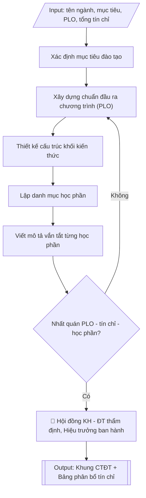

# Tư liệu lịch sử – không phải quy trình hiện hành

Nội dung từ phiên bản nguồn trước 1.1.0, giữ để đối chiếu dữ liệu đầu vào và thay đổi; căn cứ, điều kiện, mẫu và ví dụ có thể đã lỗi thời. Không dùng để thực hiện nghiệp vụ hiện tại.

## Khi nào dùng
Khi cần xây dựng mới, rà soát hoặc cập nhật khung chương trình đào tạo (CTĐT) của một ngành
trình độ đại học: xác lập mục tiêu đào tạo, chuẩn đầu ra chương trình (PLO), cấu trúc các khối
kiến thức, tổng số tín chỉ và danh mục học phần.

## Đầu vào (Input)

| Trường | Mô tả | Bắt buộc |
|---|---|---|
| `ten_nganh` | Tên ngành đào tạo | Có |
| `ma_nganh` | Mã ngành theo danh mục | Không |
| `trinh_do` | Trình độ đào tạo (đại học) | Có |
| `thoi_gian_dao_tao` | Thời gian đào tạo (năm / học kỳ) | Không (mặc định: 4 năm – 8 học kỳ) |
| `muc_tieu_dao_tao` | Mục tiêu chung và mục tiêu cụ thể của CTĐT | Có |
| `plo` | Danh sách chuẩn đầu ra chương trình (PLO), phân 3 nhóm: kiến thức / kỹ năng / mức tự chủ và trách nhiệm | Có |
| `tong_tin_chi` | Tổng số tín chỉ của CTĐT | Có |
| `khoi_kien_thuc` | Cấu trúc các khối kiến thức và số tín chỉ từng khối | Có |
| `danh_muc_hoc_phan` | Danh sách học phần: mã, tên, số tín chỉ, học kỳ, mô tả vắn tắt | Có |
| `don_vi_xay_dung` | Khoa/bộ môn chủ trì xây dựng | Có |

## Quy trình

**Bước 1. Xác định mục tiêu đào tạo**
- Làm gì: viết mục tiêu chung (phẩm chất, năng lực của người tốt nghiệp) và các mục tiêu cụ
  thể từ `muc_tieu_dao_tao`; đối chiếu từng mục tiêu với sứ mệnh, tầm nhìn của trường và nhu
  cầu xã hội đã xác định; đảm bảo mục tiêu cụ thể có thể đo lường được qua chuẩn đầu ra ở
  Bước 2.
- Dùng input: `ten_nganh`, `muc_tieu_dao_tao`, `don_vi_xay_dung`.
- Vai trò: Chuyên viên đơn vị xây dựng CTĐT (khoa/bộ môn) · AI hỗ trợ: soạn dự thảo mục tiêu, kiểm tra tính đo lường được · ⏱ ~45 phút (ước tính)
- Lưu ý nghiệp vụ: bẫy thường gặp là mục tiêu chung chung kiểu "đào tạo nguồn nhân lực chất
  lượng cao" mà không nói rõ "chất lượng cao" là gì; mỗi mục tiêu cụ thể phải ánh xạ được
  sang ít nhất một nhóm PLO ở Bước 2.
- → Kết quả bước: mục tiêu chung và các mục tiêu cụ thể của CTĐT, có ghi căn cứ gắn với
  sứ mệnh trường.

**Bước 2. Xây dựng chuẩn đầu ra chương trình (PLO)**
- Làm gì: cụ thể hóa mục tiêu Bước 1 thành danh sách `plo` theo 3 nhóm: (a) kiến thức,
  (b) kỹ năng, (c) mức tự chủ và trách nhiệm; mỗi PLO viết bằng động từ hành động có thể đo
  lường được; đánh số PLO1, PLO2...; lập bảng ánh xạ mục tiêu → PLO để không sót mục tiêu.
- Dùng input: `plo`, kết quả Bước 1 (mục tiêu đào tạo).
- Vai trò: Chuyên viên đơn vị xây dựng CTĐT (khoa/bộ môn) · AI hỗ trợ: soạn danh sách PLO, kiểm tra ánh xạ mục tiêu → PLO · ⏱ ~1 giờ (ước tính)
- Lưu ý nghiệp vụ: PLO phải dùng động từ đo lường được (phân tích, thiết kế, đánh giá) —
  tránh động từ mơ hồ (hiểu, nắm được); số lượng PLO vừa phải (thường 8–12), quá nhiều gây
  khó kiểm chứng khi kiểm định.
- → Kết quả bước: danh sách PLO đánh số, phân 3 nhóm, kèm bảng ánh xạ mục tiêu → PLO.

**Bước 3. Thiết kế cấu trúc khối kiến thức**
- Làm gì: phân bổ `tong_tin_chi` vào các khối trong `khoi_kien_thuc` — kiến thức giáo dục đại
  cương; kiến thức cơ sở ngành; kiến thức chuyên ngành; thực tập; khóa luận/đồ án tốt nghiệp;
  tính tỷ lệ % từng khối; kiểm tra tổng các khối bằng đúng `tong_tin_chi` và tỷ lệ các khối
  hợp lý theo quy định (khối chuyên ngành phải chiếm tỷ trọng lớn nhất).
- Dùng input: `tong_tin_chi`, `khoi_kien_thuc`.
- Vai trò: Chuyên viên đơn vị xây dựng CTĐT (khoa/bộ môn) · AI hỗ trợ: tính phân bổ tín chỉ theo khối, kiểm tra tổng khớp · ⏱ ~45 phút (ước tính)
- Lưu ý nghiệp vụ: bẫy số học — tổng tín chỉ các khối không khớp tổng công bố là lỗi phổ biến
  nhất; kiểm tra quy định tối thiểu/tối đa của từng khối theo chuẩn chương trình đào tạo.
- → Kết quả bước: bảng phân bổ tín chỉ theo khối kiến thức (số tín chỉ, tỷ lệ %, tổng 100%).

**Bước 4. Lập danh mục học phần**
- Làm gì: từ `danh_muc_hoc_phan`, với mỗi học phần ghi: mã, tên, số tín chỉ (lý thuyết –
  thực hành), học kỳ bố trí, học phần tiên quyết (nếu có); sắp xếp theo tiến trình học tập
  từ đại cương đến chuyên sâu; kiểm tra tổng tín chỉ các học phần khớp với bảng phân bổ ở
  Bước 3 và mỗi khối kiến thức đều có đủ học phần.
- Dùng input: `danh_muc_hoc_phan`, kết quả Bước 3 (bảng phân bổ tín chỉ).
- Vai trò: Chuyên viên đơn vị xây dựng CTĐT (khoa/bộ môn) · AI hỗ trợ: lập danh mục học phần, kiểm tra tiến trình và học phần tiên quyết · ⏱ ~1 giờ (ước tính)
- Lưu ý nghiệp vụ: học phần tiên quyết phải được bố trí ở học kỳ trước học phần phụ thuộc —
  bẫy phổ biến là xếp tiên quyết cùng học kỳ hoặc sau; tên và mã học phần phải thống nhất
  tuyệt đối với đề cương chi tiết từng học phần.
- → Kết quả bước: danh mục học phần hoàn chỉnh (mã, tên, tín chỉ, học kỳ, tiên quyết) sắp
  xếp theo tiến trình.

**Bước 5. Viết mô tả vắn tắt từng học phần**
- Làm gì: với mỗi học phần trong danh mục Bước 4, viết mô tả 3–5 dòng: nội dung cốt lõi và
  năng lực người học đạt được sau học phần; đảm bảo mô tả thể hiện được đóng góp của học
  phần vào các PLO ở Bước 2.
- Dùng input: `danh_muc_hoc_phan`, kết quả Bước 2 (danh sách PLO).
- Vai trò: Chuyên viên đơn vị xây dựng CTĐT (khoa/bộ môn) · AI hỗ trợ: viết mô tả vắn tắt, kiểm tra đóng góp vào PLO · ⏱ ~1 giờ (ước tính)
- Lưu ý nghiệp vụ: mô tả vắn tắt là cơ sở để giảng viên soạn đề cương chi tiết — phải đủ
  cụ thể về nội dung, tránh mô tả chung chung áp dụng được cho mọi học phần; mỗi mô tả nên
  gợi được PLO mà học phần đóng góp.
- → Kết quả bước: bảng danh mục học phần đã bổ sung cột mô tả vắn tắt.

**Bước 6. Kiểm tra tính nhất quán và trình phê duyệt**
- Làm gì: đối chiếu chéo toàn bộ khung: PLO có bao phủ hết mục tiêu đào tạo không; tổng tín
  chỉ các khối và các học phần có khớp nhau không; mỗi PLO có học phần đóng góp không; lấy
  ý kiến Hội đồng khoa học – đào tạo khoa và doanh nghiệp; chỉnh sửa theo góp ý; trình Hiệu
  trưởng ký quyết định ban hành.
- Dùng input: toàn bộ các trường input và kết quả các bước trên, `don_vi_xay_dung`.
- Vai trò: Hội đồng KH–ĐT thẩm định; Hiệu trưởng ký ban hành; chuyên viên đơn vị xây dựng đối chiếu · AI hỗ trợ: đối chiếu chéo nhất quán (mục tiêu ↔ PLO ↔ tín chỉ ↔ học phần) · ⏱ ~2 giờ (ước tính)
- Lưu ý nghiệp vụ: đây là cổng chặn lỗi cuối — 3 điểm kiểm tra bắt buộc: (1) mục tiêu ↔ PLO,
  (2) tổng tín chỉ các khối = tổng tín chỉ các học phần = tổng công bố, (3) học phần tiên
  quyết đúng tiến trình; ý kiến doanh nghiệp là minh chứng quan trọng khi kiểm định.
- → Kết quả bước: khung CTĐT hoàn chỉnh đã qua thẩm định, sẵn sàng trình Hiệu trưởng ký
  quyết định ban hành.

## Luồng quy trình (Workflow)


## Đầu ra (Output)
- Khung CTĐT hoàn chỉnh: mục tiêu, chuẩn đầu ra PLO, cấu trúc khối kiến thức, danh mục
  học phần kèm mô tả vắn tắt — trình bày dạng bảng.
- Bảng tổng hợp phân bổ tín chỉ theo khối kiến thức và theo học kỳ.

**Cấu trúc output chuẩn:** khung mẫu CỐ ĐỊNH của sản phẩm chính (Khung chương trình đào tạo),
các phần bắt buộc theo đúng thứ tự xuất hiện:
1. Tiêu đề khung CTĐT: tên ngành, mã ngành, trình độ đào tạo, thời gian đào tạo (năm/học kỳ),
   tổng số tín chỉ; số, ngày quyết định ban hành và người ký ban hành.
2. Mục 1 – Mục tiêu đào tạo: mục tiêu chung và các mục tiêu cụ thể.
3. Mục 2 – Chuẩn đầu ra của chương trình đào tạo (PLO): liệt kê đánh số theo 3 nhóm —
   kiến thức; kỹ năng; mức tự chủ và trách nhiệm.
4. Mục 3 – Cấu trúc khối kiến thức: bảng (khối kiến thức, số tín chỉ, tỷ lệ %) kèm dòng tổng.
5. Mục 4 – Danh mục học phần: bảng (mã HP, tên học phần, số TC lý thuyết–thực hành, học kỳ,
   học phần tiên quyết, mô tả vắn tắt) sắp xếp theo tiến trình học tập.
6. Phụ lục kèm theo: Bảng tổng hợp phân bổ tín chỉ theo học kỳ.

## Checklist nghiệm thu

- [ ] Đủ 6 phần theo "Cấu trúc output chuẩn": tiêu đề khung CTĐT (ngành, mã ngành, trình độ, thời gian, tổng tín chỉ, số/ngày quyết định ban hành), Mục 1 mục tiêu đào tạo, Mục 2 chuẩn đầu ra PLO, Mục 3 cấu trúc khối kiến thức, Mục 4 danh mục học phần, phụ lục phân bổ tín chỉ theo học kỳ.
- [ ] Mọi mục tiêu cụ thể đều ánh xạ được sang ít nhất một PLO; PLO viết bằng động từ hành động đo lường được, số lượng vừa phải (thường 8–12).
- [ ] Tổng tín chỉ các khối = tổng tín chỉ các học phần = tổng công bố (tỷ lệ các khối cộng đúng 100%).
- [ ] Mỗi PLO có học phần đóng góp; học phần tiên quyết được bố trí ở học kỳ trước học phần phụ thuộc.
- [ ] Tên, mã học phần thống nhất với đề cương chi tiết; nội dung khớp với Input đã cho.
- [ ] Không bịa đặt số liệu tín chỉ, quyết định ban hành hay trích dẫn văn bản.
- [ ] Căn cứ pháp lý đầy đủ, còn hiệu lực (Thông tư 17/2021/TT-BGDĐT về chuẩn CTĐT).
- [ ] Đã qua Human gate: Hội đồng KH–ĐT đã thẩm định, Hiệu trưởng đã ký quyết định ban hành.

Tiêu chí đạt = tất cả các ô được đánh dấu.

## Ví dụ mô phỏng (dữ liệu giả lập)

> Tất cả tên trường, cá nhân, số liệu dưới đây đều là **giả lập**, không liên quan tổ chức/cá nhân có thật.

### Input mẫu

| Trường | Giá trị |
|---|---|
| `ten_nganh` | Trí tuệ nhân tạo |
| `ma_nganh` | 7480107 |
| `trinh_do` | Đại học |
| `thoi_gian_dao_tao` | 4 năm – 8 học kỳ |
| `muc_tieu_dao_tao` | Mục tiêu chung: đào tạo kỹ sư Trí tuệ nhân tạo có phẩm chất chính trị, đạo đức tốt, kiến thức vững, kỹ năng thực hành thành thạo, đáp ứng nhu cầu phát triển kinh tế số. Mục tiêu cụ thể: (1) nắm vững kiến thức nền tảng toán, tin học và AI; (2) thiết kế, triển khai được hệ thống AI; (3) làm việc nhóm, học tập suốt đời. |
| `plo` | PLO1–PLO4 (kiến thức); PLO5–PLO8 (kỹ năng); PLO9–PLO11 (mức tự chủ và trách nhiệm) — chi tiết ở output mẫu |
| `tong_tin_chi` | 130 |
| `khoi_kien_thuc` | Đại cương 38 TC; cơ sở ngành 30 TC; chuyên ngành 44 TC; thực tập 8 TC; tốt nghiệp 10 TC |
| `danh_muc_hoc_phan` | 42 học phần (trích 12 học phần tiêu biểu ở output mẫu) |
| `don_vi_xay_dung` | Khoa Công nghệ thông tin – Trưởng khoa TS. Nguyễn Văn C |

### Output mẫu

```
KHUNG CHƯƠNG TRÌNH ĐÀO TẠO
Ngành: Trí tuệ nhân tạo – Mã ngành: 7480107 – Trình độ: Đại học
Thời gian đào tạo: 4 năm (8 học kỳ) – Tổng số: 130 tín chỉ
Ban hành kèm theo Quyết định số 210/QĐ-ĐHA ngày 09/10/2026 của Hiệu trưởng
Trường Đại học A
```

**1. Mục tiêu đào tạo**

*Mục tiêu chung:* Đào tạo kỹ sư Trí tuệ nhân tạo có phẩm chất chính trị, đạo đức nghề nghiệp
tốt; kiến thức nền tảng vững chắc; kỹ năng thực hành thành thạo; khả năng thích ứng với
thay đổi công nghệ, đáp ứng nhu cầu phát triển kinh tế số của đất nước.

*Mục tiêu cụ thể:*
- MT1: Nắm vững kiến thức nền tảng về toán học, tin học và trí tuệ nhân tạo.
- MT2: Có năng lực thiết kế, xây dựng và triển khai các hệ thống, ứng dụng AI.
- MT3: Có kỹ năng làm việc nhóm, giao tiếp, học tập suốt đời và khởi nghiệp.

**2. Chuẩn đầu ra của chương trình đào tạo (PLO)**

*Nhóm kiến thức:*
- PLO1: Vận dụng được kiến thức toán học (giải tích, đại số tuyến tính, xác suất thống kê,
  tối ưu) làm nền tảng cho các thuật toán AI.
- PLO2: Trình bày được kiến thức cốt lõi về khoa học máy tính: cấu trúc dữ liệu, giải thuật,
  cơ sở dữ liệu, hệ điều hành, mạng máy tính.
- PLO3: Phân tích được các mô hình, thuật toán học máy, học sâu và ứng dụng trong xử lý
  ngôn ngữ tự nhiên, thị giác máy tính.
- PLO4: Giải thích được các vấn đề đạo đức, pháp lý và tác động xã hội của trí tuệ nhân tạo.

*Nhóm kỹ năng:*
- PLO5: Thiết kế, huấn luyện và đánh giá được mô hình học máy/học sâu trên dữ liệu thực tế.
- PLO6: Xây dựng, triển khai được hệ thống, ứng dụng AI hoàn chỉnh (từ thu thập dữ liệu
  đến triển khai sản phẩm).
- PLO7: Làm việc nhóm hiệu quả, giao tiếp và trình bày được giải pháp kỹ thuật bằng
  tiếng Việt và tiếng Anh chuyên ngành.
- PLO8: Sử dụng thành thạo các công cụ, framework AI phổ biến (Python, TensorFlow/PyTorch).

*Nhóm mức tự chủ và trách nhiệm:*
- PLO9: Tự chủ trong học tập, nghiên cứu; có khả năng tự cập nhật công nghệ mới.
- PLO10: Chịu trách nhiệm về chất lượng, tiến độ công việc được giao; tuân thủ đạo đức
  nghề nghiệp và quy định pháp luật về dữ liệu, AI.
- PLO11: Có tinh thần khởi nghiệp, đổi mới sáng tạo trong lĩnh vực trí tuệ nhân tạo.

**3. Cấu trúc khối kiến thức**

| STT | Khối kiến thức | Số tín chỉ | Tỷ lệ |
|---|---|---|---|
| 1 | Kiến thức giáo dục đại cương | 38 | 29,2% |
| 2 | Kiến thức cơ sở ngành | 30 | 23,1% |
| 3 | Kiến thức chuyên ngành | 44 | 33,8% |
| 4 | Thực tập tốt nghiệp | 8 | 6,2% |
| 5 | Khóa luận/Đồ án tốt nghiệp | 10 | 7,7% |
| | **Tổng cộng** | **130** | **100%** |

**4. Danh mục học phần (trích các học phần tiêu biểu)**

| Mã HP | Tên học phần | Số TC (LT–TH) | Học kỳ | Học phần tiên quyết | Mô tả vắn tắt |
|---|---|---|---|---|---|
| ĐHA101 | Triết học Mác – Lênin | 3 (3–0) | 1 | — | Những nguyên lý cơ bản của triết học Mác – Lênin; vận dụng phương pháp luận duy vật biện chứng trong nhận thức và thực tiễn. |
| ĐHA110 | Giải tích 1 | 3 (3–0) | 1 | — | Giới hạn, đạo hàm, tích phân hàm một biến; nền tảng toán cho các thuật toán tối ưu trong AI. |
| ĐHA115 | Đại số tuyến tính | 3 (3–0) | 1 | — | Ma trận, không gian vectơ, trị riêng; công cụ toán cốt lõi của học máy. |
| ĐHA120 | Nhập môn lập trình | 3 (2–1) | 1 | — | Tư duy lập trình, ngôn ngữ Python; viết chương trình giải quyết bài toán cơ bản. |
| AI201 | Xác suất thống kê cho AI | 3 (3–0) | 3 | ĐHA110 | Xác suất, phân phối, suy luận thống kê; cơ sở lý thuyết của học máy. |
| AI202 | Cấu trúc dữ liệu và giải thuật | 3 (2–1) | 3 | ĐHA120 | Các cấu trúc dữ liệu và thuật toán kinh điển; phân tích độ phức tạp. |
| AI301 | Học máy | 4 (3–1) | 5 | AI201, AI202 | Hồi quy, phân loại, phân cụm, cây quyết định; huấn luyện và đánh giá mô hình trên dữ liệu thực. |
| AI302 | Học sâu | 4 (3–1) | 6 | AI301 | Mạng nơ-ron, CNN, RNN, Transformer; xây dựng mô hình học sâu bằng PyTorch/TensorFlow. |
| AI303 | Xử lý ngôn ngữ tự nhiên | 3 (2–1) | 6 | AI301 | Biểu diễn văn bản, mô hình ngôn ngữ, các bài toán phân loại văn bản, hỏi đáp tự động. |
| AI304 | Thị giác máy tính | 3 (2–1) | 7 | AI302 | Xử lý ảnh số, phát hiện và nhận dạng đối tượng bằng học sâu. |
| AI401 | Thực tập tốt nghiệp | 8 (0–8) | 8 | — | Thực tập 12 tuần tại doanh nghiệp; vận dụng kiến thức AI giải quyết bài toán thực tế. |
| AI402 | Đồ án tốt nghiệp | 10 (0–10) | 8 | — | Thực hiện đề tài nghiên cứu/ứng dụng AI hoàn chỉnh; bảo vệ trước hội đồng. |

*(Danh mục đầy đủ gồm 42 học phần được ban hành kèm khung chương trình.)*

## Căn cứ & lưu ý
- Thông tư 17/2021/TT-BGDĐT ngày 22/6/2021 của Bộ GD&ĐT quy định về chuẩn chương trình
  đào tạo; xây dựng, thẩm định và ban hành chương trình đào tạo các trình độ của giáo dục đại học.
- Chuẩn đầu ra phải viết theo 3 nhóm: kiến thức; kỹ năng; mức tự chủ và trách nhiệm —
  dùng động từ hành động đo lường được.
- Khung CTĐT phải được Hội đồng khoa học và đào tạo thẩm định trước khi Hiệu trưởng
  ký quyết định ban hành.
- Không dùng tên thật của trường/cá nhân khi mô phỏng.
