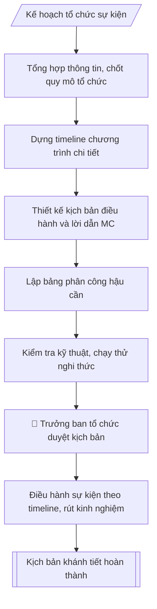

# Xây dựng kịch bản lễ tân, khánh tiết

## Định dạng và file đầu ra

Định dạng đầu ra có thể chọn theo sản phẩm/yêu cầu: .docx, .pdf, .txt, .md, .html. Đọc mục “Định dạng bổ sung” trong quy cách đầu ra trước khi chọn.

**Phải tạo file thực tế để tải xuống, không chỉ trả nội dung trong chat.** Định dạng mặc định của skill: **.docx**. Nếu có bảng số liệu nghiệp vụ yêu cầu file bảng tính riêng, tạo thêm Excel theo yêu cầu; không tự tạo file kiểm tra. Không chờ người dùng yêu cầu xuất file lần nữa. Ưu tiên định dạng người dùng chỉ định; đọc quy tắc xuất file tại references/quy-cach-dau-ra.md.

## Quy cách đầu ra và thông tin thiếu
Đọc [quy cách và cấu trúc sản phẩm](references/quy-cach-dau-ra.md) trước khi soạn/xuất. File giao chỉ gồm sản phẩm nghiệp vụ được yêu cầu; kiểm tra nội bộ không xuất kèm. Thiếu thông tin thì giữ nguyên trường/mục và chỗ điền theo mẫu gốc (dòng dấu chấm, dấu gạch hoặc ô trống); không tự điền dữ liệu mẫu, số 0, mã chờ xác minh hay dòng chờ ký. Mẫu chuyên ngành còn áp dụng được ưu tiên về cấu trúc, mã biểu và người ký. Bản đầy đủ: [quy tắc chung](references/quy-tac-chung.md).

## Kiểm soát áp dụng và phê duyệt
Trước khi chạy, xác định `ngay_ap_dung`, `loai_hinh_truong`, `quy_che_noi_bo`, `nguon_du_lieu`, `nguoi_kiem_duyet`; chỉ hỏi thông tin liên quan nghiệp vụ, không dùng giá trị giả định thay dữ liệu bắt buộc. Đối chiếu căn cứ pháp lý với văn bản gốc, hiệu lực, điều khoản áp dụng và chuyển tiếp. Bản đầy đủ: [quy tắc chung](references/quy-tac-chung.md).

## Giới hạn và human gate
AI hỗ trợ chuẩn bị và đối chiếu; cán bộ phụ trách kiểm tra dữ liệu/căn cứ, người có thẩm quyền duyệt và ký. Không đánh dấu đã ký, đã duyệt, đã công bố khi chưa có chứng cứ. Dữ liệu sinh viên, sức khỏe, nhân sự, tài chính chỉ dùng theo mục đích và phân quyền, che thông tin định danh khi dùng ví dụ (Luật 91/2025/QH15, hiệu lực 01/01/2026); không tải dữ liệu lên dịch vụ ngoài khi chưa có quyền. Bản đầy đủ: [quy tắc chung](references/quy-tac-chung.md).

## Khi nào dùng
Khi tổ chức các sự kiện cần lễ tân, khánh tiết: lễ khai giảng / bế giảng, lễ kỷ niệm,
hội nghị – hội thảo, đón đoàn khách cấp trên / quốc tế.

## Đầu vào (Input)

| Trường | Mô tả | Bắt buộc |
|---|---|---|
| `ten_su_kien` | Tên sự kiện | Có |
| `thoi_gian` | Giờ, ngày tổ chức | Có |
| `dia_diem` | Địa điểm | Có |
| `dai_bieu` | Thành phần đại biểu (lãnh đạo cấp trên, khách mời, CBVC, SV) | Có |
| `chuong_trinh` | Các nội dung chính theo thứ tự | Có |
| `mc` | Người dẫn chương trình | Không |
| `yeu_cau_dac_biet` | Nghi thức đặc biệt: cắt băng khánh thành, trao bằng khen, đánh trống... | Không |

## Quy trình

**Bước 1. Tổng hợp thông tin sự kiện, chốt quy mô tổ chức**
- Làm gì: thu thập `ten_su_kien`, `thoi_gian`, `dia_diem`, `dai_bieu`, `chuong_trinh`, `yeu_cau_dac_biet`; đối chiếu với kế hoạch tổ chức đã phê duyệt; ước tính quy mô (số lượng đại biểu từng nhóm) để xác định quy mô lễ tân, sơ đồ chỗ ngồi, lực lượng hậu cần cần huy động.
- Dùng input: `ten_su_kien`, `thoi_gian`, `dia_diem`, `dai_bieu`, `chuong_trinh`, `yeu_cau_dac_biet`.
- Vai trò: Phòng HCTH chủ trì, các đơn vị phối hợp · AI hỗ trợ: lập kế hoạch, phân công nhiệm vụ · ⏱ ~1–2 giờ (ước tính)
- Lưu ý nghiệp vụ: số lượng đại biểu quyết định mọi phân công sau — bẫy là ước tính thiếu khiến thiếu chỗ ngồi, thiếu lễ tân; ghi nhận yêu cầu đặc biệt (đoàn quốc tế cần cờ, phiên dịch; lãnh đạo cấp trên cần bố trí an ninh).
- → Kết quả bước: bảng thông tin sự kiện tổng hợp (quy mô, thành phần, yêu cầu đặc biệt).

**Bước 2. Dựng timeline chương trình chi tiết**
- Làm gì: từ `thoi_gian` và `chuong_trinh`, chia giờ cụ thể cho từng nội dung: đón tiếp đại biểu trước giờ khai mạc 30–45 phút; mỗi phát biểu giới hạn thời gian; nghi thức đặc biệt có khung giờ riêng; ghi rõ người thực hiện từng mục (MC, diễn giả, tổ lễ tân).
- Dùng input: `thoi_gian`, `chuong_trinh`, `mc`.
- Vai trò: Chuyên viên Phòng HCTH · AI hỗ trợ: soạn dự thảo đúng thể thức · ⏱ ~20–45 phút (ước tính)
- Lưu ý nghiệp vụ: tổng thời lượng các mục không vượt quá khung giờ sự kiện — bẫy là nhồi quá nhiều nội dung khiến chương trình kéo dài; để 5–10 phút dự phòng giữa các mục; giờ đón tiếp phải sớm hơn giờ khai mạc đủ để ổn định tổ chức.
- → Kết quả bước: bảng timeline (Giờ – Nội dung – Người thực hiện).

**Bước 3. Thiết kế kịch bản điều hành và lời dẫn MC**
- Làm gì: viết kịch bản điều hành cho `mc`: lời tuyên bố lý do, giới thiệu đại biểu (theo thứ tự chức vụ từ cao xuống thấp), lời dẫn chuyển giữa các nội dung, lời dẫn các nghi thức đặc biệt (`yeu_cau_dac_biet`), lời bế mạc – cảm ơn – mời chụp ảnh – tiễn đại biểu; ghi chú thời điểm MC nhắc tắt/chế độ im lặng điện thoại.
- Dùng input: `mc`, `dai_bieu`, `chuong_trinh`, `yeu_cau_dac_biet`.
- Vai trò: Phòng HCTH chủ trì, các đơn vị phối hợp · AI hỗ trợ: lập kế hoạch, phân công nhiệm vụ · ⏱ ~1–2 giờ (ước tính)
- Lưu ý nghiệp vụ: thứ tự giới thiệu đại biểu tuyệt đối theo chức vụ từ cao xuống thấp — sai thứ tự là lỗi nghi thức nghiêm trọng; họ tên, chức danh đại biểu phải kiểm tra chính xác; lời dẫn ngắn gọn, trang trọng.
- → Kết quả bước: kịch bản lời dẫn MC chi tiết theo từng mục timeline.

**Bước 4. Lập bảng phân công hậu cần**
- Làm gì: phân công từng hạng mục: âm thanh – ánh sáng – màn LED; backdrop – bandroll – hoa tươi; sơ đồ chỗ ngồi (in, đặt trước 01 ngày); y tế thường trực; an ninh – giữ xe; chụp ảnh – quay phim; ghi rõ người/tổ phụ trách và thời hạn hoàn thành chuẩn bị.
- Dùng input: `dia_diem`, `dai_bieu` (quy mô), `yeu_cau_dac_biet`.
- Vai trò: Chuyên viên Phòng HCTH · AI hỗ trợ: lập bảng tính toán · ⏱ ~20–45 phút (ước tính)
- Lưu ý nghiệp vụ: mỗi hạng mục chỉ một đầu mối chịu trách nhiệm, tránh chồng chéo; sơ đồ chỗ ngồi đại biểu cấp trên phải được duyệt trước; kiểm tra nguồn điện, phương án dự phòng khi mất điện/mưa (sự kiện ngoài trời).
- → Kết quả bước: bảng phân công hậu cần (hạng mục – người phụ trách – thời hạn).

**Bước 5. Kiểm tra kỹ thuật, duyệt kịch bản**
- Làm gì: kiểm tra âm thanh, trình chiếu, màn LED trước giờ khai mạc (ít nhất 01 giờ); chạy thử các nghi thức đặc biệt; trình Trưởng ban tổ chức duyệt toàn bộ kịch bản (timeline, lời dẫn MC, phân công hậu cần, sơ đồ chỗ ngồi).
- Dùng input: (không dùng thêm input — kiểm tra trên sản phẩm các bước trước).
- Vai trò: Chuyên viên Phòng HCTH (Trưởng phòng kiểm tra lại) · AI hỗ trợ: quét lỗi theo checklist · ⏱ ~15–30 phút (ước tính)
- Lưu ý nghiệp vụ: không bỏ qua bước chạy thử — đa số sự cố (mic hú, slide lỗi, nhạc sai) phát hiện ở bước này; mọi thay đổi sau khi duyệt phải báo lại Trưởng ban tổ chức.
- → Kết quả bước: kịch bản khánh tiết đã được duyệt.

**Bước 6. Điều hành sự kiện, rút kinh nghiệm**
- Làm gì: điều hành chương trình đúng timeline; xử lý tình huống phát sinh (đại biểu đến muộn, kéo dài phát biểu, sự cố kỹ thuật); sau sự kiện tổng hợp đánh giá, ghi nhận sự cố và bài học.
- Dùng input: (vận hành trên kịch bản đã duyệt).
- Vai trò: Phòng HCTH chủ trì, các đơn vị phối hợp · AI hỗ trợ: lập kế hoạch, phân công nhiệm vụ · ⏱ ~1–2 giờ (ước tính)
- Lưu ý nghiệp vụ: MC giữ nhịp chương trình, linh hoạt rút gọn khi trễ giờ nhưng không cắt nghi thức quan trọng; biên bản rút kinh nghiệm là đầu vào cải tiến cho sự kiện sau.
- → Kết quả bước: sự kiện diễn ra theo kịch bản + biên bản rút kinh nghiệm.

## Luồng quy trình (Workflow)

## Đầu ra

File nghiệp vụ thực tế theo định dạng mặc định ở đầu skill hoặc định dạng người dùng yêu cầu, kèm liên kết tải trong phản hồi cuối.

Sản phẩm nghiệp vụ hoàn chỉnh theo [quy cách và cấu trúc](references/quy-cach-dau-ra.md), giữ các trường chưa có dữ liệu ở trạng thái trống. Không xuất kèm checklist/phụ lục kiểm tra đầu ra.

## Kiểm tra nội bộ trước khi giao

Các tiêu chí sau dùng để tự đối chiếu; không sao chép vào file xuất. Mục thiếu dữ liệu được để trống, không đánh dấu đã đạt hoặc đã duyệt.

- [ ] Bố cục khớp mẫu áp dụng và cấu trúc tại references/quy-cach-dau-ra.md.
- [ ] Nội dung và số liệu trong output khớp đúng với Input đã cho (không thêm, bớt hay suy diễn)
- [ ] Không bịa đặt số liệu, minh chứng, trích dẫn hay căn cứ
- [ ] Đúng thể thức và định dạng theo Kế hoạch tổ chức sự kiện đã được phê duyệt
- [ ] Căn cứ pháp lý được trích dẫn đầy đủ và còn hiệu lực
- [ ] Không coi bản soạn là đã ký/đã duyệt; việc phê duyệt thuộc người có thẩm quyền trước phát hành
- [ ] Giờ đón tiếp phải sớm hơn giờ khai mạc đủ để ổn định tổ chức
- [ ] Họ tên, chức danh đại biểu phải kiểm tra chính xác
- [ ] Mỗi hạng mục chỉ một đầu mối chịu trách nhiệm, tránh chồng chéo

## Căn cứ & lưu ý
- Kế hoạch tổ chức sự kiện đã được phê duyệt; phối hợp với đơn vị chủ trì nội dung.
- Với đoàn khách quốc tế: bổ sung lễ tân ngoại giao (cờ, phiên dịch).
- Không dùng tên thật của trường/cá nhân khi mô phỏng.

## Quản trị phiên bản
- Phiên bản gói `1.3.2` (cập nhật 2026-10-10); hồ sơ đầy đủ tại [references/version.json](references/version.json).
- Người phê duyệt nghiệp vụ: **chưa chỉ định**. Trạng thái: dự thảo nghiệp vụ; kiểm tra pháp lý trước thực thi. Ngày cập nhật không đồng nghĩa mọi văn bản đã được rà soát toàn văn.
- Giấy phép theo LICENSE của kho (bản quyền CES Global). Lịch sử thay đổi: CHANGELOG.md.
