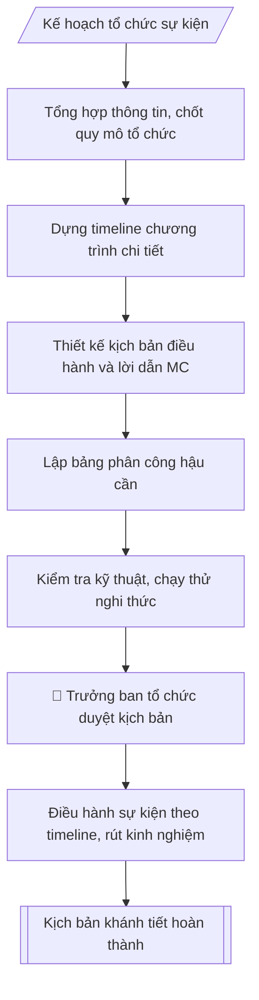

# Xây dựng kịch bản lễ tân, khánh tiết

## Kiểm soát áp dụng và phê duyệt

Trước khi chạy quy trình, xác định `ngay_ap_dung`, `loai_hinh_truong`, `quy_che_noi_bo`, `nguon_du_lieu` và `nguoi_kiem_duyet`. Chỉ yêu cầu thông tin có liên quan đến nghiệp vụ; không dùng giá trị giả định thay dữ liệu bắt buộc. Hồ sơ có yếu tố pháp lý phải kèm văn bản gốc, tình trạng hiệu lực, điều khoản áp dụng và chuyển tiếp.

## Giới hạn và human gate

AI hỗ trợ chuẩn bị và đối chiếu. Cán bộ phụ trách kiểm tra dữ liệu/căn cứ, người có thẩm quyền duyệt và ký. Mọi đầu ra mặc định là **DỰ THẢO – CHỜ KIỂM DUYỆT**; không đánh dấu đã ký, đã duyệt hoặc đã công bố nếu chưa có chứng cứ. Dữ liệu sinh viên, sức khỏe, nhân sự và tài chính phải hạn chế theo mục đích, phân quyền và che thông tin định danh khi dùng ví dụ. Không tải dữ liệu lên dịch vụ ngoài khi chưa có quyền. Kiểm tra Luật 91/2025/QH15 về bảo vệ dữ liệu cá nhân (hiệu lực 01/01/2026) và quy định áp dụng trước xử lý/chia sẻ dữ liệu cá nhân.


## Khi nào dùng
Khi tổ chức các sự kiện cần lễ tân, khánh tiết: lễ khai giảng / bế giảng, lễ kỷ niệm,
hội nghị – hội thảo, đón đoàn khách cấp trên / quốc tế.

## Đầu vào (Input)

| Trường | Mô tả | Bắt buộc |
|---|---|---|
| `ten_su_kien` | Tên sự kiện | Có |
| `thoi_gian` | Giờ, ngày tổ chức | Có |
| `dia_diem` | Địa điểm | Có |
| `dai_bieu` | Thành phần đại biểu (lãnh đạo cấp trên, khách mời, CBVC, SV) | Có |
| `chuong_trinh` | Các nội dung chính theo thứ tự | Có |
| `mc` | Người dẫn chương trình | Không |
| `yeu_cau_dac_biet` | Nghi thức đặc biệt: cắt băng khánh thành, trao bằng khen, đánh trống... | Không |

## Quy trình

**Bước 1. Tổng hợp thông tin sự kiện, chốt quy mô tổ chức**
- Làm gì: thu thập `ten_su_kien`, `thoi_gian`, `dia_diem`, `dai_bieu`, `chuong_trinh`, `yeu_cau_dac_biet`; đối chiếu với kế hoạch tổ chức đã phê duyệt; ước tính quy mô (số lượng đại biểu từng nhóm) để xác định quy mô lễ tân, sơ đồ chỗ ngồi, lực lượng hậu cần cần huy động.
- Dùng input: `ten_su_kien`, `thoi_gian`, `dia_diem`, `dai_bieu`, `chuong_trinh`, `yeu_cau_dac_biet`.
- Vai trò: Phòng HCTH chủ trì, các đơn vị phối hợp · AI hỗ trợ: lập kế hoạch, phân công nhiệm vụ · ⏱ ~1–2 giờ (ước tính)
- Lưu ý nghiệp vụ: số lượng đại biểu quyết định mọi phân công sau — bẫy là ước tính thiếu khiến thiếu chỗ ngồi, thiếu lễ tân; ghi nhận yêu cầu đặc biệt (đoàn quốc tế cần cờ, phiên dịch; lãnh đạo cấp trên cần bố trí an ninh).
- → Kết quả bước: bảng thông tin sự kiện tổng hợp (quy mô, thành phần, yêu cầu đặc biệt).

**Bước 2. Dựng timeline chương trình chi tiết**
- Làm gì: từ `thoi_gian` và `chuong_trinh`, chia giờ cụ thể cho từng nội dung: đón tiếp đại biểu trước giờ khai mạc 30–45 phút; mỗi phát biểu giới hạn thời gian; nghi thức đặc biệt có khung giờ riêng; ghi rõ người thực hiện từng mục (MC, diễn giả, tổ lễ tân).
- Dùng input: `thoi_gian`, `chuong_trinh`, `mc`.
- Vai trò: Chuyên viên Phòng HCTH · AI hỗ trợ: soạn dự thảo đúng thể thức · ⏱ ~20–45 phút (ước tính)
- Lưu ý nghiệp vụ: tổng thời lượng các mục không vượt quá khung giờ sự kiện — bẫy là nhồi quá nhiều nội dung khiến chương trình kéo dài; để 5–10 phút dự phòng giữa các mục; giờ đón tiếp phải sớm hơn giờ khai mạc đủ để ổn định tổ chức.
- → Kết quả bước: bảng timeline (Giờ – Nội dung – Người thực hiện).

**Bước 3. Thiết kế kịch bản điều hành và lời dẫn MC**
- Làm gì: viết kịch bản điều hành cho `mc`: lời tuyên bố lý do, giới thiệu đại biểu (theo thứ tự chức vụ từ cao xuống thấp), lời dẫn chuyển giữa các nội dung, lời dẫn các nghi thức đặc biệt (`yeu_cau_dac_biet`), lời bế mạc – cảm ơn – mời chụp ảnh – tiễn đại biểu; ghi chú thời điểm MC nhắc tắt/chế độ im lặng điện thoại.
- Dùng input: `mc`, `dai_bieu`, `chuong_trinh`, `yeu_cau_dac_biet`.
- Vai trò: Phòng HCTH chủ trì, các đơn vị phối hợp · AI hỗ trợ: lập kế hoạch, phân công nhiệm vụ · ⏱ ~1–2 giờ (ước tính)
- Lưu ý nghiệp vụ: thứ tự giới thiệu đại biểu tuyệt đối theo chức vụ từ cao xuống thấp — sai thứ tự là lỗi nghi thức nghiêm trọng; họ tên, chức danh đại biểu phải kiểm tra chính xác; lời dẫn ngắn gọn, trang trọng.
- → Kết quả bước: kịch bản lời dẫn MC chi tiết theo từng mục timeline.

**Bước 4. Lập bảng phân công hậu cần**
- Làm gì: phân công từng hạng mục: âm thanh – ánh sáng – màn LED; backdrop – bandroll – hoa tươi; sơ đồ chỗ ngồi (in, đặt trước 01 ngày); y tế thường trực; an ninh – giữ xe; chụp ảnh – quay phim; ghi rõ người/tổ phụ trách và thời hạn hoàn thành chuẩn bị.
- Dùng input: `dia_diem`, `dai_bieu` (quy mô), `yeu_cau_dac_biet`.
- Vai trò: Chuyên viên Phòng HCTH · AI hỗ trợ: lập bảng tính toán · ⏱ ~20–45 phút (ước tính)
- Lưu ý nghiệp vụ: mỗi hạng mục chỉ một đầu mối chịu trách nhiệm, tránh chồng chéo; sơ đồ chỗ ngồi đại biểu cấp trên phải được duyệt trước; kiểm tra nguồn điện, phương án dự phòng khi mất điện/mưa (sự kiện ngoài trời).
- → Kết quả bước: bảng phân công hậu cần (hạng mục – người phụ trách – thời hạn).

**Bước 5. Kiểm tra kỹ thuật, duyệt kịch bản**
- Làm gì: kiểm tra âm thanh, trình chiếu, màn LED trước giờ khai mạc (ít nhất 01 giờ); chạy thử các nghi thức đặc biệt; trình Trưởng ban tổ chức duyệt toàn bộ kịch bản (timeline, lời dẫn MC, phân công hậu cần, sơ đồ chỗ ngồi).
- Dùng input: (không dùng thêm input — kiểm tra trên sản phẩm các bước trước).
- Vai trò: Chuyên viên Phòng HCTH (Trưởng phòng kiểm tra lại) · AI hỗ trợ: quét lỗi theo checklist · ⏱ ~15–30 phút (ước tính)
- Lưu ý nghiệp vụ: không bỏ qua bước chạy thử — đa số sự cố (mic hú, slide lỗi, nhạc sai) phát hiện ở bước này; mọi thay đổi sau khi duyệt phải báo lại Trưởng ban tổ chức.
- → Kết quả bước: kịch bản khánh tiết đã được duyệt.

**Bước 6. Điều hành sự kiện, rút kinh nghiệm**
- Làm gì: điều hành chương trình đúng timeline; xử lý tình huống phát sinh (đại biểu đến muộn, kéo dài phát biểu, sự cố kỹ thuật); sau sự kiện tổng hợp đánh giá, ghi nhận sự cố và bài học.
- Dùng input: (vận hành trên kịch bản đã duyệt).
- Vai trò: Phòng HCTH chủ trì, các đơn vị phối hợp · AI hỗ trợ: lập kế hoạch, phân công nhiệm vụ · ⏱ ~1–2 giờ (ước tính)
- Lưu ý nghiệp vụ: MC giữ nhịp chương trình, linh hoạt rút gọn khi trễ giờ nhưng không cắt nghi thức quan trọng; biên bản rút kinh nghiệm là đầu vào cải tiến cho sự kiện sau.
- → Kết quả bước: sự kiện diễn ra theo kịch bản + biên bản rút kinh nghiệm.

## Luồng quy trình (Workflow)



## Đầu ra (Output)
- Kịch bản chi tiết theo timeline (giờ – nội dung – người thực hiện).
- Bảng phân công hậu cần.

**Cấu trúc output chuẩn:** khung mẫu cố định của kịch bản khánh tiết, theo đúng thứ tự:
1. Tiêu đề: tên kịch bản + tên sự kiện + đơn vị tổ chức;
2. Bảng timeline chương trình: Giờ | Nội dung | Người thực hiện (theo đúng trình tự: đón tiếp – ổn định – khai mạc – nội dung chính – nghi thức đặc biệt – bế mạc);
3. Kịch bản lời dẫn MC theo từng mục timeline (tuyên bố lý do, giới thiệu đại biểu theo thứ tự chức vụ, lời dẫn nghi thức, lời bế mạc);
4. Bảng phân công hậu cần: hạng mục – người/tổ phụ trách – thời hạn chuẩn bị;
5. Lưu ý điều hành: kiểm tra kỹ thuật trước giờ G, sơ đồ chỗ ngồi, xử lý tình huống phát sinh.

## Checklist nghiệm thu

Tiêu chí đạt: tất cả các ô dưới đây được đánh dấu.

- [ ] Đủ các phần theo Cấu trúc output chuẩn: Tiêu đề: tên kịch bản + tên sự kiện + đơn vị tổ chức; Bảng timeline chương trình: Giờ | Nội dung | Người thực hiện (theo…; Kịch bản lời dẫn MC theo từng mục timeline (tuyên bố lý do, giới th…; Bảng phân công hậu cần: hạng mục – người/tổ phụ trách – thời hạn ch…; Lưu ý điều hành: kiểm tra kỹ thuật trước giờ G, sơ đồ chỗ ngồi, xử…
- [ ] Nội dung và số liệu trong output khớp đúng với Input đã cho (không thêm, bớt hay suy diễn)
- [ ] Không bịa đặt số liệu, minh chứng, trích dẫn hay căn cứ
- [ ] Đúng thể thức và định dạng theo Kế hoạch tổ chức sự kiện đã được phê duyệt
- [ ] Căn cứ pháp lý được trích dẫn đầy đủ và còn hiệu lực
- [ ] Đã qua Human gate: người có thẩm quyền đã kiểm tra/duyệt trước khi phát hành
- [ ] Giờ đón tiếp phải sớm hơn giờ khai mạc đủ để ổn định tổ chức
- [ ] Họ tên, chức danh đại biểu phải kiểm tra chính xác
- [ ] Mỗi hạng mục chỉ một đầu mối chịu trách nhiệm, tránh chồng chéo

## Ví dụ mô phỏng (dữ liệu giả lập)

> Tất cả tên trường, cá nhân, số liệu dưới đây đều là **giả lập**, không liên quan tổ chức/cá nhân có thật.

### Input mẫu

| Trường | Giá trị |
|---|---|
| `ten_su_kien` | Lễ khai giảng năm học 2026–2027 |
| `thoi_gian` | 08h00 ngày 05/10/2026 |
| `dia_diem` | Hội trường A, Trường Đại học A |
| `dai_bieu` | Lãnh đạo Bộ GD&ĐT; Ban Giám hiệu; 300 CBVC; 800 tân sinh viên |
| `chuong_trinh` | Văn nghệ; tuyên bố lý do; diễn văn khai giảng; phát biểu lãnh đạo; đánh trống khai giảng; trao học bổng tân SV thủ khoa |
| `mc` | ThS. Vũ Thị D |
| `yeu_cau_dac_biet` | Nghi thức đánh trống khai giảng; trao 05 suất học bổng thủ khoa |

### Output mẫu

```
KỊCH BẢN LỄ TÂN, KHÁNH TIẾT
Lễ khai giảng năm học 2026–2027 – Trường Đại học A
(Dữ liệu giả lập)

I. TIMELINE CHƯƠNG TRÌNH
| Giờ | Nội dung | Thực hiện |
|-----|----------|-----------|
| 07h15 | Đón tiếp đại biểu, hướng dẫn ổn định chỗ ngồi | Tổ Lễ tân (06 người) |
| 08h00 | Tuyên bố lý do, giới thiệu đại biểu | MC: ThS. Vũ Thị D |
| 08h10 | Văn nghệ chào mừng (02 tiết mục) | CLB Văn nghệ SV |
| 08h25 | Diễn văn khai giảng năm học mới | PGS.TS. Phạm Văn A – Hiệu trưởng |
| 08h40 | Phát biểu của lãnh đạo Bộ GD&ĐT | Đại diện Bộ GD&ĐT |
| 08h55 | Nghi thức đánh trống khai giảng | Hiệu trưởng |
| 09h05 | Trao 05 suất học bổng tân sinh viên thủ khoa | BGH + Phòng CTSV |
| 09h20 | Bế mạc, chụp ảnh lưu niệm, tiễn đại biểu | Tổ Lễ tân |

II. LỜI DẪN MC (trích)
- Khai mạc: "Kính thưa quý vị đại biểu, các thầy cô giáo cùng toàn thể các em
  tân sinh viên! Hôm nay, trong không khí hân hoan của ngày hội toàn dân đưa
  trẻ đến trường, Trường Đại học A long trọng tổ chức Lễ khai giảng
  năm học 2026–2027..."
- Giới thiệu đại biểu (theo thứ tự chức vụ từ cao xuống thấp): đại diện lãnh
  đạo Bộ GD&ĐT; Ban Giám hiệu Nhà trường; đại diện các cơ quan, đơn vị...
- Nghi thức đánh trống: "Xin trân trọng kính mời PGS.TS. Phạm Văn A –
  Hiệu trưởng Nhà trường lên thực hiện nghi thức đánh trống khai giảng
  năm học mới!"
- Bế mạc: "Buổi lễ đến đây kết thúc. Xin trân trọng cảm ơn quý vị đại biểu;
  kính mời quý vị cùng chụp ảnh lưu niệm."

III. PHÂN CÔNG HẬU CẦN
- Âm thanh, ánh sáng, màn LED: Tổ Kỹ thuật (Ông Trần Văn Nam) – xong trước 07h00.
- Backdrop, bandroll, hoa tươi: Tổ Khánh tiết – xong trước 17h00 ngày 04/10.
- Sơ đồ chỗ ngồi đại biểu: in và đặt trước 01 ngày.
- Y tế thường trực: Phòng Y tế (01 bác sĩ, 01 điều dưỡng).
- An ninh, giữ xe: Tổ Bảo vệ.
- Chụp ảnh, quay phim: Tổ Truyền thông.

IV. LƯU Ý ĐIỀU HÀNH
- Kiểm tra âm thanh, trình chiếu trước 07h00; chạy thử nghi thức đánh trống.
- Đại biểu cấp trên ngồi hàng đầu theo sơ đồ đã duyệt.
- MC giữ nhịp chương trình; mỗi phát biểu không quá 10 phút.
```

## Căn cứ & lưu ý
- Kế hoạch tổ chức sự kiện đã được phê duyệt; phối hợp với đơn vị chủ trì nội dung.
- Với đoàn khách quốc tế: bổ sung lễ tân ngoại giao (cờ, phiên dịch).
- Không dùng tên thật của trường/cá nhân khi mô phỏng.

## Quản trị phiên bản

- Phiên bản gói: `1.1.0`; ngày cập nhật: `2026-10-09`.
- Kho nguồn: https://github.com/phamtruong91/dh-skills
- Người duy trì trên GitHub: `phamtruong91` (Phạm Văn Trường). Người phê duyệt nghiệp vụ: **chưa chỉ định**.
- Commit nguồn trước cập nhật: `78fd1d51b8acd1a724d9b9af6c488460bc7551ad`. Commit chứa phiên bản này xem bằng `git log -1 -- skills/kich-ban-khanh-tiet`; không tự gán SHA chưa tạo.
- Giấy phép: theo LICENSE của kho; bản quyền CES Global.
- Lịch sử 1.1.0: bổ sung metadata giao diện, kiểm soát áp dụng, quản trị phiên bản.
- Trạng thái: dự thảo nghiệp vụ; kiểm tra pháp lý trước thực thi. Ngày cập nhật không đồng nghĩa mọi văn bản đã được rà soát toàn văn.
