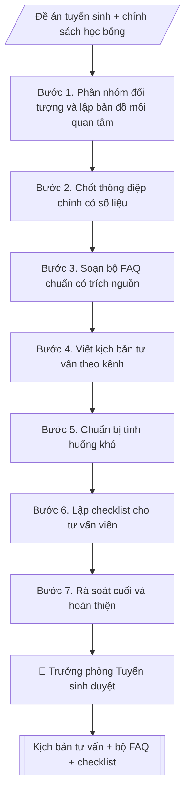

# Skill: Xây dựng kịch bản tư vấn tuyển sinh & hướng nghiệp

## Khi nào dùng
Trước mỗi chiến dịch/mùa tuyển sinh, khi Phòng Tuyển sinh (hoặc Phòng Truyền thông và Tuyển sinh)
cần chuẩn bị kịch bản cho đội ngũ tư vấn: ngày hội tư vấn, livestream, tư vấn tại trường THPT,
trực hotline, trả lời fanpage.

## Đầu vào (Input)

| Trường | Mô tả | Bắt buộc |
|---|---|---|
| `doi_tuong` | Học sinh lớp 12 / Phụ huynh / Cả hai | Có |
| `kenh_tu_van` | Trực tiếp / Livestream / Hotline / Fanpage | Có |
| `nganh_noi_bat` | Các ngành cần đẩy mạnh tư vấn | Không |
| `chinh_sach` | Học bổng, học phí, ký túc xá, việc làm sau tốt nghiệp (số liệu chính thức) | Có |
| `cau_hoi_thuong_gap` | Danh sách FAQ cần chuẩn hóa câu trả lời | Không |

## Quy trình

**Bước 1. Phân nhóm đối tượng và lập bản đồ mối quan tâm**
- Làm gì: từ `doi_tuong`, tách nhóm học sinh (quan tâm: ngành học, việc làm, môi trường học tập) và phụ huynh (quan tâm: học phí, uy tín, an toàn, ký túc xá); với từng nhóm liệt kê 5–7 mối quan tâm chính theo thứ tự ưu tiên; ghi nhận khác biệt theo `kenh_tu_van` (trực tiếp/livestream/hotline/fanpage).
- Dùng input: `doi_tuong`, `kenh_tu_van`.
- Vai trò: Chuyên viên Phòng Truyền thông – Tuyển sinh · AI hỗ trợ: xử lý sơ bộ, tổng hợp · ⏱ ~30–60 phút (ước tính)
- Lưu ý nghiệp vụ: cùng một câu hỏi nhưng cách trả lời cho học sinh và phụ huynh khác nhau (học sinh cần cảm hứng, phụ huynh cần số liệu chắc chắn).
- → Kết quả bước: Bản đồ mối quan tâm theo nhóm đối tượng.

**Bước 2. Chốt thông điệp chính có số liệu**
- Làm gì: từ `chinh_sach`, chọn 3–5 điểm nổi bật nhất của trường/ngành (`nganh_noi_bat`); mỗi điểm gắn 1 số liệu chính thức (học bổng, học phí, KTX, tỷ lệ việc làm); đối chiếu từng số liệu với văn bản đã công bố (quyết định học bổng, đề án tuyển sinh).
- Dùng input: `chinh_sach`, `nganh_noi_bat`.
- Vai trò: Trưởng phòng Truyền thông – Tuyển sinh · AI hỗ trợ: đối chiếu tự động, cảnh báo sai lệch · ⏱ ~1–2 giờ (ước tính)
- Lưu ý nghiệp vụ: tuyệt đối không bịa số liệu; số liệu nào chưa có văn bản công bố thì loại khỏi thông điệp.
- → Kết quả bước: Bộ thông điệp chính (3–5 điểm, mỗi điểm kèm số liệu + nguồn văn bản).

**Bước 3. Soạn bộ FAQ chuẩn có trích nguồn**
- Làm gì: từ `cau_hoi_thuong_gap`, với mỗi câu hỏi viết câu trả lời chuẩn ngắn gọn, có số liệu, ghi nguồn văn bản (tên văn bản + số quyết định nếu có); bổ sung câu hỏi còn thiếu cho đủ các nhóm: điểm chuẩn, học phí, học bổng, KTX, việc làm.
- Dùng input: `cau_hoi_thuong_gap`, `chinh_sach`.
- Vai trò: Chuyên viên Phòng Truyền thông – Tuyển sinh · AI hỗ trợ: soạn dự thảo · ⏱ ~30–60 phút (ước tính)
- Lưu ý nghiệp vụ: câu trả lời về điểm chuẩn năm trước phải ghi rõ phương thức xét tuyển đi kèm; không hứa hẹn điểm chuẩn năm nay.
- → Kết quả bước: Bộ FAQ chuẩn (câu hỏi → câu trả lời → nguồn văn bản).

**Bước 4. Viết kịch bản tư vấn theo kênh**
- Làm gì: theo `kenh_tu_van`, viết kịch bản 5 pha: mở đầu (câu chào + câu hỏi mở) → khai thác nhu cầu (3–5 câu hỏi gợi mở) → tư vấn (gắn thông điệp Bước 2 + FAQ Bước 3) → xử lý từ chối (kỹ thuật đồng cảm + số liệu) → chốt hành động (đăng ký tư vấn sâu / tham quan trường / theo dõi fanpage); viết riêng phiên bản cho học sinh và phụ huynh.
- Dùng input: `kenh_tu_van` + bản đồ mối quan tâm (Bước 1) + thông điệp (Bước 2) + FAQ (Bước 3).
- Vai trò: Chuyên viên Phòng Truyền thông – Tuyển sinh · AI hỗ trợ: soạn dự thảo · ⏱ ~30–60 phút (ước tính)
- Lưu ý nghiệp vụ: kịch bản livestream cần thêm phần tương tác bình luận; kịch bản hotline cần câu hỏi xác nhận thông tin liên hệ để chăm sóc tiếp.
- → Kết quả bước: Kịch bản tư vấn theo kênh (đủ 5 pha, 2 phiên bản đối tượng).

**Bước 5. Chuẩn bị tình huống khó**
- Làm gì: liệt kê 5–8 tình huống nhạy cảm (điểm chuẩn cao, học phí tăng, tin đồn tiêu cực, so sánh với trường khác, "điểm em thấp có đỗ không"...); mỗi tình huống viết cách trả lời mẫu theo nguyên tắc: trung thực – không né tránh – không hứa hẹn quá mức – không hạ thấp trường khác.
- Dùng input: bộ FAQ (Bước 3) + `chinh_sach`.
- Vai trò: Chuyên viên Phòng Truyền thông – Tuyển sinh · AI hỗ trợ: soạn dự thảo · ⏱ ~30–90 phút (ước tính)
- Lưu ý nghiệp vụ: câu "điểm em thấp có đỗ không" → không hứa hẹn trúng tuyển, chỉ hướng dẫn phương thức phù hợp và ngưỡng năm trước để tham khảo.
- → Kết quả bước: Bộ tình huống khó kèm cách xử lý mẫu.

**Bước 6. Lập checklist cho tư vấn viên**
- Làm gì: liệt kê tài liệu mang theo (tờ rơi, mã QR), kiến thức bắt buộc nắm (đề án tuyển sinh, học phí, học bổng, KTX), và bài kiểm tra nhanh 10 câu trước chiến dịch; quy định "3 không": không hứa hẹn trúng tuyển, không bịa số liệu, không hạ thấp trường khác.
- Dùng input: kịch bản (Bước 4) + FAQ (Bước 3).
- Vai trò: Chuyên viên Phòng Truyền thông – Tuyển sinh · AI hỗ trợ: đối chiếu tự động, cảnh báo sai lệch · ⏱ ~30–60 phút (ước tính)
- Lưu ý nghiệp vụ: tư vấn viên chưa qua kiểm tra nhanh thì không được trực tiếp tư vấn.
- → Kết quả bước: Checklist tư vấn viên + bài kiểm tra nhanh.

**Bước 7. Rà soát cuối và hoàn thiện**
- Làm gì: đối chiếu mọi số liệu trong kịch bản + FAQ với đề án tuyển sinh năm hiện hành đã công bố; kiểm tra ngôn ngữ phù hợp từng đối tượng; đóng gói thành tài liệu nội bộ hoàn chỉnh.
- Dùng input: toàn bộ bán thành phẩm Bước 2–6 + `chinh_sach`.
- Vai trò: Chuyên viên Phòng Truyền thông – Tuyển sinh · AI hỗ trợ: đối chiếu tự động, cảnh báo sai lệch · ⏱ ~1–2 giờ (ước tính)
- Lưu ý nghiệp vụ: chỉ một con số sai (học phí, điểm chuẩn) cũng đủ gây khiếu nại; người rà soát cuối nên khác người soạn.
- → Kết quả bước: Kịch bản tư vấn hoàn chỉnh (sẵn sàng trình duyệt và tập huấn).

## Luồng quy trình (Workflow)



## Đầu ra (Output)
- Kịch bản tư vấn hoàn chỉnh theo đối tượng và kênh (markdown).
- Bộ FAQ có câu trả lời chuẩn + checklist cho tư vấn viên.

**Cấu trúc output chuẩn** (khung mẫu cố định của sản phẩm chính — Kịch bản tư vấn):
1. Tiêu đề (tên kịch bản + kênh tư vấn + đối tượng; ghi rõ "tài liệu nội bộ").
2. Thông điệp chính (3–5 điểm, mỗi điểm kèm số liệu + nguồn văn bản).
3. Kịch bản theo đối tượng và kênh (5 pha: mở đầu – khai thác nhu cầu – tư vấn – xử lý từ chối – chốt hành động; phiên bản học sinh / phụ huynh).
4. Bộ FAQ chuẩn (câu hỏi → câu trả lời có số liệu → nguồn văn bản).
5. Tình huống khó (tình huống → cách xử lý mẫu theo nguyên tắc trung thực).
6. Checklist tư vấn viên (tài liệu mang theo, kiến thức bắt buộc, bài kiểm tra nhanh, quy tắc "3 không").

## Checklist nghiệm thu

- [ ] Đủ các phần theo "Cấu trúc output chuẩn": Tiêu đề (tên kịch bản + kênh tư vấn + đối…; Thông điệp chính (3; Kịch bản theo đối tượng và kênh (5 pha; Bộ FAQ chuẩn (câu hỏi → câu trả lời có số…; Tình huống khó (tình huống → cách xử lý mẫu…; Checklist tư vấn viên (tài liệu mang theo,…
- [ ] Có đầy đủ sản phẩm: Kịch bản tư vấn hoàn chỉnh theo đối tượng và kênh (markdown)
- [ ] Có đầy đủ sản phẩm: Bộ FAQ có câu trả lời chuẩn + checklist cho tư vấn viên
- [ ] Mọi số liệu, tên, ngày tháng trong output khớp với Input đã cung cấp (không thêm bớt, không suy đoán)
- [ ] Không bịa đặt số liệu, minh chứng, trích dẫn hay căn cứ
- [ ] Đúng thể thức, định dạng văn bản theo quy định hiện hành
- [ ] Căn cứ pháp lý nêu đầy đủ, còn hiệu lực tại thời điểm lập
- [ ] Đã qua Human gate: người có thẩm quyền đã kiểm tra/ký duyệt trước khi phát hành
- [ ] Cùng một câu hỏi nhưng cách trả lời cho học sinh và phụ huynh khác nhau (học sinh cần cảm hứng, phụ huynh cần số liệu chắc chắn).
- [ ] Tuyệt đối không bịa số liệu

> Tiêu chí đạt: tất cả các ô đều được đánh dấu.

## Ví dụ mô phỏng (dữ liệu giả lập)

> Tất cả tên trường, cá nhân, số liệu dưới đây đều là **giả lập**, không liên quan tổ chức/cá nhân có thật.

### Input mẫu

| Trường | Giá trị |
|---|---|
| `doi_tuong` | Học sinh lớp 12 và phụ huynh |
| `kenh_tu_van` | Ngày hội tư vấn trực tiếp |
| `nganh_noi_bat` | Công nghệ thông tin, Kế toán |
| `chinh_sach` | Học bổng tân sinh viên: 50 suất 100% học phí năm nhất; học phí 2027: 18 triệu đồng/năm (khối kinh tế), 22 triệu đồng/năm (khối kỹ thuật); KTX 350 nghìn đồng/tháng; 92% sinh viên có việc làm sau 12 tháng (khảo sát 2026) |
| `cau_hoi_thuong_gap` | Điểm chuẩn năm trước? Học phí có tăng không? KTX có đủ chỗ không? Ra trường làm gì? |

### Output mẫu

```
KỊCH BẢN TƯ VẤN TUYỂN SINH – NGÀY HỘI TRỰC TIẾP
Trường Đại học A (tài liệu nội bộ – dữ liệu giả lập)

I. THÔNG ĐIỆP CHÍNH (3 điểm)
1. Đào tạo ứng dụng, gắn với doanh nghiệp – 92% sinh viên có việc làm sau 12 tháng
   tốt nghiệp (khảo sát năm 2026).
2. Học bổng tân sinh viên: 50 suất miễn 100% học phí năm nhất.
3. Ký túc xá hiện đại, 350 nghìn đồng/tháng, ngay trong khuôn viên trường.

II. KỊCH BẢN THEO ĐỐI TƯỢNG
A. Với học sinh lớp 12:
1. Mở đầu: "Em đang quan tâm ngành nào nhất?"
2. Khai thác: hỏi về sở thích, môn học mạnh, định hướng nghề nghiệp.
3. Tư vấn: giới thiệu 2–3 ngành phù hợp + cơ hội việc làm cụ thể.
4. Chốt: mời đăng ký tư vấn sâu 1-1 / tham quan phòng lab / quét mã theo dõi fanpage.
B. Với phụ huynh:
1. Mở đầu: lắng nghe băn khoăn (học phí, xa nhà, đầu ra).
2. Tư vấn: học phí công khai theo năm (18–22 triệu đồng/năm tùy khối), chính sách
   học bổng, KTX và công tác quản lý sinh viên.
3. Chốt: để lại thông tin nhận tài liệu, mời tham quan trường cùng con.

III. BỘ FAQ CHUẨN
1. Điểm chuẩn năm trước bao nhiêu?
   → Ngành CNTT: 24,5 điểm; Kế toán: 23,0 điểm (phương thức xét điểm thi TN THPT
   năm 2026). Điểm chuẩn năm nay phụ thuộc phổ điểm chung, trường sẽ công bố
   ngưỡng đảm bảo chất lượng theo lịch của Bộ.
2. Học phí có tăng không?
   → Học phí năm 2027 giữ nguyên: 18 triệu đồng/năm (khối kinh tế),
   22 triệu đồng/năm (khối kỹ thuật), theo Quyết định 45/QĐ-ĐHA.
3. KTX có đủ chỗ cho tân sinh viên không?
   → KTX đáp ứng 100% nhu cầu tân sinh viên đăng ký sớm, 350 nghìn đồng/tháng.
4. Ra trường làm gì?
   → 92% sinh viên có việc làm sau 12 tháng (khảo sát 2026); đối tác tuyển dụng
   gồm 120 doanh nghiệp trong mạng lưới của trường.

IV. TÌNH HUỐNG KHÓ
- "Nghe nói trường X tốt hơn?": không so sánh hạ thấp trường khác; tập trung vào
  điểm mạnh và số liệu thực tế của trường mình.
- "Điểm em thấp có đỗ không?": không hứa hẹn trúng tuyển; hướng dẫn các phương thức
  xét tuyển phù hợp và ngưỡng năm trước để tham khảo.

V. CHECKLIST TƯ VẤN VIÊN
- [ ] Nắm vững đề án tuyển sinh 2027, học phí, học bổng, KTX
- [ ] Mang tờ rơi, mã QR đăng ký tư vấn sâu
- [ ] Tuyệt đối không hứa hẹn trúng tuyển, không bịa số liệu
```

## Human gate (người kiểm duyệt)
- Trưởng phòng Tuyển sinh (hoặc Phòng Truyền thông và Tuyển sinh) duyệt toàn bộ nội dung,
  đặc biệt là số liệu học phí, học bổng, điểm chuẩn, tỷ lệ việc làm.
- Tư vấn viên phải được tập huấn và kiểm tra nhanh trước khi tham gia tư vấn.

## Giới hạn (guardrails)
- AI không bịa điểm chuẩn, tỷ lệ việc làm, mức học bổng — mọi số liệu phải theo văn bản đã công bố.
- AI không hứa hẹn trúng tuyển dưới bất kỳ hình thức nào.
- AI không so sánh hạ thấp trường khác; không tư vấn ngoài phạm vi đề án tuyển sinh.

## Căn cứ & lưu ý
- Đề án tuyển sinh năm hiện hành của trường.
- Quy chế tuyển sinh của Bộ Giáo dục và Đào tạo.
- Không dùng tên thật của trường/cá nhân khi mô phỏng.
