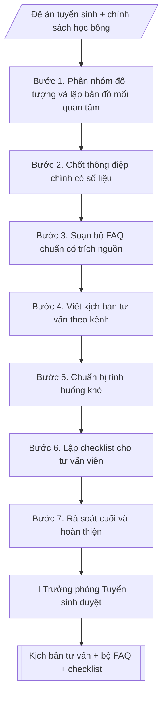

# Xây dựng kịch bản tư vấn tuyển sinh & hướng nghiệp

## Định dạng và file đầu ra

Định dạng đầu ra có thể chọn theo sản phẩm/yêu cầu: .docx, .pdf, .txt, .md, .html. Đọc mục “Định dạng bổ sung” trong quy cách đầu ra trước khi chọn.

**Phải tạo file thực tế để tải xuống, không chỉ trả nội dung trong chat.** Định dạng mặc định của skill: **.docx**. Nếu có bảng số liệu nghiệp vụ yêu cầu file bảng tính riêng, tạo thêm Excel theo yêu cầu; không tự tạo file kiểm tra. Không chờ người dùng yêu cầu xuất file lần nữa. Ưu tiên định dạng người dùng chỉ định; đọc quy tắc xuất file tại references/quy-cach-dau-ra.md.

## Quy cách đầu ra và thông tin thiếu

Đọc [quy cách và cấu trúc sản phẩm](references/quy-cach-dau-ra.md) trước khi soạn/xuất. File giao chỉ gồm văn bản hoặc sản phẩm nghiệp vụ được yêu cầu; kiểm tra nội bộ không xuất kèm. Thiếu thông tin giữ nguyên trường/mục và chỗ điền theo mẫu gốc (dòng dấu chấm, dấu gạch hoặc ô trống); không tự điền dữ liệu mẫu, số 0, mã chờ xác minh hoặc dòng chờ ký. Mẫu chuyên ngành còn áp dụng được ưu tiên về cấu trúc, mã biểu và người ký. Các trường “bắt buộc” là điều kiện hoàn thiện hồ sơ, không ngăn việc soạn bản có chỗ chừa để điền. Mọi chỉ dẫn “để trống” trong skill được hiểu là không điền dữ liệu và giữ cách chừa chỗ của mẫu gốc, không phải xóa dấu chấm của mẫu.

## Kiểm soát áp dụng và phê duyệt

Trước khi chạy quy trình, xác định `ngay_ap_dung`, `loai_hinh_truong`, `quy_che_noi_bo`, `nguon_du_lieu` và `nguoi_kiem_duyet`. Chỉ yêu cầu thông tin có liên quan đến nghiệp vụ; không dùng giá trị giả định thay dữ liệu bắt buộc. Đối chiếu nội bộ hồ sơ có yếu tố pháp lý với văn bản gốc, hiệu lực, điều khoản áp dụng và chuyển tiếp; không tự đính kèm bảng kiểm tra vào file giao.

## Giới hạn và human gate

AI hỗ trợ chuẩn bị và đối chiếu. Cán bộ phụ trách kiểm tra dữ liệu/căn cứ, người có thẩm quyền duyệt và ký. Văn bản soạn chưa được coi là đã ban hành; không tự chèn nhãn trạng thái kiểm duyệt vào file giao; không đánh dấu đã ký, đã duyệt hoặc đã công bố nếu chưa có chứng cứ. Dữ liệu sinh viên, sức khỏe, nhân sự và tài chính phải hạn chế theo mục đích, phân quyền và che thông tin định danh khi dùng ví dụ. Không tải dữ liệu lên dịch vụ ngoài khi chưa có quyền. Kiểm tra Luật 91/2025/QH15 về bảo vệ dữ liệu cá nhân (hiệu lực 01/01/2026) và quy định áp dụng trước xử lý/chia sẻ dữ liệu cá nhân.

## Khi nào dùng
Trước mỗi chiến dịch/mùa tuyển sinh, khi Phòng Tuyển sinh (hoặc Phòng Truyền thông và Tuyển sinh)
cần chuẩn bị kịch bản cho đội ngũ tư vấn: ngày hội tư vấn, livestream, tư vấn tại trường THPT,
trực hotline, trả lời fanpage.

## Đầu vào (Input)

| Trường | Mô tả | Bắt buộc |
|---|---|---|
| `doi_tuong` | Học sinh lớp 12 / Phụ huynh / Cả hai | Có |
| `kenh_tu_van` | Trực tiếp / Livestream / Hotline / Fanpage | Có |
| `nganh_noi_bat` | Các ngành cần đẩy mạnh tư vấn | Không |
| `chinh_sach` | Học bổng, học phí, ký túc xá, việc làm sau tốt nghiệp (số liệu chính thức) | Có |
| `cau_hoi_thuong_gap` | Danh sách FAQ cần chuẩn hóa câu trả lời | Không |

## Quy trình

**Bước 1. Phân nhóm đối tượng và lập bản đồ mối quan tâm**
- Làm gì: từ `doi_tuong`, tách nhóm học sinh (quan tâm: ngành học, việc làm, môi trường học tập) và phụ huynh (quan tâm: học phí, uy tín, an toàn, ký túc xá); với từng nhóm liệt kê 5–7 mối quan tâm chính theo thứ tự ưu tiên; ghi nhận khác biệt theo `kenh_tu_van` (trực tiếp/livestream/hotline/fanpage).
- Dùng input: `doi_tuong`, `kenh_tu_van`.
- Vai trò: Chuyên viên Phòng Truyền thông – Tuyển sinh · AI hỗ trợ: xử lý sơ bộ, tổng hợp · ⏱ ~30–60 phút (ước tính)
- Lưu ý nghiệp vụ: cùng một câu hỏi nhưng cách trả lời cho học sinh và phụ huynh khác nhau (học sinh cần cảm hứng, phụ huynh cần số liệu chắc chắn).
- → Kết quả bước: Bản đồ mối quan tâm theo nhóm đối tượng.

**Bước 2. Chốt thông điệp chính có số liệu**
- Làm gì: từ `chinh_sach`, chọn 3–5 điểm nổi bật nhất của trường/ngành (`nganh_noi_bat`); mỗi điểm gắn 1 số liệu chính thức (học bổng, học phí, KTX, tỷ lệ việc làm); đối chiếu từng số liệu với văn bản đã công bố (quyết định học bổng, đề án tuyển sinh).
- Dùng input: `chinh_sach`, `nganh_noi_bat`.
- Vai trò: Trưởng phòng Truyền thông – Tuyển sinh · AI hỗ trợ: đối chiếu tự động, cảnh báo sai lệch · ⏱ ~1–2 giờ (ước tính)
- Lưu ý nghiệp vụ: tuyệt đối không bịa số liệu; số liệu nào chưa có văn bản công bố thì loại khỏi thông điệp.
- → Kết quả bước: Bộ thông điệp chính (3–5 điểm, mỗi điểm kèm số liệu + nguồn văn bản).

**Bước 3. Soạn bộ FAQ chuẩn có trích nguồn**
- Làm gì: từ `cau_hoi_thuong_gap`, với mỗi câu hỏi viết câu trả lời chuẩn ngắn gọn, có số liệu, ghi nguồn văn bản (tên văn bản + số quyết định nếu có); bổ sung câu hỏi còn thiếu cho đủ các nhóm: điểm chuẩn, học phí, học bổng, KTX, việc làm.
- Dùng input: `cau_hoi_thuong_gap`, `chinh_sach`.
- Vai trò: Chuyên viên Phòng Truyền thông – Tuyển sinh · AI hỗ trợ: soạn dự thảo · ⏱ ~30–60 phút (ước tính)
- Lưu ý nghiệp vụ: câu trả lời về điểm chuẩn năm trước phải ghi rõ phương thức xét tuyển đi kèm; không hứa hẹn điểm chuẩn năm nay.
- → Kết quả bước: Bộ FAQ chuẩn (câu hỏi → câu trả lời → nguồn văn bản).

**Bước 4. Viết kịch bản tư vấn theo kênh**
- Làm gì: theo `kenh_tu_van`, viết kịch bản 5 pha: mở đầu (câu chào + câu hỏi mở) → khai thác nhu cầu (3–5 câu hỏi gợi mở) → tư vấn (gắn thông điệp Bước 2 + FAQ Bước 3) → xử lý từ chối (kỹ thuật đồng cảm + số liệu) → chốt hành động (đăng ký tư vấn sâu / tham quan trường / theo dõi fanpage); viết riêng phiên bản cho học sinh và phụ huynh.
- Dùng input: `kenh_tu_van` + bản đồ mối quan tâm (Bước 1) + thông điệp (Bước 2) + FAQ (Bước 3).
- Vai trò: Chuyên viên Phòng Truyền thông – Tuyển sinh · AI hỗ trợ: soạn dự thảo · ⏱ ~30–60 phút (ước tính)
- Lưu ý nghiệp vụ: kịch bản livestream cần thêm phần tương tác bình luận; kịch bản hotline cần câu hỏi xác nhận thông tin liên hệ để chăm sóc tiếp.
- → Kết quả bước: Kịch bản tư vấn theo kênh (đủ 5 pha, 2 phiên bản đối tượng).

**Bước 5. Chuẩn bị tình huống khó**
- Làm gì: liệt kê 5–8 tình huống nhạy cảm (điểm chuẩn cao, học phí tăng, tin đồn tiêu cực, so sánh với trường khác, "điểm em thấp có đỗ không"...); mỗi tình huống viết cách trả lời mẫu theo nguyên tắc: trung thực – không né tránh – không hứa hẹn quá mức – không hạ thấp trường khác.
- Dùng input: bộ FAQ (Bước 3) + `chinh_sach`.
- Vai trò: Chuyên viên Phòng Truyền thông – Tuyển sinh · AI hỗ trợ: soạn dự thảo · ⏱ ~30–90 phút (ước tính)
- Lưu ý nghiệp vụ: câu "điểm em thấp có đỗ không" → không hứa hẹn trúng tuyển, chỉ hướng dẫn phương thức phù hợp và ngưỡng năm trước để tham khảo.
- → Kết quả bước: Bộ tình huống khó kèm cách xử lý mẫu.

**Bước 6. Lập checklist cho tư vấn viên**
- Làm gì: liệt kê tài liệu mang theo (tờ rơi, mã QR), kiến thức bắt buộc nắm (đề án tuyển sinh, học phí, học bổng, KTX), và bài kiểm tra nhanh 10 câu trước chiến dịch; quy định "3 không": không hứa hẹn trúng tuyển, không bịa số liệu, không hạ thấp trường khác.
- Dùng input: kịch bản (Bước 4) + FAQ (Bước 3).
- Vai trò: Chuyên viên Phòng Truyền thông – Tuyển sinh · AI hỗ trợ: đối chiếu tự động, cảnh báo sai lệch · ⏱ ~30–60 phút (ước tính)
- Lưu ý nghiệp vụ: tư vấn viên chưa qua kiểm tra nhanh thì không được trực tiếp tư vấn.
- → Kết quả bước: Checklist tư vấn viên + bài kiểm tra nhanh.

**Bước 7. Rà soát cuối và hoàn thiện**
- Làm gì: đối chiếu mọi số liệu trong kịch bản + FAQ với đề án tuyển sinh năm hiện hành đã công bố; kiểm tra ngôn ngữ phù hợp từng đối tượng; đóng gói thành tài liệu nội bộ hoàn chỉnh.
- Dùng input: toàn bộ bán thành phẩm Bước 2–6 + `chinh_sach`.
- Vai trò: Chuyên viên Phòng Truyền thông – Tuyển sinh · AI hỗ trợ: đối chiếu tự động, cảnh báo sai lệch · ⏱ ~1–2 giờ (ước tính)
- Lưu ý nghiệp vụ: chỉ một con số sai (học phí, điểm chuẩn) cũng đủ gây khiếu nại; người rà soát cuối nên khác người soạn.
- → Kết quả bước: Kịch bản tư vấn hoàn chỉnh (sẵn sàng trình duyệt và tập huấn).

## Luồng quy trình (Workflow)

## Đầu ra

File nghiệp vụ thực tế theo định dạng mặc định ở đầu skill hoặc định dạng người dùng yêu cầu, kèm liên kết tải trong phản hồi cuối.

Sản phẩm nghiệp vụ hoàn chỉnh theo [quy cách và cấu trúc](references/quy-cach-dau-ra.md), giữ các trường chưa có dữ liệu ở trạng thái trống. Không xuất kèm checklist/phụ lục kiểm tra đầu ra.

## Kiểm tra nội bộ trước khi giao

- [ ] Bố cục khớp mẫu áp dụng và cấu trúc tại references/quy-cach-dau-ra.md.
- [ ] Có đầy đủ sản phẩm: Kịch bản tư vấn hoàn chỉnh theo đối tượng và kênh (markdown)
- [ ] Có đầy đủ sản phẩm: Bộ FAQ có câu trả lời chuẩn + checklist cho tư vấn viên
- [ ] Mọi số liệu, tên, ngày tháng trong output khớp với Input đã cung cấp (không thêm bớt, không suy đoán)
- [ ] Không bịa đặt số liệu, minh chứng, trích dẫn hay căn cứ
- [ ] Đúng thể thức, định dạng văn bản theo quy định hiện hành
- [ ] Căn cứ pháp lý nêu đầy đủ, còn hiệu lực tại thời điểm lập
- [ ] Đã qua Human gate: người có thẩm quyền đã kiểm tra/ký duyệt trước khi phát hành
- [ ] Cùng một câu hỏi nhưng cách trả lời cho học sinh và phụ huynh khác nhau (học sinh cần cảm hứng, phụ huynh cần số liệu chắc chắn).
- [ ] Tuyệt đối không bịa số liệu

> Tiêu chí đạt: tất cả các ô đều được đánh dấu.

## Human gate (người kiểm duyệt)
- Trưởng phòng Tuyển sinh (hoặc Phòng Truyền thông và Tuyển sinh) duyệt toàn bộ nội dung,
  đặc biệt là số liệu học phí, học bổng, điểm chuẩn, tỷ lệ việc làm.
- Tư vấn viên phải được tập huấn và kiểm tra nhanh trước khi tham gia tư vấn.

## Giới hạn (guardrails)
- AI không bịa điểm chuẩn, tỷ lệ việc làm, mức học bổng — mọi số liệu phải theo văn bản đã công bố.
- AI không hứa hẹn trúng tuyển dưới bất kỳ hình thức nào.
- AI không so sánh hạ thấp trường khác; không tư vấn ngoài phạm vi đề án tuyển sinh.

## Căn cứ & lưu ý
- Đề án tuyển sinh năm hiện hành của trường.
- Quy chế tuyển sinh của Bộ Giáo dục và Đào tạo.
- Không dùng tên thật của trường/cá nhân khi mô phỏng.

## Quản trị phiên bản

- Phiên bản gói: `1.3.1`; ngày cập nhật: `2026-10-10`.
- Kho nguồn: https://github.com/phamtruong91/university-skills-framework
- Người duy trì trên GitHub: `phamtruong91` (Phạm Văn Trường). Người phê duyệt nghiệp vụ: **chưa chỉ định**.
- Commit nguồn trước cập nhật: `346719e6b0318ed034b4b016703f79733aa575e7`. Commit chứa phiên bản này xem bằng `git log -1 -- skills/kich-ban-tu-van-tuyen-sinh`; không tự gán SHA chưa tạo.
- Giấy phép: theo LICENSE của kho; bản quyền CES Global.
- Lịch sử 1.1.0: bổ sung metadata giao diện, kiểm soát áp dụng, quản trị phiên bản.
- Trạng thái: dự thảo nghiệp vụ; kiểm tra pháp lý trước thực thi. Ngày cập nhật không đồng nghĩa mọi văn bản đã được rà soát toàn văn.
