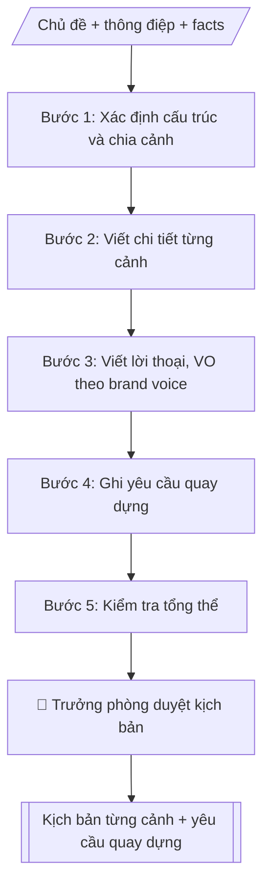

# Kịch bản video truyền thông

## Định dạng và file đầu ra

Định dạng đầu ra có thể chọn theo sản phẩm/yêu cầu: .docx, .pdf, .txt, .md, .html. Đọc mục “Định dạng bổ sung” trong quy cách đầu ra trước khi chọn.

**Phải tạo file thực tế để tải xuống, không chỉ trả nội dung trong chat.** Định dạng mặc định của skill: **.docx**. Nếu có bảng số liệu nghiệp vụ yêu cầu file bảng tính riêng, tạo thêm Excel theo yêu cầu; không tự tạo file kiểm tra. Không chờ người dùng yêu cầu xuất file lần nữa. Ưu tiên định dạng người dùng chỉ định; đọc quy tắc xuất file tại references/quy-cach-dau-ra.md.

## Quy cách đầu ra và thông tin thiếu
Đọc [quy cách và cấu trúc sản phẩm](references/quy-cach-dau-ra.md) trước khi soạn/xuất. File giao chỉ gồm sản phẩm nghiệp vụ được yêu cầu; kiểm tra nội bộ không xuất kèm. Thiếu thông tin thì giữ nguyên trường/mục và chỗ điền theo mẫu gốc (dòng dấu chấm, dấu gạch hoặc ô trống); không tự điền dữ liệu mẫu, số 0, mã chờ xác minh hay dòng chờ ký. Mẫu chuyên ngành còn áp dụng được ưu tiên về cấu trúc, mã biểu và người ký. Bản đầy đủ: [quy tắc chung](references/quy-tac-chung.md).

## Kiểm soát áp dụng và phê duyệt
Trước khi chạy, xác định `ngay_ap_dung`, `loai_hinh_truong`, `quy_che_noi_bo`, `nguon_du_lieu`, `nguoi_kiem_duyet`; chỉ hỏi thông tin liên quan nghiệp vụ, không dùng giá trị giả định thay dữ liệu bắt buộc. Đối chiếu căn cứ pháp lý với văn bản gốc, hiệu lực, điều khoản áp dụng và chuyển tiếp. Bản đầy đủ: [quy tắc chung](references/quy-tac-chung.md).

## Giới hạn và human gate
AI hỗ trợ chuẩn bị và đối chiếu; cán bộ phụ trách kiểm tra dữ liệu/căn cứ, người có thẩm quyền duyệt và ký. Không đánh dấu đã ký, đã duyệt, đã công bố khi chưa có chứng cứ. Dữ liệu sinh viên, sức khỏe, nhân sự, tài chính chỉ dùng theo mục đích và phân quyền, che thông tin định danh khi dùng ví dụ (Luật 91/2025/QH15, hiệu lực 01/01/2026); không tải dữ liệu lên dịch vụ ngoài khi chưa có quyền. Bản đầy đủ: [quy tắc chung](references/quy-tac-chung.md).

## Khi nào dùng
Khi cần kịch bản video: giới thiệu trường/ngành, quảng bá tuyển sinh, recap sự kiện,
phỏng vấn, viral ngắn cho TikTok/Reels.

## Đầu vào (Input)

| Trường | Mô tả | Bắt buộc |
|---|---|---|
| `chu_de` | Chủ đề video | Có |
| `dinh_dang` | TVC 60–90s / viral 30–60s / phóng sự 3–5 phút / recap | Có |
| `kenh` | TikTok / YouTube / fanpage (quyết định tỉ lệ khung hình) | Có |
| `thong_diep` | Thông điệp chính cần truyền tải | Có |
| `nhan_vat` | Nhân vật xuất hiện (sinh viên, giảng viên, cựu SV...) | Không |
| `dia_diem` | Bối cảnh quay (giảng đường, lab, ký túc xá...) | Không |
| `facts` | Số liệu, thông tin bắt buộc phải xuất hiện | Không |

## Quy trình

**Bước 1. Xác định cấu trúc và chia cảnh**
- Làm gì: chọn cấu trúc theo định dạng: hook 3 giây đầu (viral) → thân → CTA cuối; chia số cảnh phù hợp tổng thời lượng; mỗi cảnh dự kiến: STT, thời lượng, ý chính.
- Dùng input: `chu_de`, `dinh_dang`, `kenh` (quyết định tỉ lệ khung hình), `thong_diep`.
- Vai trò: Chuyên viên Phòng Truyền thông – Tuyển sinh · AI hỗ trợ: xử lý sơ bộ, tổng hợp · ⏱ ~30–60 phút (ước tính)
- Lưu ý nghiệp vụ: tổng thời lượng các cảnh phải khớp định dạng (viral 30–60s, TVC 60–90s, phóng sự 3–5 phút); hook 3 giây đầu quyết định người xem có ở lại không.
- → Kết quả bước: Khung cảnh (số cảnh, thời lượng, ý chính từng cảnh).

**Bước 2. Viết chi tiết từng cảnh**
- Làm gì: với từng cảnh, mô tả cụ thể 5 yếu tố: hình ảnh (khung hình, góc quay, nhân vật, bối cảnh), lời thoại/voice-over, âm thanh/nhạc, chữ trên màn hình, thời lượng chính xác.
- Dùng input: `nhan_vat`, `dia_diem`, `facts` (số liệu bắt buộc phải xuất hiện), `thong_diep`.
- Vai trò: Chuyên viên Phòng Truyền thông – Tuyển sinh · AI hỗ trợ: soạn dự thảo · ⏱ ~30–60 phút (ước tính)
- Lưu ý nghiệp vụ: số liệu phải có nguồn, không bịa; lời thoại không gây hiểu lầm về cam kết (VD: "đảm bảo việc làm"); mỗi cảnh chỉ truyền tải một ý chính.
- → Kết quả bước: Bảng kịch bản chi tiết từng cảnh.

**Bước 3. Viết lời thoại, voice-over theo brand voice**
- Làm gì: hoàn thiện toàn bộ lời thoại nhân vật và voice-over theo brand voice trẻ trung, học thuật; kiểm tra độ dài đọc khớp thời lượng từng cảnh (mỗi câu VO đọc trong ~5 giây).
- Dùng input: `thong_diep`.
- Vai trò: Chuyên viên Phòng Truyền thông – Tuyển sinh · AI hỗ trợ: soạn dự thảo, đối chiếu tự động, cảnh báo sai lệch · ⏱ ~30–60 phút (ước tính)
- Lưu ý nghiệp vụ: đọc thử ước lượng thời gian; câu dài quá thời lượng cảnh thì cắt gọn, không nói nhanh.
- → Kết quả bước: Lời thoại/VO hoàn chỉnh, khớp thời lượng từng cảnh.

**Bước 4. Ghi yêu cầu quay dựng**
- Làm gì: tổng hợp yêu cầu kỹ thuật: tỉ lệ khung hình theo kênh, phong cách màu, nhạc nền, phụ đề, định dạng file xuất.
- Dùng input: `kenh`, `dinh_dang`.
- Vai trò: Chuyên viên Phòng Truyền thông – Tuyển sinh · AI hỗ trợ: tổng hợp, chuẩn hóa dữ liệu, lập bảng biểu, định dạng · ⏱ ~30–60 phút (ước tính)
- Lưu ý nghiệp vụ: nhạc và hình ảnh sử dụng phải rõ bản quyền; quay hình sinh viên phải được người xuất hiện đồng ý.
- → Kết quả bước: Danh sách yêu cầu quay dựng.

**Bước 5. Kiểm tra tổng thể**
- Làm gì: kiểm tra 4 điểm: facts có nguồn, tổng thời lượng khớp định dạng, CTA rõ ràng, thông điệp xuyên suốt các cảnh; lập checklist facts; phát hiện lỗi thì quay lại bước tương ứng sửa.
- Dùng input: `facts`.
- Vai trò: Chuyên viên Phòng Truyền thông – Tuyển sinh · AI hỗ trợ: đối chiếu tự động, cảnh báo sai lệch · ⏱ ~1–2 giờ (ước tính)
- Lưu ý nghiệp vụ: số liệu trong kịch bản phải được đơn vị sở hữu số liệu xác nhận trước khi bấm máy.
- → Kết quả bước: Kịch bản hoàn chỉnh + checklist facts + yêu cầu quay dựng.

## Luồng quy trình (Workflow)


```

## Đầu ra

File nghiệp vụ thực tế theo định dạng mặc định ở đầu skill hoặc định dạng người dùng yêu cầu, kèm liên kết tải trong phản hồi cuối.

Sản phẩm nghiệp vụ hoàn chỉnh theo [quy cách và cấu trúc](references/quy-cach-dau-ra.md), giữ các trường chưa có dữ liệu ở trạng thái trống. Không xuất kèm checklist/phụ lục kiểm tra đầu ra.

## Kiểm tra nội bộ trước khi giao

- [ ] Bố cục khớp mẫu áp dụng và cấu trúc tại references/quy-cach-dau-ra.md.
- [ ] Có đầy đủ sản phẩm: Kịch bản chi tiết từng cảnh (dạng bảng)
- [ ] Có đầy đủ sản phẩm: Danh sách yêu cầu quay dựng + checklist facts
- [ ] Mọi số liệu, tên, ngày tháng trong output khớp với Input đã cung cấp (không thêm bớt, không suy đoán)
- [ ] Không bịa đặt số liệu, minh chứng, trích dẫn hay căn cứ
- [ ] Đúng thể thức, định dạng văn bản theo quy định hiện hành
- [ ] Căn cứ pháp lý nêu đầy đủ, còn hiệu lực tại thời điểm lập
- [ ] Đã qua Human gate: người có thẩm quyền đã kiểm tra/ký duyệt trước khi phát hành
- [ ] Tổng thời lượng các cảnh phải khớp định dạng (viral 30–60s, TVC 60–90s, phóng sự 3–5 phút)
- [ ] Số liệu phải có nguồn, không bịa

> Tiêu chí đạt: tất cả các ô đều được đánh dấu.

## Human gate (người kiểm duyệt)
- Trưởng phòng duyệt kịch bản trước khi bấm máy.
- Số liệu trong kịch bản phải được đơn vị sở hữu số liệu xác nhận.

## Giới hạn (guardrails)
- Không dùng hình ảnh, âm thanh không rõ bản quyền.
- Không bịa số liệu, thành tích.
- Không quay hình sinh viên khi chưa được đồng ý.
- Không đưa lời thoại gây hiểu lầm về cam kết (VD: "đảm bảo việc làm").

## Căn cứ & lưu ý
- Brand voice: trẻ trung, học thuật.
- Không dùng tên thật của trường/cá nhân khi mô phỏng.

## Quản trị phiên bản
- Phiên bản gói `1.3.2` (cập nhật 2026-10-10); hồ sơ đầy đủ tại [references/version.json](references/version.json).
- Người phê duyệt nghiệp vụ: **chưa chỉ định**. Trạng thái: dự thảo nghiệp vụ; kiểm tra pháp lý trước thực thi. Ngày cập nhật không đồng nghĩa mọi văn bản đã được rà soát toàn văn.
- Giấy phép theo LICENSE của kho (bản quyền CES Global). Lịch sử thay đổi: CHANGELOG.md.
