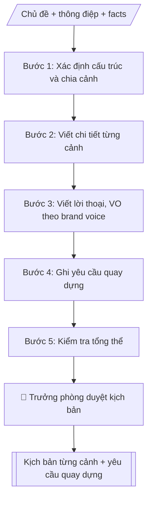

# Kịch bản video truyền thông

## Kiểm soát áp dụng và phê duyệt

Trước khi chạy quy trình, xác định `ngay_ap_dung`, `loai_hinh_truong`, `quy_che_noi_bo`, `nguon_du_lieu` và `nguoi_kiem_duyet`. Chỉ yêu cầu thông tin có liên quan đến nghiệp vụ; không dùng giá trị giả định thay dữ liệu bắt buộc. Hồ sơ có yếu tố pháp lý phải kèm văn bản gốc, tình trạng hiệu lực, điều khoản áp dụng và chuyển tiếp.

## Giới hạn và human gate

AI hỗ trợ chuẩn bị và đối chiếu. Cán bộ phụ trách kiểm tra dữ liệu/căn cứ, người có thẩm quyền duyệt và ký. Mọi đầu ra mặc định là **DỰ THẢO – CHỜ KIỂM DUYỆT**; không đánh dấu đã ký, đã duyệt hoặc đã công bố nếu chưa có chứng cứ. Dữ liệu sinh viên, sức khỏe, nhân sự và tài chính phải hạn chế theo mục đích, phân quyền và che thông tin định danh khi dùng ví dụ. Không tải dữ liệu lên dịch vụ ngoài khi chưa có quyền. Kiểm tra Luật 91/2025/QH15 về bảo vệ dữ liệu cá nhân (hiệu lực 01/01/2026) và quy định áp dụng trước xử lý/chia sẻ dữ liệu cá nhân.


## Khi nào dùng
Khi cần kịch bản video: giới thiệu trường/ngành, quảng bá tuyển sinh, recap sự kiện,
phỏng vấn, viral ngắn cho TikTok/Reels.

## Đầu vào (Input)

| Trường | Mô tả | Bắt buộc |
|---|---|---|
| `chu_de` | Chủ đề video | Có |
| `dinh_dang` | TVC 60–90s / viral 30–60s / phóng sự 3–5 phút / recap | Có |
| `kenh` | TikTok / YouTube / fanpage (quyết định tỉ lệ khung hình) | Có |
| `thong_diep` | Thông điệp chính cần truyền tải | Có |
| `nhan_vat` | Nhân vật xuất hiện (sinh viên, giảng viên, cựu SV...) | Không |
| `dia_diem` | Bối cảnh quay (giảng đường, lab, ký túc xá...) | Không |
| `facts` | Số liệu, thông tin bắt buộc phải xuất hiện | Không |

## Quy trình

**Bước 1. Xác định cấu trúc và chia cảnh**
- Làm gì: chọn cấu trúc theo định dạng: hook 3 giây đầu (viral) → thân → CTA cuối; chia số cảnh phù hợp tổng thời lượng; mỗi cảnh dự kiến: STT, thời lượng, ý chính.
- Dùng input: `chu_de`, `dinh_dang`, `kenh` (quyết định tỉ lệ khung hình), `thong_diep`.
- Vai trò: Chuyên viên Phòng Truyền thông – Tuyển sinh · AI hỗ trợ: xử lý sơ bộ, tổng hợp · ⏱ ~30–60 phút (ước tính)
- Lưu ý nghiệp vụ: tổng thời lượng các cảnh phải khớp định dạng (viral 30–60s, TVC 60–90s, phóng sự 3–5 phút); hook 3 giây đầu quyết định người xem có ở lại không.
- → Kết quả bước: Khung cảnh (số cảnh, thời lượng, ý chính từng cảnh).

**Bước 2. Viết chi tiết từng cảnh**
- Làm gì: với từng cảnh, mô tả cụ thể 5 yếu tố: hình ảnh (khung hình, góc quay, nhân vật, bối cảnh), lời thoại/voice-over, âm thanh/nhạc, chữ trên màn hình, thời lượng chính xác.
- Dùng input: `nhan_vat`, `dia_diem`, `facts` (số liệu bắt buộc phải xuất hiện), `thong_diep`.
- Vai trò: Chuyên viên Phòng Truyền thông – Tuyển sinh · AI hỗ trợ: soạn dự thảo · ⏱ ~30–60 phút (ước tính)
- Lưu ý nghiệp vụ: số liệu phải có nguồn, không bịa; lời thoại không gây hiểu lầm về cam kết (VD: "đảm bảo việc làm"); mỗi cảnh chỉ truyền tải một ý chính.
- → Kết quả bước: Bảng kịch bản chi tiết từng cảnh.

**Bước 3. Viết lời thoại, voice-over theo brand voice**
- Làm gì: hoàn thiện toàn bộ lời thoại nhân vật và voice-over theo brand voice trẻ trung, học thuật; kiểm tra độ dài đọc khớp thời lượng từng cảnh (mỗi câu VO đọc trong ~5 giây).
- Dùng input: `thong_diep`.
- Vai trò: Chuyên viên Phòng Truyền thông – Tuyển sinh · AI hỗ trợ: soạn dự thảo, đối chiếu tự động, cảnh báo sai lệch · ⏱ ~30–60 phút (ước tính)
- Lưu ý nghiệp vụ: đọc thử ước lượng thời gian; câu dài quá thời lượng cảnh thì cắt gọn, không nói nhanh.
- → Kết quả bước: Lời thoại/VO hoàn chỉnh, khớp thời lượng từng cảnh.

**Bước 4. Ghi yêu cầu quay dựng**
- Làm gì: tổng hợp yêu cầu kỹ thuật: tỉ lệ khung hình theo kênh, phong cách màu, nhạc nền, phụ đề, định dạng file xuất.
- Dùng input: `kenh`, `dinh_dang`.
- Vai trò: Chuyên viên Phòng Truyền thông – Tuyển sinh · AI hỗ trợ: tổng hợp, chuẩn hóa dữ liệu, lập bảng biểu, định dạng · ⏱ ~30–60 phút (ước tính)
- Lưu ý nghiệp vụ: nhạc và hình ảnh sử dụng phải rõ bản quyền; quay hình sinh viên phải được người xuất hiện đồng ý.
- → Kết quả bước: Danh sách yêu cầu quay dựng.

**Bước 5. Kiểm tra tổng thể**
- Làm gì: kiểm tra 4 điểm: facts có nguồn, tổng thời lượng khớp định dạng, CTA rõ ràng, thông điệp xuyên suốt các cảnh; lập checklist facts; phát hiện lỗi thì quay lại bước tương ứng sửa.
- Dùng input: `facts`.
- Vai trò: Chuyên viên Phòng Truyền thông – Tuyển sinh · AI hỗ trợ: đối chiếu tự động, cảnh báo sai lệch · ⏱ ~1–2 giờ (ước tính)
- Lưu ý nghiệp vụ: số liệu trong kịch bản phải được đơn vị sở hữu số liệu xác nhận trước khi bấm máy.
- → Kết quả bước: Kịch bản hoàn chỉnh + checklist facts + yêu cầu quay dựng.

## Luồng quy trình (Workflow)


```

## Đầu ra (Output)
- Kịch bản chi tiết từng cảnh (bảng markdown).
- Danh sách yêu cầu quay dựng + checklist facts.

**Cấu trúc output chuẩn:** Kịch bản video truyền thông gồm các phần bắt buộc theo đúng thứ tự sau:
1. Tiêu đề: "KỊCH BẢN VIDEO — ..." (tên video, thời lượng, tỉ lệ khung hình) + tên trường (+ ghi chú giả lập nếu mô phỏng).
2. Bảng kịch bản từng cảnh với các cột: Cảnh – Thời lượng – Hình ảnh – Lời thoại/VO – Âm thanh/Chữ màn hình.
3. Yêu cầu quay dựng (tỉ lệ khung hình, phong cách màu, nhạc nền, phụ đề).
4. Checklist facts (phần kèm theo).

## Checklist nghiệm thu

- [ ] Đủ các phần theo "Cấu trúc output chuẩn": Tiêu đề; Bảng kịch bản từng cảnh với các cột; Yêu cầu quay dựng (tỉ lệ khung hình, phong…; Checklist facts (phần kèm theo).
- [ ] Có đầy đủ sản phẩm: Kịch bản chi tiết từng cảnh (bảng markdown)
- [ ] Có đầy đủ sản phẩm: Danh sách yêu cầu quay dựng + checklist facts
- [ ] Mọi số liệu, tên, ngày tháng trong output khớp với Input đã cung cấp (không thêm bớt, không suy đoán)
- [ ] Không bịa đặt số liệu, minh chứng, trích dẫn hay căn cứ
- [ ] Đúng thể thức, định dạng văn bản theo quy định hiện hành
- [ ] Căn cứ pháp lý nêu đầy đủ, còn hiệu lực tại thời điểm lập
- [ ] Đã qua Human gate: người có thẩm quyền đã kiểm tra/ký duyệt trước khi phát hành
- [ ] Tổng thời lượng các cảnh phải khớp định dạng (viral 30–60s, TVC 60–90s, phóng sự 3–5 phút)
- [ ] Số liệu phải có nguồn, không bịa

> Tiêu chí đạt: tất cả các ô đều được đánh dấu.

## Ví dụ mô phỏng (dữ liệu giả lập)

> Tất cả tên trường, cá nhân, số liệu dưới đây đều là **giả lập**.

### Input mẫu

| Trường | Giá trị |
|---|---|
| `chu_de` | Giới thiệu ngành Công nghệ thông tin |
| `dinh_dang` | Viral 60s |
| `kenh` | TikTok (9:16) |
| `thong_diep` | Học CNTT tại A: học thật, làm thật từ năm nhất |
| `nhan_vat` | 2 sinh viên năm 2 (nam, nữ) |
| `facts` | 95% SV có việc làm sau 6 tháng tốt nghiệp (giả lập); 40+ doanh nghiệp đối tác (giả lập) |

### Output mẫu

```
KỊCH BẢN VIDEO — "CNTT A: Học thật, làm thật" (60s, 9:16)
Trường Đại học A (dữ liệu giả lập)

| Cảnh | Thời lượng | Hình ảnh | Lời thoại / VO | Âm thanh / Chữ màn hình |
|------|-----------|----------|----------------|------------------------|
| 1 | 0–3s | Cận cảnh tay gõ code, màn hình sáng | (Text) "Năm nhất đã code dự án thật?" | Nhạc nền sôi động, chữ to |
| 2 | 3–15s | SV nam trong lab AI | SV: "Năm nhất ở A, mình đã làm chatbot thật cho thư viện trường." | Nhạc nền, sub phụ đề |
| 3 | 15–30s | SV nữ thuyết trình trước lớp | SV: "Năm 2, nhóm mình thắng hackathon với app điểm danh bằng AI." | Tiếng vỗ tay, sub |
| 4 | 30–50s | Flycam campus, phòng lab | VO: "95% sinh viên CNTT A có việc làm sau 6 tháng tốt nghiệp. 40+ doanh nghiệp đồng hành." | Nhạc dâng cao, chữ số liệu |
| 5 | 50–60s | Logo trường, link đăng ký | VO: "A — nơi tri thức gặp tương lai." | CTA: "Đăng ký tư vấn tại link bio" |

YÊU CẦU QUAY DỰNG: tỉ lệ 9:16, màu tươi sáng, phụ đề đầy đủ, nhạc nền có bản quyền.
```

## Human gate (người kiểm duyệt)
- Trưởng phòng duyệt kịch bản trước khi bấm máy.
- Số liệu trong kịch bản phải được đơn vị sở hữu số liệu xác nhận.

## Giới hạn (guardrails)
- Không dùng hình ảnh, âm thanh không rõ bản quyền.
- Không bịa số liệu, thành tích.
- Không quay hình sinh viên khi chưa được đồng ý.
- Không đưa lời thoại gây hiểu lầm về cam kết (VD: "đảm bảo việc làm").

## Căn cứ & lưu ý
- Brand voice: trẻ trung, học thuật.
- Không dùng tên thật của trường/cá nhân khi mô phỏng.

## Quản trị phiên bản

- Phiên bản gói: `1.1.0`; ngày cập nhật: `2026-10-09`.
- Kho nguồn: https://github.com/phamtruong91/dh-skills
- Người duy trì trên GitHub: `phamtruong91` (Phạm Văn Trường). Người phê duyệt nghiệp vụ: **chưa chỉ định**.
- Commit nguồn trước cập nhật: `78fd1d51b8acd1a724d9b9af6c488460bc7551ad`. Commit chứa phiên bản này xem bằng `git log -1 -- skills/kich-ban-video-truyen-thong`; không tự gán SHA chưa tạo.
- Giấy phép: theo LICENSE của kho; bản quyền CES Global.
- Lịch sử 1.1.0: bổ sung metadata giao diện, kiểm soát áp dụng, quản trị phiên bản.
- Trạng thái: dự thảo nghiệp vụ; kiểm tra pháp lý trước thực thi. Ngày cập nhật không đồng nghĩa mọi văn bản đã được rà soát toàn văn.
