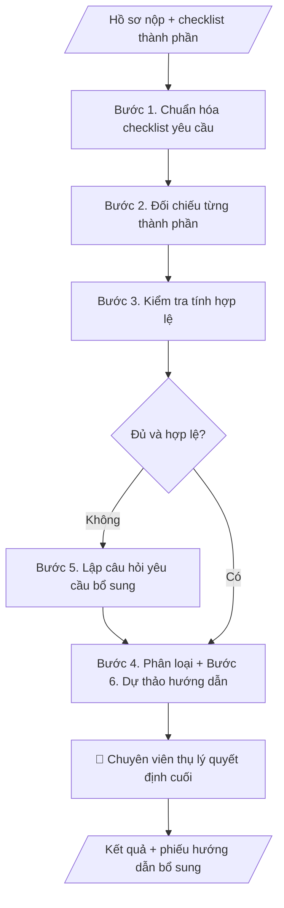

# Skill: Kiểm tra đầy đủ hồ sơ

## Khi nào dùng
Khi tiếp nhận bất kỳ bộ hồ sơ nào cần kiểm tra tính đầy đủ, hợp lệ trước khi trình xử lý:
hồ sơ tuyển dụng, bổ nhiệm, khen thưởng, học bổng, miễn giảm học phí, tốt nghiệp, thanh quyết toán...
Áp dụng cho mọi phòng ban — chỉ cần có checklist danh mục thành phần.

## Đầu vào (Input)

| Trường | Mô tả | Bắt buộc |
|---|---|---|
| `loai_ho_so` | VD: hồ sơ xét học bổng; hồ sơ bổ nhiệm; hồ sơ thanh quyết toán đề tài... | Có |
| `checklist` | Danh mục thành phần bắt buộc + tiêu chí hợp lệ của từng thành phần | Có |
| `ho_so_hien_co` | Liệt kê từng thành phần hiện có (tên file/mục + tình trạng sơ bộ) | Có |
| `tieu_chi_hop_le` | Quy tắc chung: mẫu biểu, thời hạn hiệu lực, chữ ký, công chứng... | Không |

## Quy trình

**Bước 1. Chuẩn hóa checklist yêu cầu**
- Làm gì: với mỗi thành phần trong `checklist`, ghi rõ: tên thành phần, bắt buộc hay không bắt buộc,
  mẫu biểu yêu cầu, điều kiện hợp lệ (chữ ký, dấu, thời hạn hiệu lực), và cách đối chiếu (bản gốc hay bản sao).
- Dùng input: `checklist`, `tieu_chi_hop_le`.
- Vai trò: Chuyên viên thụ lý hồ sơ (đơn vị tiếp nhận hồ sơ) · AI hỗ trợ: chuẩn hóa checklist; chuyên viên xác nhận các thành phần thiếu tiêu chí hợp lệ · ⏱ ~10–20 phút + ~15–30 phút xác nhận (ước tính)
- Lưu ý nghiệp vụ: checklist là "thước đo" của toàn bộ quy trình — checklist mơ hồ thì kết quả đối chiếu
  vô nghĩa; thành phần nào thiếu tiêu chí hợp lệ thì đánh dấu "cần làm rõ" và chuyển chuyên viên xác nhận,
  không tự suy ra.
- → Kết quả bước: checklist chuẩn hóa (mỗi thành phần có tiêu chí kiểm tra cụ thể).

**Bước 2. Đối chiếu từng thành phần**
- Làm gì: so từng thành phần trong `ho_so_hien_co` với checklist chuẩn hóa, đánh dấu: Có / Thiếu /
  Có nhưng cần kiểm tra kỹ; ghi rõ tên file/mục tương ứng của từng thành phần.
- Dùng input: `checklist` (đã chuẩn hóa ở Bước 1), `ho_so_hien_co`.
- Vai trò: Chuyên viên thụ lý hồ sơ (đơn vị tiếp nhận hồ sơ) · AI hỗ trợ: đối chiếu từng thành phần với checklist, đánh dấu Có/Thiếu/Có nhưng cần kiểm tra kỹ · ⏱ ~10–20 phút (ước tính)
- Lưu ý nghiệp vụ: phân biệt "thiếu thành phần" (chưa nộp) với "có nhưng chưa hợp lệ" (nộp rồi nhưng
  sai mẫu/hết hạn) — hai trường hợp này dẫn đến câu hỏi bổ sung khác nhau ở Bước 5.
- → Kết quả bước: bảng đối chiếu sơ bộ (thành phần | trạng thái có/thiếu).

**Bước 3. Kiểm tra tính hợp lệ từng thành phần**
- Làm gì: với mỗi thành phần đã đánh dấu "Có", kiểm tra 4 điểm: đúng mẫu biểu quy định;
  còn thời hạn hiệu lực (VD: giấy xác nhận trong 6 tháng); đủ chữ ký, đóng dấu theo yêu cầu;
  thông tin nhất quán giữa các giấy tờ (họ tên, ngày sinh, mã số...).
- Dùng input: `ho_so_hien_co`, `tieu_chi_hop_le`, `checklist` (đã chuẩn hóa).
- Vai trò: Chuyên viên thụ lý hồ sơ (đơn vị tiếp nhận hồ sơ) · AI hỗ trợ: kiểm tra 4 điểm hợp lệ (mẫu biểu, hiệu lực, chữ ký, nhất quán thông tin) · ⏱ ~15–30 phút (ước tính)
- Lưu ý nghiệp vụ: bẫy thường gặp là giấy tờ "nhìn có vẻ đủ" nhưng đã hết hiệu lực hoặc thiếu xác nhận
  của đơn vị có thẩm quyền; thông tin không khớp giữa các giấy tờ (VD: họ tên viết khác nhau) phải ghi
  cụ thể chỗ khác nhau.
- → Kết quả bước: bảng hợp lệ/không hợp lệ từng thành phần kèm lý do cụ thể.

**Bước 4. Phân loại kết quả tổng thể**
- Làm gì: tổng hợp kết quả Bước 2–3, xếp hồ sơ vào một trong các nhóm: Đủ & hợp lệ / Thiếu thành phần /
  Có thành phần không hợp lệ; đếm số mục cần bổ sung; nêu kết luận tổng thể dự kiến.
- Dùng input: kết quả Bước 2, Bước 3.
- Vai trò: Chuyên viên thụ lý hồ sơ (đơn vị tiếp nhận hồ sơ) · AI hỗ trợ: đề xuất phân loại tổng thể; chuyên viên ra quyết định cuối cùng · ⏱ ~10–15 phút + ~15–30 phút duyệt (ước tính)
- Lưu ý nghiệp vụ: AI chỉ đề xuất phân loại, KHÔNG tự kết luận "hồ sơ đạt" hay "loại hồ sơ" — quyết định
  cuối cùng thuộc chuyên viên thụ lý (human gate).
- → Kết quả bước: kết luận phân loại dự kiến + số lượng mục cần bổ sung.

**Bước 5. Lập câu hỏi yêu cầu bổ sung**
- Làm gì: với mỗi mục thiếu/không hợp lệ, soạn một câu hỏi rõ ràng gửi người nộp: thiếu cái gì,
  theo mẫu nào, xin ở đâu, hạn nộp nào; diễn đạt cụ thể đến mức người nộp đọc là làm được ngay
  (VD: "Thiếu Giấy xác nhận hộ nghèo năm 2026 — mẫu số 01/XN-UBND, còn hiệu lực 6 tháng").
- Dùng input: kết quả Bước 3, Bước 4, `tieu_chi_hop_le`.
- Vai trò: Chuyên viên thụ lý hồ sơ (đơn vị tiếp nhận hồ sơ) · AI hỗ trợ: soạn câu hỏi yêu cầu bổ sung theo từng thành phần · ⏱ ~10–15 phút (ước tính)
- Lưu ý nghiệp vụ: mỗi câu hỏi phải gắn đúng thành phần và đúng lý do; không yêu cầu người nộp
  cung cấp giấy tờ ngoài danh mục `checklist`.
- → Kết quả bước: danh sách câu hỏi bổ sung theo từng thành phần.

**Bước 6. Dự thảo phiếu hướng dẫn hoàn thiện hồ sơ**
- Làm gì: soạn phiếu/văn bản hướng dẫn gửi người nộp: liệt kê các mục cần bổ sung (từ Bước 5),
  ghi rõ hạn bổ sung, nơi nộp bổ sung, và hậu quả nếu quá hạn (nếu quy định có).
- Dùng input: kết quả Bước 5, `loai_ho_so`.
- Vai trò: Chuyên viên thụ lý hồ sơ (đơn vị tiếp nhận hồ sơ) · AI hỗ trợ: soạn dự thảo phiếu hướng dẫn; chuyên viên duyệt trước khi gửi · ⏱ ~10–15 phút + ~15–30 phút duyệt (ước tính)
- Lưu ý nghiệp vụ: phiếu hướng dẫn chỉ là dự thảo — chuyên viên thụ lý duyệt trước khi gửi;
  không tự gửi cho người nộp.
- → Kết quả bước: dự thảo phiếu hướng dẫn hoàn thiện hồ sơ (ghi hạn bổ sung).
## Luồng quy trình (Workflow)

## Đầu ra (Output)
- Bảng đối chiếu đủ/thiếu/hợp lệ theo từng thành phần.
- Danh sách câu hỏi yêu cầu bổ sung.
- Dự thảo phiếu hướng dẫn hoàn thiện hồ sơ (ghi hạn bổ sung).

**Cấu trúc output chuẩn** (sản phẩm chính: Bảng đối chiếu đủ/thiếu/hợp lệ):
1. Tiêu đề: loại hồ sơ, người nộp/đơn vị nộp, ngày kiểm tra, checklist áp dụng.
2. Bảng đối chiếu: STT | Thành phần | Yêu cầu (mẫu biểu, hiệu lực) | Tình trạng (Đủ & hợp lệ / Thiếu / Không hợp lệ) | Ghi chú cụ thể.
3. Kết luận tổng thể: Đủ điều kiện / Chưa đủ điều kiện — thiếu X thành phần, Y thành phần cần bổ sung/đổi mới.
4. Danh sách câu hỏi yêu cầu bổ sung + hạn bổ sung.

## Checklist nghiệm thu

- [ ] Bảng đối chiếu đầy đủ 4 phần theo Cấu trúc output chuẩn: tiêu đề (loại hồ sơ, người nộp/đơn vị nộp, ngày kiểm tra, checklist áp dụng); bảng đối chiếu (STT | Thành phần | Yêu cầu | Tình trạng | Ghi chú); kết luận tổng thể; danh sách câu hỏi bổ sung + hạn bổ sung.
- [ ] Tình trạng từng thành phần khớp với hồ sơ trong Input: phân biệt đúng "thiếu thành phần" và "có nhưng chưa hợp lệ".
- [ ] Không bịa đặt giấy tờ, không suy đoán hay tự điền nội dung còn thiếu trong hồ sơ.
- [ ] Mỗi câu hỏi yêu cầu bổ sung gắn đúng thành phần và đúng lý do; không yêu cầu người nộp cung cấp giấy tờ ngoài danh mục checklist.
- [ ] Hạn bổ sung rõ ràng (ngày, giờ); nơi nộp bổ sung ghi cụ thể.
- [ ] Đã qua Human gate: chuyên viên thụ lý đã ra quyết định cuối cùng (đạt / yêu cầu bổ sung / từ chối tiếp nhận) kèm lý do.
- [ ] Dự thảo phiếu hướng dẫn chỉ ở trạng thái dự thảo — chưa gửi cho người nộp.
- [ ] Checklist danh mục hồ sơ là căn cứ duy nhất; AI không tự thêm/bớt thành phần.

> Tiêu chí đạt: tất cả các ô được đánh dấu.

## Ví dụ mô phỏng (dữ liệu giả lập)

> Tất cả tên trường, cá nhân, số liệu dưới đây đều là **giả lập**.
> Ví dụ: Phòng CTSV kiểm tra hồ sơ xét học bổng chính sách — skill dùng tương tự cho mọi loại hồ sơ.

### Input mẫu

| Trường | Giá trị |
|---|---|
| `loai_ho_so` | Hồ sơ xét học bổng chính sách học kỳ 1 năm học 2026–2027 |
| `checklist` | 1. Đơn xin học bổng (mẫu 02/HB, có chữ ký SV); 2. Bảng điểm học kỳ (có xác nhận Phòng Đào tạo); 3. Giấy xác nhận hộ nghèo/cận nghèo năm 2026 (mẫu 01/XN-UBND, hiệu lực 6 tháng); 4. Bản sao thẻ SV |
| `ho_so_hien_co` | Đơn (có); Bảng điểm (có, chưa có xác nhận); Giấy xác nhận hộ nghèo năm 2025 (cũ); Thẻ SV (có) |

### Output mẫu

**BẢNG ĐỐI CHIẾU — Hồ sơ xét học bổng chính sách học kỳ 1 năm học 2026–2027** (ngày kiểm tra: 09/10/2026; checklist: quy định học bổng Trường Đại học A)

**Bảng đối chiếu:**

| # | Thành phần | Tình trạng | Ghi chú |
|---|---|---|---|
| 1 | Đơn xin học bổng | Đủ & hợp lệ | Đúng mẫu, có chữ ký |
| 2 | Bảng điểm học kỳ | Có nhưng chưa hợp lệ | Thiếu xác nhận của Phòng Đào tạo |
| 3 | Giấy xác nhận hộ nghèo | Không hợp lệ | Giấy năm 2025 đã hết hiệu lực 6 tháng; cần giấy năm 2026 mẫu 01/XN-UBND |
| 4 | Bản sao thẻ SV | Đủ & hợp lệ | — |

**Kết luận:** Hồ sơ CHƯA ĐỦ ĐIỀU KIỆN — thiếu 0 thành phần, 2 thành phần cần bổ sung/đổi mới.

**Câu hỏi bổ sung gửi sinh viên:**
1. Đề nghị bổ sung xác nhận của Phòng Đào tạo vào Bảng điểm học kỳ 1.
2. Đề nghị nộp Giấy xác nhận hộ nghèo/cận nghèo năm 2026 (mẫu 01/XN-UBND, xin tại UBND xã/phường).
Hạn bổ sung: trước 17h00 ngày 20/10/2026.

## Human gate (người kiểm duyệt)
1. **Chuyên viên thụ lý hồ sơ**: là người duy nhất ra quyết định cuối cùng — đạt / yêu cầu bổ sung / từ chối tiếp nhận (ghi lý do).
2. AI chỉ hỗ trợ đối chiếu và soạn dự thảo; không được tự kết luận "hồ sơ đạt" hay "loại hồ sơ".
3. Trường hợp checklist chưa rõ hoặc có tình huống ngoại lệ, chuyển chuyên viên xử lý thủ công.

## Giới hạn (guardrails)
- KHÔNG tự phê duyệt hoặc từ chối bất kỳ hồ sơ nào.
- KHÔNG suy đoán, tự điền nội dung còn thiếu trong hồ sơ.
- KHÔNG yêu cầu người nộp cung cấp giấy tờ ngoài danh mục quy định.
- KHÔNG lưu trữ bản sao giấy tờ tùy thân vượt quá phạm vi xử lý hồ sơ (bảo vệ dữ liệu cá nhân).

## Căn cứ & lưu ý
- Checklist danh mục hồ sơ do đơn vị nghiệp vụ ban hành là căn cứ duy nhất; AI không tự thêm/bớt thành phần.
- Mọi ví dụ đều giả lập; không dùng tên thật của trường/cá nhân.
