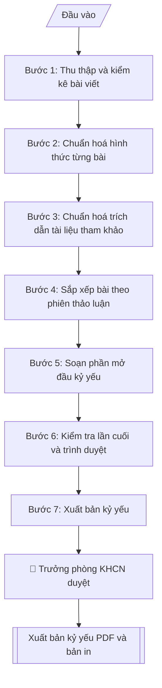

# Biên tập kỷ yếu hội thảo khoa học

## Định dạng và file đầu ra

Định dạng đầu ra có thể chọn theo sản phẩm/yêu cầu: .docx, .pdf. Đọc mục “Định dạng bổ sung” trong quy cách đầu ra trước khi chọn.

**Phải tạo file thực tế để tải xuống, không chỉ trả nội dung trong chat.** Định dạng mặc định của skill: **.docx**. Nếu có bảng số liệu nghiệp vụ yêu cầu file bảng tính riêng, tạo thêm Excel theo yêu cầu; không tự tạo file kiểm tra. Không chờ người dùng yêu cầu xuất file lần nữa. Ưu tiên định dạng người dùng chỉ định; đọc quy tắc xuất file tại references/quy-cach-dau-ra.md.

## Quy cách đầu ra và thông tin thiếu
Khi dựng file Word/Excel, áp dụng mục “Thể thức và bảng biểu khi dựng file” trong quy cách đầu ra (cỡ chữ từng thành phần, bảng nhiều trang, số trang, phụ lục). Đọc [quy cách và cấu trúc sản phẩm](references/quy-cach-dau-ra.md) trước khi soạn/xuất. File giao chỉ gồm sản phẩm nghiệp vụ được yêu cầu; kiểm tra nội bộ không xuất kèm. Thiếu thông tin thì giữ nguyên trường/mục và chỗ điền theo mẫu gốc (dòng dấu chấm, dấu gạch hoặc ô trống); không tự điền dữ liệu mẫu, số 0, mã chờ xác minh hay dòng chờ ký. Mẫu chuyên ngành còn áp dụng được ưu tiên về cấu trúc, mã biểu và người ký. Bản đầy đủ: [quy tắc chung](references/quy-tac-chung.md).

Khi người dùng yêu cầu bộ slide (.pptx), đọc mục “Xuất PowerPoint (.pptx) khi được yêu cầu” trong quy cách đầu ra.

## Kiểm soát áp dụng và phê duyệt
Trước khi chạy, xác định `ngay_ap_dung`, `loai_hinh_truong`, `quy_che_noi_bo`, `nguon_du_lieu`, `nguoi_kiem_duyet`; chỉ hỏi thông tin liên quan nghiệp vụ, không dùng giá trị giả định thay dữ liệu bắt buộc. Đối chiếu căn cứ pháp lý với văn bản gốc, hiệu lực, điều khoản áp dụng và chuyển tiếp. Bản đầy đủ: [quy tắc chung](references/quy-tac-chung.md).

## Giới hạn và human gate
AI hỗ trợ chuẩn bị và đối chiếu; cán bộ phụ trách kiểm tra dữ liệu/căn cứ, người có thẩm quyền duyệt và ký. Không đánh dấu đã ký, đã duyệt, đã công bố khi chưa có chứng cứ. Dữ liệu sinh viên, sức khỏe, nhân sự, tài chính chỉ dùng theo mục đích và phân quyền, che thông tin định danh khi dùng ví dụ (Luật 91/2025/QH15, hiệu lực 01/01/2026); không tải dữ liệu lên dịch vụ ngoài khi chưa có quyền. Bản đầy đủ: [quy tắc chung](references/quy-tac-chung.md).

## Khi nào dùng
Khi cần biên tập và xuất bản kỷ yếu (proceedings) sau hội thảo, hội nghị khoa học:
tổng hợp bài toàn văn của báo cáo viên, chuẩn hoá hình thức, sắp xếp theo phiên,
soạn lời nói đầu và mục lục, giao bản in / bản điện tử.

## Đầu vào (Input)

| Trường | Mô tả | Bắt buộc |
|---|---|---|
| `ten_hoi_thao` | Tên đầy đủ của hội thảo (tiếng Việt, có thể kèm tên tiếng Anh) | Có |
| `thoi_gian` | Ngày tổ chức | Có |
| `dia_diem` | Địa điểm tổ chức | Có |
| `don_vi_to_chuc` | Đơn vị chủ trì, đơn vị phối hợp | Có |
| `danh_sach_bai` | Danh sách bài viết: tiêu đề, tác giả, đơn vị công tác, phiên thảo luận (mỗi bài 1 dòng) | Có |
| `so_phien` | Số phiên thảo luận và tên từng phiên | Có |
| `chu_tich_hoi_thao` | Họ tên, học hàm, học vị của Chủ tịch hội thảo (ký Lời nói đầu) | Có |
| `chuan_dinh_dang` | Chuẩn trích dẫn yêu cầu (APA / IEEE / Vancouver) và quy định định dạng | Không (mặc định: APA) |
| `loai_xuat_ban` | Bản in / Bản điện tử (PDF) / Cả hai | Không (mặc định: Bản điện tử) |

## Quy trình

**Bước 1. Thu thập và kiểm kê bài viết**
- Làm gì: đối chiếu từng dòng trong `danh_sach_bai` (tiêu đề, tác giả, đơn vị, phiên) với số bài toàn văn thực nhận; lập danh mục bài thiếu và bài nộp sau thời hạn đóng kỷ yếu; báo Ban Tổ chức đôn đốc, loại bài quá hạn.
- Dùng input: `danh_sach_bai`, `so_phien`.
- Vai trò: Trưởng Phòng KHCN và HTQT · AI hỗ trợ: tổng hợp đối chiếu · ⏱ ~1–2 giờ (ước tính)
- Lưu ý nghiệp vụ: chỉ đưa vào kỷ yếu bài có xác nhận đồng ý xuất bản của tác giả (Luật Sở hữu trí tuệ); bài thiếu tác giả hoặc thiếu file toàn văn thì ghi vào danh mục bài thiếu, không tự "vá" nội dung.
- → Kết quả bước: bảng đối chiếu kiểm kê (bài trong danh sách – tình trạng thực nhận) + danh mục bài thiếu / bài loại kèm lý do.

**Bước 2. Chuẩn hoá hình thức từng bài**
- Làm gì: đưa mỗi bài về mẫu thống nhất: tiêu đề, tên tác giả, đơn vị công tác, tóm tắt (tiếng Việt + tiếng Anh), từ khóa, nội dung chính, tài liệu tham khảo; thống nhất font, cỡ chữ, giãn dòng và cách đánh số bảng/biểu/hình toàn kỷ yếu.
- Dùng input: `danh_sach_bai`, `chuan_dinh_dang`.
- Vai trò: Chuyên viên Phòng KHCN và HTQT · AI hỗ trợ: chuẩn hoá hình thức · ⏱ ~2–4 giờ (ước tính, tùy số lượng bài)
- Lưu ý nghiệp vụ: tên tác giả và đơn vị công tác phải giữ đúng chính tả do tác giả cung cấp — sai tên tác giả là lỗi nghiêm trọng nhất của kỷ yếu; tóm tắt tiếng Anh bắt buộc có dù bài viết bằng tiếng Việt.
- → Kết quả bước: bộ bài đã chuẩn hoá hình thức + danh sách lỗi hình thức đã sửa.

**Bước 3. Chuẩn hoá trích dẫn tài liệu tham khảo**
- Làm gì: kiểm tra toàn bộ danh mục tài liệu tham khảo của từng bài theo chuẩn đã chọn (APA/IEEE/Vancouver): sửa lỗi chính tả tên tác giả, năm xuất bản, tên tạp chí; loại bỏ trích dẫn "ma" (có trong danh mục nhưng không được trích trong nội dung) và bổ sung vào danh mục các trích dẫn còn thiếu.
- Dùng input: `chuan_dinh_dang`.
- Vai trò: Chuyên viên Phòng KHCN và HTQT · AI hỗ trợ: sửa trích dẫn theo chuẩn · ⏱ ~1–2 giờ (ước tính, cho 10–15 bài)
- Lưu ý nghiệp vụ: không tự bịa thêm trích dẫn để "làm đẹp" danh mục; trích dẫn "ma" phải loại chứ không được giữ; chuẩn trích dẫn phải thống nhất toàn kỷ yếu, không để mỗi bài một chuẩn.
- → Kết quả bước: danh sách lỗi trích dẫn đã sửa theo chuẩn + danh sách trích dẫn "ma" đã loại.

**Bước 4. Sắp xếp bài theo phiên thảo luận**
- Làm gì: nhóm bài theo từng phiên trong `so_phien`; trong mỗi phiên xếp báo cáo mời (keynote) trước, báo cáo thường sau; đánh số trang liên tục toàn kỷ yếu.
- Dùng input: `so_phien`, `danh_sach_bai`.
- Vai trò: Chuyên viên Phòng KHCN và HTQT · AI hỗ trợ: sắp xếp theo phiên và đánh số trang liên tục · ⏱ ~30–45 phút (ước tính, BTC xác nhận nếu bài chưa rõ phiên)
- Lưu ý nghiệp vụ: bài nào trong `danh_sach_bai` không ghi rõ phiên thì phải xác nhận lại với Ban Tổ chức, không tự xếp; số trang phải liên tục, không được nhảy số giữa các phiên.
- → Kết quả bước: danh mục bài theo phiên (thứ tự keynote → báo cáo thường) + dải số trang từng bài.

**Bước 5. Soạn phần mở đầu kỷ yếu**
- Làm gì: soạn bìa kỷ yếu (tên hội thảo, thời gian, địa điểm, đơn vị tổ chức), lời nói đầu do `chu_tich_hoi_thao` ký, danh sách Ban Tổ chức, chương trình hội thảo tóm tắt, mục lục chi tiết (tên bài – tác giả – số trang lấy từ kết quả Bước 4).
- Dùng input: `ten_hoi_thao`, `thoi_gian`, `dia_diem`, `don_vi_to_chuc`, `chu_tich_hoi_thao`.
- Vai trò: Chủ tịch hội thảo · AI hỗ trợ: soạn bìa, lời nói đầu, mục lục · ⏱ ~1–2 giờ (ước tính)
- Lưu ý nghiệp vụ: số trang trong mục lục phải lấy từ bản dàn trang thực tế, không ghi số trang ước tính; lời nói đầu nêu đúng số lượng bài và số phiên đã chốt ở Bước 4.
- → Kết quả bước: bộ phận mở đầu kỷ yếu (bìa, lời nói đầu, danh sách BTC, chương trình tóm tắt, mục lục).

**Bước 6. Kiểm tra lần cuối và trình duyệt**
- Làm gì: kiểm tra chính tả toàn văn, đối chiếu số trang mục lục với thực tế, xác minh tên tác giả/đơn vị, kiểm tra bản quyền hình ảnh sử dụng trong bài; trình Trưởng phòng KHCN&HTQT duyệt trước khi xuất bản.
- Dùng input: toàn bộ input (đối chiếu chéo).
- Vai trò: Trưởng Phòng KHCN và HTQT · AI hỗ trợ: rà chính tả · ⏱ ~1–2 giờ (ước tính)
- Lưu ý nghiệp vụ: đây là Human gate bắt buộc — không xuất bản khi chưa có duyệt; hình ảnh không rõ bản quyền phải loại hoặc thay thế trước khi in.
- → Kết quả bước: biên bản kiểm tra lần cuối + xác nhận phê duyệt của Trưởng phòng KHCN&HTQT.

**Bước 7. Xuất bản kỷ yếu**
- Làm gì: xuất file PDF hoàn chỉnh (bản điện tử) và/hoặc file gửi nhà in theo `loai_xuat_ban`; lưu 01 bản tại Phòng KHCN&HTQT và gửi 01 bản cho Thư viện trường.
- Dùng input: `loai_xuat_ban`.
- Vai trò: Chuyên viên Phòng KHCN và HTQT · AI hỗ trợ: xuất file PDF/bản in, lưu trữ và phân phối · ⏱ ~30–60 phút (ước tính)
- Lưu ý nghiệp vụ: kỷ yếu có mã ISBN phải đăng ký qua Nhà xuất bản trước ít nhất 30 ngày — kiểm tra lại trước khi ghi ISBN lên bìa.
- → Kết quả bước: file kỷ yếu hoàn chỉnh (PDF và/hoặc bản in) đã lưu trữ và phân phối.

## Luồng quy trình (Workflow)

## Đầu ra

File nghiệp vụ thực tế theo định dạng mặc định ở đầu skill hoặc định dạng người dùng yêu cầu, kèm liên kết tải trong phản hồi cuối.

Sản phẩm nghiệp vụ hoàn chỉnh theo [quy cách và cấu trúc](references/quy-cach-dau-ra.md), giữ các trường chưa có dữ liệu ở trạng thái trống. Không xuất kèm checklist/phụ lục kiểm tra đầu ra.

## Kiểm tra nội bộ trước khi giao
- [ ] Bố cục khớp mẫu áp dụng và cấu trúc tại references/quy-cach-dau-ra.md.
- [ ] Tên bài, tên tác giả, đơn vị khớp với Input (danh sách bài đã cung cấp).
- [ ] Không bịa đặt nội dung bài viết, số liệu, trích dẫn; bài thiếu file toàn văn không tự "vá".
- [ ] Định dạng thống nhất toàn kỷ yếu (font, cỡ chữ, đánh số bảng/hình); trích dẫn đúng 01 chuẩn đã chọn.
- [ ] Căn cứ đầy đủ: quy chế tổ chức hội thảo của Trường, tuân thủ Luật SHTT (chỉ xuất bản bài có xác nhận đồng ý của tác giả).
- [ ] Đã qua Human gate: Trưởng phòng KHCN&HTQT kiểm tra lần cuối và duyệt trước khi xuất bản.
- [ ] Số trang mục lục khớp với bản dàn trang thực tế; số trang liên tục toàn kỷ yếu.
- [ ] Hình ảnh trong bài rõ bản quyền (đã loại/thay thế ảnh không rõ nguồn).
- [ ] Danh mục bài thiếu/loại (nếu có) ghi rõ lý do.

Tiêu chí đạt = tất cả các ô được đánh dấu.

## Căn cứ & lưu ý
- Quy chế tổ chức hội thảo, hội nghị khoa học của Trường Đại học A.
- Tuân thủ Luật Sở hữu trí tuệ: chỉ đưa vào kỷ yếu bài có xác nhận đồng ý xuất bản của tác giả.
- Kỷ yếu có mã ISBN (nếu xuất bản chính thức) phải đăng ký qua Nhà xuất bản trước ít nhất 30 ngày.
- Không dùng tên thật của trường/cá nhân khi mô phỏng.

## Quản trị phiên bản
- Phiên bản gói `1.3.2` (cập nhật 2026-10-10); hồ sơ đầy đủ tại [references/version.json](references/version.json).
- Người phê duyệt nghiệp vụ: **chưa chỉ định**. Trạng thái: dự thảo nghiệp vụ; kiểm tra pháp lý trước thực thi. Ngày cập nhật không đồng nghĩa mọi văn bản đã được rà soát toàn văn.
- Giấy phép theo LICENSE của kho (bản quyền CES Global). Lịch sử thay đổi: CHANGELOG.md.
