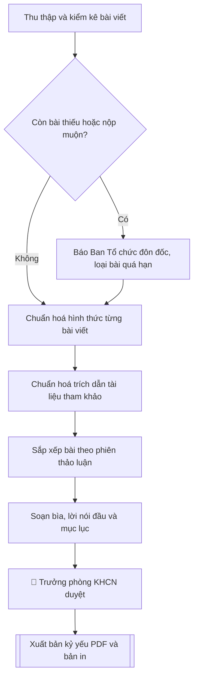

# Biên tập kỷ yếu hội thảo khoa học

## Kiểm soát áp dụng và phê duyệt

Trước khi chạy quy trình, xác định `ngay_ap_dung`, `loai_hinh_truong`, `quy_che_noi_bo`, `nguon_du_lieu` và `nguoi_kiem_duyet`. Chỉ yêu cầu thông tin có liên quan đến nghiệp vụ; không dùng giá trị giả định thay dữ liệu bắt buộc. Hồ sơ có yếu tố pháp lý phải kèm văn bản gốc, tình trạng hiệu lực, điều khoản áp dụng và chuyển tiếp.

## Giới hạn và human gate

AI hỗ trợ chuẩn bị và đối chiếu. Cán bộ phụ trách kiểm tra dữ liệu/căn cứ, người có thẩm quyền duyệt và ký. Mọi đầu ra mặc định là **DỰ THẢO – CHỜ KIỂM DUYỆT**; không đánh dấu đã ký, đã duyệt hoặc đã công bố nếu chưa có chứng cứ. Dữ liệu sinh viên, sức khỏe, nhân sự và tài chính phải hạn chế theo mục đích, phân quyền và che thông tin định danh khi dùng ví dụ. Không tải dữ liệu lên dịch vụ ngoài khi chưa có quyền. Kiểm tra Luật 91/2025/QH15 về bảo vệ dữ liệu cá nhân (hiệu lực 01/01/2026) và quy định áp dụng trước xử lý/chia sẻ dữ liệu cá nhân.


## Khi nào dùng
Khi cần biên tập và xuất bản kỷ yếu (proceedings) sau hội thảo, hội nghị khoa học:
tổng hợp bài toàn văn của báo cáo viên, chuẩn hoá hình thức, sắp xếp theo phiên,
soạn lời nói đầu và mục lục, giao bản in / bản điện tử.

## Đầu vào (Input)

| Trường | Mô tả | Bắt buộc |
|---|---|---|
| `ten_hoi_thao` | Tên đầy đủ của hội thảo (tiếng Việt, có thể kèm tên tiếng Anh) | Có |
| `thoi_gian` | Ngày tổ chức | Có |
| `dia_diem` | Địa điểm tổ chức | Có |
| `don_vi_to_chuc` | Đơn vị chủ trì, đơn vị phối hợp | Có |
| `danh_sach_bai` | Danh sách bài viết: tiêu đề, tác giả, đơn vị công tác, phiên thảo luận (mỗi bài 1 dòng) | Có |
| `so_phien` | Số phiên thảo luận và tên từng phiên | Có |
| `chu_tich_hoi_thao` | Họ tên, học hàm, học vị của Chủ tịch hội thảo (ký Lời nói đầu) | Có |
| `chuan_dinh_dang` | Chuẩn trích dẫn yêu cầu (APA / IEEE / Vancouver) và quy định định dạng | Không (mặc định: APA) |
| `loai_xuat_ban` | Bản in / Bản điện tử (PDF) / Cả hai | Không (mặc định: Bản điện tử) |

## Quy trình

**Bước 1. Thu thập và kiểm kê bài viết**
- Làm gì: đối chiếu từng dòng trong `danh_sach_bai` (tiêu đề, tác giả, đơn vị, phiên) với số bài toàn văn thực nhận; lập danh mục bài thiếu và bài nộp sau thời hạn đóng kỷ yếu; báo Ban Tổ chức đôn đốc, loại bài quá hạn.
- Dùng input: `danh_sach_bai`, `so_phien`.
- Vai trò: Trưởng Phòng KHCN và HTQT · AI hỗ trợ: tổng hợp đối chiếu · ⏱ ~1–2 giờ (ước tính)
- Lưu ý nghiệp vụ: chỉ đưa vào kỷ yếu bài có xác nhận đồng ý xuất bản của tác giả (Luật Sở hữu trí tuệ); bài thiếu tác giả hoặc thiếu file toàn văn thì ghi vào danh mục bài thiếu, không tự "vá" nội dung.
- → Kết quả bước: bảng đối chiếu kiểm kê (bài trong danh sách – tình trạng thực nhận) + danh mục bài thiếu / bài loại kèm lý do.

**Bước 2. Chuẩn hoá hình thức từng bài**
- Làm gì: đưa mỗi bài về mẫu thống nhất: tiêu đề, tên tác giả, đơn vị công tác, tóm tắt (tiếng Việt + tiếng Anh), từ khóa, nội dung chính, tài liệu tham khảo; thống nhất font, cỡ chữ, giãn dòng và cách đánh số bảng/biểu/hình toàn kỷ yếu.
- Dùng input: `danh_sach_bai`, `chuan_dinh_dang`.
- Vai trò: Chuyên viên Phòng KHCN và HTQT · AI hỗ trợ: chuẩn hoá hình thức · ⏱ ~2–4 giờ (ước tính, tùy số lượng bài)
- Lưu ý nghiệp vụ: tên tác giả và đơn vị công tác phải giữ đúng chính tả do tác giả cung cấp — sai tên tác giả là lỗi nghiêm trọng nhất của kỷ yếu; tóm tắt tiếng Anh bắt buộc có dù bài viết bằng tiếng Việt.
- → Kết quả bước: bộ bài đã chuẩn hoá hình thức + danh sách lỗi hình thức đã sửa.

**Bước 3. Chuẩn hoá trích dẫn tài liệu tham khảo**
- Làm gì: kiểm tra toàn bộ danh mục tài liệu tham khảo của từng bài theo chuẩn đã chọn (APA/IEEE/Vancouver): sửa lỗi chính tả tên tác giả, năm xuất bản, tên tạp chí; loại bỏ trích dẫn "ma" (có trong danh mục nhưng không được trích trong nội dung) và bổ sung vào danh mục các trích dẫn còn thiếu.
- Dùng input: `chuan_dinh_dang`.
- Vai trò: Chuyên viên Phòng KHCN và HTQT · AI hỗ trợ: sửa trích dẫn theo chuẩn · ⏱ ~1–2 giờ (ước tính, cho 10–15 bài)
- Lưu ý nghiệp vụ: không tự bịa thêm trích dẫn để "làm đẹp" danh mục; trích dẫn "ma" phải loại chứ không được giữ; chuẩn trích dẫn phải thống nhất toàn kỷ yếu, không để mỗi bài một chuẩn.
- → Kết quả bước: danh sách lỗi trích dẫn đã sửa theo chuẩn + danh sách trích dẫn "ma" đã loại.

**Bước 4. Sắp xếp bài theo phiên thảo luận**
- Làm gì: nhóm bài theo từng phiên trong `so_phien`; trong mỗi phiên xếp báo cáo mời (keynote) trước, báo cáo thường sau; đánh số trang liên tục toàn kỷ yếu.
- Dùng input: `so_phien`, `danh_sach_bai`.
- Vai trò: Chuyên viên Phòng KHCN và HTQT · AI hỗ trợ: sắp xếp theo phiên và đánh số trang liên tục · ⏱ ~30–45 phút (ước tính, BTC xác nhận nếu bài chưa rõ phiên)
- Lưu ý nghiệp vụ: bài nào trong `danh_sach_bai` không ghi rõ phiên thì phải xác nhận lại với Ban Tổ chức, không tự xếp; số trang phải liên tục, không được nhảy số giữa các phiên.
- → Kết quả bước: danh mục bài theo phiên (thứ tự keynote → báo cáo thường) + dải số trang từng bài.

**Bước 5. Soạn phần mở đầu kỷ yếu**
- Làm gì: soạn bìa kỷ yếu (tên hội thảo, thời gian, địa điểm, đơn vị tổ chức), lời nói đầu do `chu_tich_hoi_thao` ký, danh sách Ban Tổ chức, chương trình hội thảo tóm tắt, mục lục chi tiết (tên bài – tác giả – số trang lấy từ kết quả Bước 4).
- Dùng input: `ten_hoi_thao`, `thoi_gian`, `dia_diem`, `don_vi_to_chuc`, `chu_tich_hoi_thao`.
- Vai trò: Chủ tịch hội thảo · AI hỗ trợ: soạn bìa, lời nói đầu, mục lục · ⏱ ~1–2 giờ (ước tính)
- Lưu ý nghiệp vụ: số trang trong mục lục phải lấy từ bản dàn trang thực tế, không ghi số trang ước tính; lời nói đầu nêu đúng số lượng bài và số phiên đã chốt ở Bước 4.
- → Kết quả bước: bộ phận mở đầu kỷ yếu (bìa, lời nói đầu, danh sách BTC, chương trình tóm tắt, mục lục).

**Bước 6. Kiểm tra lần cuối và trình duyệt**
- Làm gì: kiểm tra chính tả toàn văn, đối chiếu số trang mục lục với thực tế, xác minh tên tác giả/đơn vị, kiểm tra bản quyền hình ảnh sử dụng trong bài; trình Trưởng phòng KHCN&HTQT duyệt trước khi xuất bản.
- Dùng input: toàn bộ input (đối chiếu chéo).
- Vai trò: Trưởng Phòng KHCN và HTQT · AI hỗ trợ: rà chính tả · ⏱ ~1–2 giờ (ước tính)
- Lưu ý nghiệp vụ: đây là Human gate bắt buộc — không xuất bản khi chưa có duyệt; hình ảnh không rõ bản quyền phải loại hoặc thay thế trước khi in.
- → Kết quả bước: biên bản kiểm tra lần cuối + xác nhận phê duyệt của Trưởng phòng KHCN&HTQT.

**Bước 7. Xuất bản kỷ yếu**
- Làm gì: xuất file PDF hoàn chỉnh (bản điện tử) và/hoặc file gửi nhà in theo `loai_xuat_ban`; lưu 01 bản tại Phòng KHCN&HTQT và gửi 01 bản cho Thư viện trường.
- Dùng input: `loai_xuat_ban`.
- Vai trò: Chuyên viên Phòng KHCN và HTQT · AI hỗ trợ: xuất file PDF/bản in, lưu trữ và phân phối · ⏱ ~30–60 phút (ước tính)
- Lưu ý nghiệp vụ: kỷ yếu có mã ISBN phải đăng ký qua Nhà xuất bản trước ít nhất 30 ngày — kiểm tra lại trước khi ghi ISBN lên bìa.
- → Kết quả bước: file kỷ yếu hoàn chỉnh (PDF và/hoặc bản in) đã lưu trữ và phân phối.

## Luồng quy trình (Workflow)


## Đầu ra (Output)
- File kỷ yếu hoàn chỉnh (PDF và/hoặc bản in).
- Lời nói đầu, mục lục chi tiết theo phiên.
- Danh mục bài thiếu / bài loại (nếu có) kèm lý do.

**Cấu trúc output chuẩn:** khung mẫu cố định của sản phẩm chính — Kỷ yếu hội thảo khoa học,
các phần bắt buộc theo đúng thứ tự:
1. Bìa kỷ yếu: tên hội thảo (tiếng Việt, kèm tiếng Anh nếu có), cấp hội thảo, thời gian, địa điểm, đơn vị tổ chức.
2. Lời nói đầu của Chủ tịch hội thảo (ký, ghi rõ họ tên, học hàm, học vị, ngày ký).
3. Mục lục chi tiết theo phiên: tên bài – tác giả – đơn vị – số trang.
4. Toàn văn các bài báo cáo sắp xếp theo phiên (báo cáo mời trước, báo cáo thường sau), đánh số trang liên tục toàn kỷ yếu.
5. Danh sách Ban Tổ chức.
6. Chương trình hội thảo (tóm tắt).
7. Danh mục bài thiếu / bài loại kèm lý do (phụ lục kèm theo, nếu có).

## Checklist nghiệm thu
- [ ] Đủ các phần theo "Cấu trúc output chuẩn": bìa, lời nói đầu, mục lục theo phiên, toàn văn bài theo phiên, danh sách BTC, chương trình tóm tắt, phụ lục bài thiếu/loại.
- [ ] Tên bài, tên tác giả, đơn vị khớp với Input (danh sách bài đã cung cấp).
- [ ] Không bịa đặt nội dung bài viết, số liệu, trích dẫn; bài thiếu file toàn văn không tự "vá".
- [ ] Định dạng thống nhất toàn kỷ yếu (font, cỡ chữ, đánh số bảng/hình); trích dẫn đúng 01 chuẩn đã chọn.
- [ ] Căn cứ đầy đủ: quy chế tổ chức hội thảo của Trường, tuân thủ Luật SHTT (chỉ xuất bản bài có xác nhận đồng ý của tác giả).
- [ ] Đã qua Human gate: Trưởng phòng KHCN&HTQT kiểm tra lần cuối và duyệt trước khi xuất bản.
- [ ] Số trang mục lục khớp với bản dàn trang thực tế; số trang liên tục toàn kỷ yếu.
- [ ] Hình ảnh trong bài rõ bản quyền (đã loại/thay thế ảnh không rõ nguồn).
- [ ] Danh mục bài thiếu/loại (nếu có) ghi rõ lý do.

Tiêu chí đạt = tất cả các ô được đánh dấu.

## Ví dụ mô phỏng (dữ liệu giả lập)

> Tất cả tên trường, cá nhân, đề tài, số liệu dưới đây đều là **giả lập**, không liên quan tổ chức/cá nhân có thật.

### Input mẫu

| Trường | Giá trị |
|---|---|
| `ten_hoi_thao` | Hội thảo khoa học quốc gia "Trí tuệ nhân tạo trong giáo dục đại học" (National Conference on AI in Higher Education – NCAIHE 2026) |
| `thoi_gian` | 25/9/2026 |
| `dia_diem` | Hội trường A, Trường Đại học A, thành phố C |
| `don_vi_to_chuc` | Phòng KHCN&HTQT, Trường Đại học A |
| `so_phien` | 3 phiên: (1) AI trong dạy và học; (2) AI trong quản trị đại học; (3) Đạo đức và chính sách AI |
| `danh_sach_bai` | 12 bài toàn văn đã nhận đủ (4 bài/phiên), gồm 2 báo cáo mời |
| `chu_tich_hoi_thao` | PGS.TS. Trần Văn B – Phó Hiệu trưởng |
| `chuan_dinh_dang` | APA |

### Output mẫu

```
KỶ YẾU HỘI THẢO KHOA HỌC QUỐC GIA
"TRÍ TUỆ NHÂN TẠO TRONG GIÁO DỤC ĐẠI HỌC"
(National Conference on AI in Higher Education – NCAIHE 2026)

Thành phố C, ngày 25 tháng 9 năm 2026
Trường Đại học A

────────────────────────────────────────
LỜI NÓI ĐẦU
────────────────────────────────────────

Hội thảo khoa học quốc gia "Trí tuệ nhân tạo trong giáo dục đại học"
được Trường Đại học A tổ chức ngày 25/9/2026 tại thành phố C, với sự
tham dự của 120 đại biểu đến từ 18 trường đại học, viện nghiên cứu trong
cả nước. Hội thảo gồm 3 phiên thảo luận với 12 báo cáo khoa học, tập trung
vào ứng dụng trí tuệ nhân tạo trong dạy – học, quản trị đại học, cùng các
vấn đề đạo đức và chính sách.

Kỷ yếu này tập hợp toàn văn 12 báo cáo đã được Hội đồng khoa học thẩm định
và chấp nhận trình bày tại Hội thảo. Ban Tổ chức trân trọng cảm ơn các tác
giả, các nhà khoa học phản biện và toàn thể đại biểu đã đóng góp cho thành
công của Hội thảo.

Thay mặt Ban Tổ chức, tôi trân trọng giới thiệu Kỷ yếu Hội thảo đến bạn đọc.

                                        Thành phố C, ngày 09 tháng 10 năm 2026
                                        CHỦ TỊCH HỘI THẢO

                                        PGS.TS. Trần Văn B

────────────────────────────────────────
MỤC LỤC
────────────────────────────────────────

PHIÊN 1: AI TRONG DẠY VÀ HỌC
1. Ứng dụng mô hình ngôn ngữ lớn trong thiết kế bài giảng đại học ......... 7
   Nguyễn Thị A, Vũ Văn C (Trường Đại học A) [Báo cáo mời]
2. Đánh giá tự động bài tập lập trình bằng AI ........................... 21
   Trần Văn D (Trường Đại học A)
3. Cá nhân hoá lộ trình học tập cho sinh viên năm nhất ................... 35
   Đỗ Thu Hà, Vũ Minh Tuấn (Trường Đại học A)
4. Trợ lý AI hỗ trợ giảng viên chấm bài tự luận .......................... 49
   Ngô Văn B (Trường Đại học A)

PHIÊN 2: AI TRONG QUẢN TRỊ ĐẠI HỌC
5. Hệ thống dự báo nguy cơ bỏ học của sinh viên .......................... 63
   Trần Thị Mai Phương (Trường Đại học A) [Báo cáo mời]
6. Chatbot tư vấn tuyển sinh tích hợp dữ liệu đào tạo ................... 77
   Nguyễn Văn Sơn (Trường Đại học A)
7. Phân tích dữ liệu lớn phục vụ ra quyết định quản trị .................. 91
   Bùi Thị Ngọc (Trường Đại học A)
8. Tự động hoá quy trình xét tốt nghiệp ................................. 105
   Đặng Quốc Bảo (Trường Đại học A)

PHIÊN 3: ĐẠO ĐỨC VÀ CHÍNH SÁCH AI
9. Khung đạo đức sử dụng AI trong đánh giá người học .................... 119
   PGS.TS. Trần Văn B (Trường Đại học A) [Báo cáo mời]
10. Quyền riêng tư dữ liệu sinh viên trong hệ thống học tập số .......... 133
    Ngô Thị Thanh (Trường Đại học A)
11. Chính sách liêm chính học thuật trong kỷ nguyên AI .................. 147
    Lý Văn Hùng (Trường Đại học A)
12. Tiếp cận có trách nhiệm với AI tạo sinh trong nghiên cứu khoa học ... 161
    Trịnh Thị Hồng Nhung (Trường Đại học A)

DANH SÁCH BAN TỔ CHỨC .................................................. 175
CHƯƠNG TRÌNH HỘI THẢO (TÓM TẮT) ....................................... 177
```

### Ghi chú biên tập (output kèm theo)
- Đã nhận đủ 12/12 bài toàn văn, không có bài thiếu.
- 100% bài đã chuẩn hoá trích dẫn theo APA; sửa 9 lỗi chính tả tên tác giả trong tài liệu tham khảo.
- Số trang mục lục đã đối chiếu khớp với bản in thử.

## Căn cứ & lưu ý
- Quy chế tổ chức hội thảo, hội nghị khoa học của Trường Đại học A.
- Tuân thủ Luật Sở hữu trí tuệ: chỉ đưa vào kỷ yếu bài có xác nhận đồng ý xuất bản của tác giả.
- Kỷ yếu có mã ISBN (nếu xuất bản chính thức) phải đăng ký qua Nhà xuất bản trước ít nhất 30 ngày.
- Không dùng tên thật của trường/cá nhân khi mô phỏng.

## Quản trị phiên bản

- Phiên bản gói: `1.1.0`; ngày cập nhật: `2026-10-09`.
- Kho nguồn: https://github.com/phamtruong91/dh-skills
- Người duy trì trên GitHub: `phamtruong91` (Phạm Văn Trường). Người phê duyệt nghiệp vụ: **chưa chỉ định**.
- Commit nguồn trước cập nhật: `78fd1d51b8acd1a724d9b9af6c488460bc7551ad`. Commit chứa phiên bản này xem bằng `git log -1 -- skills/ky-yeu-hoi-thao`; không tự gán SHA chưa tạo.
- Giấy phép: theo LICENSE của kho; bản quyền CES Global.
- Lịch sử 1.1.0: bổ sung metadata giao diện, kiểm soát áp dụng, quản trị phiên bản.
- Trạng thái: dự thảo nghiệp vụ; kiểm tra pháp lý trước thực thi. Ngày cập nhật không đồng nghĩa mọi văn bản đã được rà soát toàn văn.
