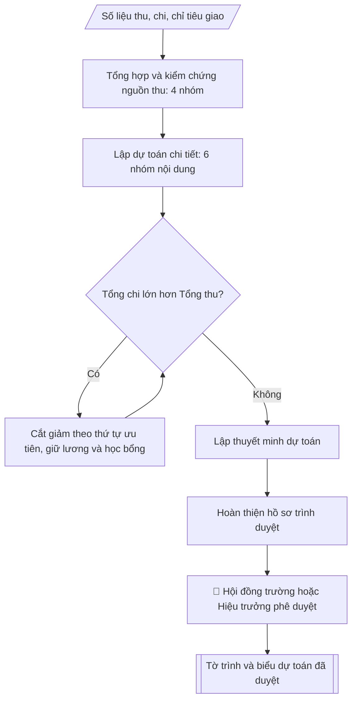

# Skill: Lập dự toán thu – chi ngân sách năm

## Khi nào dùng
Khi xây dựng dự toán ngân sách năm (năm tài chính hoặc năm học) của trường: tổng hợp các
nguồn thu, lập kế hoạch chi tiết theo từng nội dung chi, cân đối thu – chi và trình cấp có
thẩm quyền phê duyệt.

## Đầu vào (Input)

| Trường | Mô tả | Bắt buộc |
|---|---|---|
| `nam_ngan_sach` | Năm ngân sách lập dự toán (vd: 2027) | Có |
| `so_lieu_thu` | Số liệu các nguồn thu: học phí, ngân sách nhà nước cấp, thu dịch vụ – liên kết đào tạo, thu khác (đơn vị: triệu đồng) | Có |
| `so_lieu_chi` | Kế hoạch chi: lương – phụ cấp, hoạt động thường xuyên, học bổng, NCKH, đầu tư – mua sắm, dự phòng | Có |
| `chi_tieu_giao` | Chỉ tiêu, định mức được giao (biên chế, quỹ lương, nhiệm vụ chi...) | Không |
| `du_phong_ty_le` | Tỷ lệ dự phòng chi (mặc định: 3% tổng chi) | Không |
| `don_vi_trinh` | Cấp trình duyệt (Hội đồng trường / Hiệu trưởng) | Có |
| `nguoi_lap` | Chuyên viên lập dự toán (để ký tên cuối biểu) | Không |

## Quy trình

**Bước 1. Tổng hợp và kiểm chứng nguồn thu**
- Làm gì: phân loại đầy đủ 4 nhóm nguồn thu từ `so_lieu_thu`: (1) thu học phí, lệ phí
  (quy mô tuyển sinh × mức thu dự kiến); (2) ngân sách nhà nước cấp (kinh phí thường xuyên,
  kinh phí không thường xuyên / nhiệm vụ đặt hàng); (3) thu dịch vụ – liên kết đào tạo
  (đào tạo ngắn hạn, tư vấn, chuyển giao, cho thuê cơ sở vật chất); (4) thu khác (lãi tiền
  gửi, hợp tác, nguồn thu hợp pháp khác). Với mỗi nguồn, kiểm tra tính khả thi qua quyết
  định giao dự toán, hợp đồng đã ký và số thực hiện năm trước; đánh dấu nguồn chưa chắc chắn.
- Dùng input: `so_lieu_thu`, `chi_tieu_giao`, `nam_ngan_sach`.
- Vai trò: Chuyên viên Phòng TCKT · AI hỗ trợ: tổng hợp, chuẩn hóa dữ liệu · ⏱ ~1–2 giờ (ước tính)
- Lưu ý nghiệp vụ: không đưa nguồn thu "hy vọng" vào tổng thu để cân đối; thu dịch vụ
  phải có hợp đồng hoặc kế hoạch triển khai khả thi kèm theo.
- → Kết quả bước: bảng tổng hợp nguồn thu đã kiểm chứng (4 nhóm, số tiền, ghi chú mức độ
  chắc chắn của từng nguồn).

**Bước 2. Lập dự toán chi tiết theo 6 nhóm nội dung chi**
- Làm gì: dựng chi tiết từng nhóm từ `so_lieu_chi`: chi lương – phụ cấp (biên chế được giao
  × ngạch bậc, hệ số × lương cơ sở + các khoản phụ cấp); chi hoạt động thường xuyên (điện,
  nước, văn phòng phẩm, công tác phí, sửa chữa nhỏ...); chi học bổng, hỗ trợ sinh viên;
  chi nghiên cứu khoa học; chi đầu tư – mua sắm; chi dự phòng theo `du_phong_ty_le`
  (mặc định 3% tổng chi). Mỗi khoản chi ghi rõ cơ sở tính.
- Dùng input: `so_lieu_chi`, `chi_tieu_giao`, `du_phong_ty_le`.
- Vai trò: Chuyên viên Phòng TCKT · AI hỗ trợ: lập bảng biểu, định dạng · ⏱ ~30–60 phút (ước tính)
- Lưu ý nghiệp vụ: chi lương tính theo biên chế được giao, không theo biên chế mong muốn;
  chi dự phòng tính trên tổng chi sau khi đã lập đủ 5 nhóm còn lại.
- → Kết quả bước: bảng dự toán chi chi tiết 6 nhóm (số tiền kèm cơ sở tính từng khoản).

**Bước 3. Cân đối thu – chi**
- Làm gì: cộng tổng thu (Bước 1) và tổng chi (Bước 2); nếu tổng chi > tổng thu, cắt giảm
  theo thứ tự ưu tiên: chi đầu tư – mua sắm → chi hoạt động thường xuyên → các nội dung chi
  khác; tuyệt đối không giảm chi lương – phụ cấp và chi học bổng đã cam kết. Lặp lại cho đến
  khi tổng thu = tổng chi; ghi lại nhật ký mọi điều chỉnh (trước/sau).
- Dùng input: kết quả Bước 1 và Bước 2.
- Vai trò: Chuyên viên Phòng TCKT · AI hỗ trợ: xử lý sơ bộ, tổng hợp · ⏱ ~30–60 phút (ước tính)
- Lưu ý nghiệp vụ: bẫy thường gặp là cắt giảm lương/học bổng để cân đối cho nhanh — vi phạm
  cam kết chi; mọi khoản cắt giảm phải có vết để giải trình ở thuyết minh.
- → Kết quả bước: bảng cân đối thu = chi cuối cùng + nhật ký điều chỉnh.

**Bước 4. Lập thuyết minh dự toán**
- Làm gì: viết giải trình cơ sở tính của từng khoản thu/chi biến động lớn so với năm trước
  (nguyên nhân: tuyển sinh, lương cơ sở, nhiệm vụ mới; định mức áp dụng); nêu rõ các khoản
  đã cắt giảm ở Bước 3 và lý do.
- Dùng input: kết quả Bước 1 – 3, `chi_tieu_giao`.
- Vai trò: Chuyên viên Phòng TCKT · AI hỗ trợ: soạn dự thảo, tính toán, phân tích số liệu · ⏱ ~30–60 phút (ước tính)
- Lưu ý nghiệp vụ: thuyết minh là căn cứ để Hội đồng trường chất vấn — mọi số liệu trong
  thuyết minh phải khớp 100% với số trên biểu dự toán.
- → Kết quả bước: dự thảo thuyết minh dự toán.

**Bước 5. Hoàn thiện hồ sơ và trình duyệt**
- Làm gì: ghép bộ hồ sơ gồm Tờ trình + biểu dự toán thu + biểu dự toán chi + thuyết minh;
  kiểm tra số học cộng khớp, đơn vị tính thống nhất (triệu đồng), tổng thu = tổng chi;
  lấy chữ ký người lập (`nguoi_lap`) và trưởng phòng; trình cấp có thẩm quyền (`don_vi_trinh`)
  phê duyệt theo quy chế chi tiêu nội bộ.
- Dùng input: `don_vi_trinh`, `nguoi_lap`, kết quả Bước 3 – 4.
- Vai trò: Chuyên viên Phòng TCKT (lập hồ sơ); Trưởng phòng Tài chính – Kế toán ký duyệt · AI hỗ trợ: đối chiếu tự động, cảnh báo sai lệch, tính toán, phân tích số liệu · ⏱ ~1–3 giờ (ước tính)
- Lưu ý nghiệp vụ: dự toán phải được phê duyệt trước khi năm ngân sách bắt đầu; mọi khoản
  chi đều phải có trong dự toán được duyệt hoặc được điều chỉnh, bổ sung theo thẩm quyền.
- → Kết quả bước: bộ hồ sơ trình duyệt hoàn chỉnh (Tờ trình + 2 biểu + thuyết minh, đã ký).

## Luồng quy trình (Workflow)

## Đầu ra (Output)
- Tờ trình phê duyệt dự toán ngân sách năm.
- Bảng dự toán thu ngân sách năm (đơn vị: triệu đồng).
- Bảng dự toán chi ngân sách năm (đơn vị: triệu đồng), tổng thu = tổng chi.
- Thuyết minh dự toán (tóm tắt).

**Cấu trúc output chuẩn:** khung mẫu cố định của bộ hồ sơ dự toán, các phần theo đúng
thứ tự xuất hiện:
1. Tờ trình (đơn vị trình, nội dung trình, tổng thu = tổng chi, đề nghị phê duyệt);
2. Biểu 1: Dự toán thu (cột: TT, nguồn thu, dự toán, tỷ trọng; dòng tổng thu);
3. Biểu 2: Dự toán chi (cột: TT, nội dung chi, dự toán, tỷ trọng; dòng tổng chi);
4. Thuyết minh dự toán (cơ sở tính từng khoản, biến động so với năm trước, các khoản
   đã điều chỉnh khi cân đối);
5. Chữ ký: người lập, trưởng phòng, người phê duyệt (ký, đóng dấu).

## Checklist nghiệm thu

- [ ] Đủ các phần theo "Cấu trúc output chuẩn": Tờ trình (đơn vị trình, nội dung trình, tổng…; Biểu 1; Biểu 2; Thuyết minh dự toán (cơ sở tính từng khoản,…; Chữ ký
- [ ] Có đầy đủ sản phẩm: Tờ trình phê duyệt dự toán ngân sách năm
- [ ] Có đầy đủ sản phẩm: Bảng dự toán thu ngân sách năm (đơn vị: triệu đồng)
- [ ] Mọi số liệu, tên, ngày tháng trong output khớp với Input đã cung cấp (không thêm bớt, không suy đoán)
- [ ] Không bịa đặt số liệu, minh chứng, trích dẫn hay căn cứ
- [ ] Đúng thể thức, định dạng văn bản theo quy định hiện hành
- [ ] Căn cứ pháp lý nêu đầy đủ, còn hiệu lực tại thời điểm lập
- [ ] Đã qua Human gate: người có thẩm quyền đã kiểm tra/ký duyệt trước khi phát hành
- [ ] Không đưa nguồn thu "hy vọng" vào tổng thu để cân đối
- [ ] Chi lương tính theo biên chế được giao, không theo biên chế mong muốn

> Tiêu chí đạt: tất cả các ô đều được đánh dấu.

## Ví dụ mô phỏng (dữ liệu giả lập)

> Tất cả tên trường, cá nhân, số liệu dưới đây đều là **giả lập**, không liên quan tổ chức/cá nhân có thật.

### Input mẫu

| Trường | Giá trị |
|---|---|
| `nam_ngan_sach` | 2027 |
| `so_lieu_thu` | Học phí–lệ phí: 96.000; NSNN cấp: 45.000; dịch vụ–liên kết: 30.000; thu khác: 9.000 (triệu đồng) |
| `so_lieu_chi` | Lương–phụ cấp: 78.000; hoạt động thường xuyên: 42.000; học bổng: 12.000; NCKH: 15.000; đầu tư–mua sắm: 27.600; dự phòng: 5.400 (triệu đồng) |
| `don_vi_trinh` | Hội đồng trường |
| `nguoi_lap` | ThS. Lê Thị C |

### Output mẫu

**TỜ TRÌNH (tóm tắt)**

Phòng Tài chính – Kế toán kính trình Hội đồng trường phê duyệt Dự toán ngân sách năm 2027
của Trường Đại học A với tổng thu và tổng chi đều là **180.000 triệu đồng**
(một trăm tám mươi tỷ đồng), cân đối thu = chi. Chi tiết theo hai biểu đính kèm.

**Biểu 1: Dự toán thu ngân sách năm 2027** (đơn vị: triệu đồng)

| TT | Nguồn thu | Dự toán | Tỷ trọng |
|----|-----------|--------:|---------:|
| 1 | Thu học phí, lệ phí | 96.000 | 53,3% |
| 2 | Ngân sách nhà nước cấp | 45.000 | 25,0% |
| 3 | Thu dịch vụ – liên kết đào tạo | 30.000 | 16,7% |
| 4 | Thu khác | 9.000 | 5,0% |
| | **Tổng thu** | **180.000** | **100%** |

**Biểu 2: Dự toán chi ngân sách năm 2027** (đơn vị: triệu đồng)

| TT | Nội dung chi | Dự toán | Tỷ trọng |
|----|--------------|--------:|---------:|
| 1 | Chi lương – phụ cấp | 78.000 | 43,3% |
| 2 | Chi hoạt động thường xuyên | 42.000 | 23,3% |
| 3 | Chi học bổng, hỗ trợ sinh viên | 12.000 | 6,7% |
| 4 | Chi nghiên cứu khoa học | 15.000 | 8,3% |
| 5 | Chi đầu tư – mua sắm | 27.600 | 15,3% |
| 6 | Chi dự phòng (3%) | 5.400 | 3,0% |
| | **Tổng chi** | **180.000** | **100%** |

**Thuyết minh dự toán (tóm tắt)**
- Thu học phí tăng 8% so với năm 2026 nhờ quy mô tuyển sinh tăng 600 chỉ tiêu và
  điều chỉnh mức thu theo Nghị quyết số 12/NQ-HĐT.
- Ngân sách nhà nước cấp giữ ổn định theo quyết định giao dự toán của cơ quan chủ quản.
- Chi lương – phụ cấp tăng 5% do điều chỉnh hệ số lương cơ sở và tăng 40 biên chế giảng viên.
- Chi đầu tư – mua sắm tập trung cho 02 phòng thí nghiệm mới và nâng cấp hạ tầng CNTT.
- Quỹ dự phòng 3% tổng chi để xử lý các nhiệm vụ phát sinh ngoài dự kiến.

Người lập: ThS. Lê Thị C — Trưởng phòng: (ký, ghi rõ họ tên) —
Phê duyệt: Chủ tịch Hội đồng trường (ký, đóng dấu).

## Căn cứ & lưu ý
- Luật Ngân sách nhà nước 2015 (sửa đổi, bổ sung); Nghị định 163/2016/NĐ-CP hướng dẫn
  thi hành Luật Ngân sách nhà nước.
- Đơn vị sự nghiệp công lập tự chủ tài chính thực hiện theo Nghị định 60/2021/NĐ-CP
  về cơ chế tự chủ tài chính của đơn vị sự nghiệp công lập.
- Dự toán phải được phê duyệt trước khi năm ngân sách bắt đầu; mọi khoản chi đều phải
  có trong dự toán được duyệt hoặc được điều chỉnh, bổ sung theo thẩm quyền.
- Không dùng tên thật của trường/cá nhân khi mô phỏng.
