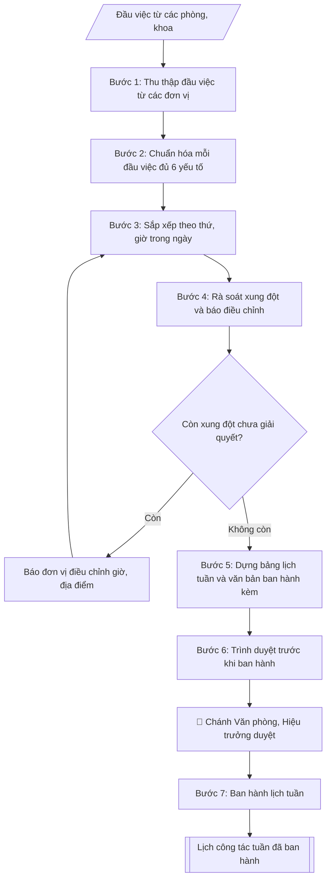

# Lập lịch công tác tuần

## Quy cách đầu ra và thông tin thiếu

Đọc [quy cách và cấu trúc sản phẩm](references/quy-cach-dau-ra.md) trước khi soạn/xuất. File giao chỉ gồm văn bản hoặc sản phẩm nghiệp vụ được yêu cầu; kiểm tra nội bộ không xuất kèm. Thiếu thông tin giữ nguyên trường/mục và chỗ điền theo mẫu gốc (dòng dấu chấm, dấu gạch hoặc ô trống); không tự điền dữ liệu mẫu, số 0, mã chờ xác minh hoặc dòng chờ ký. Mẫu chuyên ngành còn áp dụng được ưu tiên về cấu trúc, mã biểu và người ký. Các trường “bắt buộc” là điều kiện hoàn thiện hồ sơ, không ngăn việc soạn bản có chỗ chừa để điền. Mọi chỉ dẫn “để trống” trong skill được hiểu là không điền dữ liệu và giữ cách chừa chỗ của mẫu gốc, không phải xóa dấu chấm của mẫu.

## Kiểm soát áp dụng và phê duyệt

Trước khi chạy quy trình, xác định `ngay_ap_dung`, `loai_hinh_truong`, `quy_che_noi_bo`, `nguon_du_lieu` và `nguoi_kiem_duyet`. Chỉ yêu cầu thông tin có liên quan đến nghiệp vụ; không dùng giá trị giả định thay dữ liệu bắt buộc. Đối chiếu nội bộ hồ sơ có yếu tố pháp lý với văn bản gốc, hiệu lực, điều khoản áp dụng và chuyển tiếp; không tự đính kèm bảng kiểm tra vào file giao.

## Giới hạn và human gate

AI hỗ trợ chuẩn bị và đối chiếu. Cán bộ phụ trách kiểm tra dữ liệu/căn cứ, người có thẩm quyền duyệt và ký. Văn bản soạn chưa được coi là đã ban hành; không tự chèn nhãn trạng thái kiểm duyệt vào file giao; không đánh dấu đã ký, đã duyệt hoặc đã công bố nếu chưa có chứng cứ. Dữ liệu sinh viên, sức khỏe, nhân sự và tài chính phải hạn chế theo mục đích, phân quyền và che thông tin định danh khi dùng ví dụ. Không tải dữ liệu lên dịch vụ ngoài khi chưa có quyền. Kiểm tra Luật 91/2025/QH15 về bảo vệ dữ liệu cá nhân (hiệu lực 01/01/2026) và quy định áp dụng trước xử lý/chia sẻ dữ liệu cá nhân.

## Khi nào dùng
Cuối mỗi tuần, Văn phòng tổng hợp đầu việc của các đơn vị thành lịch công tác tuần tiếp theo
của Ban Giám hiệu, ban hành cho toàn trường.

## Đầu vào (Input)

| Trường | Mô tả | Bắt buộc |
|---|---|---|
| `tuan` | Tuần thứ mấy, từ ngày–đến ngày | Có |
| `dau_viec` | Danh sách đầu việc, mỗi đầu việc gồm: thứ/ngày, giờ, nội dung, địa điểm, thành phần tham dự, đơn vị chủ trì, lãnh đạo chủ trì/dự | Có |

## Quy trình

**Bước 1. Thu thập đầu việc từ các đơn vị**
- Làm gì: Nhận danh sách đầu việc các phòng/khoa gửi về (qua email/biểu mẫu) cho tuần trong `tuan`; kiểm tra đơn vị nào chưa gửi thì đôn đốc; ghi nhận thời điểm chốt nhận (thường trước 16h00 thứ Sáu) để làm căn cứ từ chối đầu việc gửi muộn.
- Dùng input: `tuan`, `dau_viec`.
- Vai trò: Chuyên viên Phòng HCTH · AI hỗ trợ: xử lý sơ bộ theo quy trình · ⏱ ~20–45 phút (ước tính)
- Lưu ý nghiệp vụ: Đầu việc gửi sau giờ chốt chỉ đưa vào lịch khi có xác nhận của Chánh Văn phòng; lưu lại bản gốc đầu việc từng đơn vị gửi để đối chiếu khi có khiếu nại.
- → Kết quả bước: Danh sách đầu việc thô đã tập hợp đủ từ các đơn vị.

**Bước 2. Chuẩn hóa mỗi đầu việc đủ 6 yếu tố**
- Làm gì: Với từng đầu việc, kiểm tra và bổ sung cho đủ 6 yếu tố: (1) thứ/ngày, (2) giờ, (3) nội dung, (4) địa điểm, (5) thành phần tham dự, (6) đơn vị chủ trì + lãnh đạo chủ trì/dự; đầu việc thiếu yếu tố nào thì trả về đơn vị bổ sung; chuẩn hóa cách ghi (giờ dạng "08h00", ngày dạng "12/10").
- Dùng input: `dau_viec`.
- Vai trò: Chuyên viên Phòng HCTH · AI hỗ trợ: xử lý sơ bộ theo quy trình · ⏱ ~20–45 phút (ước tính)
- Lưu ý nghiệp vụ: Bẫy thường gặp — thiếu "lãnh đạo dự" (không biết xếp lịch cho ai), thiếu địa điểm, nội dung ghi chung chung ("họp triển khai công việc" mà không rõ việc gì); không tự suy đoán bổ sung thông tin thiếu.
- → Kết quả bước: Danh sách đầu việc đã chuẩn hóa, mỗi đầu việc đủ 6 yếu tố.

**Bước 3. Sắp xếp theo thứ, giờ trong ngày**
- Làm gì: Sắp xếp đầu việc theo thứ trong tuần (Thứ 2 → Thứ 7/Chủ nhật), trong mỗi ngày sắp theo giờ tăng dần; gộp các đầu việc liên tiếp cùng địa điểm/thành phần nếu đơn vị đồng ý; đánh dấu các đầu việc cần Hiệu trưởng quyết hoặc có tính chất đặc biệt (lễ, hội nghị lớn).
- Dùng input: `tuan`, `dau_viec` (đã chuẩn hóa).
- Vai trò: Chuyên viên Phòng HCTH · AI hỗ trợ: xử lý sơ bộ theo quy trình · ⏱ ~20–45 phút (ước tính)
- Lưu ý nghiệp vụ: Đầu việc "cả ngày" hoặc chưa chốt giờ phải ghi rõ trạng thái, không tự đặt giờ; sự kiện nhiều ngày ghi rõ ngày bắt đầu – kết thúc.
- → Kết quả bước: Bảng lịch tuần đã sắp xếp theo thời gian.

**Bước 4. Rà soát xung đột và báo điều chỉnh**
- Làm gì: Quét toàn bảng: một lãnh đạo không được dự 2 việc cùng khung giờ; địa điểm không được xếp 2 việc trùng giờ; phát hiện xung đột thì lập danh sách xung đột (việc nào – trùng với việc nào – lãnh đạo/địa điểm nào), báo ngay cho đơn vị chủ trì để điều chỉnh giờ/địa điểm hoặc xin ý kiến lãnh đạo ưu tiên việc nào.
- Dùng input: `dau_viec` (đã chuẩn hóa, sắp xếp).
- Vai trò: Chuyên viên Phòng HCTH (Trưởng phòng kiểm tra lại) · AI hỗ trợ: quét lỗi theo checklist · ⏱ ~15–30 phút (ước tính)
- Lưu ý nghiệp vụ: Ưu tiên giữ nguyên lịch của Hiệu trưởng, điều chỉnh lịch cấp dưới; xung đột không giải quyết được thì ghi chú rõ trong lịch ("chờ điều chỉnh") thay vì âm thầm bỏ việc.
- → Kết quả bước: Danh sách xung đột lịch + phương án điều chỉnh đã thống nhất với đơn vị.

**Bước 5. Dựng bảng lịch tuần và văn bản ban hành kèm**
- Làm gì: Dựng bảng markdown với các cột: Thứ/Ngày | Giờ | Nội dung | Địa điểm | Thành phần | Chủ trì; viết tiêu đề "LỊCH CÔNG TÁC TUẦN [số] (từ [ngày] đến [ngày])" + dòng văn bản ban hành kèm (số thông báo của Phòng HCTH); viết phần Ghi chú: cơ chế báo thay đổi (báo về Phòng HCTH trước giờ chốt), đầu mối liên hệ.
- Dùng input: `tuan`.
- Vai trò: Chuyên viên Phòng HCTH · AI hỗ trợ: soạn dự thảo đúng thể thức · ⏱ ~20–45 phút (ước tính)
- Lưu ý nghiệp vụ: Tên lãnh đạo trong cột "Chủ trì" ghi đúng chức danh (Hiệu trưởng / PHT phụ trách ...); không viết tắt tên đơn vị ở lần xuất hiện đầu tiên trong bảng.
- → Kết quả bước: Bảng lịch công tác tuần hoàn chỉnh kèm ghi chú.

**Bước 6. Trình duyệt trước khi ban hành**
- Làm gì: Gửi bảng lịch + danh sách xung đột (nếu còn) cho Chánh Văn phòng rà soát, sau đó trình Hiệu trưởng duyệt (human gate); ghi nhận ý kiến điều chỉnh của lãnh đạo và cập nhật vào bảng lịch.
- Dùng input: toàn bộ.
- Vai trò: Chuyên viên Phòng HCTH chuẩn bị, Trưởng phòng HCTH phê duyệt · AI hỗ trợ: tổng hợp hồ sơ, soạn phiếu trình/tờ trình đầy đủ · ⏱ ~15–30 phút chuẩn bị + chờ duyệt (ước tính)
- Lưu ý nghiệp vụ: Lịch tuần chỉ ban hành sau khi Hiệu trưởng duyệt — không tự phát hành bản nháp; mọi điều chỉnh sau duyệt phải xin ý kiến lại.
- → Kết quả bước: Bảng lịch tuần đã được lãnh đạo duyệt.

**Bước 7. Ban hành lịch tuần**
- Làm gì: Phát hành lịch tuần đã duyệt trên các kênh chính thức (website trường, email các đơn vị, bảng tin); lưu bản đã ban hành vào hồ sơ công việc tuần; theo dõi các báo thay đổi trong tuần để cập nhật (nếu có).
- Dùng input: toàn bộ.
- Vai trò: Văn thư Phòng HCTH · AI hỗ trợ: định dạng bản chính, cập nhật sổ phát hành · ⏱ ~30 phút (ước tính)
- Lưu ý nghiệp vụ: Lịch thường ban hành vào chiều thứ Sáu cho tuần kế tiếp; bản cập nhật (nếu có) phải ghi rõ "thay thế bản ngày ..." để tránh nhầm lẫn.
- → Kết quả bước: Lịch công tác tuần đã ban hành + hồ sơ lưu.

## Luồng quy trình (Workflow)

## Đầu ra

Sản phẩm nghiệp vụ hoàn chỉnh theo [quy cách và cấu trúc](references/quy-cach-dau-ra.md), giữ các trường chưa có dữ liệu ở trạng thái trống. Không xuất kèm checklist/phụ lục kiểm tra đầu ra.

## Kiểm tra nội bộ trước khi giao

Các tiêu chí sau dùng để tự đối chiếu; không sao chép vào file xuất. Mục thiếu dữ liệu được để trống, không đánh dấu đã đạt hoặc đã duyệt.

- [ ] Bố cục khớp mẫu áp dụng và cấu trúc tại references/quy-cach-dau-ra.md.
- [ ] Nội dung và số liệu trong output khớp đúng với Input đã cho (không thêm, bớt hay suy diễn)
- [ ] Không bịa đặt số liệu, minh chứng, trích dẫn hay căn cứ
- [ ] Đúng thể thức và định dạng theo Lịch tuần thường ban hành vào chiều thứ Sáu cho tuần kế tiếp.
- [ ] Căn cứ pháp lý được trích dẫn đầy đủ và còn hiệu lực
- [ ] Không coi bản soạn là đã ký/đã duyệt; việc phê duyệt thuộc người có thẩm quyền trước phát hành
- [ ] Đầu việc "cả ngày" hoặc chưa chốt giờ phải ghi rõ trạng thái, không tự đặt giờ
- [ ] Tên lãnh đạo trong cột "Chủ trì" ghi đúng chức danh (Hiệu trưởng / PHT phụ trách ...)
- [ ] Mọi điều chỉnh sau duyệt phải xin ý kiến lại

## Căn cứ & lưu ý
- Lịch tuần thường ban hành vào chiều thứ Sáu cho tuần kế tiếp.
- Không dùng tên thật của trường/cá nhân khi mô phỏng.

## Quản trị phiên bản

- Phiên bản gói: `1.2.1`; ngày cập nhật: `2026-10-10`.
- Kho nguồn: https://github.com/phamtruong91/university-skills-framework
- Người duy trì trên GitHub: `phamtruong91` (Phạm Văn Trường). Người phê duyệt nghiệp vụ: **chưa chỉ định**.
- Commit nguồn trước cập nhật: `346719e6b0318ed034b4b016703f79733aa575e7`. Commit chứa phiên bản này xem bằng `git log -1 -- skills/lap-lich-cong-tac-tuan`; không tự gán SHA chưa tạo.
- Giấy phép: theo LICENSE của kho; bản quyền CES Global.
- Lịch sử 1.1.0: bổ sung metadata giao diện, kiểm soát áp dụng, quản trị phiên bản.
- Trạng thái: dự thảo nghiệp vụ; kiểm tra pháp lý trước thực thi. Ngày cập nhật không đồng nghĩa mọi văn bản đã được rà soát toàn văn.
