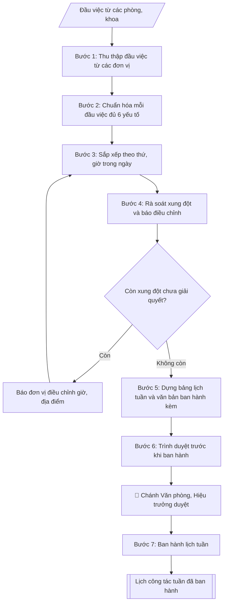

# Skill: Lập lịch công tác tuần

## Khi nào dùng
Cuối mỗi tuần, Văn phòng tổng hợp đầu việc của các đơn vị thành lịch công tác tuần tiếp theo
của Ban Giám hiệu, ban hành cho toàn trường.

## Đầu vào (Input)

| Trường | Mô tả | Bắt buộc |
|---|---|---|
| `tuan` | Tuần thứ mấy, từ ngày–đến ngày | Có |
| `dau_viec` | Danh sách đầu việc, mỗi đầu việc gồm: thứ/ngày, giờ, nội dung, địa điểm, thành phần tham dự, đơn vị chủ trì, lãnh đạo chủ trì/dự | Có |

## Quy trình

**Bước 1. Thu thập đầu việc từ các đơn vị**
- Làm gì: Nhận danh sách đầu việc các phòng/khoa gửi về (qua email/biểu mẫu) cho tuần trong `tuan`; kiểm tra đơn vị nào chưa gửi thì đôn đốc; ghi nhận thời điểm chốt nhận (thường trước 16h00 thứ Sáu) để làm căn cứ từ chối đầu việc gửi muộn.
- Dùng input: `tuan`, `dau_viec`.
- Vai trò: Chuyên viên Phòng HCTH · AI hỗ trợ: xử lý sơ bộ theo quy trình · ⏱ ~20–45 phút (ước tính)
- Lưu ý nghiệp vụ: Đầu việc gửi sau giờ chốt chỉ đưa vào lịch khi có xác nhận của Chánh Văn phòng; lưu lại bản gốc đầu việc từng đơn vị gửi để đối chiếu khi có khiếu nại.
- → Kết quả bước: Danh sách đầu việc thô đã tập hợp đủ từ các đơn vị.

**Bước 2. Chuẩn hóa mỗi đầu việc đủ 6 yếu tố**
- Làm gì: Với từng đầu việc, kiểm tra và bổ sung cho đủ 6 yếu tố: (1) thứ/ngày, (2) giờ, (3) nội dung, (4) địa điểm, (5) thành phần tham dự, (6) đơn vị chủ trì + lãnh đạo chủ trì/dự; đầu việc thiếu yếu tố nào thì trả về đơn vị bổ sung; chuẩn hóa cách ghi (giờ dạng "08h00", ngày dạng "12/10").
- Dùng input: `dau_viec`.
- Vai trò: Chuyên viên Phòng HCTH · AI hỗ trợ: xử lý sơ bộ theo quy trình · ⏱ ~20–45 phút (ước tính)
- Lưu ý nghiệp vụ: Bẫy thường gặp — thiếu "lãnh đạo dự" (không biết xếp lịch cho ai), thiếu địa điểm, nội dung ghi chung chung ("họp triển khai công việc" mà không rõ việc gì); không tự suy đoán bổ sung thông tin thiếu.
- → Kết quả bước: Danh sách đầu việc đã chuẩn hóa, mỗi đầu việc đủ 6 yếu tố.

**Bước 3. Sắp xếp theo thứ, giờ trong ngày**
- Làm gì: Sắp xếp đầu việc theo thứ trong tuần (Thứ 2 → Thứ 7/Chủ nhật), trong mỗi ngày sắp theo giờ tăng dần; gộp các đầu việc liên tiếp cùng địa điểm/thành phần nếu đơn vị đồng ý; đánh dấu các đầu việc cần Hiệu trưởng quyết hoặc có tính chất đặc biệt (lễ, hội nghị lớn).
- Dùng input: `tuan`, `dau_viec` (đã chuẩn hóa).
- Vai trò: Chuyên viên Phòng HCTH · AI hỗ trợ: xử lý sơ bộ theo quy trình · ⏱ ~20–45 phút (ước tính)
- Lưu ý nghiệp vụ: Đầu việc "cả ngày" hoặc chưa chốt giờ phải ghi rõ trạng thái, không tự đặt giờ; sự kiện nhiều ngày ghi rõ ngày bắt đầu – kết thúc.
- → Kết quả bước: Bảng lịch tuần đã sắp xếp theo thời gian.

**Bước 4. Rà soát xung đột và báo điều chỉnh**
- Làm gì: Quét toàn bảng: một lãnh đạo không được dự 2 việc cùng khung giờ; địa điểm không được xếp 2 việc trùng giờ; phát hiện xung đột thì lập danh sách xung đột (việc nào – trùng với việc nào – lãnh đạo/địa điểm nào), báo ngay cho đơn vị chủ trì để điều chỉnh giờ/địa điểm hoặc xin ý kiến lãnh đạo ưu tiên việc nào.
- Dùng input: `dau_viec` (đã chuẩn hóa, sắp xếp).
- Vai trò: Chuyên viên Phòng HCTH (Trưởng phòng kiểm tra lại) · AI hỗ trợ: quét lỗi theo checklist · ⏱ ~15–30 phút (ước tính)
- Lưu ý nghiệp vụ: Ưu tiên giữ nguyên lịch của Hiệu trưởng, điều chỉnh lịch cấp dưới; xung đột không giải quyết được thì ghi chú rõ trong lịch ("chờ điều chỉnh") thay vì âm thầm bỏ việc.
- → Kết quả bước: Danh sách xung đột lịch + phương án điều chỉnh đã thống nhất với đơn vị.

**Bước 5. Dựng bảng lịch tuần và văn bản ban hành kèm**
- Làm gì: Dựng bảng markdown với các cột: Thứ/Ngày | Giờ | Nội dung | Địa điểm | Thành phần | Chủ trì; viết tiêu đề "LỊCH CÔNG TÁC TUẦN [số] (từ [ngày] đến [ngày])" + dòng văn bản ban hành kèm (số thông báo của Phòng HCTH); viết phần Ghi chú: cơ chế báo thay đổi (báo về Phòng HCTH trước giờ chốt), đầu mối liên hệ.
- Dùng input: `tuan`.
- Vai trò: Chuyên viên Phòng HCTH · AI hỗ trợ: soạn dự thảo đúng thể thức · ⏱ ~20–45 phút (ước tính)
- Lưu ý nghiệp vụ: Tên lãnh đạo trong cột "Chủ trì" ghi đúng chức danh (Hiệu trưởng / PHT phụ trách ...); không viết tắt tên đơn vị ở lần xuất hiện đầu tiên trong bảng.
- → Kết quả bước: Bảng lịch công tác tuần hoàn chỉnh kèm ghi chú.

**Bước 6. Trình duyệt trước khi ban hành**
- Làm gì: Gửi bảng lịch + danh sách xung đột (nếu còn) cho Chánh Văn phòng rà soát, sau đó trình Hiệu trưởng duyệt (human gate); ghi nhận ý kiến điều chỉnh của lãnh đạo và cập nhật vào bảng lịch.
- Dùng input: toàn bộ.
- Vai trò: Chuyên viên Phòng HCTH chuẩn bị, Trưởng phòng HCTH phê duyệt · AI hỗ trợ: tổng hợp hồ sơ, soạn phiếu trình/tờ trình đầy đủ · ⏱ ~15–30 phút chuẩn bị + chờ duyệt (ước tính)
- Lưu ý nghiệp vụ: Lịch tuần chỉ ban hành sau khi Hiệu trưởng duyệt — không tự phát hành bản nháp; mọi điều chỉnh sau duyệt phải xin ý kiến lại.
- → Kết quả bước: Bảng lịch tuần đã được lãnh đạo duyệt.

**Bước 7. Ban hành lịch tuần**
- Làm gì: Phát hành lịch tuần đã duyệt trên các kênh chính thức (website trường, email các đơn vị, bảng tin); lưu bản đã ban hành vào hồ sơ công việc tuần; theo dõi các báo thay đổi trong tuần để cập nhật (nếu có).
- Dùng input: toàn bộ.
- Vai trò: Văn thư Phòng HCTH · AI hỗ trợ: định dạng bản chính, cập nhật sổ phát hành · ⏱ ~30 phút (ước tính)
- Lưu ý nghiệp vụ: Lịch thường ban hành vào chiều thứ Sáu cho tuần kế tiếp; bản cập nhật (nếu có) phải ghi rõ "thay thế bản ngày ..." để tránh nhầm lẫn.
- → Kết quả bước: Lịch công tác tuần đã ban hành + hồ sơ lưu.

## Luồng quy trình (Workflow)



## Đầu ra (Output)
- Bảng lịch công tác tuần hoàn chỉnh.
- Danh sách xung đột lịch (nếu có) để điều chỉnh.

**Cấu trúc output chuẩn:** khung mẫu cố định của lịch công tác tuần — các phần bắt buộc theo đúng thứ tự xuất hiện:
1. Tên trường + tiêu đề "LỊCH CÔNG TÁC TUẦN [số] (từ [ngày] đến [ngày])"
2. Dòng văn bản ban hành kèm (số thông báo của đơn vị ban hành)
3. Bảng lịch với đúng 6 cột theo thứ tự: Thứ/Ngày | Giờ | Nội dung | Địa điểm | Thành phần | Chủ trì — các dòng sắp xếp theo thứ trong tuần, rồi theo giờ tăng dần trong ngày
4. Phần Ghi chú: cơ chế báo thay đổi (đầu mối, giờ chốt) và các lưu ý khác
5. Danh sách xung đột lịch chưa giải quyết (nếu có)

## Checklist nghiệm thu

Tiêu chí đạt: tất cả các ô dưới đây được đánh dấu.

- [ ] Đủ các phần theo Cấu trúc output chuẩn: Tên trường + tiêu đề "LỊCH CÔNG TÁC TUẦN [số] (từ [ngày] đến [ngày])"; Dòng văn bản ban hành kèm; Bảng lịch với đúng 6 cột theo thứ tự: Thứ/Ngày | Giờ | Nội dung | Đ…; Phần Ghi chú: cơ chế báo thay đổi (đầu mối, giờ chốt) và các lưu ý…; Danh sách xung đột lịch chưa giải quyết
- [ ] Nội dung và số liệu trong output khớp đúng với Input đã cho (không thêm, bớt hay suy diễn)
- [ ] Không bịa đặt số liệu, minh chứng, trích dẫn hay căn cứ
- [ ] Đúng thể thức và định dạng theo Lịch tuần thường ban hành vào chiều thứ Sáu cho tuần kế tiếp.
- [ ] Căn cứ pháp lý được trích dẫn đầy đủ và còn hiệu lực
- [ ] Đã qua Human gate: người có thẩm quyền đã kiểm tra/duyệt trước khi phát hành
- [ ] Đầu việc "cả ngày" hoặc chưa chốt giờ phải ghi rõ trạng thái, không tự đặt giờ
- [ ] Tên lãnh đạo trong cột "Chủ trì" ghi đúng chức danh (Hiệu trưởng / PHT phụ trách ...)
- [ ] Mọi điều chỉnh sau duyệt phải xin ý kiến lại

## Ví dụ mô phỏng (dữ liệu giả lập)

> Tất cả tên trường, cá nhân, số liệu dưới đây đều là **giả lập**.

### Input mẫu

| Trường | Giá trị |
|---|---|
| `tuan` | Tuần 42, từ 12/10/2026 đến 17/10/2026 |
| `dau_viec` | - Thứ 2 8h00: Giao ban Ban Giám hiệu; P.A101; thành phần: BGH, trưởng các phòng; chủ trì: Hiệu trưởng. - Thứ 3 9h00: Họp Hội đồng tuyển sinh; P.A201; chủ trì: Phó Hiệu trưởng ĐT. - Thứ 4 14h00: Nghiệm thu đề tài cấp trường; P.B305; chủ trì: Phó Hiệu trưởng KHCN. - Thứ 6 8h30: Lễ khai giảng năm học mới; Hội trường lớn; toàn trường; chủ trì: Hiệu trưởng. |

### Output mẫu

```
TRƯỜNG ĐẠI HỌC A
LỊCH CÔNG TÁC TUẦN 42 (từ 12/10/2026 đến 17/10/2026)
(Ban hành kèm theo Thông báo số 99/TB-ĐHA-HCTH)

| Thứ / Ngày | Giờ | Nội dung | Địa điểm | Thành phần | Chủ trì |
|---|---|---|---|---|---|
| Thứ 2 (12/10) | 08h00 | Giao ban Ban Giám hiệu | P.A101 | BGH, Trưởng các phòng/ban | Hiệu trưởng |
| Thứ 3 (13/10) | 09h00 | Họp Hội đồng tuyển sinh | P.A201 | Thành viên HĐTS | PHT phụ trách Đào tạo |
| Thứ 4 (14/10) | 14h00 | Nghiệm thu đề tài NCKH cấp trường | P.B305 | HĐ nghiệm thu, chủ nhiệm đề tài | PHT phụ trách KHCN |
| Thứ 6 (16/10) | 08h30 | Lễ khai giảng năm học 2026–2027 | Hội trường lớn | Toàn thể CBVC, SV | Hiệu trưởng |

Ghi chú: Các đơn vị có thay đổi báo về Phòng HCTH trước 16h00 thứ Sáu hằng tuần.
```

## Căn cứ & lưu ý
- Lịch tuần thường ban hành vào chiều thứ Sáu cho tuần kế tiếp.
- Không dùng tên thật của trường/cá nhân khi mô phỏng.
