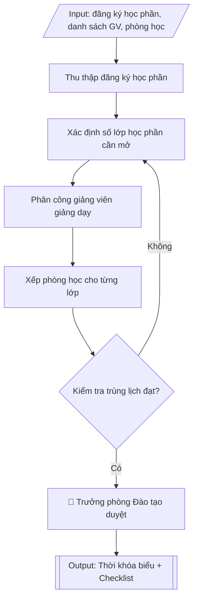

# Skill: Lập thời khóa biểu học kỳ

## Khi nào dùng
Khi cần lập mới hoặc điều chỉnh thời khóa biểu của một học kỳ: từ đăng ký học phần của
sinh viên → mở lớp theo sĩ số → phân công giảng viên → xếp phòng học → kiểm tra trùng
lịch giảng viên/phòng học/sinh viên → chốt và công bố.

## Đầu vào (Input)

| Trường | Mô tả | Bắt buộc |
|---|---|---|
| `hoc_ky` | Học kỳ cần lập TKB (ví dụ: Học kỳ 1 năm học 2026–2027) | Có |
| `dang_ky_hoc_phan` | Danh sách đăng ký học phần của SV (mã HP, số SV đăng ký) | Có |
| `si_so_toi_da` | Sĩ số tối đa mỗi lớp học phần (lý thuyết / thực hành) | Có |
| `danh_sach_gv` | Danh sách giảng viên giảng dạy trong kỳ + học phần đảm nhiệm | Có |
| `danh_sach_phong` | Danh sách phòng học (sức chứa, thiết bị: máy chiếu, phòng máy...) | Có |
| `khung_tiet` | Khung tiết học trong ngày (sáng/chiều/tối, số tiết mỗi buổi) | Có |
| `lich_hoc_tuan` | Số buổi học mỗi tuần cho từng loại học phần (nếu có quy định riêng) | Không |
| `rang_buoc_dac_biet` | Ràng buộc đặc biệt (GV thỉnh giảng chỉ dạy được ngày X, HP cần phòng máy...) | Không |

## Quy trình

**Bước 1. Thu thập đăng ký học phần**
- Làm gì: trích xuất từ hệ thống quản lý đào tạo danh sách đăng ký học phần của sinh viên
  trong `dang_ky_hoc_phan` (mã học phần, số sinh viên đăng ký từng học phần); loại bỏ các
  đăng ký không hợp lệ (trùng đăng ký, sinh viên chưa đủ điều kiện tiên quyết); chốt số liệu
  đăng ký làm đầu vào cho Bước 2.
- Dùng input: `hoc_ky`, `dang_ky_hoc_phan`.
- Vai trò: Chuyên viên Phòng Đào tạo · AI hỗ trợ: trích xuất và lọc sơ bộ đăng ký học phần, loại đăng ký không hợp lệ · ⏱ ~45 phút (ước tính)
- Lưu ý nghiệp vụ: số liệu đăng ký phải lấy sau khi hết hạn đăng ký/hủy đăng ký — lấy sớm
  sẽ thiếu chính xác; kiểm tra sinh viên đăng ký học phần chưa học tiên quyết để loại trước
  khi chia lớp.
- → Kết quả bước: danh sách học phần đã chốt số sinh viên đăng ký hợp lệ.

**Bước 2. Xác định số lớp học phần cần mở**
- Làm gì: với mỗi học phần, tính số lớp = làm tròn lên (số SV đăng ký / `si_so_toi_da`); tách
  lớp thực hành/thí nghiệm thành các nhóm nhỏ hơn theo sĩ số thực hành; đánh mã lớp học phần
  (vd: TIN101.1, TIN101.2...); lập danh sách lớp kèm sĩ số dự kiến.
- Dùng input: `si_so_toi_da`, kết quả Bước 1 (số SV đăng ký đã chốt).
- Vai trò: Chuyên viên Phòng Đào tạo · AI hỗ trợ: tính số lớp cần mở, kiểm tra và xử lý lớp sĩ số nhỏ · ⏱ ~45 phút (ước tính)
- Lưu ý nghiệp vụ: học phần có cả lý thuyết và thực hành phải tách nhóm thực hành riêng —
  bẫy phổ biến là chỉ chia lớp lý thuyết mà quên chia nhóm lab; lớp có sĩ số quá nhỏ (dưới
  mức tối thiểu của trường) phải báo cáo xin ý kiến trước khi mở.
- → Kết quả bước: danh sách lớp học phần cần mở (mã lớp, sĩ số dự kiến, nhóm thực hành).

**Bước 3. Phân công giảng viên giảng dạy**
- Làm gì: căn cứ `danh_sach_gv` (giảng viên giảng dạy trong kỳ và học phần đảm nhiệm) và đề
  xuất của khoa/bộ môn: phân công giảng viên cho từng lớp học phần theo năng lực chuyên môn
  và định mức giờ giảng; ưu tiên giảng viên cơ hữu trước, giảng viên thỉnh giảng sau; ghi nhận
  ràng buộc thời gian từ `rang_buoc_dac_biet` (giảng viên thỉnh giảng chỉ dạy được ngày X).
- Dùng input: `danh_sach_gv`, `rang_buoc_dac_biet`, kết quả Bước 2 (danh sách lớp).
- Vai trò: Khoa/bộ môn chốt phân công theo định mức; chuyên viên Phòng Đào tạo tổng hợp · AI hỗ trợ: lập bảng phân công sơ bộ, cảnh báo vượt định mức giờ giảng · ⏱ ~1 giờ (ước tính)
- Lưu ý nghiệp vụ: kiểm tra định mức giờ giảng — không phân công vượt định mức mà chưa có
  phê duyệt; giảng viên thỉnh giảng phải có hợp đồng/hồ sơ hợp lệ trước khi xếp lịch; một
  giảng viên không nên dạy quá nhiều lớp cùng học phần trong cùng khung giờ kề nhau.
- → Kết quả bước: bảng phân công giảng viên (lớp học phần – giảng viên – ghi chú ràng buộc).

**Bước 4. Xếp phòng học cho từng lớp**
- Làm gì: từ `danh_sach_phong`, chọn phòng cho từng lớp theo `khung_tiet`: sức chứa phòng ≥
  sĩ số lớp; học phần thực hành → phòng máy/phòng thí nghiệm; học phần cần máy chiếu → phòng
  có thiết bị tương ứng; ghi thứ/tiết dự kiến cho từng lớp.
- Dùng input: `danh_sach_phong`, `khung_tiet`, `lich_hoc_tuan`, kết quả Bước 2–3.
- Vai trò: Chuyên viên Phòng Đào tạo · AI hỗ trợ: xếp phòng sơ bộ theo sức chứa và thiết bị, kiểm tra ghi chú thiết bị đặc biệt · ⏱ ~1 giờ (ước tính)
- Lưu ý nghiệp vụ: ưu tiên phòng đúng chuẩn thiết bị hơn là phòng to nhưng thiếu thiết bị;
  các lớp thực hành cần phòng máy là nguồn lực khan hiếm — xếp trước; ghi rõ yêu cầu thiết
  bị đặc biệt vào ghi chú để bộ phận quản trị thiết bị chuẩn bị.
- → Kết quả bước: bảng xếp phòng sơ bộ (lớp học phần – thứ/tiết – phòng – ghi chú thiết bị).

**Bước 5. Kiểm tra trùng lịch**
- Làm gì: chạy checklist kiểm tra bắt buộc trên bảng xếp phòng Bước 4: (1) một giảng viên
  không dạy 2 lớp cùng khung giờ; (2) một phòng học không xếp 2 lớp cùng khung giờ; (3) sinh
  viên cùng khóa/ngành không bị trùng 2 học phần bắt buộc cùng khung giờ; (4) đảm bảo giờ
  nghỉ giữa các buổi; (5) giảng viên không dạy quá số tiết tối đa/ngày (nếu có quy định);
  lập danh sách các điểm xung đột và điều chỉnh lại từ Bước 2 (hoặc Bước 3/4 tùy nguyên nhân).
- Dùng input: kết quả Bước 2–4 (danh sách lớp, phân công GV, xếp phòng).
- Vai trò: Chuyên viên Phòng Đào tạo · AI hỗ trợ: chạy kiểm tra tự động 5 tiêu chí trùng lịch, lập danh sách điểm xung đột · ⏱ ~1 giờ (ước tính)
- Lưu ý nghiệp vụ: đây là cổng chặn lỗi quan trọng nhất — TKB có xung đột mà công bố sẽ gây
  hỗn loạn tuần đầu học kỳ; kiểm tra xung đột của sinh viên phải theo từng khóa/ngành cụ thể,
  không kiểm tra chung chung; mọi điều chỉnh sau kiểm tra phải kiểm tra lại từ đầu.
- → Kết quả bước: checklist kiểm tra trùng lịch có đánh dấu đạt từng tiêu chí; thời khóa
  biểu đã hết xung đột; danh sách các lớp chưa xếp được kèm nguyên nhân và đề xuất xử lý
  (nếu có).

**Bước 6. Chốt, phê duyệt và công bố thời khóa biểu**
- Làm gì: trình Trưởng phòng Đào tạo duyệt TKB đã kiểm tra; công bố trên cổng thông tin đào
  tạo và gửi các khoa trước ngày bắt đầu học kỳ ít nhất 01 tuần; tiếp nhận và xử lý đề nghị
  điều chỉnh trong tuần đầu của học kỳ theo quy trình phê duyệt.
- Dùng input: kết quả Bước 5 (TKB đã kiểm tra).
- Vai trò: Trưởng phòng Đào tạo duyệt; chuyên viên Phòng Đào tạo công bố trên cổng thông tin · AI hỗ trợ: chuẩn bị tài liệu trình duyệt và đăng công bố · ⏱ ~30 phút (ước tính)
- Lưu ý nghiệp vụ: TKB phải công bố trước khi học kỳ bắt đầu ít nhất 01 tuần theo quy định;
  mọi điều chỉnh sau công bố phải được Phòng Đào tạo phê duyệt và thông báo lại công khai —
  không tự ý đổi lịch qua tin nhắn riêng.
- → Kết quả bước: thời khóa biểu học kỳ hoàn chỉnh đã duyệt, đã công bố kèm checklist kiểm
  tra và danh sách lớp chưa xếp được (nếu có).

## Luồng quy trình (Workflow)

## Đầu ra (Output)
- Thời khóa biểu mẫu: bảng gồm các cột Lớp học phần | Học phần | Giảng viên | Thứ/Tiết | Phòng | Sĩ số.
- Checklist kiểm tra trùng lịch (đánh dấu từng tiêu chí đã kiểm tra).
- Danh sách các lớp chưa xếp được (nếu có) kèm nguyên nhân và đề xuất xử lý.

**Cấu trúc output chuẩn:** khung mẫu CỐ ĐỊNH của sản phẩm chính (Thời khóa biểu học kỳ), các
phần bắt buộc theo đúng thứ tự xuất hiện:
1. Tiêu đề: THỜI KHÓA BIỂU — HỌC KỲ ... NĂM HỌC ... (ghi rõ tên trường).
2. Bảng thời khóa biểu: các cột Lớp học phần – Học phần – Giảng viên – Thứ/Tiết – Phòng –
   Sĩ số.
3. Checklist kiểm tra trùng lịch: bảng (tiêu chí kiểm tra – kết quả đạt/không đạt kèm ghi chú).
4. Danh sách các lớp chưa xếp được (nếu có): lớp học phần, nguyên nhân, đề xuất xử lý; nếu
   không có thì ghi rõ "Không có".

## Checklist nghiệm thu

- [ ] Đủ 4 phần theo "Cấu trúc output chuẩn": tiêu đề TKB (học kỳ, năm học, tên trường), bảng thời khóa biểu (Lớp học phần – Học phần – Giảng viên – Thứ/Tiết – Phòng – Sĩ số), checklist kiểm tra trùng lịch, danh sách lớp chưa xếp được (ghi rõ "Không có" nếu không có).
- [ ] Một giảng viên không dạy 2 lớp cùng khung giờ; một phòng học không xếp 2 lớp cùng khung giờ.
- [ ] Sinh viên cùng khóa/ngành không bị trùng 2 học phần bắt buộc cùng khung giờ; đảm bảo giờ nghỉ giữa các buổi.
- [ ] Sức chứa phòng ≥ sĩ số lớp; lớp thực hành xếp phòng máy/thí nghiệm đúng chuẩn thiết bị.
- [ ] Giảng viên không vượt định mức giờ giảng; giảng viên thỉnh giảng có hợp đồng/hồ sơ hợp lệ; lớp sĩ số quá nhỏ đã có ý kiến trước khi mở.
- [ ] Số lớp, sĩ số, phân công giảng viên, phòng học khớp với Input đã cho.
- [ ] Không bịa đặt số liệu đăng ký, phòng học hay trích dẫn quy định.
- [ ] TKB công bố trước khi học kỳ bắt đầu ít nhất 01 tuần; điều chỉnh sau công bố được Phòng Đào tạo phê duyệt và thông báo công khai.
- [ ] Đã qua Human gate: Trưởng phòng Đào tạo đã duyệt.

Tiêu chí đạt = tất cả các ô được đánh dấu.

## Ví dụ mô phỏng (dữ liệu giả lập)

> Tất cả tên trường, cá nhân, số liệu dưới đây đều là **giả lập**, không liên quan tổ chức/cá nhân có thật.

### Input mẫu

| Trường | Giá trị |
|---|---|
| `hoc_ky` | Học kỳ 1 năm học 2026–2027 |
| `dang_ky_hoc_phan` | TIN101 Nhập môn CNTT: 185 SV; KT201 Nguyên lý kế toán: 120 SV; QTKD301 Quản trị marketing: 95 SV |
| `si_so_toi_da` | Lý thuyết: 80 SV/lớp; thực hành: 40 SV/nhóm |
| `danh_sach_gv` | GV1: ThS. Đỗ Thị A (TIN101); GV2: ThS. Bùi Thị C (KT201); GV3: PGS.TS. Trần Văn B (QTKD301) |
| `danh_sach_phong` | A101 (120 chỗ, máy chiếu); A102 (90 chỗ, máy chiếu); B201 phòng máy (45 máy) |
| `khung_tiet` | Sáng: tiết 1–5 (7h00–11h30); Chiều: tiết 6–10 (13h00–17h30) |

### Output mẫu

**THỜI KHÓA BIỂU — HỌC KỲ 1 NĂM HỌC 2026–2027**
*(Trường Đại học A)*

| Lớp học phần | Học phần | Giảng viên | Thứ / Tiết | Phòng | Sĩ số |
|---|---|---|---|---|---|
| TIN101.1 | Nhập môn CNTT | ThS. Đỗ Thị A | Thứ 2 / Tiết 1–3 | A101 | 80 |
| TIN101.2 | Nhập môn CNTT | ThS. Đỗ Thị A | Thứ 4 / Tiết 1–3 | A101 | 80 |
| TIN101.3 | Nhập môn CNTT | ThS. Đỗ Thị A | Thứ 6 / Tiết 1–3 | A102 | 25 |
| KT201.1 | Nguyên lý kế toán | ThS. Bùi Thị C | Thứ 3 / Tiết 1–3 | A101 | 80 |
| KT201.2 | Nguyên lý kế toán | ThS. Bùi Thị C | Thứ 5 / Tiết 1–3 | A102 | 40 |
| QTKD301.1 | Quản trị marketing | PGS.TS. Trần Văn B | Thứ 2 / Tiết 6–8 | A102 | 60 |
| QTKD301.2 | Quản trị marketing | PGS.TS. Trần Văn B | Thứ 4 / Tiết 6–8 | B201 | 35 |

**Checklist kiểm tra trùng lịch:**

| Tiêu chí kiểm tra | Kết quả |
|---|---|
| Giảng viên không dạy trùng giờ | [x] Đạt — không GV nào dạy 2 lớp cùng khung giờ |
| Phòng học không xếp trùng giờ | [x] Đạt — mỗi phòng 1 lớp/khung giờ |
| SV cùng khóa không trùng HP bắt buộc | [x] Đạt — TIN101 và KT201 khác khung giờ |
| Phòng đủ sức chứa và thiết bị | [x] Đạt — lớp thực hành xếp phòng máy B201 |
| GV không quá tải tiết/ngày | [x] Đạt — tối đa 3 tiết/buổi/GV |

**Lớp chưa xếp được:** Không có.

## Căn cứ & lưu ý
- Quy chế đào tạo trình độ đại học (Thông tư 08/2021/TT-BGDĐT): tổ chức lớp học phần theo đăng ký của SV.
- Quy định nội bộ về định mức giờ giảng, sĩ số lớp học phần của trường.
- TKB nên công bố trước khi học kỳ bắt đầu ít nhất 01 tuần; mọi điều chỉnh sau công bố phải được
  Phòng Đào tạo phê duyệt.
- Khi mô phỏng không dùng tên thật của trường/cá nhân.
