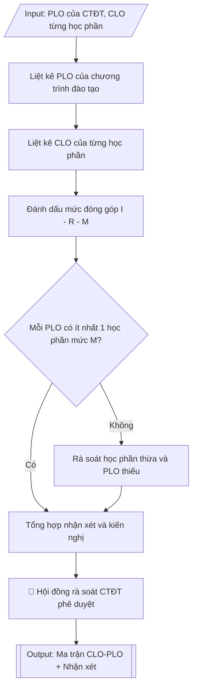

# Tư liệu lịch sử – không phải quy trình hiện hành

Nội dung từ phiên bản nguồn trước 1.1.0, giữ để đối chiếu dữ liệu đầu vào và thay đổi; căn cứ, điều kiện, mẫu và ví dụ có thể đã lỗi thời. Không dùng để thực hiện nghiệp vụ hiện tại.

## Khi nào dùng
Khi cần kiểm tra tính liên kết giữa các học phần và chuẩn đầu ra của chương trình đào tạo:
lập ma trận CLO–PLO, đánh giá mức độ đóng góp của từng học phần, phát hiện PLO chưa được
học phần nào "đạt được" (mức M) hoặc học phần không đóng góp vào PLO nào.

## Đầu vào (Input)

| Trường | Mô tả | Bắt buộc |
|---|---|---|
| `ten_nganh` | Tên ngành / chương trình đào tạo | Có |
| `plo` | Danh sách chuẩn đầu ra chương trình (PLO1, PLO2...) kèm nội dung tóm tắt | Có |
| `hoc_phan` | Danh sách học phần: mã, tên, và các CLO của từng học phần | Có |
| `nguong_kiem_tra` | Quy tắc kiểm tra (mặc định: mỗi PLO có ít nhất 1 học phần mức M) | Không |

## Quy trình

**Bước 1. Liệt kê PLO của chương trình đào tạo**
- Làm gì: đưa toàn bộ chuẩn đầu ra chương trình từ `plo` thành các cột của ma trận; mỗi cột
  ghi số hiệu và nội dung tóm tắt từng PLO; kiểm tra danh sách PLO khớp với PLO đã ban hành
  trong khung CTĐT (đủ số lượng, đúng nội dung, đúng thứ tự đánh số).
- Dùng input: `ten_nganh`, `plo`.
- Vai trò: Chuyên viên Phòng Đào tạo · AI hỗ trợ: chuẩn hóa danh sách PLO, đối chiếu bản PLO đang hiệu lực · ⏱ ~20 phút (ước tính)
- Lưu ý nghiệp vụ: bẫy thường gặp là dùng bản PLO cũ (chưa cập nhật sau lần rà soát CTĐT
  gần nhất) — phải lấy đúng bản PLO đang có hiệu lực; thiếu một PLO trong ma trận đồng nghĩa
  với PLO đó không được kiểm tra.
- → Kết quả bước: danh sách PLO đã chuẩn hóa (số hiệu + nội dung tóm tắt), sẵn sàng làm
  tiêu đề cột của ma trận.

**Bước 2. Liệt kê CLO của từng học phần**
- Làm gì: với mỗi học phần trong `hoc_phan`, lập một hàng của ma trận; ghi mã, tên học phần
  và toàn bộ các chuẩn đầu ra học phần (CLO) đã xác định trong đề cương chi tiết; kiểm tra
  mỗi CLO đều có ghi đóng góp vào PLO nào (thông tin này là đầu vào cho Bước 3).
- Dùng input: `hoc_phan`, `ten_nganh`.
- Vai trò: Chuyên viên Phòng Đào tạo · AI hỗ trợ: tổng hợp danh sách CLO, kiểm tra đề cương đã thông qua · ⏱ ~30 phút (ước tính)
- Lưu ý nghiệp vụ: CLO phải lấy từ đề cương chi tiết đã được khoa thông qua, không lấy từ
  bản nháp; học phần nào chưa có CLO thì ghi chú "chưa xác định CLO" và đưa vào danh sách
  cần bổ sung — không được bỏ qua.
- → Kết quả bước: danh sách học phần (mỗi hàng kèm các CLO), sẵn sàng làm hàng của ma trận.

**Bước 3. Đánh dấu mức đóng góp I – R – M**
- Làm gì: với mỗi ô giao giữa học phần (hàng) và PLO (cột), đánh dấu mức đóng góp dựa trên
  CLO của học phần: **I (Introduce – Giới thiệu)** khi học phần giới thiệu, làm quen nội dung
  của PLO; **R (Reinforce – Củng cố)** khi học phần củng cố, thực hành sâu hơn; **M (Master –
  Đạt được)** khi học phần giúp người học đạt được PLO ở mức thành thạo (thường gắn với đánh
  giá tổng hợp như đồ án, thực tập, khóa luận); để trống nếu học phần không đóng góp vào PLO đó.
- Dùng input: kết quả Bước 1 (danh sách PLO), kết quả Bước 2 (CLO từng học phần).
- Vai trò: Chuyên viên Phòng Đào tạo · AI hỗ trợ: đánh dấu sơ bộ I/R/M từng ô giao học phần – PLO · ⏱ ~1 giờ (ước tính)
- Lưu ý nghiệp vụ: mức M không được gán tùy tiện — chỉ gán M khi học phần có hình thức đánh
  giá tổng hợp đo được PLO ở mức thành thạo; bẫy phổ biến là gán quá nhiều M để "đẹp" ma trận,
  đoàn kiểm định sẽ đối chiếu với đề cương và rubric đánh giá.
- → Kết quả bước: ma trận CLO–PLO hoàn chỉnh (hàng: học phần; cột: PLO; ô: I/R/M hoặc trống).

**Bước 4. Kiểm tra độ phủ từng PLO**
- Làm gì: áp dụng `nguong_kiem_tra` (mặc định: mỗi PLO có ít nhất 01 học phần ở mức M): đếm
  số học phần ở mỗi mức I/R/M cho từng PLO; lập bảng kiểm tra độ phủ; đánh dấu "Đạt" hoặc
  "Chưa đạt" kèm ghi chú (vd: PLO chỉ có mức I mà không có R/M là điểm yếu).
- Dùng input: `nguong_kiem_tra`, kết quả Bước 3 (ma trận đã đánh dấu).
- Vai trò: Chuyên viên Phòng Đào tạo · AI hỗ trợ: tính bảng độ phủ PLO, kiểm tra kết luận đạt/chưa đạt · ⏱ ~30 phút (ước tính)
- Lưu ý nghiệp vụ: kiểm tra cả chiều ngược — không chỉ PLO thiếu M mà còn phát hiện PLO
  "quá tải" (quá nhiều học phần mức M cho một PLO đơn giản) gây lãng phí nguồn lực; ghi rõ
  học phần nào đang gánh mức M cho từng PLO.
- → Kết quả bước: bảng kiểm tra độ phủ từng PLO (số HP ở mỗi mức I/R/M, kết luận đạt/chưa đạt).

**Bước 5. Rà soát học phần "thừa" và PLO "thiếu"**
- Làm gì: từ ma trận Bước 3 và bảng phủ Bước 4, liệt kê học phần "thừa" (hàng trống toàn bộ —
  không đóng góp vào PLO nào) để xem xét loại bỏ hoặc điều chỉnh CLO; liệt kê PLO "thiếu"
  (chưa đạt ngưỡng kiểm tra) để đề xuất bổ sung/điều chỉnh học phần; với mỗi trường hợp ghi
  rõ nguyên nhân và phương án xử lý đề xuất.
- Dùng input: kết quả Bước 3, kết quả Bước 4.
- Vai trò: Chuyên viên Phòng Đào tạo · AI hỗ trợ: liệt kê sơ bộ học phần thừa/PLO thiếu, đề xuất phương án xử lý · ⏱ ~30 phút (ước tính)
- Lưu ý nghiệp vụ: học phần "thừa" chưa chắc phải loại bỏ ngay — có thể do CLO viết chưa
  gắn đúng PLO, cần kiểm tra đề cương trước khi kết luận; PLO "thiếu" mức M là lỗi nghiêm
  trọng khi kiểm định, phải có phương án khắc phục cụ thể (bổ sung học phần hay nâng mức
  đánh giá của học phần hiện có).
- → Kết quả bước: danh sách học phần thừa và PLO thiếu kèm nguyên nhân và phương án xử lý
  đề xuất.

**Bước 6. Tổng hợp nhận xét và kiến nghị**
- Làm gì: viết nhận xét đánh giá tổng thể mức độ liên kết giữa học phần và PLO (điểm mạnh,
  điểm yếu); tổng hợp các kiến nghị điều chỉnh cụ thể từ Bước 5 (học phần nào cần sửa CLO,
  PLO nào cần bổ sung mức M, thời hạn thực hiện); trình Hội đồng rà soát CTĐT phê duyệt.
- Dùng input: kết quả Bước 4, kết quả Bước 5, `ten_nganh`.
- Vai trò: Hội đồng rà soát CTĐT phê duyệt; chuyên viên Phòng Đào tạo soạn dự thảo và kiểm tra · AI hỗ trợ: soạn dự thảo nhận xét và kiến nghị · ⏱ ~45 phút (ước tính)
- Lưu ý nghiệp vụ: kiến nghị phải cụ thể đến từng học phần và có thời hạn (không viết chung
  chung "cần rà soát lại"); nhận xét phải công bằng — nêu cả điểm mạnh của ma trận, không
  chỉ liệt kê lỗi.
- → Kết quả bước: bản nhận xét đánh giá và kiến nghị điều chỉnh, sẵn sàng trình Hội đồng
  rà soát CTĐT.

## Luồng quy trình (Workflow)

## Đầu ra (Output)
- Ma trận CLO–PLO hoàn chỉnh dạng bảng (hàng: học phần; cột: PLO; ô: I/R/M).
- Bảng kiểm tra độ phủ từng PLO (số học phần ở mỗi mức I/R/M).
- Nhận xét đánh giá + kiến nghị điều chỉnh.

**Cấu trúc output chuẩn:** khung mẫu CỐ ĐỊNH của sản phẩm chính (Ma trận đối sánh CLO–PLO),
các phần bắt buộc theo đúng thứ tự xuất hiện:
1. Tiêu đề: ĐHA TRẬN ĐỐI SÁNH CHUẨN ĐẦU RA HỌC PHẦN – CHƯƠNG TRÌNH (CLO–PLO); tên ngành,
   tên trường.
2. Bảng ma trận: hàng là từng học phần (mã HP, tên học phần), cột là từng PLO; ô giao nhau
   ghi I/R/M hoặc để trống.
3. Chú thích ký hiệu: I = Giới thiệu (Introduce); R = Củng cố (Reinforce); M = Đạt được
   (Master).
4. Bảng kiểm tra độ phủ từng PLO: số học phần ở mỗi mức I/R/M và kết luận đạt/chưa đạt.
5. Nhận xét và kiến nghị: đánh giá mức độ liên kết; liệt kê điểm cần điều chỉnh; kiến nghị
   cụ thể trình Hội đồng rà soát CTĐT.

## Checklist nghiệm thu

- [ ] Đủ 5 phần theo "Cấu trúc output chuẩn": tiêu đề ma trận, bảng ma trận CLO–PLO, chú thích ký hiệu I/R/M, bảng kiểm tra độ phủ từng PLO, nhận xét và kiến nghị.
- [ ] Danh sách PLO khớp bản đang có hiệu lực trong khung CTĐT (đủ số lượng, đúng nội dung, đúng thứ tự đánh số).
- [ ] CLO lấy từ đề cương chi tiết đã được khoa thông qua (không dùng bản nháp); học phần chưa có CLO được ghi chú bổ sung.
- [ ] Mức M chỉ gán khi học phần có hình thức đánh giá tổng hợp đo được PLO ở mức thành thạo; không gán M tùy tiện để "đẹp" ma trận.
- [ ] Mỗi PLO có ít nhất 01 học phần ở mức M theo ngưỡng kiểm tra đã chọn; học phần "thừa"/PLO "thiếu" được liệt kê đầy đủ kèm nguyên nhân và phương án xử lý.
- [ ] Kiến nghị cụ thể đến từng học phần, có thời hạn thực hiện; nhận xét nêu cả điểm mạnh, không chỉ liệt kê lỗi.
- [ ] Không bịa đặt CLO, mức đánh giá hay trích dẫn văn bản.
- [ ] Đã qua Human gate: Hội đồng rà soát CTĐT đã phê duyệt.

Tiêu chí đạt = tất cả các ô được đánh dấu.

## Ví dụ mô phỏng (dữ liệu giả lập)

> Tất cả tên trường, cá nhân, số liệu dưới đây đều là **giả lập**, không liên quan tổ chức/cá nhân có thật.

### Input mẫu

| Trường | Giá trị |
|---|---|
| `ten_nganh` | Trí tuệ nhân tạo – Trường Đại học A |
| `plo` | PLO1: Vận dụng kiến thức toán nền tảng cho thuật toán AI. PLO2: Kiến thức cốt lõi khoa học máy tính. PLO3: Phân tích mô hình, thuật toán học máy/học sâu. PLO4: Đạo đức, pháp lý và tác động xã hội của AI. PLO5: Thiết kế, huấn luyện, đánh giá mô hình ML/DL. PLO6: Xây dựng, triển khai hệ thống AI hoàn chỉnh. PLO7: Làm việc nhóm, giao tiếp tiếng Việt/Anh chuyên ngành. PLO8: Sử dụng thành thạo công cụ, framework AI. PLO9: Tự chủ học tập, cập nhật công nghệ mới. PLO10: Trách nhiệm, đạo đức nghề nghiệp. PLO11: Tinh thần khởi nghiệp, đổi mới sáng tạo. |
| `hoc_phan` | 12 học phần tiêu biểu: ĐHA110 Giải tích 1; ĐHA115 Đại số tuyến tính; ĐHA120 Nhập môn lập trình; AI201 Xác suất thống kê cho AI; AI202 Cấu trúc dữ liệu và giải thuật; AI301 Học máy; AI302 Học sâu; AI303 Xử lý ngôn ngữ tự nhiên; AI304 Thị giác máy tính; AI305 Đạo đức AI và pháp luật công nghệ; AI401 Thực tập tốt nghiệp; AI402 Đồ án tốt nghiệp |
| `nguong_kiem_tra` | Mỗi PLO có ít nhất 1 học phần mức M |

### Output mẫu

**ĐHA TRẬN ĐỐI SÁNH CHUẨN ĐẦU RA HỌC PHẦN – CHƯƠNG TRÌNH (CLO–PLO)**

Ngành: Trí tuệ nhân tạo – Trường Đại học A

| Mã HP | Tên học phần | PLO1 | PLO2 | PLO3 | PLO4 | PLO5 | PLO6 | PLO7 | PLO8 | PLO9 | PLO10 | PLO11 |
|---|---|---|---|---|---|---|---|---|---|---|---|---|
| ĐHA110 | Giải tích 1 | I | | | | | | | | | | |
| ĐHA115 | Đại số tuyến tính | I | | | | | | | | | | |
| ĐHA120 | Nhập môn lập trình | | I | | | | | | I | | | |
| AI201 | Xác suất thống kê cho AI | R | | I | | | | | | | | |
| AI202 | Cấu trúc dữ liệu và giải thuật | | R | | | | | | R | | | |
| AI301 | Học máy | R | | R | | I | | | R | | | |
| AI302 | Học sâu | | | R | | R | I | | R | | | |
| AI303 | Xử lý ngôn ngữ tự nhiên | | | R | | R | R | I | R | | | |
| AI304 | Thị giác máy tính | | | R | | R | R | I | R | | | |
| AI305 | Đạo đức AI và pháp luật công nghệ | | | | M | | | R | | | R | I |
| AI401 | Thực tập tốt nghiệp | | | | | M | M | M | M | R | M | R |
| AI402 | Đồ án tốt nghiệp | M | M | M | | M | M | M | M | M | M | M |

*Chú thích: I = Giới thiệu (Introduce); R = Củng cố (Reinforce); M = Đạt được (Master).*

**Bảng kiểm tra độ phủ từng PLO**

| PLO | Số HP mức I | Số HP mức R | Số HP mức M | Kết luận |
|---|---|---|---|---|
| PLO1 | 2 | 2 | 1 (AI402) | Đạt |
| PLO2 | 1 | 1 | 1 (AI402) | Đạt |
| PLO3 | 1 | 4 | 1 (AI402) | Đạt |
| PLO4 | 0 | 0 | 1 (AI305) | Đạt (chỉ 1 HP mức M – cần theo dõi) |
| PLO5 | 1 | 3 | 2 (AI401, AI402) | Đạt |
| PLO6 | 1 | 2 | 2 (AI401, AI402) | Đạt |
| PLO7 | 2 | 1 | 2 (AI401, AI402) | Đạt |
| PLO8 | 1 | 4 | 2 (AI401, AI402) | Đạt |
| PLO9 | 0 | 1 | 1 (AI402) | Đạt (mỏng ở mức R) |
| PLO10 | 0 | 1 | 2 (AI401, AI402) | Đạt |
| PLO11 | 1 | 1 | 1 (AI402) | Đạt |

**Nhận xét và kiến nghị**

1. Tất cả 11 PLO đều có ít nhất 01 học phần hỗ trợ ở mức M — ma trận đạt yêu cầu phủ chuẩn đầu ra.
2. Điểm cần lưu ý:
   - PLO4 (đạo đức, pháp lý AI) chỉ có duy nhất học phần AI305 ở mức M; kiến nghị bổ sung
     nội dung đạo đức AI vào đồ án tốt nghiệp (AI402) để tăng cường.
   - PLO9 (tự chủ học tập) mỏng ở mức R; kiến nghị đưa hoạt động tự học có hướng dẫn vào
     các học phần AI303, AI304.
   - Không phát hiện học phần "thừa" (mọi học phần đều đóng góp vào ít nhất 01 PLO).
3. Kiến nghị trình Hội đồng rà soát CTĐT Khoa Công nghệ thông tin xem xét, phê duyệt.

## Căn cứ & lưu ý
- Thông tư 17/2021/TT-BGDĐT: chuẩn đầu ra của CTĐT phải được cụ thể hóa thành chuẩn đầu ra
  của từng học phần và có sự liên kết logic giữa hai cấp độ.
- Ma trận CLO–PLO là minh chứng bắt buộc trong hồ sơ tự đánh giá và kiểm định CTĐT.
- Ký hiệu I/R/M là quy ước phổ biến; nếu trường dùng quy ước khác cần chú thích rõ trong ma trận.
- Không dùng tên thật của trường/cá nhân khi mô phỏng.
