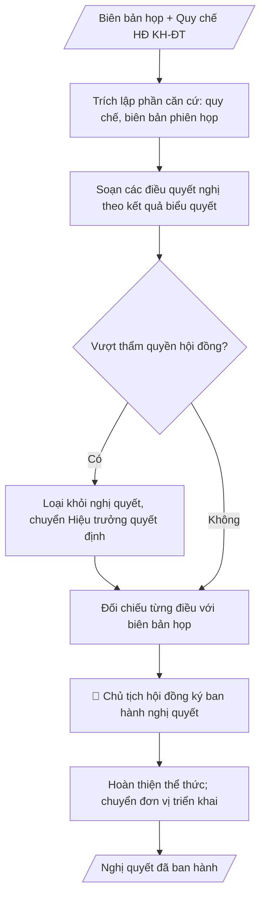

# Nghị quyết Hội đồng KH&ĐT

## Quy cách đầu ra và thông tin thiếu

Đọc [quy cách và cấu trúc sản phẩm](references/quy-cach-dau-ra.md) trước khi soạn/xuất. File giao chỉ gồm văn bản hoặc sản phẩm nghiệp vụ được yêu cầu; kiểm tra nội bộ không xuất kèm. Thiếu thông tin giữ nguyên trường/mục và chỗ điền theo mẫu gốc (dòng dấu chấm, dấu gạch hoặc ô trống); không tự điền dữ liệu mẫu, số 0, mã chờ xác minh hoặc dòng chờ ký. Mẫu chuyên ngành còn áp dụng được ưu tiên về cấu trúc, mã biểu và người ký. Các trường “bắt buộc” là điều kiện hoàn thiện hồ sơ, không ngăn việc soạn bản có chỗ chừa để điền. Mọi chỉ dẫn “để trống” trong skill được hiểu là không điền dữ liệu và giữ cách chừa chỗ của mẫu gốc, không phải xóa dấu chấm của mẫu.

## Kiểm soát áp dụng và phê duyệt

Trước khi chạy quy trình, xác định `ngay_ap_dung`, `loai_hinh_truong`, `quy_che_noi_bo`, `nguon_du_lieu` và `nguoi_kiem_duyet`. Chỉ yêu cầu thông tin có liên quan đến nghiệp vụ; không dùng giá trị giả định thay dữ liệu bắt buộc. Đối chiếu nội bộ hồ sơ có yếu tố pháp lý với văn bản gốc, hiệu lực, điều khoản áp dụng và chuyển tiếp; không tự đính kèm bảng kiểm tra vào file giao.

## Giới hạn và human gate

AI hỗ trợ chuẩn bị và đối chiếu. Cán bộ phụ trách kiểm tra dữ liệu/căn cứ, người có thẩm quyền duyệt và ký. Văn bản soạn chưa được coi là đã ban hành; không tự chèn nhãn trạng thái kiểm duyệt vào file giao; không đánh dấu đã ký, đã duyệt hoặc đã công bố nếu chưa có chứng cứ. Dữ liệu sinh viên, sức khỏe, nhân sự và tài chính phải hạn chế theo mục đích, phân quyền và che thông tin định danh khi dùng ví dụ. Không tải dữ liệu lên dịch vụ ngoài khi chưa có quyền. Kiểm tra Luật 91/2025/QH15 về bảo vệ dữ liệu cá nhân (hiệu lực 01/01/2026) và quy định áp dụng trước xử lý/chia sẻ dữ liệu cá nhân.

## Khi nào dùng
Sau phiên họp Hội đồng Khoa học và Đào tạo đã biểu quyết thông qua các nội dung (chương trình
đào tạo, danh mục đề tài, công nhận chức danh, định hướng KHCN...), cần ban hành nghị quyết
làm căn cứ để Hiệu trưởng quyết định và các đơn vị triển khai.

## Đầu vào (Input)

| Trường | Mô tả | Bắt buộc |
|---|---|---|
| `so_nghi_quyet` | Số, ký hiệu nghị quyết | Có |
| `phien_hop` | Căn cứ phiên họp (số, ngày) và biên bản họp | Có |
| `can_cu` | Quy chế tổ chức HĐ, các văn bản pháp lý liên quan | Có |
| `dieu_quyet_nghi` | Từng điều quyết nghị: nội dung + kết quả biểu quyết | Có |
| `hieu_luc` | Hiệu lực thi hành | Có |
| `noi_nhan` | Nơi nhận (Ban Giám hiệu, các đơn vị, lưu) | Có |

## Quy trình

**Bước 1. Trích lập phần căn cứ**
- Làm gì: trích Quy chế tổ chức và hoạt động của Hội đồng từ `can_cu`; trích biên bản phiên họp trong `phien_hop` (số biên bản, ngày họp); sắp xếp các căn cứ theo thứ tự (quy chế trước, biên bản sau).
- Dùng input: `can_cu`, `phien_hop`.
- Vai trò: Thư ký hội đồng (trích lập phần căn cứ theo biên bản đã ký) · AI hỗ trợ: trích lập phần căn cứ theo thứ tự quy chế trước, biên bản sau · ⏱ ~10–15 phút (ước tính)
- Lưu ý nghiệp vụ: chỉ trích căn cứ có liên quan trực tiếp đến nội dung quyết nghị; số biên bản và ngày họp phải khớp chính xác biên bản đã ký.
- → Kết quả bước: phần căn cứ hoàn chỉnh (quy chế + biên bản phiên họp).

**Bước 2. Soạn các điều quyết nghị**
- Làm gì: với từng nội dung trong `dieu_quyet_nghi`, viết một điều riêng ghi rõ nội dung và kết quả biểu quyết; điều cuối quy định đơn vị chịu trách nhiệm thi hành; thêm điều về `hieu_luc`.
- Dùng input: `dieu_quyet_nghi`, `hieu_luc`.
- Vai trò: Thư ký hội đồng (soát đảm bảo không sửa đổi nội dung đã biểu quyết) · AI hỗ trợ: soạn từng điều quyết nghị từ nội dung đã biểu quyết, kèm kết quả biểu quyết · ⏱ ~20–30 phút (ước tính)
- Lưu ý nghiệp vụ: mỗi điều chỉ chứa một nội dung đã được biểu quyết thông qua; tuyệt đối không sửa đổi nội dung đã biểu quyết khi soạn nghị quyết; không đưa nội dung vượt thẩm quyền của hội đồng vào quyết nghị.
- → Kết quả bước: dự thảo các điều quyết nghị (kèm kết quả biểu quyết từng điều).

**Bước 3. Đối chiếu với biên bản và kiểm tra thẩm quyền**
- Làm gì: đối chiếu từng điều quyết nghị với biên bản họp (nội dung, số liệu biểu quyết); rà soát từng điều xem có vượt thẩm quyền của hội đồng theo quy chế không (hội đồng tư vấn/quyết nghị chuyên môn; quyết định hành chính thuộc Hiệu trưởng).
- Dùng input: kết quả bước 2, `phien_hop`, `can_cu`.
- Vai trò: Chủ tịch hội đồng (xác nhận, loại nội dung vượt thẩm quyền) · AI hỗ trợ: đối chiếu từng điều với biên bản, rà soát thẩm quyền từng điều · ⏱ ~20–30 phút (ước tính)
- Lưu ý nghiệp vụ: nội dung vượt thẩm quyền thì loại khỏi nghị quyết, chuyển Hiệu trưởng quyết định; sai lệch số liệu biểu quyết so với biên bản phải sửa ngay, không tự điều chỉnh.
- → Kết quả bước: dự thảo nghị quyết đã đối chiếu khớp biên bản và đúng thẩm quyền.

**Bước 4. Hoàn thiện thể thức, ký ban hành và triển khai**
- Làm gì: ghi `so_nghi_quyet`, địa danh và ngày ban hành; lập `noi_nhan`; trình Chủ tịch hội đồng ký ban hành; chuyển nghị quyết đến Hiệu trưởng và các đơn vị liên quan triển khai.
- Dùng input: `so_nghi_quyet`, `noi_nhan`, kết quả bước 3.
- Vai trò: Chủ tịch hội đồng (đối chiếu biên bản, ký ban hành); Văn thư phát hành · AI hỗ trợ: chuẩn bị văn bản, lập danh sách nơi nhận trước khi trình ký · ⏱ ~30 phút–1 ngày làm việc (ước tính)
- Lưu ý nghiệp vụ: Chủ tịch hội đồng đối chiếu với biên bản trước khi ký; nghị quyết hội đồng là căn cứ chuyên môn để Hiệu trưởng ra quyết định hành chính theo thẩm quyền.
- → Kết quả bước: nghị quyết đã ký ban hành, chuyển các đơn vị triển khai.
## Luồng quy trình (Workflow)

## Đầu ra

Sản phẩm nghiệp vụ hoàn chỉnh theo [quy cách và cấu trúc](references/quy-cach-dau-ra.md), giữ các trường chưa có dữ liệu ở trạng thái trống. Không xuất kèm checklist/phụ lục kiểm tra đầu ra.

## Kiểm tra nội bộ trước khi giao

- [ ] Bố cục khớp mẫu áp dụng và cấu trúc tại references/quy-cach-dau-ra.md.
- [ ] Căn cứ pháp lý đầy đủ, còn hiệu lực: Quy chế tổ chức và hoạt động của Hội đồng; số biên bản và ngày họp khớp chính xác biên bản đã ký.
- [ ] Mỗi điều quyết nghị chỉ chứa một nội dung đã biểu quyết thông qua; không đưa nội dung vượt thẩm quyền hội đồng vào quyết nghị (nội dung vượt thẩm quyền chuyển Hiệu trưởng quyết định).
- [ ] Kết quả biểu quyết từng điều khớp 100% biên bản họp — tuyệt đối không sửa đổi nội dung đã biểu quyết.
- [ ] Có điều cuối quy định đơn vị chịu trách nhiệm thi hành và điều về hiệu lực thi hành.
- [ ] Đã qua Human gate: Chủ tịch hội đồng đối chiếu với biên bản trước khi ký ban hành.

> Tiêu chí đạt: tất cả các ô được đánh dấu.

## Human gate (người kiểm duyệt)
- **Chủ tịch Hội đồng** ký ban hành nghị quyết sau khi đối chiếu với biên bản họp.
- **Hiệu trưởng** xem xét và ra quyết định hành chính theo thẩm quyền đối với các nội dung
  cần quyết định (nghị quyết hội đồng là căn cứ chuyên môn).

## Giới hạn (guardrails)
- KHÔNG quyết nghị nội dung vượt thẩm quyền của hội đồng theo quy chế (hội đồng có chức
  năng tư vấn/quyết nghị chuyên môn, không thay quyết định quản lý của Hiệu trưởng).
- KHÔNG ban hành nghị quyết khi chưa có biên bản họp và kết quả biểu quyết hợp lệ.
- KHÔNG sửa đổi nội dung đã biểu quyết khi soạn nghị quyết.

## Căn cứ & lưu ý
- Quy chế tổ chức và hoạt động của Hội đồng KH&ĐT; Luật Giáo dục đại học.
- Không dùng tên thật của trường/cá nhân khi mô phỏng.

## Quản trị phiên bản

- Phiên bản gói: `1.2.1`; ngày cập nhật: `2026-10-10`.
- Kho nguồn: https://github.com/phamtruong91/university-skills-framework
- Người duy trì trên GitHub: `phamtruong91` (Phạm Văn Trường). Người phê duyệt nghiệp vụ: **chưa chỉ định**.
- Commit nguồn trước cập nhật: `346719e6b0318ed034b4b016703f79733aa575e7`. Commit chứa phiên bản này xem bằng `git log -1 -- skills/nghi-quyet-hoi-dong-khdt`; không tự gán SHA chưa tạo.
- Giấy phép: theo LICENSE của kho; bản quyền CES Global.
- Lịch sử 1.1.0: bổ sung metadata giao diện, kiểm soát áp dụng, quản trị phiên bản.
- Trạng thái: dự thảo nghiệp vụ; kiểm tra pháp lý trước thực thi. Ngày cập nhật không đồng nghĩa mọi văn bản đã được rà soát toàn văn.
