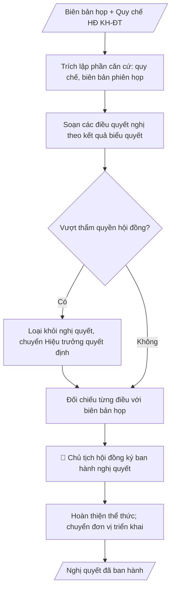

# Skill: Nghị quyết Hội đồng KH&ĐT

## Khi nào dùng
Sau phiên họp Hội đồng Khoa học và Đào tạo đã biểu quyết thông qua các nội dung (chương trình
đào tạo, danh mục đề tài, công nhận chức danh, định hướng KHCN...), cần ban hành nghị quyết
làm căn cứ để Hiệu trưởng quyết định và các đơn vị triển khai.

## Đầu vào (Input)

| Trường | Mô tả | Bắt buộc |
|---|---|---|
| `so_nghi_quyet` | Số, ký hiệu nghị quyết | Có |
| `phien_hop` | Căn cứ phiên họp (số, ngày) và biên bản họp | Có |
| `can_cu` | Quy chế tổ chức HĐ, các văn bản pháp lý liên quan | Có |
| `dieu_quyet_nghi` | Từng điều quyết nghị: nội dung + kết quả biểu quyết | Có |
| `hieu_luc` | Hiệu lực thi hành | Có |
| `noi_nhan` | Nơi nhận (Ban Giám hiệu, các đơn vị, lưu) | Có |

## Quy trình

**Bước 1. Trích lập phần căn cứ**
- Làm gì: trích Quy chế tổ chức và hoạt động của Hội đồng từ `can_cu`; trích biên bản phiên họp trong `phien_hop` (số biên bản, ngày họp); sắp xếp các căn cứ theo thứ tự (quy chế trước, biên bản sau).
- Dùng input: `can_cu`, `phien_hop`.
- Vai trò: Thư ký hội đồng (trích lập phần căn cứ theo biên bản đã ký) · AI hỗ trợ: trích lập phần căn cứ theo thứ tự quy chế trước, biên bản sau · ⏱ ~10–15 phút (ước tính)
- Lưu ý nghiệp vụ: chỉ trích căn cứ có liên quan trực tiếp đến nội dung quyết nghị; số biên bản và ngày họp phải khớp chính xác biên bản đã ký.
- → Kết quả bước: phần căn cứ hoàn chỉnh (quy chế + biên bản phiên họp).

**Bước 2. Soạn các điều quyết nghị**
- Làm gì: với từng nội dung trong `dieu_quyet_nghi`, viết một điều riêng ghi rõ nội dung và kết quả biểu quyết; điều cuối quy định đơn vị chịu trách nhiệm thi hành; thêm điều về `hieu_luc`.
- Dùng input: `dieu_quyet_nghi`, `hieu_luc`.
- Vai trò: Thư ký hội đồng (soát đảm bảo không sửa đổi nội dung đã biểu quyết) · AI hỗ trợ: soạn từng điều quyết nghị từ nội dung đã biểu quyết, kèm kết quả biểu quyết · ⏱ ~20–30 phút (ước tính)
- Lưu ý nghiệp vụ: mỗi điều chỉ chứa một nội dung đã được biểu quyết thông qua; tuyệt đối không sửa đổi nội dung đã biểu quyết khi soạn nghị quyết; không đưa nội dung vượt thẩm quyền của hội đồng vào quyết nghị.
- → Kết quả bước: dự thảo các điều quyết nghị (kèm kết quả biểu quyết từng điều).

**Bước 3. Đối chiếu với biên bản và kiểm tra thẩm quyền**
- Làm gì: đối chiếu từng điều quyết nghị với biên bản họp (nội dung, số liệu biểu quyết); rà soát từng điều xem có vượt thẩm quyền của hội đồng theo quy chế không (hội đồng tư vấn/quyết nghị chuyên môn; quyết định hành chính thuộc Hiệu trưởng).
- Dùng input: kết quả bước 2, `phien_hop`, `can_cu`.
- Vai trò: Chủ tịch hội đồng (xác nhận, loại nội dung vượt thẩm quyền) · AI hỗ trợ: đối chiếu từng điều với biên bản, rà soát thẩm quyền từng điều · ⏱ ~20–30 phút (ước tính)
- Lưu ý nghiệp vụ: nội dung vượt thẩm quyền thì loại khỏi nghị quyết, chuyển Hiệu trưởng quyết định; sai lệch số liệu biểu quyết so với biên bản phải sửa ngay, không tự điều chỉnh.
- → Kết quả bước: dự thảo nghị quyết đã đối chiếu khớp biên bản và đúng thẩm quyền.

**Bước 4. Hoàn thiện thể thức, ký ban hành và triển khai**
- Làm gì: ghi `so_nghi_quyet`, địa danh và ngày ban hành; lập `noi_nhan`; trình Chủ tịch hội đồng ký ban hành; chuyển nghị quyết đến Hiệu trưởng và các đơn vị liên quan triển khai.
- Dùng input: `so_nghi_quyet`, `noi_nhan`, kết quả bước 3.
- Vai trò: Chủ tịch hội đồng (đối chiếu biên bản, ký ban hành); Văn thư phát hành · AI hỗ trợ: chuẩn bị văn bản, lập danh sách nơi nhận trước khi trình ký · ⏱ ~30 phút–1 ngày làm việc (ước tính)
- Lưu ý nghiệp vụ: Chủ tịch hội đồng đối chiếu với biên bản trước khi ký; nghị quyết hội đồng là căn cứ chuyên môn để Hiệu trưởng ra quyết định hành chính theo thẩm quyền.
- → Kết quả bước: nghị quyết đã ký ban hành, chuyển các đơn vị triển khai.
## Luồng quy trình (Workflow)


## Đầu ra (Output)
- Nghị quyết hội đồng hoàn chỉnh (markdown), sẵn sàng ký ban hành.

**Cấu trúc output chuẩn:** khung mẫu cố định của nghị quyết hội đồng:
1. Quốc hiệu – tiêu ngữ + tên cơ quan (HỘI ĐỒNG KHOA HỌC VÀ ĐÀO TẠO) và tên trường.
2. Số, ký hiệu nghị quyết; địa danh, ngày tháng năm ban hành.
3. Tiêu đề "NGHỊ QUYẾT" + trích yếu (phiên họp, năm học).
4. Các căn cứ pháp lý: Quy chế tổ chức và hoạt động của Hội đồng; biên bản phiên họp (số, ngày).
5. "QUYẾT NGHỊ": từng điều — mỗi điều một nội dung đã biểu quyết thông qua + kết quả biểu quyết; điều cuối: đơn vị chịu trách nhiệm thi hành; điều về hiệu lực.
6. Nơi nhận (Ban Giám hiệu, các đơn vị liên quan, lưu).
7. Chữ ký Chủ tịch hội đồng (chức danh, họ tên đầy đủ).

## Checklist nghiệm thu

- [ ] Đủ 7 phần theo Cấu trúc output chuẩn: quốc hiệu–tiêu ngữ + tên cơ quan, số/ký hiệu + ngày ban hành, tiêu đề + trích yếu, căn cứ pháp lý, các điều quyết nghị, nơi nhận, chữ ký Chủ tịch.
- [ ] Căn cứ pháp lý đầy đủ, còn hiệu lực: Quy chế tổ chức và hoạt động của Hội đồng; số biên bản và ngày họp khớp chính xác biên bản đã ký.
- [ ] Mỗi điều quyết nghị chỉ chứa một nội dung đã biểu quyết thông qua; không đưa nội dung vượt thẩm quyền hội đồng vào quyết nghị (nội dung vượt thẩm quyền chuyển Hiệu trưởng quyết định).
- [ ] Kết quả biểu quyết từng điều khớp 100% biên bản họp — tuyệt đối không sửa đổi nội dung đã biểu quyết.
- [ ] Có điều cuối quy định đơn vị chịu trách nhiệm thi hành và điều về hiệu lực thi hành.
- [ ] Đã qua Human gate: Chủ tịch hội đồng đối chiếu với biên bản trước khi ký ban hành.

> Tiêu chí đạt: tất cả các ô được đánh dấu.

## Ví dụ mô phỏng (dữ liệu giả lập)

> Tất cả tên trường, cá nhân, số liệu dưới đây đều là **giả lập**.

### Input mẫu

| Trường | Giá trị |
|---|---|
| `so_nghi_quyet` | Số 12/NQ-HĐKHĐT |
| `phien_hop` | Phiên thứ 2, ngày 15/10/2026 (Biên bản số 08/BB-HĐKHĐT) |
| `can_cu` | Quy chế tổ chức và hoạt động của Hội đồng KH&ĐT (QĐ 88/QĐ-ĐHA); Luật Giáo dục đại học |
| `dieu_quyet_nghi` | Điều 1: Thông qua danh mục 13 đề tài NCKH cấp trường 2027 (13/13 tán thành). Điều 2: Công nhận chức danh giảng viên chính cho 04 viên chức (12 tán thành, 01 không ý kiến). Điều 3: Giao Phòng KHCN triển khai; hiệu lực từ ngày ký. |
| `hieu_luc` | Kể từ ngày ký |
| `noi_nhan` | Ban Giám hiệu; Phòng KHCN; Phòng TCCB; Lưu: VT, HĐKHĐT |

### Output mẫu

```
TRƯỜNG ĐẠI HỌC A            CỘNG HÒA XÃ HỘI CHỦ NGHĨA VIỆT NAM
HỘI ĐỒNG KHOA HỌC VÀ ĐÀO TẠO             Độc lập – Tự do – Hạnh phúc
      Số: 12/NQ-HĐKHĐT
                                                 Thành phố C, ngày 16 tháng 10 năm 2026

                          NGHỊ QUYẾT
        Phiên họp thứ 2 Hội đồng Khoa học và Đào tạo, năm học 2026–2027

Căn cứ Quy chế tổ chức và hoạt động của Hội đồng Khoa học và Đào tạo
(ban hành kèm theo Quyết định số 88/QĐ-ĐHA);
Căn cứ Biên bản họp Hội đồng Khoa học và Đào tạo số 08/BB-HĐKHĐT ngày 15/10/2026,

                            QUYẾT NGHỊ:

Điều 1. Thông qua danh mục 13 đề tài nghiên cứu khoa học cấp trường năm 2027
(kết quả biểu quyết: 13/13 tán thành).

Điều 2. Công nhận chức danh giảng viên chính đối với 04 viên chức có tên trong
danh sách kèm theo (kết quả biểu quyết: 12 tán thành, 01 không ý kiến).

Điều 3. Giao Phòng Khoa học công nghệ và Hợp tác phát triển, Phòng Tổ chức và
Quản trị phối hợp triển khai thực hiện Nghị quyết này.

Điều 4. Nghị quyết có hiệu lực kể từ ngày ký.

Nơi nhận:                                      CHỦ TỊCH HỘI ĐỒNG
- Ban Giám hiệu;                                         (đã ký)
- Phòng KHCN, Phòng TCCB;
- Lưu: VT, HĐKHĐT.
                                              GS.TS. Hoàng Văn C
```

## Human gate (người kiểm duyệt)
- **Chủ tịch Hội đồng** ký ban hành nghị quyết sau khi đối chiếu với biên bản họp.
- **Hiệu trưởng** xem xét và ra quyết định hành chính theo thẩm quyền đối với các nội dung
  cần quyết định (nghị quyết hội đồng là căn cứ chuyên môn).

## Giới hạn (guardrails)
- KHÔNG quyết nghị nội dung vượt thẩm quyền của hội đồng theo quy chế (hội đồng có chức
  năng tư vấn/quyết nghị chuyên môn, không thay quyết định quản lý của Hiệu trưởng).
- KHÔNG ban hành nghị quyết khi chưa có biên bản họp và kết quả biểu quyết hợp lệ.
- KHÔNG sửa đổi nội dung đã biểu quyết khi soạn nghị quyết.

## Căn cứ & lưu ý
- Quy chế tổ chức và hoạt động của Hội đồng KH&ĐT; Luật Giáo dục đại học.
- Không dùng tên thật của trường/cá nhân khi mô phỏng.
