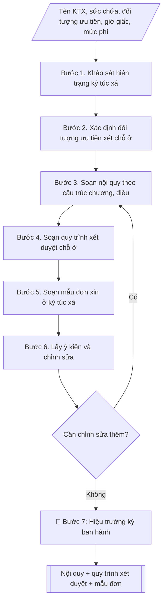

# Soạn nội quy ký túc xá và quy trình xét duyệt chỗ ở

## Định dạng và file đầu ra

Định dạng đầu ra có thể chọn theo sản phẩm/yêu cầu: .docx, .pdf. Đọc mục “Định dạng bổ sung” trong quy cách đầu ra trước khi chọn.

**Phải tạo file thực tế để tải xuống, không chỉ trả nội dung trong chat.** Định dạng mặc định của skill: **.docx**. Nếu có bảng số liệu nghiệp vụ yêu cầu file bảng tính riêng, tạo thêm Excel theo yêu cầu; không tự tạo file kiểm tra. Không chờ người dùng yêu cầu xuất file lần nữa. Ưu tiên định dạng người dùng chỉ định; đọc quy tắc xuất file tại references/quy-cach-dau-ra.md.

## Quy cách đầu ra và thông tin thiếu
Khi dựng file Word/Excel, áp dụng mục “Thể thức và bảng biểu khi dựng file” trong quy cách đầu ra (cỡ chữ từng thành phần, bảng nhiều trang, số trang, phụ lục). Đọc [quy cách và cấu trúc sản phẩm](references/quy-cach-dau-ra.md) trước khi soạn/xuất. File giao chỉ gồm sản phẩm nghiệp vụ được yêu cầu; kiểm tra nội bộ không xuất kèm. Thiếu thông tin thì giữ nguyên trường/mục và chỗ điền theo mẫu gốc (dòng dấu chấm, dấu gạch hoặc ô trống); không tự điền dữ liệu mẫu, số 0, mã chờ xác minh hay dòng chờ ký. Mẫu chuyên ngành còn áp dụng được ưu tiên về cấu trúc, mã biểu và người ký. Bản đầy đủ: [quy tắc chung](references/quy-tac-chung.md).

## Kiểm soát áp dụng và phê duyệt
Trước khi chạy, xác định `ngay_ap_dung`, `loai_hinh_truong`, `quy_che_noi_bo`, `nguon_du_lieu`, `nguoi_kiem_duyet`; chỉ hỏi thông tin liên quan nghiệp vụ, không dùng giá trị giả định thay dữ liệu bắt buộc. Đối chiếu căn cứ pháp lý với văn bản gốc, hiệu lực, điều khoản áp dụng và chuyển tiếp. Bản đầy đủ: [quy tắc chung](references/quy-tac-chung.md).

## Giới hạn và human gate
AI hỗ trợ chuẩn bị và đối chiếu; cán bộ phụ trách kiểm tra dữ liệu/căn cứ, người có thẩm quyền duyệt và ký. Không đánh dấu đã ký, đã duyệt, đã công bố khi chưa có chứng cứ. Dữ liệu sinh viên, sức khỏe, nhân sự, tài chính chỉ dùng theo mục đích và phân quyền, che thông tin định danh khi dùng ví dụ (Luật 91/2025/QH15, hiệu lực 01/01/2026); không tải dữ liệu lên dịch vụ ngoài khi chưa có quyền. Bản đầy đủ: [quy tắc chung](references/quy-tac-chung.md).

## Khi nào dùng
Khi Ban quản lý ký túc xá (thuộc Phòng Công tác sinh viên) cần:
- Soạn mới hoặc sửa đổi, bổ sung nội quy ký túc xá;
- Xây dựng/quy định lại quy trình xét duyệt, tiếp nhận sinh viên vào ở ký túc xá;
- Ban hành mẫu đơn xin ở ký túc xá thống nhất toàn trường.

## Đầu vào (Input)

| Trường | Mô tả | Bắt buộc |
|---|---|---|
| `ten_ktx` | Tên ký túc xá / khu nội trú | Có |
| `suc_chua` | Sức chứa (số chỗ ở) của ký túc xá | Có |
| `doi_tuong_uu_tien` | Các nhóm đối tượng được ưu tiên xét chỗ ở | Có |
| `gio_giac` | Giờ mở/đóng cổng, giờ tự học, giờ tắt đèn (nếu có quy định riêng) | Không |
| `muc_phi` | Mức thu phí nội trú (theo tháng/học kỳ) | Không |
| `hinh_thuc_xu_ly` | Các hình thức xử lý vi phạm (khiển trách, cảnh cáo, buộc thôi ở KTX...) | Không (mặc định: 3 mức) |
| `nguoi_ky` | Người ký ban hành (thường là Hiệu trưởng) | Không (mặc định: Hiệu trưởng) |

## Quy trình

**Bước 1. Khảo sát hiện trạng ký túc xá**
- Làm gì: khảo sát sức chứa, cơ sở vật chất, tình hình an ninh trật tự, các vi phạm phổ biến
  của sinh viên nội trú trong thời gian qua; tổng hợp thành báo cáo hiện trạng.
- Dùng input: `ten_ktx`, `suc_chua`.
- Vai trò: Chuyên viên Phòng Công tác sinh viên · AI hỗ trợ: chuẩn bị hồ sơ trình ký, nhắc lịch và theo dõi tiến độ · ⏱ ~1–2 ngày làm việc (ước tính)
- Lưu ý nghiệp vụ: số liệu vi phạm lấy từ sổ theo dõi của Ban quản lý KTX; hiện trạng là căn
  cứ để điều chỉnh nội dung nội quy cho sát thực tế.
- → Kết quả bước: báo cáo hiện trạng KTX (cơ sở vật chất, an ninh trật tự, vi phạm phổ biến).

**Bước 2. Xác định đối tượng ưu tiên xét chỗ ở**
- Làm gì: xác định thứ tự ưu tiên theo quy định: sinh viên diện chính sách, con liệt sĩ/
  thương binh; sinh viên dân tộc thiểu số vùng khó khăn; sinh viên mồ côi; sinh viên có hoàn
  cảnh khó khăn; sinh viên năm thứ nhất; sinh viên ở xa...
- Dùng input: `doi_tuong_uu_tien`.
- Vai trò: Trưởng Phòng Công tác sinh viên · AI hỗ trợ: soạn danh sách dự thảo · ⏱ ~1–2 giờ (ước tính)
- Lưu ý nghiệp vụ: thứ tự ưu tiên phải công khai, minh bạch và thống nhất với quy định của
  trường.
- → Kết quả bước: danh sách thứ tự ưu tiên xét chỗ ở đã chốt.

**Bước 3. Soạn nội quy theo cấu trúc chương/điều**
- Làm gì: soạn nội quy tối thiểu 6 chương: Chương I – Quy định chung (phạm vi, đối tượng áp
  dụng); Chương II – Quyền và nghĩa vụ của sinh viên nội trú; Chương III – Giờ giấc sinh hoạt,
  an ninh trật tự; Chương IV – Vệ sinh môi trường, bảo vệ tài sản; Chương V – Khen thưởng và
  xử lý vi phạm; Chương VI – Điều khoản thi hành; đưa giờ giấc, mức phí, hình thức xử lý vào
  điều khoản tương ứng.
- Dùng input: `ten_ktx`, `suc_chua`, `gio_giac`, `muc_phi`, `hinh_thuc_xu_ly`, báo cáo hiện
  trạng (kết quả bước 1).
- Vai trò: Chuyên viên Phòng Công tác sinh viên · AI hỗ trợ: soạn dự thảo nội quy theo cấu trúc chương, điều · ⏱ ~3–5 giờ (ước tính)
- Lưu ý nghiệp vụ: mỗi điều chỉ quy định một nội dung, diễn đạt rõ ràng, không chồng chéo;
  mức xử lý vi phạm tăng dần theo mức độ vi phạm.
- → Kết quả bước: dự thảo nội quy KTX theo chương/điều.

**Bước 4. Soạn quy trình xét duyệt chỗ ở**
- Làm gì: quy định 5 bước: (1) thông báo tiếp nhận (trước mỗi học kỳ ít nhất 20 ngày); (2)
  nộp hồ sơ (đơn theo mẫu thống nhất + giấy tờ chứng minh đối tượng ưu tiên); (3) xét duyệt
  (trong 05 ngày làm việc kể từ hết hạn nộp hồ sơ, theo thứ tự ưu tiên); (4) công bố kết quả
  (niêm yết 03 ngày làm việc) và giải quyết khiếu nại (05 ngày làm việc); (5) ký hợp đồng nội
  trú, nộp phí, bàn giao phòng theo biên bản bàn giao tài sản.
- Dùng input: danh sách ưu tiên (kết quả bước 2), `suc_chua`.
- Vai trò: Chuyên viên Phòng Công tác sinh viên · AI hỗ trợ: soạn dự thảo quy trình xét duyệt chỗ ở (5 bước) · ⏱ ~2–3 giờ (ước tính)
- Lưu ý nghiệp vụ: thời hạn mỗi bước cụ thể, tính bằng ngày làm việc; quy định rõ thành phần
  Hội đồng xét duyệt.
- → Kết quả bước: dự thảo quy trình xét duyệt chỗ ở (5 bước, có thời hạn cụ thể).

**Bước 5. Soạn mẫu đơn xin ở ký túc xá**
- Làm gì: soạn mẫu đơn thống nhất: Quốc hiệu – Tiêu ngữ; tên đơn; kính gửi; thông tin người
  làm đơn (họ tên, ngày sinh, mã SV, lớp, khoa, SĐT, email, hộ khẩu thường trú); đối tượng ưu
  tiên và giấy tờ chứng minh kèm theo; cam kết chấp hành nội quy, đóng phí đúng hạn; địa
  danh, ngày tháng; chữ ký người làm đơn; kèm danh mục giấy tờ chứng minh đối tượng ưu tiên.
- Dùng input: danh sách ưu tiên (kết quả bước 2), `ten_ktx`.
- Vai trò: Chuyên viên Phòng Công tác sinh viên · AI hỗ trợ: soạn mẫu đơn theo form thống nhất · ⏱ ~30–60 phút (ước tính)
- Lưu ý nghiệp vụ: mẫu đơn phải thu đủ thông tin để xét duyệt mà không yêu cầu giấy tờ thừa.
- → Kết quả bước: mẫu đơn xin ở KTX thống nhất + danh mục giấy tờ chứng minh đối tượng ưu
  tiên.

**Bước 6. Lấy ý kiến và chỉnh sửa**
- Làm gì: gửi dự thảo (nội quy + quy trình xét duyệt + mẫu đơn) lấy ý kiến Ban quản lý KTX,
  Phòng CTSV, đại diện sinh viên nội trú; tổng hợp ý kiến, chỉnh sửa dự thảo.
- Dùng input: kết quả bước 3–5.
- Vai trò: Trưởng Phòng Công tác sinh viên · AI hỗ trợ: tổng hợp ý kiến · ⏱ ~5–10 ngày làm việc (ước tính)
- Lưu ý nghiệp vụ: ghi nhận đầy đủ ý kiến, nêu rõ lý do tiếp thu/không tiếp thu; nếu còn nhiều
  ý kiến trái chiều thì tổ chức lấy ý kiến vòng 2.
- → Kết quả bước: dự thảo hoàn chỉnh sau lấy ý kiến (nội quy + quy trình + mẫu đơn).

**Bước 7. Trình ký ban hành và công khai**
- Làm gì: soạn tờ trình + quyết định ban hành của Hiệu trưởng; sau khi ký, niêm yết công khai
  tại ký túc xá và đăng trên cổng thông tin sinh viên.
- Dùng input: `nguoi_ky`, dự thảo hoàn chỉnh (kết quả bước 6).
- Vai trò: Hiệu trưởng · AI hỗ trợ: chuẩn bị hồ sơ trình ký, nhắc lịch và theo dõi tiến độ · ⏱ ~1–2 ngày làm việc (ước tính, chưa kể thời gian chờ ký)
- Lưu ý nghiệp vụ: nội quy chỉ có hiệu lực sau khi ban hành và công khai; lưu hồ sơ ban hành
  đầy đủ.
- → Kết quả bước: quyết định ban hành + nội quy + quy trình xét duyệt + mẫu đơn, đã công khai.

## Luồng quy trình (Workflow)

## Đầu ra

File nghiệp vụ thực tế theo định dạng mặc định ở đầu skill hoặc định dạng người dùng yêu cầu, kèm liên kết tải trong phản hồi cuối.

Sản phẩm nghiệp vụ hoàn chỉnh theo [quy cách và cấu trúc](references/quy-cach-dau-ra.md), giữ các trường chưa có dữ liệu ở trạng thái trống. Không xuất kèm checklist/phụ lục kiểm tra đầu ra.

## Kiểm tra nội bộ trước khi giao

- [ ] Bố cục khớp mẫu áp dụng và cấu trúc tại references/quy-cach-dau-ra.md.
- [ ] Tên KTX, sức chứa, đối tượng ưu tiên, giờ giấc, mức phí trong output khớp với Input đã cho.
- [ ] Không bịa đặt số liệu, mức phí, tên thành viên Hội đồng xét duyệt.
- [ ] Đúng thể thức: quyết định có căn cứ, Điều 1–3, nơi nhận, chữ ký; nội quy cấu trúc chương/điều, mỗi điều một nội dung, diễn đạt rõ ràng, không chồng chéo.
- [ ] Căn cứ pháp lý (Thông tư 10/2016/TT-BGDĐT) còn hiệu lực.
- [ ] Đã qua Human gate: Hiệu trưởng ký ban hành; nội quy đã công khai (niêm yết tại KTX + đăng trên cổng thông tin sinh viên).
- [ ] Mức xử lý vi phạm tăng dần theo mức độ vi phạm; thứ tự ưu tiên xét chỗ ở công khai, minh bạch; quy định rõ thành phần Hội đồng xét duyệt; hồ sơ xét duyệt lưu đầy đủ.

Tiêu chí đạt = tất cả các ô được đánh dấu.

## Căn cứ & lưu ý
- Quy chế công tác sinh viên đối với chương trình đào tạo đại học hệ chính quy (Thông tư 10/2016/TT-BGDĐT); nội quy KTX do Hiệu trưởng ban hành sau khi lấy ý kiến các đơn vị liên quan.
- Thứ tự ưu tiên xét chỗ ở phải công khai, minh bạch; hồ sơ xét duyệt lưu trữ đầy đủ để phục vụ thanh tra, kiểm tra.
- Không dùng tên thật của trường/cá nhân khi mô phỏng; mọi số liệu, tên người trong ví dụ đều giả lập.

## Quản trị phiên bản
- Phiên bản gói `1.3.2` (cập nhật 2026-10-10); hồ sơ đầy đủ tại [references/version.json](references/version.json).
- Người phê duyệt nghiệp vụ: **chưa chỉ định**. Trạng thái: dự thảo nghiệp vụ; kiểm tra pháp lý trước thực thi. Ngày cập nhật không đồng nghĩa mọi văn bản đã được rà soát toàn văn.
- Giấy phép theo LICENSE của kho (bản quyền CES Global). Lịch sử thay đổi: CHANGELOG.md.
