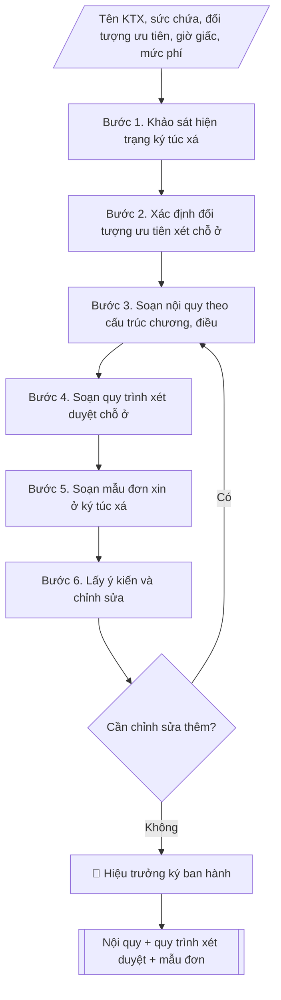

# Skill: Soạn nội quy ký túc xá và quy trình xét duyệt chỗ ở

## Khi nào dùng
Khi Ban quản lý ký túc xá (thuộc Phòng Công tác sinh viên) cần:
- Soạn mới hoặc sửa đổi, bổ sung nội quy ký túc xá;
- Xây dựng/quy định lại quy trình xét duyệt, tiếp nhận sinh viên vào ở ký túc xá;
- Ban hành mẫu đơn xin ở ký túc xá thống nhất toàn trường.

## Đầu vào (Input)

| Trường | Mô tả | Bắt buộc |
|---|---|---|
| `ten_ktx` | Tên ký túc xá / khu nội trú | Có |
| `suc_chua` | Sức chứa (số chỗ ở) của ký túc xá | Có |
| `doi_tuong_uu_tien` | Các nhóm đối tượng được ưu tiên xét chỗ ở | Có |
| `gio_giac` | Giờ mở/đóng cổng, giờ tự học, giờ tắt đèn (nếu có quy định riêng) | Không |
| `muc_phi` | Mức thu phí nội trú (theo tháng/học kỳ) | Không |
| `hinh_thuc_xu_ly` | Các hình thức xử lý vi phạm (khiển trách, cảnh cáo, buộc thôi ở KTX...) | Không (mặc định: 3 mức) |
| `nguoi_ky` | Người ký ban hành (thường là Hiệu trưởng) | Không (mặc định: Hiệu trưởng) |

## Quy trình

**Bước 1. Khảo sát hiện trạng ký túc xá**
- Làm gì: khảo sát sức chứa, cơ sở vật chất, tình hình an ninh trật tự, các vi phạm phổ biến
  của sinh viên nội trú trong thời gian qua; tổng hợp thành báo cáo hiện trạng.
- Dùng input: `ten_ktx`, `suc_chua`.
- Vai trò: Chuyên viên Phòng Công tác sinh viên · AI hỗ trợ: chuẩn bị hồ sơ trình ký, nhắc lịch và theo dõi tiến độ · ⏱ ~1–2 ngày làm việc (ước tính)
- Lưu ý nghiệp vụ: số liệu vi phạm lấy từ sổ theo dõi của Ban quản lý KTX; hiện trạng là căn
  cứ để điều chỉnh nội dung nội quy cho sát thực tế.
- → Kết quả bước: báo cáo hiện trạng KTX (cơ sở vật chất, an ninh trật tự, vi phạm phổ biến).

**Bước 2. Xác định đối tượng ưu tiên xét chỗ ở**
- Làm gì: xác định thứ tự ưu tiên theo quy định: sinh viên diện chính sách, con liệt sĩ/
  thương binh; sinh viên dân tộc thiểu số vùng khó khăn; sinh viên mồ côi; sinh viên có hoàn
  cảnh khó khăn; sinh viên năm thứ nhất; sinh viên ở xa...
- Dùng input: `doi_tuong_uu_tien`.
- Vai trò: Trưởng Phòng Công tác sinh viên · AI hỗ trợ: soạn danh sách dự thảo · ⏱ ~1–2 giờ (ước tính)
- Lưu ý nghiệp vụ: thứ tự ưu tiên phải công khai, minh bạch và thống nhất với quy định của
  trường.
- → Kết quả bước: danh sách thứ tự ưu tiên xét chỗ ở đã chốt.

**Bước 3. Soạn nội quy theo cấu trúc chương/điều**
- Làm gì: soạn nội quy tối thiểu 6 chương: Chương I – Quy định chung (phạm vi, đối tượng áp
  dụng); Chương II – Quyền và nghĩa vụ của sinh viên nội trú; Chương III – Giờ giấc sinh hoạt,
  an ninh trật tự; Chương IV – Vệ sinh môi trường, bảo vệ tài sản; Chương V – Khen thưởng và
  xử lý vi phạm; Chương VI – Điều khoản thi hành; đưa giờ giấc, mức phí, hình thức xử lý vào
  điều khoản tương ứng.
- Dùng input: `ten_ktx`, `suc_chua`, `gio_giac`, `muc_phi`, `hinh_thuc_xu_ly`, báo cáo hiện
  trạng (kết quả bước 1).
- Vai trò: Chuyên viên Phòng Công tác sinh viên · AI hỗ trợ: soạn dự thảo nội quy theo cấu trúc chương, điều · ⏱ ~3–5 giờ (ước tính)
- Lưu ý nghiệp vụ: mỗi điều chỉ quy định một nội dung, diễn đạt rõ ràng, không chồng chéo;
  mức xử lý vi phạm tăng dần theo mức độ vi phạm.
- → Kết quả bước: dự thảo nội quy KTX theo chương/điều.

**Bước 4. Soạn quy trình xét duyệt chỗ ở**
- Làm gì: quy định 5 bước: (1) thông báo tiếp nhận (trước mỗi học kỳ ít nhất 20 ngày); (2)
  nộp hồ sơ (đơn theo mẫu thống nhất + giấy tờ chứng minh đối tượng ưu tiên); (3) xét duyệt
  (trong 05 ngày làm việc kể từ hết hạn nộp hồ sơ, theo thứ tự ưu tiên); (4) công bố kết quả
  (niêm yết 03 ngày làm việc) và giải quyết khiếu nại (05 ngày làm việc); (5) ký hợp đồng nội
  trú, nộp phí, bàn giao phòng theo biên bản bàn giao tài sản.
- Dùng input: danh sách ưu tiên (kết quả bước 2), `suc_chua`.
- Vai trò: Chuyên viên Phòng Công tác sinh viên · AI hỗ trợ: soạn dự thảo quy trình xét duyệt chỗ ở (5 bước) · ⏱ ~2–3 giờ (ước tính)
- Lưu ý nghiệp vụ: thời hạn mỗi bước cụ thể, tính bằng ngày làm việc; quy định rõ thành phần
  Hội đồng xét duyệt.
- → Kết quả bước: dự thảo quy trình xét duyệt chỗ ở (5 bước, có thời hạn cụ thể).

**Bước 5. Soạn mẫu đơn xin ở ký túc xá**
- Làm gì: soạn mẫu đơn thống nhất: Quốc hiệu – Tiêu ngữ; tên đơn; kính gửi; thông tin người
  làm đơn (họ tên, ngày sinh, mã SV, lớp, khoa, SĐT, email, hộ khẩu thường trú); đối tượng ưu
  tiên và giấy tờ chứng minh kèm theo; cam kết chấp hành nội quy, đóng phí đúng hạn; địa
  danh, ngày tháng; chữ ký người làm đơn; kèm danh mục giấy tờ chứng minh đối tượng ưu tiên.
- Dùng input: danh sách ưu tiên (kết quả bước 2), `ten_ktx`.
- Vai trò: Chuyên viên Phòng Công tác sinh viên · AI hỗ trợ: soạn mẫu đơn theo form thống nhất · ⏱ ~30–60 phút (ước tính)
- Lưu ý nghiệp vụ: mẫu đơn phải thu đủ thông tin để xét duyệt mà không yêu cầu giấy tờ thừa.
- → Kết quả bước: mẫu đơn xin ở KTX thống nhất + danh mục giấy tờ chứng minh đối tượng ưu
  tiên.

**Bước 6. Lấy ý kiến và chỉnh sửa**
- Làm gì: gửi dự thảo (nội quy + quy trình xét duyệt + mẫu đơn) lấy ý kiến Ban quản lý KTX,
  Phòng CTSV, đại diện sinh viên nội trú; tổng hợp ý kiến, chỉnh sửa dự thảo.
- Dùng input: kết quả bước 3–5.
- Vai trò: Trưởng Phòng Công tác sinh viên · AI hỗ trợ: tổng hợp ý kiến · ⏱ ~5–10 ngày làm việc (ước tính)
- Lưu ý nghiệp vụ: ghi nhận đầy đủ ý kiến, nêu rõ lý do tiếp thu/không tiếp thu; nếu còn nhiều
  ý kiến trái chiều thì tổ chức lấy ý kiến vòng 2.
- → Kết quả bước: dự thảo hoàn chỉnh sau lấy ý kiến (nội quy + quy trình + mẫu đơn).

**Bước 7. Trình ký ban hành và công khai**
- Làm gì: soạn tờ trình + quyết định ban hành của Hiệu trưởng; sau khi ký, niêm yết công khai
  tại ký túc xá và đăng trên cổng thông tin sinh viên.
- Dùng input: `nguoi_ky`, dự thảo hoàn chỉnh (kết quả bước 6).
- Vai trò: Hiệu trưởng · AI hỗ trợ: chuẩn bị hồ sơ trình ký, nhắc lịch và theo dõi tiến độ · ⏱ ~1–2 ngày làm việc (ước tính, chưa kể thời gian chờ ký)
- Lưu ý nghiệp vụ: nội quy chỉ có hiệu lực sau khi ban hành và công khai; lưu hồ sơ ban hành
  đầy đủ.
- → Kết quả bước: quyết định ban hành + nội quy + quy trình xét duyệt + mẫu đơn, đã công khai.

## Luồng quy trình (Workflow)


## Đầu ra (Output)
- Văn bản nội quy ký túc xá hoàn chỉnh theo chương/điều.
- Quy trình xét duyệt chỗ ở (đối tượng ưu tiên, hồ sơ, thời gian, các bước thực hiện).
- Mẫu đơn xin ở ký túc xá.

**Cấu trúc output chuẩn:** khung cố định của ba sản phẩm:
A. Quyết định ban hành kèm Nội quy:
1. Thể thức quyết định ban hành: Quốc hiệu – Tiêu ngữ; số, ký hiệu; địa danh, ngày tháng
   năm; "QUYẾT ĐỊNH" + tên ("Ban hành Nội quy ..."); chức danh người ký (HIỆU TRƯỞNG...);
   các căn cứ; Điều 1 (ban hành kèm theo), Điều 2 (hiệu lực), Điều 3 (trách nhiệm thi hành);
   nơi nhận; chữ ký.
2. Nội quy kèm theo: tên nội quy + căn cứ ban hành; Chương I. Quy định chung (Điều 1 – phạm
   vi, đối tượng áp dụng; Điều 2 – nguyên tắc chung); Chương II. Quyền và nghĩa vụ của sinh
   viên nội trú; Chương III. Giờ giấc sinh hoạt, an ninh trật tự; Chương IV. Vệ sinh môi
   trường, bảo vệ tài sản; Chương V. Khen thưởng và xử lý vi phạm; Chương VI. Điều khoản thi
   hành.
B. Quy trình xét duyệt chỗ ở — 5 bước cố định: Bước 1. Thông báo tiếp nhận; Bước 2. Nộp hồ
   sơ; Bước 3. Xét duyệt (theo thứ tự ưu tiên); Bước 4. Công bố kết quả và giải quyết khiếu
   nại; Bước 5. Ký hợp đồng nội trú và bàn giao phòng.
C. Mẫu đơn xin ở KTX: Quốc hiệu – Tiêu ngữ; tên đơn "ĐƠN XIN Ở KÝ TÚC XÁ"; Kính gửi; thông
   tin người làm đơn; đối tượng ưu tiên + giấy tờ chứng minh kèm theo; cam kết chấp hành nội
   quy; địa danh, ngày tháng; chữ ký người làm đơn.

## Checklist nghiệm thu

- [ ] Đủ ba sản phẩm theo "Cấu trúc output chuẩn": (A) quyết định ban hành + nội quy đủ 6 chương (I. Quy định chung; II. Quyền và nghĩa vụ của sinh viên nội trú; III. Giờ giấc sinh hoạt, an ninh trật tự; IV. Vệ sinh môi trường, bảo vệ tài sản; V. Khen thưởng và xử lý vi phạm; VI. Điều khoản thi hành); (B) quy trình xét duyệt chỗ ở đủ 5 bước với thời hạn cụ thể tính bằng ngày làm việc; (C) mẫu đơn xin ở KTX đủ các mục (thông tin người làm đơn, đối tượng ưu tiên + giấy tờ chứng minh, cam kết, chữ ký).
- [ ] Tên KTX, sức chứa, đối tượng ưu tiên, giờ giấc, mức phí trong output khớp với Input đã cho.
- [ ] Không bịa đặt số liệu, mức phí, tên thành viên Hội đồng xét duyệt.
- [ ] Đúng thể thức: quyết định có căn cứ, Điều 1–3, nơi nhận, chữ ký; nội quy cấu trúc chương/điều, mỗi điều một nội dung, diễn đạt rõ ràng, không chồng chéo.
- [ ] Căn cứ pháp lý (Thông tư 10/2016/TT-BGDĐT) còn hiệu lực.
- [ ] Đã qua Human gate: Hiệu trưởng ký ban hành; nội quy đã công khai (niêm yết tại KTX + đăng trên cổng thông tin sinh viên).
- [ ] Mức xử lý vi phạm tăng dần theo mức độ vi phạm; thứ tự ưu tiên xét chỗ ở công khai, minh bạch; quy định rõ thành phần Hội đồng xét duyệt; hồ sơ xét duyệt lưu đầy đủ.

Tiêu chí đạt = tất cả các ô được đánh dấu.


## Ví dụ mô phỏng (dữ liệu giả lập)

> Tất cả tên trường, cá nhân, số liệu dưới đây đều là **giả lập**, không liên quan tổ chức/cá nhân có thật.

### Input mẫu

| Trường | Giá trị |
|---|---|
| `ten_ktx` | Ký túc xá A (2 tòa nhà A, B) |
| `suc_chua` | 3.250 chỗ ở |
| `doi_tuong_uu_tien` | Diện chính sách; dân tộc thiểu số vùng khó khăn; mồ côi; hoàn cảnh khó khăn; sinh viên năm thứ nhất |
| `gio_giac` | Mở cổng 05h30 – đóng cổng 23h00; giờ tự học 19h30 – 22h00; tắt đèn 23h00 |
| `muc_phi` | 350.000 đồng/sinh viên/tháng (giả lập) |

### Output mẫu

#### 1. Nội quy ký túc xá

```
TRƯỜNG ĐẠI HỌC A               CỘNG HÒA XÃ HỘI CHỦ NGHĨA VIỆT NAM
                                                Độc lập – Tự do – Hạnh phúc
      Số: 88/QĐ-ĐHA
                                                 Thành phố C, ngày 15 tháng 8 năm 2026

                          QUYẾT ĐỊNH
        Ban hành Nội quy Ký túc xá A
              (Nội dung dưới đây là dữ liệu giả lập)

                         HIỆU TRƯỞNG TRƯỜNG ĐẠI HỌC A

Căn cứ Quy chế công tác sinh viên đối với chương trình đào tạo đại học hệ chính quy;
Căn cứ nhu cầu quản lý sinh viên nội trú của Nhà trường;

                                QUYẾT ĐỊNH:

Điều 1. Ban hành kèm theo Quyết định này Nội quy Ký túc xá A.
Điều 2. Quyết định này có hiệu lực kể từ ngày ký.
Điều 3. Trưởng phòng Công tác sinh viên, Trưởng ban Quản lý ký túc xá và sinh viên
nội trú chịu trách nhiệm thi hành Quyết định này./.

Nơi nhận:                                          HIỆU TRƯỞNG
- Như Điều 3;                                          (đã ký)
- Lưu: VT, CTSV.

                                    PGS.TS. Trần Văn B
                          (Tên cá nhân trong ví dụ là giả lập)

------------------------------------------------------------------

              NỘI QUY KÝ TÚC XÁ A
 (Ban hành kèm theo Quyết định số 88/QĐ-ĐHA ngày 15/8/2026)

Chương I. QUY ĐỊNH CHUNG

Điều 1. Phạm vi và đối tượng áp dụng
1. Nội quy này quy định việc quản lý, sử dụng Ký túc xá A (tòa nhà A, B;
   sức chứa 3.250 chỗ ở).
2. Áp dụng đối với sinh viên nội trú, khách đến liên hệ công tác và cán bộ quản lý
   ký túc xá.

Điều 2. Nguyên tắc chung
Sinh viên nội trú có trách nhiệm chấp hành nội quy, giữ gìn an ninh trật tự, vệ sinh
môi trường, bảo vệ tài sản chung và xây dựng nếp sống văn minh trong ký túc xá.

Chương II. QUYỀN VÀ NGHĨA VỤ CỦA SINH VIÊN NỘI TRÚ

Điều 3. Quyền của sinh viên nội trú
1. Được bố trí chỗ ở theo hợp đồng nội trú đã ký; được sử dụng các trang thiết bị,
   tiện ích phục vụ sinh hoạt trong ký túc xá.
2. Được tham gia các hoạt động văn hóa, thể thao do Ban quản lý ký túc xá tổ chức.
3. Được kiến nghị, phản ánh với Ban quản lý về điều kiện ăn ở, sinh hoạt.

Điều 4. Nghĩa vụ của sinh viên nội trú
1. Chấp hành nghiêm nội quy ký túc xá, nội quy phòng ở và sự quản lý của Ban quản lý.
2. Đóng phí nội trú đầy đủ, đúng thời hạn: 350.000 đồng/sinh viên/tháng (giả lập).
3. Giữ gìn tài sản được bàn giao; bồi thường thiệt hại do mình gây ra.
4. Không tự ý đổi phòng, chuyển nhượng chỗ ở cho người khác khi chưa được phép.

Chương III. GIỜ GIẤC SINH HOẠT, AN NINH TRẬT TỰ

Điều 5. Giờ giấc sinh hoạt
1. Cổng ký túc xá mở từ 05 giờ 30 đến 23 giờ 00 hằng ngày.
2. Giờ tự học tập trung: từ 19 giờ 30 đến 22 giờ 00; tắt đèn đi ngủ lúc 23 giờ 00.
3. Sinh viên về muộn sau 23 giờ 00 phải đăng ký với bảo vệ trực và ghi rõ lý do.

Điều 6. An ninh trật tự
1. Không đưa người lạ vào ký túc xá khi chưa đăng ký với Ban quản lý; khách đến
   thăm chỉ được tiếp tại phòng khách đến 21 giờ 30.
2. Nghiêm cấm: cờ bạc, rượu bia say xỉn gây mất trật tự, tàng trữ vũ khí, chất cháy nổ,
   chất ma túy và các tệ nạn xã hội khác trong ký túc xá.
3. Không nuôi động vật trong phòng ở; không nấu ăn bằng bếp gas, bếp điện công suất
   lớn trong phòng ở.

Chương IV. VỆ SINH MÔI TRƯỜNG, BẢO VỆ TÀI SẢN

Điều 7. Vệ sinh môi trường
1. Sinh viên có trách nhiệm giữ vệ sinh phòng ở, hành lang, khu vệ sinh chung;
   thực hiện trực nhật theo phân công của phòng.
2. Không vứt rác bừa bãi; đổ rác đúng nơi, đúng giờ quy định.

Điều 8. Bảo vệ, sử dụng tài sản
1. Sử dụng đúng mục đích, giữ gìn trang thiết bị trong phòng ở và khu vực chung.
2. Mọi hư hỏng phải báo ngay cho Ban quản lý để sửa chữa; sinh viên làm hư hỏng
   tài sản phải bồi thường theo giá trị thiệt hại thực tế.

Chương V. KHEN THƯỞNG VÀ XỬ LÝ VI PHẠM

Điều 9. Khen thưởng
Tập thể phòng, cá nhân sinh viên nội trú có thành tích trong giữ gìn an ninh trật tự,
vệ sinh, xây dựng nếp sống văn minh được Ban quản lý đề nghị Nhà trường khen thưởng.

Điều 10. Xử lý vi phạm
1. Vi phạm lần đầu, mức độ nhẹ: nhắc nhở, phê bình trước phòng ở.
2. Vi phạm nhiều lần hoặc mức độ nghiêm trọng: cảnh cáo, lập biên bản, thông báo
   về khoa và gia đình sinh viên.
3. Vi phạm nghiêm trọng (tàng trữ chất cấm, đánh nhau gây thương tích, trộm cắp...):
   buộc thôi ở ký túc xá, đồng thời xử lý kỷ luật theo Quy chế công tác sinh viên.

Chương VI. ĐIỀU KHOẢN THI HÀNH

Điều 11. Điều khoản thi hành
1. Nội quy này có hiệu lực kể từ ngày ký Quyết định ban hành.
2. Mọi trường hợp chưa được quy định trong Nội quy do Ban quản lý ký túc xá đề xuất,
   Trưởng phòng Công tác sinh viên trình Hiệu trưởng quyết định.
```

#### 2. Quy trình xét duyệt chỗ ở ký túc xá

**Bước 1. Thông báo tiếp nhận** (trước mỗi học kỳ ít nhất 20 ngày): Ban quản lý KTX thông báo số lượng chỗ trống, đối tượng, hồ sơ và thời hạn nộp đơn trên cổng thông tin sinh viên.

**Bước 2. Nộp hồ sơ**: sinh viên nộp đơn xin ở KTX (theo mẫu thống nhất) kèm giấy tờ chứng minh đối tượng ưu tiên (nếu có) tại Văn phòng Ban quản lý KTX hoặc qua cổng đăng ký trực tuyến.

**Bước 3. Xét duyệt** (trong 05 ngày làm việc kể từ hết hạn nộp hồ sơ): Hội đồng xét duyệt (Trưởng phòng CTSV, Trưởng ban Quản lý KTX, đại diện Đoàn Thanh niên) xét theo thứ tự ưu tiên:
1. Sinh viên diện chính sách, con liệt sĩ, con thương binh;
2. Sinh viên dân tộc thiểu số vùng đặc biệt khó khăn;
3. Sinh viên mồ côi cả cha lẫn mẹ;
4. Sinh viên có hoàn cảnh gia đình khó khăn (có xác nhận địa phương);
5. Sinh viên năm thứ nhất có hộ khẩu xa trường;
6. Các trường hợp còn lại xét theo thời gian nộp hồ sơ.

**Bước 4. Công bố kết quả**: niêm yết danh sách tại KTX và cổng thông tin sinh viên trong 03 ngày làm việc; giải quyết khiếu nại (nếu có) trong 05 ngày làm việc.

**Bước 5. Ký hợp đồng nội trú và bàn giao phòng**: sinh viên trúng tuyển ký hợp đồng nội trú, nộp phí học kỳ, nhận phòng theo biên bản bàn giao tài sản.

#### 3. Mẫu đơn xin ở ký túc xá

```
              CỘNG HÒA XÃ HỘI CHỦ NGHĨA VIỆT NAM
                  Độc lập – Tự do – Hạnh phúc
                  -------------------------------

                         ĐƠN XIN Ở KÝ TÚC XÁ
                    (Mẫu này là dữ liệu giả lập)

Kính gửi: Ban Quản lý Ký túc xá A – Trường Đại học A

Tên tôi là: ....................................  Ngày sinh: ...../...../..........
Mã sinh viên: ....................  Lớp: ............  Khoa: ....................
Số điện thoại: ....................  Email: ....................
Hộ khẩu thường trú: ...............................................................

Tôi làm đơn này đề nghị được xét duyệt vào ở Ký túc xá A, năm học ............
Thuộc đối tượng ưu tiên (nếu có): .....................................................
Giấy tờ chứng minh kèm theo: .......................................................

Tôi xin cam kết chấp hành nghiêm Nội quy Ký túc xá, đóng phí nội trú đầy đủ,
đúng hạn và chịu trách nhiệm trước Nhà trường về mọi vi phạm của bản thân.

                                                     Thành phố C, ngày ..... tháng ..... năm .....
                                                               Người làm đơn
                                                              (ký, ghi rõ họ tên)
```

## Căn cứ & lưu ý
- Quy chế công tác sinh viên đối với chương trình đào tạo đại học hệ chính quy (Thông tư 10/2016/TT-BGDĐT); nội quy KTX do Hiệu trưởng ban hành sau khi lấy ý kiến các đơn vị liên quan.
- Thứ tự ưu tiên xét chỗ ở phải công khai, minh bạch; hồ sơ xét duyệt lưu trữ đầy đủ để phục vụ thanh tra, kiểm tra.
- Không dùng tên thật của trường/cá nhân khi mô phỏng; mọi số liệu, tên người trong ví dụ đều giả lập.
