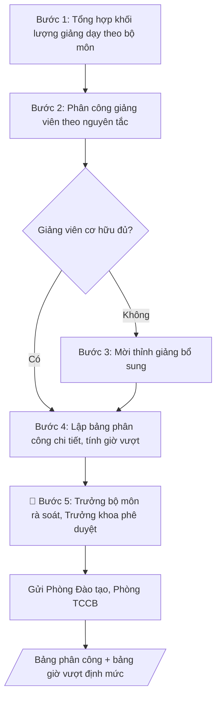

# Phân công giảng dạy học kỳ

## Định dạng và file đầu ra

Định dạng đầu ra có thể chọn theo sản phẩm/yêu cầu: .xlsx, .csv, .pdf. Đọc mục “Định dạng bổ sung” trong quy cách đầu ra trước khi chọn.

**Phải tạo file thực tế để tải xuống, không chỉ trả nội dung trong chat.** Định dạng mặc định của skill: **.xlsx**. Nếu yêu cầu gồm cả báo cáo thuyết minh, tạo thêm file Word cho báo cáo; không ghép báo cáo dài vào bảng tính. Không chờ người dùng yêu cầu xuất file lần nữa. Ưu tiên định dạng người dùng chỉ định; đọc quy tắc xuất file tại references/quy-cach-dau-ra.md.

## Quy cách đầu ra và thông tin thiếu
Khi dựng file Word/Excel, áp dụng mục “Thể thức và bảng biểu khi dựng file” trong quy cách đầu ra (cỡ chữ từng thành phần, bảng nhiều trang, số trang, phụ lục). Đọc [quy cách và cấu trúc sản phẩm](references/quy-cach-dau-ra.md) trước khi soạn/xuất. File giao chỉ gồm sản phẩm nghiệp vụ được yêu cầu; kiểm tra nội bộ không xuất kèm. Thiếu thông tin thì giữ nguyên trường/mục và chỗ điền theo mẫu gốc (dòng dấu chấm, dấu gạch hoặc ô trống); không tự điền dữ liệu mẫu, số 0, mã chờ xác minh hay dòng chờ ký. Mẫu chuyên ngành còn áp dụng được ưu tiên về cấu trúc, mã biểu và người ký. Bản đầy đủ: [quy tắc chung](references/quy-tac-chung.md).

Khi người dùng yêu cầu bộ slide (.pptx), đọc mục “Xuất PowerPoint (.pptx) khi được yêu cầu” trong quy cách đầu ra.

## Kiểm soát áp dụng và phê duyệt
Trước khi chạy, xác định `ngay_ap_dung`, `loai_hinh_truong`, `quy_che_noi_bo`, `nguon_du_lieu`, `nguoi_kiem_duyet`; chỉ hỏi thông tin liên quan nghiệp vụ, không dùng giá trị giả định thay dữ liệu bắt buộc. Đối chiếu căn cứ pháp lý với văn bản gốc, hiệu lực, điều khoản áp dụng và chuyển tiếp. Bản đầy đủ: [quy tắc chung](references/quy-tac-chung.md).

## Giới hạn và human gate
AI hỗ trợ chuẩn bị và đối chiếu; cán bộ phụ trách kiểm tra dữ liệu/căn cứ, người có thẩm quyền duyệt và ký. Không đánh dấu đã ký, đã duyệt, đã công bố khi chưa có chứng cứ. Dữ liệu sinh viên, sức khỏe, nhân sự, tài chính chỉ dùng theo mục đích và phân quyền, che thông tin định danh khi dùng ví dụ (Luật 91/2025/QH15, hiệu lực 01/01/2026); không tải dữ liệu lên dịch vụ ngoài khi chưa có quyền. Bản đầy đủ: [quy tắc chung](references/quy-tac-chung.md).

## Khi nào dùng
Khi bắt đầu mỗi học kỳ, khoa/bộ môn cần phân công giảng viên phụ trách các học phần,
lớp học phần theo thời khóa biểu dự kiến.

## Đầu vào (Input)

| Trường | Mô tả | Bắt buộc |
|---|---|---|
| `hoc_ky` | Học kỳ, năm học (VD: học kỳ 1, năm học 2026–2027) | Có |
| `danh_muc_hoc_phan` | Bảng: mã HP, tên HP, số tín chỉ, số lớp, số SV/lớp | Có |
| `danh_sach_giang_vien` | Bảng: họ tên, học hàm/học vị, bộ môn, chuyên môn, định mức giờ/năm | Có |
| `dinh_muc_gio` | Định mức giờ giảng chuẩn theo chức danh | Không (mặc định theo quy định của trường) |

## Quy trình

**Bước 1. Tổng hợp khối lượng giảng dạy theo bộ môn**
- Làm gì: từ `danh_muc_hoc_phan`, tính tổng số giờ giảng cho từng học phần: giờ lý thuyết + giờ thực hành/thí nghiệm + giờ chấm thi, hướng dẫn (áp hệ số quy đổi giờ chuẩn hiện hành của trường); cộng dồn theo bộ môn; lập bảng "khối lượng giảng dạy học kỳ" gồm các cột: học phần (mã, tên) – số lớp – tổng giờ chuẩn.
- Dùng input: `danh_muc_hoc_phan`, `hoc_ky`.
- Vai trò: Trợ lý đào tạo Khoa · AI hỗ trợ: tính tổng giờ giảng theo học phần/bộ môn, áp hệ số quy đổi giờ chuẩn hiện hành · ⏱ 2–3 giờ (ước tính)
- Lưu ý nghiệp vụ: phải dùng đúng hệ số quy đổi giờ chuẩn hiện hành (VD: 1 tiết thực hành quy đổi bao nhiêu giờ chuẩn) — sai hệ số là sai toàn bộ bảng giờ vượt. Lớp ghép, lớp đông có hệ số riêng thì ghi chú rõ từng dòng.
- → Kết quả bước: bảng khối lượng giảng dạy học kỳ theo học phần/bộ môn (tổng giờ chuẩn cần phân công).

**Bước 2. Phân công giảng viên theo nguyên tắc**
- Làm gì: với từng học phần, chọn giảng viên từ `danh_sach_giang_vien` theo thứ tự ưu tiên: (1) đúng chuyên môn được đào tạo; (2) giảng viên cơ hữu còn dưới định mức giờ; (3) cân đối khối lượng giữa các bộ môn, tránh dồn việc; ghi lại lý do phân công cho từng trường hợp đặc biệt (trái chuyên môn, vượt định mức); nếu giảng viên cơ hữu không đủ, lập danh sách học phần cần mời thỉnh giảng.
- Dùng input: `danh_sach_giang_vien`, `dinh_muc_gio` (+ bảng khối lượng ở Bước 1).
- Vai trò: Trưởng bộ môn · AI hỗ trợ: đề xuất phương án phân công theo nguyên tắc ưu tiên, Trưởng bộ môn họp quyết định phân công · ⏱ 1–2 ngày làm việc (ước tính)
- Lưu ý nghiệp vụ: không phân công vượt quá 150% định mức nếu chưa có thỏa thuận bằng văn bản với giảng viên. Giảng viên mới (chưa đủ 1 năm công tác) không giao học phần tốt nghiệp/khóa luận. Bẫy: dồn giờ "dễ" cho người quen, giờ "khó" cho người mới — trưởng bộ môn phải kiểm tra phân bổ công bằng.
- → Kết quả bước: phương án phân công sơ bộ (học phần – giảng viên – lý do) + danh sách học phần cần mời thỉnh giảng.

**Bước 3. Mời thỉnh giảng bổ sung (nếu cần)**
- Làm gì: với các học phần thiếu giảng viên cơ hữu, liên hệ giảng viên thỉnh giảng (ưu tiên người đã dạy tốt các kỳ trước, có lý lịch khoa học lưu tại Phòng TCCB); xác nhận khả năng nhận lớp và khung giờ giảng dạy; ký hợp đồng thỉnh giảng trước khi đưa tên vào bảng phân công chính thức.
- Dùng input: `danh_sach_giang_vien` (xác định phần việc còn thiếu) (+ danh sách cần thỉnh giảng ở Bước 2).
- Vai trò: Trưởng khoa · AI hỗ trợ: soạn dự thảo văn bản trình ký, kiểm tra thể thức · ⏱ 3–5 ngày làm việc (ước tính)
- Lưu ý nghiệp vụ: giảng viên thỉnh giảng chưa có hợp đồng thì KHÔNG đưa tên vào bảng phân công trình ký — tránh "treo" lớp khi người ta từ chối phút chót.
- → Kết quả bước: danh sách giảng viên thỉnh giảng đã ký hợp đồng/xác nhận nhận lớp.

**Bước 4. Lập bảng phân công chi tiết và tính giờ vượt định mức**
- Làm gì: lắp ráp bảng phân công chính thức gồm các cột: giảng viên – học phần (mã, tên) – lớp – số giờ (lý thuyết/thực hành) – ghi chú (giảng viên chính/trợ giảng/thỉnh giảng); tính tổng giờ chuẩn từng giảng viên trong học kỳ, cộng dồn với các kỳ trước để ra "lũy kế dự kiến cả năm"; tính giờ vượt định mức = lũy kế − định mức (nếu dương); lập bảng tổng hợp giờ giảng/giờ vượt định mức làm căn cứ thanh toán.
- Dùng input: `dinh_muc_gio` (+ phương án phân công ở Bước 2, danh sách thỉnh giảng ở Bước 3).
- Vai trò: Trưởng bộ môn · AI hỗ trợ: lắp bảng phân công và tính giờ vượt định mức, Trưởng bộ môn rà soát và xác nhận · ⏱ 2–3 giờ (ước tính)
- Lưu ý nghiệp vụ: giờ vượt định mức là căn cứ thanh toán tiền — tính sai là sai tiền lương. Đối chiếu tổng giờ trong bảng phân công với bảng khối lượng ở Bước 1: mọi giờ trong khối lượng đều phải có người nhận, không để giờ "vô chủ".
- → Kết quả bước: bảng phân công giảng dạy chi tiết + bảng tổng hợp giờ giảng/giờ vượt định mức theo giảng viên.

**Bước 5. Thẩm định, phê duyệt và gửi đơn vị liên quan**
- Làm gì: trưởng bộ môn rà soát (đúng chuyên môn, phân bổ công bằng, không sót giờ); trình trưởng khoa phê duyệt (human gate); gửi bảng đã duyệt cho Phòng Đào tạo (làm căn cứ xếp thời khóa biểu) và Phòng TCCB (làm căn cứ tính giờ giảng, thanh toán); lưu hồ sơ phân công.
- Dùng input: `hoc_ky` (+ 2 bảng ở Bước 4).
- Vai trò: Trưởng bộ môn · AI hỗ trợ: tổng hợp danh mục kiểm tra, đối chiếu hồ sơ · ⏱ 1–2 ngày làm việc (ước tính)
- Lưu ý nghiệp vụ: phân công phải xong trước khi học kỳ bắt đầu ít nhất 02 tuần để giảng viên chuẩn bị bài giảng. Mọi thay đổi sau phê duyệt (đổi giảng viên, đổi lớp) phải làm văn bản điều chỉnh, không sửa tay trên bảng đã ký.
- → Kết quả bước: bảng phân công giảng dạy học kỳ đã phê duyệt, đã gửi Phòng Đào tạo và Phòng TCCB.

## Luồng quy trình (Workflow)

## Đầu ra

File nghiệp vụ thực tế theo định dạng mặc định ở đầu skill hoặc định dạng người dùng yêu cầu, kèm liên kết tải trong phản hồi cuối.

Sản phẩm nghiệp vụ hoàn chỉnh theo [quy cách và cấu trúc](references/quy-cach-dau-ra.md), giữ các trường chưa có dữ liệu ở trạng thái trống. Không xuất kèm checklist/phụ lục kiểm tra đầu ra.

## Kiểm tra nội bộ trước khi giao

- [ ] Bố cục khớp mẫu áp dụng và cấu trúc tại references/quy-cach-dau-ra.md.
- [ ] Học phần, lớp, số giờ trong bảng phân công khớp với Input (`danh_muc_hoc_phan`, `danh_sach_giang_vien`).
- [ ] Mọi giờ trong bảng khối lượng đều có giảng viên nhận; không có giờ "vô chủ".
- [ ] Không phân công vượt quá 150% định mức nếu chưa có thỏa thuận bằng văn bản với giảng viên.
- [ ] Giờ vượt định mức tính đúng công thức và hệ số quy đổi giờ chuẩn hiện hành.
- [ ] Đúng thể thức: ngày lập văn bản, chữ ký Trưởng bộ môn và Trưởng khoa.
- [ ] Đã qua Human gate: Trưởng khoa đã phê duyệt; bảng đã gửi Phòng Đào tạo và Phòng TCCB.
- [ ] Giảng viên mới (chưa đủ 1 năm công tác) không được giao học phần tốt nghiệp/khóa luận.
- [ ] Giảng viên thỉnh giảng trong bảng đã có hợp đồng/xác nhận nhận lớp.
- [ ] Mọi thay đổi sau phê duyệt đều có văn bản điều chỉnh, không sửa tay trên bảng đã ký.

Tiêu chí đạt = tất cả các ô được đánh dấu.

## Căn cứ & lưu ý
- Quy định về chế độ làm việc của giảng viên (Thông tư 20/2020/TT-BGDĐT); quy chế chi
  tiêu nội bộ của Trường Đại học A (giả lập).
- Phân công phải xong trước khi học kỳ bắt đầu ít nhất 02 tuần để giảng viên chuẩn bị.
- Giảng viên thỉnh giảng phải có hợp đồng và lý lịch khoa học lưu tại Phòng TCCB.
- Không dùng tên thật của trường/cá nhân khi mô phỏng.

## Quản trị phiên bản
- Phiên bản gói `1.3.2` (cập nhật 2026-10-10); hồ sơ đầy đủ tại [references/version.json](references/version.json).
- Người phê duyệt nghiệp vụ: **chưa chỉ định**. Trạng thái: dự thảo nghiệp vụ; kiểm tra pháp lý trước thực thi. Ngày cập nhật không đồng nghĩa mọi văn bản đã được rà soát toàn văn.
- Giấy phép theo LICENSE của kho (bản quyền CES Global). Lịch sử thay đổi: CHANGELOG.md.
