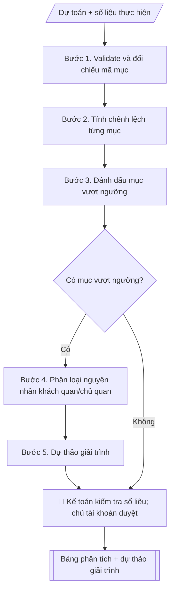

# Skill: Phân tích chênh lệch ngân sách

## Khi nào dùng
Cuối quý/năm hoặc khi cần giải trình chênh lệch giữa dự toán được giao và thực hiện.
Dùng chung cho Phòng Tài chính – Kế toán, các phòng/khoa/trung tâm, chủ tài khoản —
không phụ thuộc tên đơn vị.

## Đầu vào (Input)

| Trường | Mô tả | Bắt buộc |
|---|---|---|
| `du_toan` | Dự toán theo từng mục chi (mã mục, tên mục, số tiền) | Có |
| `thuc_hien` | Số thực hiện theo từng mục chi | Có |
| `ky_bao_cao` | Quý/năm báo cáo | Có |
| `nguong_canh_bao` | Ngưỡng chênh lệch cần giải trình, VD: ±10% | Không (mặc định: 10%) |
| `chung_tu_lien_quan` | Chứng từ/giải trình sơ bộ của đơn vị (nếu có) | Không |

## Quy trình

**Bước 1. Validate và đối chiếu mã mục**
- Làm gì: đối chiếu danh sách mã mục chi giữa `du_toan` và `thuc_hien`; kiểm tra trùng mã,
  tên mục ghi khác nhau hai bên, mục có ở một bên mà thiếu ở bên kia; kiểm tra số liệu
  âm hoặc bất thường cần xác minh lại.
- Dùng input: `du_toan`, `thuc_hien`
- Vai trò: Kế toán phụ trách · AI hỗ trợ: đối chiếu mã mục hai bên, phát hiện trùng/lệch tên/thiếu dữ liệu · ⏱ ~15–30 phút (ước tính)
- Lưu ý nghiệp vụ: cùng một mục nhưng ghi khác tên (VD "VPP" và "Văn phòng phẩm") là lỗi
  phổ biến — chuẩn hóa tên trước khi đối chiếu; tuyệt đối không tự bịa số liệu cho mục thiếu.
- → Kết quả bước: "bảng khớp mã mục" (danh sách mục khớp đầy đủ + danh sách mục thiếu
  dữ liệu một bên cần đơn vị bổ sung).

**Bước 2. Tính chênh lệch từng mục**
- Làm gì: với mỗi mục đã khớp ở bước 1, tính chênh lệch tuyệt đối (thực hiện − dự toán)
  và tương đối (% = tuyệt đối ÷ dự toán × 100); tính thêm dòng tổng toàn bộ.
- Dùng input: `du_toan`, `thuc_hien`
- Vai trò: Kế toán phụ trách · AI hỗ trợ: tính chênh lệch tuyệt đối, tương đối và dòng tổng từng mục · ⏱ ~10–15 phút (ước tính)
- Lưu ý nghiệp vụ: giữ nguyên số liệu gốc, không làm tròn gây sai tổng; tỷ lệ % chỉ có
  ý nghĩa khi dự toán > 0 — mục dự toán = 0 mà có thực hiện thì ghi "phát sinh mới",
  không chia cho 0.
- → Kết quả bước: "bảng variance thô" (dự toán / thực hiện / chênh lệch / tỷ lệ %
  từng mục + dòng tổng).

**Bước 3. Đánh dấu mục vượt ngưỡng**
- Làm gì: so sánh |tỷ lệ %| của từng mục với `nguong_canh_bao` (mặc định 10% khi đơn vị
  không quy định); các mục vượt ngưỡng được gắn cờ "cần giải trình"; xếp hạng các mục
  vượt theo mức độ chênh lệch để ưu tiên giải trình.
- Dùng input: `nguong_canh_bao`, `ky_bao_cao`
- Vai trò: Kế toán phụ trách · AI hỗ trợ: so tỷ lệ % với ngưỡng cảnh báo, gắn cờ và xếp hạng mục vượt ngưỡng · ⏱ ~5–10 phút (ước tính)
- Lưu ý nghiệp vụ: chênh lệch âm lớn (chi chưa tới, giải ngân chậm) cũng phải giải trình
  như chênh lệch dương; ngưỡng mặc định chỉ dùng khi đơn vị không có quy định riêng.
- → Kết quả bước: "danh sách mục vượt ngưỡng cần giải trình" (kèm mức vượt và thứ tự
  ưu tiên).

**Bước 4. Phân loại nguyên nhân**
- Làm gì: với từng mục vượt ngưỡng ở bước 3, đọc `chung_tu_lien_quan` và thông tin đơn vị
  cung cấp, phân loại nguyên nhân: khách quan (giá thị trường biến động, phát sinh nhiệm
  vụ do cấp trên giao) hay chủ quan (lập dự toán chưa sát, chi vượt kế hoạch, quản lý
  lỏng lẻo); mục không đủ căn cứ thì ghi rõ "cần đơn vị giải trình thêm".
- Dùng input: `chung_tu_lien_quan`, `du_toan`, `thuc_hien`
- Vai trò: Kế toán phụ trách · AI hỗ trợ: phân loại sơ bộ nguyên nhân khách quan/chủ quan từ chứng từ, liệt kê mục chưa rõ để xác nhận · ⏱ ~30 phút–1 giờ (ước tính)
- Lưu ý nghiệp vụ: chỉ ghi nguyên nhân có chứng từ hoặc thông tin đối chứng — không suy
  đoán, không "làm đẹp" lý do; nguyên nhân khách quan phải kèm căn cứ cụ thể (số công văn,
  quyết định giao nhiệm vụ...).
- → Kết quả bước: "bảng phân loại nguyên nhân" (mục vượt → nguyên nhân khách quan /
  chủ quan / chưa rõ + căn cứ kèm theo).

**Bước 5. Dự thảo giải trình**
- Làm gì: soạn văn bản giải trình theo Cấu trúc output chuẩn: ghép bảng variance (bước 2),
  danh sách mục vượt ngưỡng (bước 3), viết giải trình từng mục dựa trên bảng phân loại
  nguyên nhân (bước 4), thêm đề xuất điều chỉnh (bổ sung dự toán, dùng nguồn tiết kiệm...)
  nếu cần, trình bày để chủ tài khoản duyệt.
- Dùng input: kết quả các bước 2–4, `ky_bao_cao`
- Vai trò: Kế toán phụ trách · AI hỗ trợ: soạn dự thảo giải trình theo cấu trúc chuẩn để trình chủ tài khoản duyệt · ⏱ ~30–45 phút (ước tính)
- Lưu ý nghiệp vụ: mỗi mục vượt ngưỡng phải có đủ 3 yếu tố — con số chênh lệch, nguyên nhân
  đã phân loại, đề xuất xử lý (hoặc ghi "chưa đề xuất"); dùng ngôn ngữ văn bản hành chính,
  dẫn chiếu kỳ báo cáo và chứng từ.
- → Kết quả bước: "dự thảo văn bản giải trình chênh lệch ngân sách" (sản phẩm chính,
  chuyển sang Human gate).
## Luồng quy trình (Workflow)


## Đầu ra (Output)
- Bảng variance: dự toán / thực hiện / chênh lệch / tỷ lệ % theo từng mục.
- Danh sách mục vượt ngưỡng cần giải trình.
- Dự thảo văn bản giải trình chênh lệch.

**Cấu trúc output chuẩn** (sản phẩm chính: Dự thảo văn bản giải trình chênh lệch):
1. Tiêu đề văn bản (tên đơn vị, "Giải trình chênh lệch ngân sách", kỳ báo cáo).
2. Phần mở đầu (căn cứ dự toán được giao, phạm vi và kỳ phân tích, ngưỡng cảnh báo áp dụng).
3. Bảng phân tích chênh lệch (mục chi | dự toán | thực hiện | chênh lệch | tỷ lệ % | ghi chú vượt ngưỡng).
4. Giải trình từng mục vượt ngưỡng (số liệu chênh lệch → nguyên nhân khách quan/chủ quan → chứng từ căn cứ).
5. Đề xuất điều chỉnh (bổ sung dự toán, dùng nguồn tiết kiệm... — nếu có).
6. Kết luận và ký duyệt.

## Checklist nghiệm thu

- [ ] Đủ 6 phần theo Cấu trúc output chuẩn: tiêu đề, phần mở đầu, bảng phân tích chênh lệch, giải trình từng mục vượt ngưỡng, đề xuất điều chỉnh, kết luận và ký duyệt.
- [ ] Bảng variance khớp đúng `du_toan` / `thuc_hien`: số liệu giữ nguyên không làm tròn sai tổng; mục dự toán = 0 mà có thực hiện ghi "phát sinh mới", không chia cho 0.
- [ ] Đã đánh dấu đầy đủ các mục vượt `nguong_canh_bao` (kể cả chênh lệch âm lớn — giải ngân chậm — cũng phải giải trình).
- [ ] Mỗi mục vượt ngưỡng có đủ 3 yếu tố: con số chênh lệch, nguyên nhân đã phân loại, đề xuất xử lý (hoặc ghi "chưa đề xuất").
- [ ] Nguyên nhân kèm chứng từ/căn cứ cụ thể (số công văn, quyết định giao nhiệm vụ); mục chưa rõ nguyên nhân ghi "cần đơn vị giải trình thêm" — không suy đoán, không bịa số liệu.
- [ ] Văn bản dùng ngôn ngữ hành chính, dẫn chiếu kỳ báo cáo và chứng từ; mục còn thiếu dữ liệu một bên đã được đơn vị bổ sung.
- [ ] Đã qua Human gate: kế toán kiểm tra tính đúng đắn của số liệu; chủ tài khoản duyệt trước khi gửi cấp trên.

> Tiêu chí đạt: tất cả các ô được đánh dấu.

## Ví dụ mô phỏng (dữ liệu giả lập)

> Tất cả tên đơn vị, số liệu dưới đây đều là **giả lập** (đơn vị: triệu đồng).

### Input mẫu

| Trường | Giá trị |
|---|---|
| `du_toan` | Văn phòng phẩm: 120; Hội nghị: 200; Sửa chữa: 150; Công tác phí: 180; Tổng: 650 |
| `thuc_hien` | Văn phòng phẩm: 118; Hội nghị: 265; Sửa chữa: 142; Công tác phí: 175; Tổng: 700 |
| `ky_bao_cao` | Năm 2026 |
| `nguong_canh_bao` | 10% |

### Output mẫu

```
DỰ THẢO GIẢI TRÌNH CHÊNH LỆCH NGÂN SÁCH (giả lập)

1. Tiêu đề
Phòng Tài chính – Kế toán, Trường Đại học A
GIẢI TRÌNH CHÊNH LỆCH NGÂN SÁCH — Năm 2026 (đv: triệu đồng)

2. Phần mở đầu
Căn cứ dự toán được giao năm 2026 (tổng 650 triệu đồng). Phạm vi phân tích: 04 mục
chi thường xuyên. Ngưỡng cảnh báo áp dụng: ±10%.

3. Bảng phân tích chênh lệch
| Mục chi | Dự toán | Thực hiện | Chênh lệch | Tỷ lệ | Ghi chú |
|---|---|---|---|---|---|
| Văn phòng phẩm | 120 | 118 | -2 | -1,7% | Trong ngưỡng |
| Hội nghị | 200 | 265 | +65 | +32,5% | ⚠ VƯỢT NGƯỠNG — cần giải trình |
| Sửa chữa | 150 | 142 | -8 | -5,3% | Trong ngưỡng |
| Công tác phí | 180 | 175 | -5 | -2,8% | Trong ngưỡng |
| TỔNG | 650 | 700 | +50 | +7,7% | Trong ngưỡng |

4. Giải trình mục vượt ngưỡng
Mục Hội nghị (+65 triệu đồng, +32,5%):
- Nguyên nhân (khách quan): phát sinh 02 hội thảo quốc tế ngoài kế hoạch theo chỉ đạo
  của Ban Giám hiệu (Công văn 88/CV-ĐHA, giả lập).

5. Đề xuất điều chỉnh
- Đề xuất bổ sung dự toán mục Hội nghị từ nguồn tiết kiệm của các mục còn dư.

6. Kết luận và ký duyệt
Trên đây là giải trình chênh lệch ngân sách năm 2026, kính trình chủ tài khoản xem
xét, phê duyệt./.
```

## Human gate (người kiểm duyệt)
- **Kế toán phụ trách** kiểm tra tính đúng đắn của số liệu đối chiếu.
- **Chủ tài khoản / thủ trưởng đơn vị** duyệt bản giải trình trước khi gửi cấp trên.
- Phòng Tài chính – Kế toán (hoặc đơn vị tương đương) là đầu mối tổng hợp cuối.

## Giới hạn (guardrails)
- Không tự điều chỉnh số liệu dự toán/thực hiện; mọi con số lấy nguyên từ đầu vào.
- Không thực hiện bút toán, thanh toán hay chuyển nguồn ngân sách.
- Không suy đoán nguyên nhân vượt/chưa đạt ngoài chứng từ và thông tin được cung cấp —
  mục chưa rõ nguyên nhân phải ghi "cần đơn vị giải trình thêm".
- Không bịa số liệu để "làm đẹp" báo cáo.

## Căn cứ & lưu ý
- Theo chế độ kế toán hành chính sự nghiệp và quy chế chi tiêu nội bộ của trường.
- Không dùng tên thật của trường/cá nhân khi mô phỏng.
