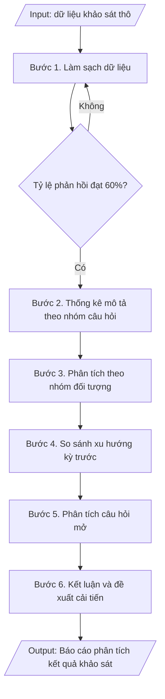

# Phân tích kết quả khảo sát

## Định dạng và file đầu ra
Định dạng đầu ra có thể chọn theo sản phẩm/yêu cầu: .xlsx, .csv, .pdf, .png, .svg. Đọc mục “Định dạng bổ sung” trong quy cách đầu ra trước khi chọn.

**Phải tạo file thực tế để tải xuống, không chỉ trả nội dung trong chat.** Định dạng mặc định của skill: **.xlsx**. Nếu yêu cầu gồm cả báo cáo thuyết minh, tạo thêm file Word cho báo cáo; không ghép báo cáo dài vào bảng tính. Không chờ người dùng yêu cầu xuất file lần nữa. Ưu tiên định dạng người dùng chỉ định; đọc quy tắc xuất file tại references/quy-cach-dau-ra.md.

## Quy cách đầu ra và thông tin thiếu
Đọc [quy cách và cấu trúc sản phẩm](references/quy-cach-dau-ra.md) trước khi soạn/xuất. File giao chỉ gồm sản phẩm nghiệp vụ được yêu cầu; kiểm tra nội bộ không xuất kèm. Thiếu thông tin thì giữ nguyên trường/mục và chỗ điền theo mẫu gốc (dòng dấu chấm, dấu gạch hoặc ô trống); không tự điền dữ liệu mẫu, số 0, mã chờ xác minh hay dòng chờ ký. Mẫu chuyên ngành còn áp dụng được ưu tiên về cấu trúc, mã biểu và người ký. Bản đầy đủ: [quy tắc chung](references/quy-tac-chung.md).

## Kiểm soát áp dụng và phê duyệt
Trước khi chạy, xác định `ngay_ap_dung`, `loai_hinh_truong`, `quy_che_noi_bo`, `nguon_du_lieu`, `nguoi_kiem_duyet`; chỉ hỏi thông tin liên quan nghiệp vụ, không dùng giá trị giả định thay dữ liệu bắt buộc. Đối chiếu căn cứ pháp lý với văn bản gốc, hiệu lực, điều khoản áp dụng và chuyển tiếp. Bản đầy đủ: [quy tắc chung](references/quy-tac-chung.md).

Nếu có cập nhật pháp lý dưới đây, đọc [căn cứ và điều kiện áp dụng](references/phap-ly.md) trước khi làm. Quy trình dưới đây giữ nghiệp vụ từ bản gốc; mọi viện dẫn văn bản, mẫu biểu, điều khoản phải theo căn cứ đã chọn trong phap-ly.md, không theo văn bản cũ.

## Giới hạn và human gate
AI hỗ trợ chuẩn bị và đối chiếu; cán bộ phụ trách kiểm tra dữ liệu/căn cứ, người có thẩm quyền duyệt và ký. Không đánh dấu đã ký, đã duyệt, đã công bố khi chưa có chứng cứ. Dữ liệu sinh viên, sức khỏe, nhân sự, tài chính chỉ dùng theo mục đích và phân quyền, che thông tin định danh khi dùng ví dụ (Luật 91/2025/QH15, hiệu lực 01/01/2026); không tải dữ liệu lên dịch vụ ngoài khi chưa có quyền. Bản đầy đủ: [quy tắc chung](references/quy-tac-chung.md).

## Khi nào dùng
Khi đã có dữ liệu khảo sát thô và cần xử lý thành báo cáo phân tích có kết luận,
so sánh và đề xuất cải tiến.

## Đầu vào (Input)
| Trường | Mô tả | Bắt buộc |
|---|---|---|
| `doi_tuong` | Sinh viên / Giảng viên / Cựu sinh viên / Nhà tuyển dụng | Có |
| `muc_dich_khao_sat` | Mục đích của đợt khảo sát | Có |
| `so_phieu_hop_le` | Số phiếu hợp lệ / tổng số phát ra | Có |
| `du_lieu_tong_hop` | Bảng tổng hợp: từng câu hỏi – tần suất từng mức – điểm trung bình | Có |
| `ky_truoc` | Số liệu cùng kỳ trước để so sánh (nếu có) | Không |

## Quy trình
**Ràng buộc pháp lý khi thực hiện** (trích references/phap-ly.md; đối chiếu toàn văn và hiệu lực tại ngày nghiệp vụ):
- Thông tư 20/2026/TT-BGDĐT, hiệu lực 15/05/2026: Yêu cầu ngày hoàn tất tự đánh giá, ngày đăng ký đánh giá ngoài, khung tiêu chuẩn và minh chứng. Điều 51: chỉ cơ sở đã tự đánh giá VÀ đăng ký đánh giá ngoài trước 15/05/2026 được tiếp tục khung 12/2017, hoàn tất chậm nhất 31/12/2026. Ngoài chuyển tiếp dùng 20/2026; không chuyển thang điểm cơ học.
- Thông tư 04/2025/TT-BGDĐT, hiệu lực 04/04/2025: Tách kiểm định chương trình khỏi kiểm định cơ sở. Yêu cầu phiên bản tiêu chuẩn, ngày đăng ký và bộ minh chứng; trích tiêu chí từ phụ lục hiện hành. Không mặc định khung 11 tiêu chuẩn của 04/2016 là khung hiện hành; đối chiếu chuyển tiếp trước khi tiếp tục hồ sơ cũ.
- Trước Bước 1: chọn căn cứ theo đối tượng, loại hình trường và chuyển tiếp; lập bảng văn bản / điều khoản / lý do áp dụng / bằng chứng. Thiếu văn bản gốc hoặc điều khoản thì ghi nhận nội bộ [CẦN XÁC MINH] (không đưa vào file giao), để trống phần tương ứng, chưa kết luận tuân thủ.

**Bước 1. Làm sạch dữ liệu**
- Làm gì: Kiểm tra từng phiếu khảo sát thu về: loại bỏ phiếu không hợp lệ (để trống > 30% số câu, chọn 01 đáp án cho toàn bộ câu hỏi đánh giá, mâu thuẫn logic giữa các câu); tính số phiếu hợp lệ trên tổng số phiếu phát ra, xác nhận tỷ lệ phản hồi đạt yêu cầu (≥ 60% cỡ mẫu); nếu không đạt, tổ chức thu thập bổ sung trước khi phân tích.
- Dùng input: `so_phieu_hop_le`, `doi_tuong`.
- Vai trò: Chuyên viên Phòng Khảo thí & ĐBCL · AI hỗ trợ: lọc phiếu không hợp lệ theo quy tắc, tính tỷ lệ phản hồi · ⏱ ~1 giờ (ước tính)
- Lưu ý nghiệp vụ: không tự ý "điền hộ" câu trả lời còn trống; ghi lại số phiếu loại và lý do loại để giải trình trong báo cáo; tỷ lệ phản hồi thấp phải nêu rõ trong phần hạn chế của báo cáo.
- → Kết quả bước: Bộ dữ liệu sạch (số phiếu hợp lệ, tỷ lệ phản hồi đạt yêu cầu) + danh sách phiếu loại.

**Bước 2. Thống kê mô tả**
- Làm gì: Với thang đo Likert 5 mức, tính cho từng câu hỏi: tần suất, tỷ lệ % từng mức, điểm trung bình; tính điểm trung bình từng nhóm câu hỏi và điểm trung bình chung; áp quy ước đánh giá: ≥ 4.0 = tốt, 3.0–3.99 = trung bình, < 3.0 = cần cải thiện; lập bảng tổng hợp kết quả.
- Dùng input: `du_lieu_tong_hop`, `muc_dich_khao_sat`.
- Vai trò: Chuyên viên Phòng Khảo thí & ĐBCL · AI hỗ trợ: tính tần suất, tỷ lệ %, điểm trung bình và lập bảng tổng hợp · ⏱ ~1 giờ (ước tính)
- Lưu ý nghiệp vụ: điểm trung bình phải tính trên số phiếu hợp lệ đã làm sạch ở Bước 1; kiểm tra câu hỏi đảo (nếu có) đã được mã hóa ngược trước khi tính điểm.
- → Kết quả bước: Bảng thống kê mô tả (tần suất, %, điểm TB từng câu/nhóm, xếp loại theo quy ước).

**Bước 3. Phân tích theo nhóm**
- Làm gì: Chia dữ liệu theo các nhóm đối tượng (khóa, ngành, giới tính, năm tốt nghiệp...) từ Phần A của phiếu; so sánh điểm trung bình giữa các nhóm để phát hiện điểm khác biệt đáng chú ý (chênh lệch ≥ 0.3 điểm hoặc đổi mức xếp loại); ghi nhận nhóm nào đánh giá thấp nhất ở từng lĩnh vực.
- Dùng input: `du_lieu_tong_hop`, `doi_tuong`.
- Vai trò: Chuyên viên Phòng Khảo thí & ĐBCL · AI hỗ trợ: so sánh điểm trung bình giữa các nhóm đối tượng, phát hiện khác biệt đáng chú ý · ⏱ ~1 giờ (ước tính)
- Lưu ý nghiệp vụ: chỉ nêu khác biệt có ý nghĩa thực tiễn, tránh liệt kê mọi chênh lệch nhỏ; nhóm mẫu quá nhỏ (< 30 phiếu) thì không kết luận riêng cho nhóm đó.
- → Kết quả bước: Bảng so sánh kết quả theo nhóm + các điểm khác biệt đáng chú ý.

**Bước 4. So sánh xu hướng**
- Làm gì: Đối chiếu điểm trung bình từng câu hỏi/nhóm với `ky_truoc` (kỳ khảo sát trước, nếu có): tính chênh lệch (+/-), xác định câu hỏi cải thiện/suy giảm mạnh nhất; liên hệ với các giải pháp cải tiến đã thực hiện giữa 02 kỳ để giải thích xu hướng.
- Dùng input: `ky_truoc`, `du_lieu_tong_hop`.
- Vai trò: Chuyên viên Phòng Khảo thí & ĐBCL · AI hỗ trợ: tính chênh lệch với kỳ trước, xác định xu hướng cải thiện/suy giảm · ⏱ ~30 phút (ước tính)
- Lưu ý nghiệp vụ: chỉ so sánh khi 02 kỳ dùng cùng thang đo và câu hỏi tương đương; nếu không có kỳ trước thì bỏ qua bước này và ghi rõ trong báo cáo.
- → Kết quả bước: Bảng so sánh với kỳ trước + nhận định xu hướng cải thiện/suy giảm.

**Bước 5. Phân tích câu hỏi mở**
- Làm gì: Đọc toàn bộ câu trả lời mở (Phần C), mã hóa và nhóm các ý kiến trùng lặp thành chủ đề; đếm tần suất từng chủ đề (tỷ lệ %); trích dẫn 02–03 ý kiến tiêu biểu cho mỗi chủ đề chính.
- Dùng input: `du_lieu_tong_hop`.
- Vai trò: Chuyên viên Phòng Khảo thí & ĐBCL · AI hỗ trợ: mã hóa và nhóm ý kiến mở sơ bộ theo chủ đề · ⏱ ~2 giờ (ước tính)
- Lưu ý nghiệp vụ: không chỉ trích ý kiến tiêu cực — phải phản ánh cân bằng cả ý kiến tích cực; ẩn thông tin định danh khi trích dẫn.
- → Kết quả bước: Bảng tổng hợp ý kiến mở theo chủ đề (tần suất, trích dẫn tiêu biểu).

**Bước 6. Kết luận và đề xuất**
- Làm gì: Tổng hợp nhận xét: điểm mạnh, điểm cần cải thiện nhất, xu hướng so với kỳ trước, ý kiến mở nổi bật; xây dựng 03–05 đề xuất cải tiến cụ thể, mỗi đề xuất gắn với 01 đơn vị chịu trách nhiệm và thời hạn; hoàn thiện báo cáo phân tích đầy đủ các phần.
- Dùng input: `muc_dich_khao_sat`, `doi_tuong`.
- Vai trò: Chuyên viên Phòng Khảo thí & ĐBCL (biên tập, hoàn thiện báo cáo) · AI hỗ trợ: soạn dự thảo kết luận và đề xuất cải tiến từ dữ liệu · ⏱ ~3 giờ (ước tính)
- Lưu ý nghiệp vụ: đề xuất phải xuất phát từ dữ liệu — không suy diễn vượt quá dữ liệu; mỗi đề xuất cần đủ cụ thể để chuyển thành hành động trong kế hoạch cải tiến chất lượng.
- → Kết quả bước: Báo cáo phân tích kết quả khảo sát hoàn chỉnh + danh sách đề xuất cải tiến ưu tiên.

## Luồng quy trình (Workflow)

## Đầu ra
- Báo cáo phân tích kết quả khảo sát (bảng số liệu + nhận xét + đề xuất).
- Danh sách đề xuất cải tiến ưu tiên.

**Cấu trúc output chuẩn:** báo cáo phân tích gồm các phần bắt buộc theo đúng thứ tự:
1. Tiêu đề báo cáo + đối tượng khảo sát + mục đích + năm thực hiện;
2. Phần I – Thông tin chung: số phiếu phát ra, số phiếu hợp lệ, tỷ lệ phản hồi (đánh giá đạt/không đạt yêu cầu), cơ cấu đối tượng (khóa/ngành/năm tốt nghiệp...);
3. Phần II – Kết quả chi tiết: bảng điểm trung bình từng câu hỏi (kèm so sánh kỳ trước nếu có, chênh lệch, xếp loại theo quy ước ≥ 4.0 tốt / 3.0–3.99 trung bình / < 3.0 cần cải thiện) và điểm trung bình chung;
4. Phần III – Nhận xét: điểm mạnh, điểm cần cải thiện nhất, xu hướng so với kỳ trước, ý kiến mở nổi bật (nhóm theo chủ đề, tỷ lệ %);
5. Phần IV – Đề xuất cải tiến: 03–05 đề xuất cụ thể, mỗi đề xuất gắn đơn vị thực hiện và thời hạn.

File nghiệp vụ thực tế theo định dạng mặc định ở đầu skill hoặc định dạng người dùng yêu cầu, kèm liên kết tải trong phản hồi cuối.

Sản phẩm nghiệp vụ hoàn chỉnh theo [quy cách và cấu trúc](references/quy-cach-dau-ra.md), giữ các trường chưa có dữ liệu ở trạng thái trống. Không xuất kèm checklist/phụ lục kiểm tra đầu ra.

## Kiểm tra nội bộ trước khi giao
Các tiêu chí sau dùng để tự đối chiếu; không sao chép vào file xuất. Mục thiếu dữ liệu được để trống, không đánh dấu đã đạt hoặc đã duyệt.

- [ ] Đủ 5 phần theo "Cấu trúc output chuẩn": tiêu đề báo cáo + đối tượng + mục đích + năm thực hiện; Phần I – Thông tin chung (số phiếu phát ra, số phiếu hợp lệ, tỷ lệ phản hồi, cơ cấu đối tượng); Phần II – Kết quả chi tiết (bảng điểm trung bình từng câu hỏi, so sánh kỳ trước, xếp loại theo quy ước); Phần III – Nhận xét (điểm mạnh, điểm cần cải thiện, xu hướng, ý kiến mở); Phần IV – Đề xuất cải tiến (03–05 đề xuất, mỗi đề xuất gắn đơn vị thực hiện và thời hạn).
- [ ] Số liệu thống kê được tính trên số phiếu hợp lệ đã làm sạch; khớp với Input (`du_lieu_tong_hop`, `doi_tuong`, `muc_dich_khao_sat`).
- [ ] Không bịa đặt số liệu, điểm trung bình, trích dẫn ý kiến mở; không tự ý "điền hộ" câu trả lời còn trống.
- [ ] Đúng quy ước xếp loại: ≥ 4.0 tốt / 3.0–3.99 trung bình / < 3.0 cần cải thiện; câu hỏi đảo đã được mã hóa ngược trước khi tính điểm.
- [ ] So sánh với kỳ trước chỉ thực hiện khi 02 kỳ dùng cùng thang đo và câu hỏi tương đương; nếu không có kỳ trước đã ghi rõ trong báo cáo.
- [ ] Đã qua Human gate: người có thẩm quyền theo quy trình đã duyệt.
- [ ] Số phiếu loại và lý do loại đã được ghi lại để giải trình; tỷ lệ phản hồi dưới 60% đã nêu rõ trong phần hạn chế của báo cáo.
- [ ] Đề xuất xuất phát từ dữ liệu, không suy diễn vượt quá dữ liệu; mỗi đề xuất đủ cụ thể để chuyển thành hành động trong kế hoạch cải tiến chất lượng.
- [ ] Ý kiến mở phản ánh cân bằng cả ý kiến tích cực và tiêu cực; ẩn thông tin định danh khi trích dẫn.

## Căn cứ & lưu ý
- Căn cứ hiện hành: xem [căn cứ và điều kiện áp dụng](references/phap-ly.md); phải đối chiếu văn bản gốc, hiệu lực và chuyển tiếp tại ngày nghiệp vụ.
- Kết quả phân tích phải được phản hồi đến các đơn vị liên quan và lưu làm minh chứng
  kiểm định (mã hóa theo quy tắc của trường).
- Không suy diễn vượt quá dữ liệu; nêu rõ hạn chế của khảo sát (cỡ mẫu, tỷ lệ phản hồi).
- Không dùng tên thật của trường/cá nhân khi mô phỏng.

## Tư liệu đối chiếu
Bản gốc trước cập nhật pháp lý (kèm ví dụ giả lập) lưu tại `references/quy-trinh-lich-su.md`, chỉ để đối chiếu hồ sơ lịch sử; không dùng căn cứ, mẫu hay số liệu trong đó làm chỉ dẫn hiện hành.

## Quản trị phiên bản
- Phiên bản gói `1.3.2` (cập nhật 2026-10-10); hồ sơ đầy đủ tại [references/version.json](references/version.json).
- Người phê duyệt nghiệp vụ: **chưa chỉ định**. Trạng thái: dự thảo nghiệp vụ; kiểm tra pháp lý trước thực thi. Ngày cập nhật không đồng nghĩa mọi văn bản đã được rà soát toàn văn.
- Giấy phép theo LICENSE của kho (bản quyền CES Global). Lịch sử thay đổi: CHANGELOG.md.
