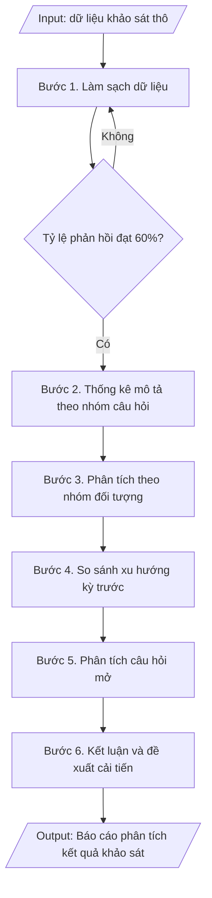

# Tư liệu lịch sử – không phải quy trình hiện hành

Nội dung từ phiên bản nguồn trước 1.1.0, giữ để đối chiếu dữ liệu đầu vào và thay đổi; căn cứ, điều kiện, mẫu và ví dụ có thể đã lỗi thời. Không dùng để thực hiện nghiệp vụ hiện tại.

## Khi nào dùng
Khi đã có dữ liệu khảo sát thô và cần xử lý thành báo cáo phân tích có kết luận,
so sánh và đề xuất cải tiến.

## Đầu vào (Input)

| Trường | Mô tả | Bắt buộc |
|---|---|---|
| `doi_tuong` | Sinh viên / Giảng viên / Cựu sinh viên / Nhà tuyển dụng | Có |
| `muc_dich_khao_sat` | Mục đích của đợt khảo sát | Có |
| `so_phieu_hop_le` | Số phiếu hợp lệ / tổng số phát ra | Có |
| `du_lieu_tong_hop` | Bảng tổng hợp: từng câu hỏi – tần suất từng mức – điểm trung bình | Có |
| `ky_truoc` | Số liệu cùng kỳ trước để so sánh (nếu có) | Không |

## Quy trình

**Bước 1. Làm sạch dữ liệu**
- Làm gì: Kiểm tra từng phiếu khảo sát thu về: loại bỏ phiếu không hợp lệ (để trống > 30% số câu, chọn 01 đáp án cho toàn bộ câu hỏi đánh giá, mâu thuẫn logic giữa các câu); tính số phiếu hợp lệ trên tổng số phiếu phát ra, xác nhận tỷ lệ phản hồi đạt yêu cầu (≥ 60% cỡ mẫu); nếu không đạt, tổ chức thu thập bổ sung trước khi phân tích.
- Dùng input: `so_phieu_hop_le`, `doi_tuong`.
- Vai trò: Chuyên viên Phòng Khảo thí & ĐBCL · AI hỗ trợ: lọc phiếu không hợp lệ theo quy tắc, tính tỷ lệ phản hồi · ⏱ ~1 giờ (ước tính)
- Lưu ý nghiệp vụ: không tự ý "điền hộ" câu trả lời còn trống; ghi lại số phiếu loại và lý do loại để giải trình trong báo cáo; tỷ lệ phản hồi thấp phải nêu rõ trong phần hạn chế của báo cáo.
- → Kết quả bước: Bộ dữ liệu sạch (số phiếu hợp lệ, tỷ lệ phản hồi đạt yêu cầu) + danh sách phiếu loại.

**Bước 2. Thống kê mô tả**
- Làm gì: Với thang đo Likert 5 mức, tính cho từng câu hỏi: tần suất, tỷ lệ % từng mức, điểm trung bình; tính điểm trung bình từng nhóm câu hỏi và điểm trung bình chung; áp quy ước đánh giá: ≥ 4.0 = tốt, 3.0–3.99 = trung bình, < 3.0 = cần cải thiện; lập bảng tổng hợp kết quả.
- Dùng input: `du_lieu_tong_hop`, `muc_dich_khao_sat`.
- Vai trò: Chuyên viên Phòng Khảo thí & ĐBCL · AI hỗ trợ: tính tần suất, tỷ lệ %, điểm trung bình và lập bảng tổng hợp · ⏱ ~1 giờ (ước tính)
- Lưu ý nghiệp vụ: điểm trung bình phải tính trên số phiếu hợp lệ đã làm sạch ở Bước 1; kiểm tra câu hỏi đảo (nếu có) đã được mã hóa ngược trước khi tính điểm.
- → Kết quả bước: Bảng thống kê mô tả (tần suất, %, điểm TB từng câu/nhóm, xếp loại theo quy ước).

**Bước 3. Phân tích theo nhóm**
- Làm gì: Chia dữ liệu theo các nhóm đối tượng (khóa, ngành, giới tính, năm tốt nghiệp...) từ Phần A của phiếu; so sánh điểm trung bình giữa các nhóm để phát hiện điểm khác biệt đáng chú ý (chênh lệch ≥ 0.3 điểm hoặc đổi mức xếp loại); ghi nhận nhóm nào đánh giá thấp nhất ở từng lĩnh vực.
- Dùng input: `du_lieu_tong_hop`, `doi_tuong`.
- Vai trò: Chuyên viên Phòng Khảo thí & ĐBCL · AI hỗ trợ: so sánh điểm trung bình giữa các nhóm đối tượng, phát hiện khác biệt đáng chú ý · ⏱ ~1 giờ (ước tính)
- Lưu ý nghiệp vụ: chỉ nêu khác biệt có ý nghĩa thực tiễn, tránh liệt kê mọi chênh lệch nhỏ; nhóm mẫu quá nhỏ (< 30 phiếu) thì không kết luận riêng cho nhóm đó.
- → Kết quả bước: Bảng so sánh kết quả theo nhóm + các điểm khác biệt đáng chú ý.

**Bước 4. So sánh xu hướng**
- Làm gì: Đối chiếu điểm trung bình từng câu hỏi/nhóm với `ky_truoc` (kỳ khảo sát trước, nếu có): tính chênh lệch (+/-), xác định câu hỏi cải thiện/suy giảm mạnh nhất; liên hệ với các giải pháp cải tiến đã thực hiện giữa 02 kỳ để giải thích xu hướng.
- Dùng input: `ky_truoc`, `du_lieu_tong_hop`.
- Vai trò: Chuyên viên Phòng Khảo thí & ĐBCL · AI hỗ trợ: tính chênh lệch với kỳ trước, xác định xu hướng cải thiện/suy giảm · ⏱ ~30 phút (ước tính)
- Lưu ý nghiệp vụ: chỉ so sánh khi 02 kỳ dùng cùng thang đo và câu hỏi tương đương; nếu không có kỳ trước thì bỏ qua bước này và ghi rõ trong báo cáo.
- → Kết quả bước: Bảng so sánh với kỳ trước + nhận định xu hướng cải thiện/suy giảm.

**Bước 5. Phân tích câu hỏi mở**
- Làm gì: Đọc toàn bộ câu trả lời mở (Phần C), mã hóa và nhóm các ý kiến trùng lặp thành chủ đề; đếm tần suất từng chủ đề (tỷ lệ %); trích dẫn 02–03 ý kiến tiêu biểu cho mỗi chủ đề chính.
- Dùng input: `du_lieu_tong_hop`.
- Vai trò: Chuyên viên Phòng Khảo thí & ĐBCL · AI hỗ trợ: mã hóa và nhóm ý kiến mở sơ bộ theo chủ đề · ⏱ ~2 giờ (ước tính)
- Lưu ý nghiệp vụ: không chỉ trích ý kiến tiêu cực — phải phản ánh cân bằng cả ý kiến tích cực; ẩn thông tin định danh khi trích dẫn.
- → Kết quả bước: Bảng tổng hợp ý kiến mở theo chủ đề (tần suất, trích dẫn tiêu biểu).

**Bước 6. Kết luận và đề xuất**
- Làm gì: Tổng hợp nhận xét: điểm mạnh, điểm cần cải thiện nhất, xu hướng so với kỳ trước, ý kiến mở nổi bật; xây dựng 03–05 đề xuất cải tiến cụ thể, mỗi đề xuất gắn với 01 đơn vị chịu trách nhiệm và thời hạn; hoàn thiện báo cáo phân tích đầy đủ các phần.
- Dùng input: `muc_dich_khao_sat`, `doi_tuong`.
- Vai trò: Chuyên viên Phòng Khảo thí & ĐBCL (biên tập, hoàn thiện báo cáo) · AI hỗ trợ: soạn dự thảo kết luận và đề xuất cải tiến từ dữ liệu · ⏱ ~3 giờ (ước tính)
- Lưu ý nghiệp vụ: đề xuất phải xuất phát từ dữ liệu — không suy diễn vượt quá dữ liệu; mỗi đề xuất cần đủ cụ thể để chuyển thành hành động trong kế hoạch cải tiến chất lượng.
- → Kết quả bước: Báo cáo phân tích kết quả khảo sát hoàn chỉnh + danh sách đề xuất cải tiến ưu tiên.

## Luồng quy trình (Workflow)


## Đầu ra (Output)
- Báo cáo phân tích kết quả khảo sát (bảng số liệu + nhận xét + đề xuất).
- Danh sách đề xuất cải tiến ưu tiên.

**Cấu trúc output chuẩn:** báo cáo phân tích gồm các phần bắt buộc theo đúng thứ tự:
1. Tiêu đề báo cáo + đối tượng khảo sát + mục đích + năm thực hiện;
2. Phần I – Thông tin chung: số phiếu phát ra, số phiếu hợp lệ, tỷ lệ phản hồi (đánh giá đạt/không đạt yêu cầu), cơ cấu đối tượng (khóa/ngành/năm tốt nghiệp...);
3. Phần II – Kết quả chi tiết: bảng điểm trung bình từng câu hỏi (kèm so sánh kỳ trước nếu có, chênh lệch, xếp loại theo quy ước ≥ 4.0 tốt / 3.0–3.99 trung bình / < 3.0 cần cải thiện) và điểm trung bình chung;
4. Phần III – Nhận xét: điểm mạnh, điểm cần cải thiện nhất, xu hướng so với kỳ trước, ý kiến mở nổi bật (nhóm theo chủ đề, tỷ lệ %);
5. Phần IV – Đề xuất cải tiến: 03–05 đề xuất cụ thể, mỗi đề xuất gắn đơn vị thực hiện và thời hạn.

## Checklist nghiệm thu

- [ ] Đủ 5 phần theo "Cấu trúc output chuẩn": tiêu đề báo cáo + đối tượng + mục đích + năm thực hiện; Phần I – Thông tin chung (số phiếu phát ra, số phiếu hợp lệ, tỷ lệ phản hồi, cơ cấu đối tượng); Phần II – Kết quả chi tiết (bảng điểm trung bình từng câu hỏi, so sánh kỳ trước, xếp loại theo quy ước); Phần III – Nhận xét (điểm mạnh, điểm cần cải thiện, xu hướng, ý kiến mở); Phần IV – Đề xuất cải tiến (03–05 đề xuất, mỗi đề xuất gắn đơn vị thực hiện và thời hạn).
- [ ] Số liệu thống kê được tính trên số phiếu hợp lệ đã làm sạch; khớp với Input (`du_lieu_tong_hop`, `doi_tuong`, `muc_dich_khao_sat`).
- [ ] Không bịa đặt số liệu, điểm trung bình, trích dẫn ý kiến mở; không tự ý "điền hộ" câu trả lời còn trống.
- [ ] Đúng quy ước xếp loại: ≥ 4.0 tốt / 3.0–3.99 trung bình / < 3.0 cần cải thiện; câu hỏi đảo đã được mã hóa ngược trước khi tính điểm.
- [ ] So sánh với kỳ trước chỉ thực hiện khi 02 kỳ dùng cùng thang đo và câu hỏi tương đương; nếu không có kỳ trước đã ghi rõ trong báo cáo.
- [ ] Đã qua Human gate: người có thẩm quyền theo quy trình đã duyệt.
- [ ] Số phiếu loại và lý do loại đã được ghi lại để giải trình; tỷ lệ phản hồi dưới 60% đã nêu rõ trong phần hạn chế của báo cáo.
- [ ] Đề xuất xuất phát từ dữ liệu, không suy diễn vượt quá dữ liệu; mỗi đề xuất đủ cụ thể để chuyển thành hành động trong kế hoạch cải tiến chất lượng.
- [ ] Ý kiến mở phản ánh cân bằng cả ý kiến tích cực và tiêu cực; ẩn thông tin định danh khi trích dẫn.

Tiêu chí đạt = tất cả các ô được đánh dấu.

## Ví dụ mô phỏng (dữ liệu giả lập)

> Tất cả tên trường, cá nhân, số liệu dưới đây đều là **giả lập**, không liên quan tổ chức/cá nhân có thật.

### Input mẫu

| Trường | Giá trị |
|---|---|
| `doi_tuong` | Cựu sinh viên tốt nghiệp 2024–2026 |
| `muc_dich_khao_sat` | Đánh giá chuẩn đầu ra và việc làm sau tốt nghiệp |
| `so_phieu_hop_le` | 412 / 500 phiếu (tỷ lệ phản hồi 82,4%) |
| `du_lieu_tong_hop` | Bảng điểm TB 07 câu hỏi nhóm B (xem output) |

### Output mẫu

```
BÁO CÁO PHÂN TÍCH KẾT QUẢ KHẢO SÁT CỰU SINH VIÊN
Trường Đại học A – Năm 2026
(Mục đích: đánh giá chuẩn đầu ra và việc làm sau tốt nghiệp)

I. THÔNG TIN CHUNG
- Số phiếu phát ra: 500; số phiếu hợp lệ: 412 (tỷ lệ phản hồi 82,4% – đạt yêu cầu).
- Cơ cấu: tốt nghiệp 2024 (32%), 2025 (35%), 2026 (33%).

II. KẾT QUẢ CHI TIẾT (thang đo 1–5)

| Câu hỏi | Điểm TB 2026 | Điểm TB 2025 | Chênh lệch | Đánh giá |
|---|---|---|---|---|
| B1. Kiến thức chuyên ngành đáp ứng công việc | 4.12 | 4.05 | +0.07 | Tốt |
| B2. Kỹ năng thực hành, vận dụng | 3.95 | 3.80 | +0.15 | Trung bình |
| B3. Kỹ năng mềm | 3.62 | 3.55 | +0.07 | Trung bình |
| B4. Ngoại ngữ, tin học | 3.41 | 3.38 | +0.03 | Cần cải thiện |
| B5. Tìm việc trong 6 tháng sau tốt nghiệp | 4.05 | 3.92 | +0.13 | Tốt |
| B6. Thu nhập phù hợp trình độ | 3.78 | 3.70 | +0.08 | Trung bình |
| B7. Nhà trường hỗ trợ kết nối việc làm | 3.55 | 3.40 | +0.15 | Trung bình |
| Điểm trung bình chung | 3.78 | 3.69 | +0.09 | Trung bình |

III. NHẬN XÉT
1. Điểm TB chung tăng nhẹ (+0.09) so với năm 2025; 100% câu hỏi đều cải thiện.
2. Điểm mạnh: kiến thức chuyên ngành (4.12), khả năng tìm việc (4.05).
3. Điểm cần cải thiện nhất: ngoại ngữ, tin học (3.41) – thấp nhất 02 năm liên tiếp;
   kỹ năng mềm (3.62) chưa đạt mức tốt.
4. Ý kiến mở nổi bật (nhóm 186 ý kiến): đề nghị tăng thời lượng thực hành/thực tập
   (38%), bổ sung tiếng Anh chuyên ngành (27%).

IV. ĐỀ XUẤT CẢI TIẾN
1. Bổ sung 02 học phần tiếng Anh chuyên ngành vào CTĐT các ngành kỹ thuật
   (Khoa CNTT, Khoa Ngoại ngữ – hoàn thành trước 06/2027).
2. Tăng tỷ trọng thực hành/thực tập trong CTĐT từ 30% lên 35% (P. Đào tạo).
3. Tổ chức 04 workshop kỹ năng mềm / năm cho sinh viên năm cuối (P. CTSV).
```

## Căn cứ & lưu ý
- Thông tư 12/2017/TT-BGDĐT; Thông tư 04/2016/TT-BGDĐT (sử dụng kết quả khảo sát
  để cải tiến chất lượng).
- Kết quả phân tích phải được phản hồi đến các đơn vị liên quan và lưu làm minh chứng
  kiểm định (mã hóa theo quy tắc của trường).
- Không suy diễn vượt quá dữ liệu; nêu rõ hạn chế của khảo sát (cỡ mẫu, tỷ lệ phản hồi).
- Không dùng tên thật của trường/cá nhân khi mô phỏng.
