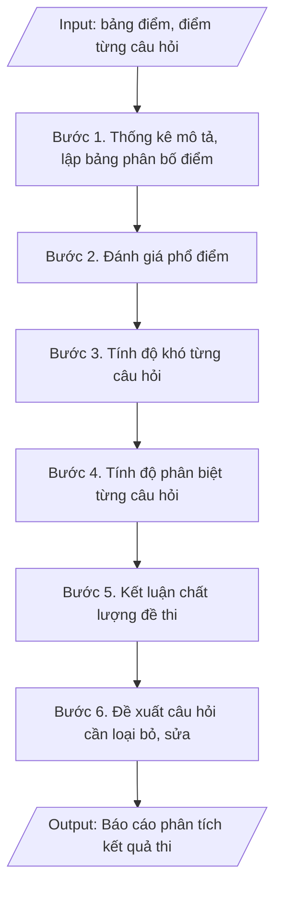

# Skill: Phân tích kết quả thi (phổ điểm, độ khó, độ phân biệt)

## Khi nào dùng
Khi kỳ thi kết thúc và đã có bảng điểm: cần đánh giá đề thi có phù hợp không,
câu hỏi nào quá khó/quá dễ, cần điều chỉnh gì cho lần sau.

## Đầu vào (Input)

| Trường | Mô tả | Bắt buộc |
|---|---|---|
| `hoc_phan` | Mã + tên học phần | Có |
| `hinh_thuc_thi` | Trắc nghiệm / Tự luận | Có |
| `bang_diem` | Bảng điểm chi tiết từng sinh viên (điểm tổng + điểm từng câu, nếu có) | Có |
| `so_sinh_vien` | Số sinh viên dự thi | Có |
| `diem_dat` | Điểm đạt (mặc định thang 10: ≥ 4.0) | Không |

## Quy trình

**Bước 1. Thống kê mô tả**
- Làm gì: Từ `bang_diem`, tính: điểm trung bình, trung vị, độ lệch chuẩn, điểm cao nhất, điểm thấp nhất, tỷ lệ đạt (theo `diem_dat`, mặc định thang 10: ≥ 4.0); lập bảng phân bố điểm theo các khoảng: 0–3.9; 4.0–4.9; 5.0–6.4; 6.5–7.9; 8.0–10 (số SV và tỷ lệ % từng khoảng).
- Dùng input: `hoc_phan`, `bang_diem`, `so_sinh_vien`, `diem_dat`.
- Vai trò: Chuyên viên Phòng Khảo thí & ĐBCL · AI hỗ trợ: tính điểm TB, trung vị, độ lệch chuẩn và lập bảng phân bố điểm · ⏱ ~30 phút (ước tính)
- Lưu ý nghiệp vụ: kiểm tra số SV trong bảng điểm khớp với `so_sinh_vien` dự thi; loại điểm bất thường do nhập sai (điểm âm, điểm > thang) trước khi tính.
- → Kết quả bước: Bảng thống kê mô tả + bảng phân bố điểm theo khoảng.

**Bước 2. Đánh giá phổ điểm**
- Làm gì: Đối chiếu bảng phân bố điểm với phổ chuẩn: phổ điểm tốt có dạng gần chuẩn (hình chuông), tập trung ở khoảng 5.0–7.9; nếu phổ lệch hẳn về điểm cao → đề quá dễ; lệch về điểm thấp → đề quá khó; ghi nhận xét về mức độ phù hợp của đề thi.
- Dùng input: `bang_diem`, `hinh_thuc_thi`.
- Vai trò: Chuyên viên Phòng Khảo thí & ĐBCL · AI hỗ trợ: vẽ phổ điểm và nhận xét sơ bộ mức độ phù hợp của đề thi · ⏱ ~1 giờ (ước tính)
- Lưu ý nghiệp vụ: phổ điểm còn phản ánh chất lượng giảng dạy — phổ lệch thấp ở nhiều học phần cùng khóa có thể do dạy chưa tốt, không chỉ do đề khó.
- → Kết quả bước: Nhận xét đánh giá phổ điểm (phù hợp/quá dễ/quá khó).

**Bước 3. Tính độ khó câu hỏi (p)**
- Làm gì: Với từng câu hỏi, tính p = (số SV làm đúng câu) / (tổng số SV); phân loại theo quy ước: p < 0.3 = khó; 0.3–0.7 = trung bình (tốt); p > 0.7 = dễ; lập bảng độ khó từng câu.
- Dùng input: `bang_diem`, `hinh_thuc_thi`.
- Vai trò: Chuyên viên Phòng Khảo thí & ĐBCL · AI hỗ trợ: tính chỉ số độ khó p và phân loại từng câu hỏi · ⏱ ~30 phút (ước tính)
- Lưu ý nghiệp vụ: với bài tự luận, "làm đúng" được quy ước là đạt ≥ 50% số điểm của câu; câu hỏi có p cực thấp (< 0.1) cần kiểm tra lại đáp án — có thể đáp án sai.
- → Kết quả bước: Bảng độ khó (p) từng câu hỏi đã phân loại.

**Bước 4. Tính độ phân biệt (D)**
- Làm gì: Chia SV thành nhóm cao (27% điểm cao nhất) và nhóm thấp (27% điểm thấp nhất); với từng câu hỏi tính D = p(nhóm cao) – p(nhóm thấp); phân loại theo quy ước: D ≥ 0.3 = tốt; 0.2–0.29 = chấp nhận được; D < 0.2 = kém, cần xem lại câu hỏi.
- Dùng input: `bang_diem`.
- Vai trò: Chuyên viên Phòng Khảo thí & ĐBCL · AI hỗ trợ: tính chỉ số độ phân biệt D và phân loại từng câu hỏi · ⏱ ~30 phút (ước tính)
- Lưu ý nghiệp vụ: câu hỏi quá dễ (p > 0.9) thường có D thấp là bình thường; chỉ đánh giá D có ý nghĩa với câu hỏi có p trong khoảng 0.2–0.8.
- → Kết quả bước: Bảng độ phân biệt (D) từng câu hỏi đã phân loại.

**Bước 5. Kết luận chất lượng đề thi**
- Làm gì: Tổng hợp 02 chỉ số p và D của toàn bộ câu hỏi: tính % câu hỏi đạt yêu cầu (p trong 0.3–0.7 và D ≥ 0.2), % câu hỏi cần hiệu đính, % câu hỏi đề nghị loại bỏ; đối chiếu với nhận xét phổ điểm ở Bước 2 để kết luận tổng thể về chất lượng đề thi.
- Dùng input: `hoc_phan`, `hinh_thuc_thi`.
- Vai trò: Chuyên viên Phòng Khảo thí & ĐBCL · AI hỗ trợ: tổng hợp bảng chất lượng câu hỏi theo 02 chỉ số p và D · ⏱ ~1 giờ (ước tính)
- Lưu ý nghiệp vụ: đề thi đạt yêu cầu khi ≥ 70% câu hỏi đạt cả 02 chỉ số; giữ lại có chủ đích một số câu khó có D tốt để làm câu phân loại.
- → Kết quả bước: Bảng tổng hợp chất lượng câu hỏi + kết luận tổng thể về đề thi.

**Bước 6. Đề xuất**
- Làm gì: Lập danh sách câu hỏi cần loại bỏ (D < 0.2 kèm p ngoài khoảng tốt) và câu hỏi cần hiệu đính trước khi đưa lại vào ngân hàng đề thi (ghi rõ đơn vị thực hiện, thời hạn); đề xuất bổ sung câu hỏi ở mức độ/chương còn thiếu; kiến nghị về giảng dạy hoặc phụ đạo bổ sung nếu nhiều SV không đạt ở cùng một nội dung.
- Dùng input: `hoc_phan`, `so_sinh_vien`.
- Vai trò: Khoa chuyên môn / Bộ môn (quyết định loại bỏ, hiệu đính câu hỏi) · AI hỗ trợ: lập danh sách loại bỏ/hiệu đính sơ bộ theo ngưỡng p/D · ⏱ ~1 giờ (ước tính)
- Lưu ý nghiệp vụ: kết quả phân tích phải được cập nhật vào ngân hàng đề thi (loại bỏ/hiệu đính câu hỏi kém) — đây là khâu bắt buộc trong vòng đời ngân hàng đề; danh sách SV cần phụ đạo chuyển cho khoa xử lý.
- → Kết quả bước: Danh sách câu hỏi cần loại bỏ/hiệu đính + đề xuất cải tiến đề thi và giảng dạy.

## Luồng quy trình (Workflow)


## Đầu ra (Output)
- Báo cáo phân tích kết quả thi (phổ điểm, chỉ số, đánh giá từng câu hỏi).
- Danh sách câu hỏi cần hiệu đính + đề xuất cải tiến.

**Cấu trúc output chuẩn:** báo cáo phân tích gồm các phần bắt buộc theo đúng thứ tự:
1. Tiêu đề báo cáo + học phần (mã + tên) + hình thức thi + kỳ thi + số sinh viên dự thi;
2. Phần I – Phổ điểm: bảng phân bố điểm theo khoảng (số SV, tỷ lệ %); điểm trung bình, trung vị, độ lệch chuẩn, tỷ lệ đạt; nhận xét về mức độ phù hợp của đề thi;
3. Phần II – Độ khó và độ phân biệt câu hỏi: bảng từng câu (độ khó p, đánh giá p, độ phân biệt D, đánh giá D, kết luận giữ lại/hiệu đính/loại bỏ); tổng hợp % câu hỏi đạt yêu cầu;
4. Phần III – Đề xuất: danh sách câu hỏi loại bỏ/hiệu đính (gắn đơn vị thực hiện, thời hạn), bổ sung câu hỏi còn thiếu, kiến nghị giảng dạy/phụ đạo.

## Checklist nghiệm thu

- [ ] Đủ 4 phần theo "Cấu trúc output chuẩn": tiêu đề báo cáo + học phần (mã + tên) + hình thức thi + kỳ thi + số sinh viên dự thi; Phần I – Phổ điểm (bảng phân bố điểm, điểm trung bình, trung vị, độ lệch chuẩn, tỷ lệ đạt, nhận xét mức phù hợp của đề); Phần II – Độ khó và độ phân biệt (bảng từng câu: độ khó p, đánh giá p, độ phân biệt D, đánh giá D, kết luận giữ lại/hiệu đính/loại bỏ; tổng hợp % câu hỏi đạt yêu cầu); Phần III – Đề xuất (câu hỏi loại bỏ/hiệu đính gắn đơn vị thực hiện và thời hạn, bổ sung câu hỏi còn thiếu, kiến nghị giảng dạy/phụ đạo).
- [ ] Số sinh viên trong bảng điểm khớp với Input (`so_sinh_vien`); điểm bất thường do nhập sai (điểm âm, điểm vượt thang) đã loại trước khi tính.
- [ ] Không bịa đặt điểm số, chỉ số p/D, kết luận chất lượng câu hỏi.
- [ ] Đúng quy ước phân loại: độ khó p < 0.3 khó / 0.3–0.7 trung bình / p > 0.7 dễ; độ phân biệt D ≥ 0.3 tốt / 0.2–0.29 chấp nhận được / D < 0.2 kém.
- [ ] Đề thi đạt yêu cầu khi ≥ 70% câu hỏi đạt cả 02 chỉ số p và D; nhận xét phổ điểm đối chiếu với phổ chuẩn hình chuông.
- [ ] Đã qua Human gate: người có thẩm quyền theo quy trình đã duyệt.
- [ ] Câu hỏi có p cực thấp (< 0.1) đã kiểm tra lại đáp án; câu hỏi D < 0.2 kèm p ngoài khoảng tốt đã đưa vào danh sách loại bỏ.
- [ ] Kết quả phân tích đã được cập nhật vào ngân hàng đề thi (loại bỏ/hiệu đính câu hỏi kém); danh sách sinh viên cần phụ đạo đã chuyển cho khoa xử lý.

Tiêu chí đạt = tất cả các ô được đánh dấu.

## Ví dụ mô phỏng (dữ liệu giả lập)

> Tất cả tên trường, cá nhân, số liệu dưới đây đều là **giả lập**, không liên quan tổ chức/cá nhân có thật.

### Input mẫu

| Trường | Giá trị |
|---|---|
| `hoc_phan` | CNTT101 – Nhập môn lập trình |
| `hinh_thuc_thi` | Trắc nghiệm 40 câu |
| `so_sinh_vien` | 320 |
| `bang_diem` | Bảng điểm chi tiết 320 SV (mô phỏng) |

### Output mẫu

```
BÁO CÁO PHÂN TÍCH KẾT QUẢ THI
Học phần: CNTT101 – Nhập môn lập trình (trắc nghiệm 40 câu)
Kỳ thi: học kỳ 1, năm học 2026–2027 – Trường Đại học A
Số sinh viên dự thi: 320

I. PHỔ ĐIỂM

| Khoảng điểm | Số SV | Tỷ lệ |
|---|---|---|
| 8.0 – 10 (Giỏi/Xuất sắc) | 58 | 18,1% |
| 6.5 – 7.9 (Khá) | 121 | 37,8% |
| 5.0 – 6.4 (Trung bình) | 96 | 30,0% |
| 4.0 – 4.9 (Yếu) | 28 | 8,8% |
| 0 – 3.9 (Kém) | 17 | 5,3% |

- Điểm trung bình: 6.42; trung vị: 6.50; độ lệch chuẩn: 1.35.
- Tỷ lệ đạt (≥ 4.0): 94,7%.
- Nhận xét: phổ điểm gần chuẩn, tập trung ở khoảng 5.0–7.9 (67,8%) – đề thi
  có độ khó phù hợp.

II. ĐỘ KHÓ VÀ ĐỘ PHÂN BIỆT CÂU HỎI (trích)

| Câu | Độ khó p | Đánh giá p | Độ phân biệt D | Đánh giá D | Kết luận |
|---|---|---|---|---|---|
| C07 | 0.82 | Dễ | 0.18 | Kém | Xem lại: quá dễ, không phân biệt được SV |
| C15 | 0.55 | Trung bình | 0.42 | Tốt | Giữ lại |
| C23 | 0.22 | Khó | 0.35 | Tốt | Giữ lại (câu phân loại) |
| C31 | 0.18 | Khó | 0.12 | Kém | Loại bỏ / sửa lại: khó và không phân biệt |

Tổng hợp 40 câu: 32 câu đạt yêu cầu (80%); 05 câu cần hiệu đính; 03 câu đề nghị loại bỏ.

III. ĐỀ XUẤT
1. Loại bỏ 03 câu có D < 0.2 (C07, C31, C38), hiệu đính 05 câu trước khi đưa lại
   vào ngân hàng đề thi (Bộ môn Khoa học máy tính – trước 02/2027).
2. Bổ sung câu hỏi mức độ Vận dụng cao cho chương 4 (hàm và đệ quy) – hiện thiếu
   câu phân loại tốt ở chương này.
3. 17 SV điểm < 4.0: Khoa CNTT tổ chức phụ đạo bổ sung trước kỳ thi lại.
```

## Căn cứ & lưu ý
- Quy chế đào tạo trình độ đại học (Thông tư 08/2021/TT-BGDĐT); quy định về ngân hàng
  đề thi của Trường Đại học A (giả lập).
- Phân tích sau thi là khâu bắt buộc trong vòng đời ngân hàng đề thi: kết quả dùng để
  cập nhật, loại bỏ câu hỏi kém chất lượng.
- Dữ liệu điểm là thông tin cá nhân của sinh viên — chỉ dùng cho mục đích chuyên môn,
  không công khai chi tiết từng cá nhân.
- Không dùng tên thật của trường/cá nhân khi mô phỏng.
