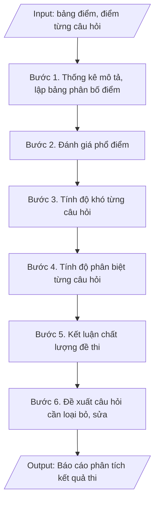

# Phân tích kết quả thi (phổ điểm, độ khó, độ phân biệt)

## Định dạng và file đầu ra
Định dạng đầu ra có thể chọn theo sản phẩm/yêu cầu: .xlsx, .csv, .pdf, .png, .svg. Đọc mục “Định dạng bổ sung” trong quy cách đầu ra trước khi chọn.

**Phải tạo file thực tế để tải xuống, không chỉ trả nội dung trong chat.** Định dạng mặc định của skill: **.xlsx**. Nếu yêu cầu gồm cả báo cáo thuyết minh, tạo thêm file Word cho báo cáo; không ghép báo cáo dài vào bảng tính. Không chờ người dùng yêu cầu xuất file lần nữa. Ưu tiên định dạng người dùng chỉ định; đọc quy tắc xuất file tại references/quy-cach-dau-ra.md.

## Quy cách đầu ra và thông tin thiếu
Đọc [quy cách và cấu trúc sản phẩm](references/quy-cach-dau-ra.md) trước khi soạn/xuất. File giao chỉ gồm sản phẩm nghiệp vụ được yêu cầu; kiểm tra nội bộ không xuất kèm. Thiếu thông tin thì giữ nguyên trường/mục và chỗ điền theo mẫu gốc (dòng dấu chấm, dấu gạch hoặc ô trống); không tự điền dữ liệu mẫu, số 0, mã chờ xác minh hay dòng chờ ký. Mẫu chuyên ngành còn áp dụng được ưu tiên về cấu trúc, mã biểu và người ký. Bản đầy đủ: [quy tắc chung](references/quy-tac-chung.md).

## Kiểm soát áp dụng và phê duyệt
Trước khi chạy, xác định `ngay_ap_dung`, `loai_hinh_truong`, `quy_che_noi_bo`, `nguon_du_lieu`, `nguoi_kiem_duyet`; chỉ hỏi thông tin liên quan nghiệp vụ, không dùng giá trị giả định thay dữ liệu bắt buộc. Đối chiếu căn cứ pháp lý với văn bản gốc, hiệu lực, điều khoản áp dụng và chuyển tiếp. Bản đầy đủ: [quy tắc chung](references/quy-tac-chung.md).

Nếu có cập nhật pháp lý dưới đây, đọc [căn cứ và điều kiện áp dụng](references/phap-ly.md) trước khi làm. Quy trình dưới đây giữ nghiệp vụ từ bản gốc; mọi viện dẫn văn bản, mẫu biểu, điều khoản phải theo căn cứ đã chọn trong phap-ly.md, không theo văn bản cũ.

## Giới hạn và human gate
AI hỗ trợ chuẩn bị và đối chiếu; cán bộ phụ trách kiểm tra dữ liệu/căn cứ, người có thẩm quyền duyệt và ký. Không đánh dấu đã ký, đã duyệt, đã công bố khi chưa có chứng cứ. Dữ liệu sinh viên, sức khỏe, nhân sự, tài chính chỉ dùng theo mục đích và phân quyền, che thông tin định danh khi dùng ví dụ (Luật 91/2025/QH15, hiệu lực 01/01/2026); không tải dữ liệu lên dịch vụ ngoài khi chưa có quyền. Bản đầy đủ: [quy tắc chung](references/quy-tac-chung.md).

## Khi nào dùng
Khi kỳ thi kết thúc và đã có bảng điểm: cần đánh giá đề thi có phù hợp không,
câu hỏi nào quá khó/quá dễ, cần điều chỉnh gì cho lần sau.

## Đầu vào (Input)
| Trường | Mô tả | Bắt buộc |
|---|---|---|
| `hoc_phan` | Mã + tên học phần | Có |
| `hinh_thuc_thi` | Trắc nghiệm / Tự luận | Có |
| `bang_diem` | Bảng điểm chi tiết từng sinh viên (điểm tổng + điểm từng câu, nếu có) | Có |
| `so_sinh_vien` | Số sinh viên dự thi | Có |
| `diem_dat` | Điểm đạt (mặc định thang 10: ≥ 4.0) | Không |

## Quy trình
**Ràng buộc pháp lý khi thực hiện** (trích references/phap-ly.md; đối chiếu toàn văn và hiệu lực tại ngày nghiệp vụ):
- Thông tư 56/2026/TT-BGDĐT, hiệu lực 07/07/2026: Yêu cầu khóa tuyển sinh, chương trình, ngày áp dụng và quy chế đào tạo nội bộ. Đối chiếu điều khoản chuyển tiếp trong toàn văn trước khi chọn quy tắc; không tự áp dụng quy định mới hồi tố cho mọi khóa. Không dùng điều/khoản, thang điểm hoặc điều kiện tốt nghiệp cũ như quy định hiện hành nếu chưa đối chiếu.
- Trước Bước 1: chọn căn cứ theo đối tượng, loại hình trường và chuyển tiếp; lập bảng văn bản / điều khoản / lý do áp dụng / bằng chứng. Thiếu văn bản gốc hoặc điều khoản thì ghi nhận nội bộ [CẦN XÁC MINH] (không đưa vào file giao), để trống phần tương ứng, chưa kết luận tuân thủ.
- Các con số, thời hạn, số điều, số mức xếp loại, hệ số và mẫu biểu nêu trong các bước dưới đây được giữ từ quy trình gốc (trước cập nhật pháp lý); chỉ dùng khi đã đối chiếu đúng với căn cứ đã chọn, khác thì theo căn cứ. Danh sách điểm cần đối chiếu: docs/DIEM_CAN_DOI_CHIEU_PHAP_LY.md.

**Bước 1. Thống kê mô tả**
- Làm gì: Từ `bang_diem`, tính: điểm trung bình, trung vị, độ lệch chuẩn, điểm cao nhất, điểm thấp nhất, tỷ lệ đạt (theo `diem_dat`, mặc định thang 10: ≥ 4.0); lập bảng phân bố điểm theo các khoảng: 0–3.9; 4.0–4.9; 5.0–6.4; 6.5–7.9; 8.0–10 (số SV và tỷ lệ % từng khoảng).
- Dùng input: `hoc_phan`, `bang_diem`, `so_sinh_vien`, `diem_dat`.
- Vai trò: Chuyên viên Phòng Khảo thí & ĐBCL · AI hỗ trợ: tính điểm TB, trung vị, độ lệch chuẩn và lập bảng phân bố điểm · ⏱ ~30 phút (ước tính)
- Lưu ý nghiệp vụ: kiểm tra số SV trong bảng điểm khớp với `so_sinh_vien` dự thi; loại điểm bất thường do nhập sai (điểm âm, điểm > thang) trước khi tính.
- → Kết quả bước: Bảng thống kê mô tả + bảng phân bố điểm theo khoảng.

**Bước 2. Đánh giá phổ điểm**
- Làm gì: Đối chiếu bảng phân bố điểm với phổ chuẩn: phổ điểm tốt có dạng gần chuẩn (hình chuông), tập trung ở khoảng 5.0–7.9; nếu phổ lệch hẳn về điểm cao → đề quá dễ; lệch về điểm thấp → đề quá khó; ghi nhận xét về mức độ phù hợp của đề thi.
- Dùng input: `bang_diem`, `hinh_thuc_thi`.
- Vai trò: Chuyên viên Phòng Khảo thí & ĐBCL · AI hỗ trợ: vẽ phổ điểm và nhận xét sơ bộ mức độ phù hợp của đề thi · ⏱ ~1 giờ (ước tính)
- Lưu ý nghiệp vụ: phổ điểm còn phản ánh chất lượng giảng dạy — phổ lệch thấp ở nhiều học phần cùng khóa có thể do dạy chưa tốt, không chỉ do đề khó.
- → Kết quả bước: Nhận xét đánh giá phổ điểm (phù hợp/quá dễ/quá khó).

**Bước 3. Tính độ khó câu hỏi (p)**
- Làm gì: Với từng câu hỏi, tính p = (số SV làm đúng câu) / (tổng số SV); phân loại theo quy ước: p < 0.3 = khó; 0.3–0.7 = trung bình (tốt); p > 0.7 = dễ; lập bảng độ khó từng câu.
- Dùng input: `bang_diem`, `hinh_thuc_thi`.
- Vai trò: Chuyên viên Phòng Khảo thí & ĐBCL · AI hỗ trợ: tính chỉ số độ khó p và phân loại từng câu hỏi · ⏱ ~30 phút (ước tính)
- Lưu ý nghiệp vụ: với bài tự luận, "làm đúng" được quy ước là đạt ≥ 50% số điểm của câu; câu hỏi có p cực thấp (< 0.1) cần kiểm tra lại đáp án — có thể đáp án sai.
- → Kết quả bước: Bảng độ khó (p) từng câu hỏi đã phân loại.

**Bước 4. Tính độ phân biệt (D)**
- Làm gì: Chia SV thành nhóm cao (27% điểm cao nhất) và nhóm thấp (27% điểm thấp nhất); với từng câu hỏi tính D = p(nhóm cao) – p(nhóm thấp); phân loại theo quy ước: D ≥ 0.3 = tốt; 0.2–0.29 = chấp nhận được; D < 0.2 = kém, cần xem lại câu hỏi.
- Dùng input: `bang_diem`.
- Vai trò: Chuyên viên Phòng Khảo thí & ĐBCL · AI hỗ trợ: tính chỉ số độ phân biệt D và phân loại từng câu hỏi · ⏱ ~30 phút (ước tính)
- Lưu ý nghiệp vụ: câu hỏi quá dễ (p > 0.9) thường có D thấp là bình thường; chỉ đánh giá D có ý nghĩa với câu hỏi có p trong khoảng 0.2–0.8.
- → Kết quả bước: Bảng độ phân biệt (D) từng câu hỏi đã phân loại.

**Bước 5. Kết luận chất lượng đề thi**
- Làm gì: Tổng hợp 02 chỉ số p và D của toàn bộ câu hỏi: tính % câu hỏi đạt yêu cầu (p trong 0.3–0.7 và D ≥ 0.2), % câu hỏi cần hiệu đính, % câu hỏi đề nghị loại bỏ; đối chiếu với nhận xét phổ điểm ở Bước 2 để kết luận tổng thể về chất lượng đề thi.
- Dùng input: `hoc_phan`, `hinh_thuc_thi`.
- Vai trò: Chuyên viên Phòng Khảo thí & ĐBCL · AI hỗ trợ: tổng hợp bảng chất lượng câu hỏi theo 02 chỉ số p và D · ⏱ ~1 giờ (ước tính)
- Lưu ý nghiệp vụ: đề thi đạt yêu cầu khi ≥ 70% câu hỏi đạt cả 02 chỉ số; giữ lại có chủ đích một số câu khó có D tốt để làm câu phân loại.
- → Kết quả bước: Bảng tổng hợp chất lượng câu hỏi + kết luận tổng thể về đề thi.

**Bước 6. Đề xuất**
- Làm gì: Lập danh sách câu hỏi cần loại bỏ (D < 0.2 kèm p ngoài khoảng tốt) và câu hỏi cần hiệu đính trước khi đưa lại vào ngân hàng đề thi (ghi rõ đơn vị thực hiện, thời hạn); đề xuất bổ sung câu hỏi ở mức độ/chương còn thiếu; kiến nghị về giảng dạy hoặc phụ đạo bổ sung nếu nhiều SV không đạt ở cùng một nội dung.
- Dùng input: `hoc_phan`, `so_sinh_vien`.
- Vai trò: Khoa chuyên môn / Bộ môn (quyết định loại bỏ, hiệu đính câu hỏi) · AI hỗ trợ: lập danh sách loại bỏ/hiệu đính sơ bộ theo ngưỡng p/D · ⏱ ~1 giờ (ước tính)
- Lưu ý nghiệp vụ: kết quả phân tích phải được cập nhật vào ngân hàng đề thi (loại bỏ/hiệu đính câu hỏi kém) — đây là khâu bắt buộc trong vòng đời ngân hàng đề; danh sách SV cần phụ đạo chuyển cho khoa xử lý.
- → Kết quả bước: Danh sách câu hỏi cần loại bỏ/hiệu đính + đề xuất cải tiến đề thi và giảng dạy.

## Luồng quy trình (Workflow)

## Đầu ra
- Báo cáo phân tích kết quả thi (phổ điểm, chỉ số, đánh giá từng câu hỏi).
- Danh sách câu hỏi cần hiệu đính + đề xuất cải tiến.

File nghiệp vụ thực tế theo định dạng mặc định ở đầu skill hoặc định dạng người dùng yêu cầu, kèm liên kết tải trong phản hồi cuối.

Sản phẩm nghiệp vụ hoàn chỉnh theo [quy cách và cấu trúc](references/quy-cach-dau-ra.md), giữ các trường chưa có dữ liệu ở trạng thái trống. Không xuất kèm checklist/phụ lục kiểm tra đầu ra.

## Kiểm tra nội bộ trước khi giao
Các tiêu chí sau dùng để tự đối chiếu; không sao chép vào file xuất. Mục thiếu dữ liệu được để trống, không đánh dấu đã đạt hoặc đã duyệt.

- [ ] Đủ các phần và đúng bố cục theo cấu trúc tại references/quy-cach-dau-ra.md (không theo cấu trúc của bản gốc).
- [ ] Số sinh viên trong bảng điểm khớp với Input (`so_sinh_vien`); điểm bất thường do nhập sai (điểm âm, điểm vượt thang) đã loại trước khi tính.
- [ ] Không bịa đặt điểm số, chỉ số p/D, kết luận chất lượng câu hỏi.
- [ ] Đúng quy ước phân loại: độ khó p < 0.3 khó / 0.3–0.7 trung bình / p > 0.7 dễ; độ phân biệt D ≥ 0.3 tốt / 0.2–0.29 chấp nhận được / D < 0.2 kém.
- [ ] Đề thi đạt yêu cầu khi ≥ 70% câu hỏi đạt cả 02 chỉ số p và D; nhận xét phổ điểm đối chiếu với phổ chuẩn hình chuông.
- [ ] Đã qua Human gate: người có thẩm quyền theo quy trình đã duyệt.
- [ ] Câu hỏi có p cực thấp (< 0.1) đã kiểm tra lại đáp án; câu hỏi D < 0.2 kèm p ngoài khoảng tốt đã đưa vào danh sách loại bỏ.
- [ ] Kết quả phân tích đã được cập nhật vào ngân hàng đề thi (loại bỏ/hiệu đính câu hỏi kém); danh sách sinh viên cần phụ đạo đã chuyển cho khoa xử lý.

## Căn cứ & lưu ý
- Căn cứ hiện hành: xem [căn cứ và điều kiện áp dụng](references/phap-ly.md); phải đối chiếu văn bản gốc, hiệu lực và chuyển tiếp tại ngày nghiệp vụ.
- Phân tích sau thi là khâu bắt buộc trong vòng đời ngân hàng đề thi: kết quả dùng để
  cập nhật, loại bỏ câu hỏi kém chất lượng.
- Dữ liệu điểm là thông tin cá nhân của sinh viên — chỉ dùng cho mục đích chuyên môn,
  không công khai chi tiết từng cá nhân.
- Không dùng tên thật của trường/cá nhân khi mô phỏng.

## Tư liệu đối chiếu
Bản gốc trước cập nhật pháp lý (kèm ví dụ giả lập) lưu tại `references/quy-trinh-lich-su.md`, chỉ để đối chiếu hồ sơ lịch sử; không dùng căn cứ, mẫu hay số liệu trong đó làm chỉ dẫn hiện hành.

## Quản trị phiên bản
- Phiên bản gói `1.3.2` (cập nhật 2026-10-10); hồ sơ đầy đủ tại [references/version.json](references/version.json).
- Người phê duyệt nghiệp vụ: **chưa chỉ định**. Trạng thái: dự thảo nghiệp vụ; kiểm tra pháp lý trước thực thi. Ngày cập nhật không đồng nghĩa mọi văn bản đã được rà soát toàn văn.
- Giấy phép theo LICENSE của kho (bản quyền CES Global). Lịch sử thay đổi: CHANGELOG.md.
