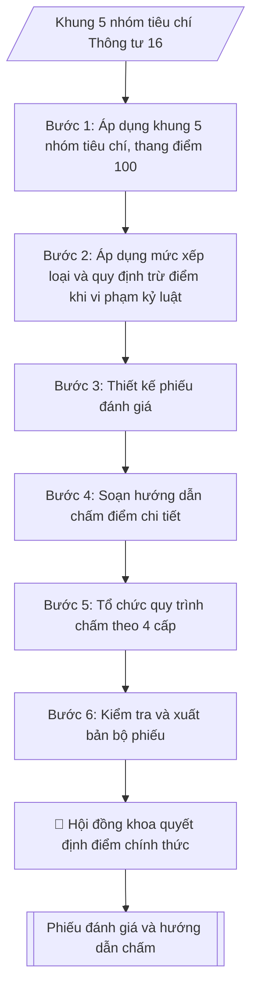

# Lập phiếu đánh giá kết quả rèn luyện sinh viên + hướng dẫn chấm

## Định dạng và file đầu ra

Định dạng đầu ra có thể chọn theo sản phẩm/yêu cầu: .docx, .pdf. Đọc mục “Định dạng bổ sung” trong quy cách đầu ra trước khi chọn.

**Phải tạo file thực tế để tải xuống, không chỉ trả nội dung trong chat.** Định dạng mặc định của skill: **.docx**. Nếu có bảng số liệu nghiệp vụ yêu cầu file bảng tính riêng, tạo thêm Excel theo yêu cầu; không tự tạo file kiểm tra. Không chờ người dùng yêu cầu xuất file lần nữa. Ưu tiên định dạng người dùng chỉ định; đọc quy tắc xuất file tại references/quy-cach-dau-ra.md.

## Quy cách đầu ra và thông tin thiếu
Khi dựng file Word/Excel, áp dụng mục “Thể thức và bảng biểu khi dựng file” trong quy cách đầu ra (cỡ chữ từng thành phần, bảng nhiều trang, số trang, phụ lục). Đọc [quy cách và cấu trúc sản phẩm](references/quy-cach-dau-ra.md) trước khi soạn/xuất. File giao chỉ gồm sản phẩm nghiệp vụ được yêu cầu; kiểm tra nội bộ không xuất kèm. Thiếu thông tin thì giữ nguyên trường/mục và chỗ điền theo mẫu gốc (dòng dấu chấm, dấu gạch hoặc ô trống); không tự điền dữ liệu mẫu, số 0, mã chờ xác minh hay dòng chờ ký. Mẫu chuyên ngành còn áp dụng được ưu tiên về cấu trúc, mã biểu và người ký. Bản đầy đủ: [quy tắc chung](references/quy-tac-chung.md).

## Kiểm soát áp dụng và phê duyệt
Trước khi chạy, xác định `ngay_ap_dung`, `loai_hinh_truong`, `quy_che_noi_bo`, `nguon_du_lieu`, `nguoi_kiem_duyet`; chỉ hỏi thông tin liên quan nghiệp vụ, không dùng giá trị giả định thay dữ liệu bắt buộc. Đối chiếu căn cứ pháp lý với văn bản gốc, hiệu lực, điều khoản áp dụng và chuyển tiếp. Bản đầy đủ: [quy tắc chung](references/quy-tac-chung.md).

## Giới hạn và human gate
AI hỗ trợ chuẩn bị và đối chiếu; cán bộ phụ trách kiểm tra dữ liệu/căn cứ, người có thẩm quyền duyệt và ký. Không đánh dấu đã ký, đã duyệt, đã công bố khi chưa có chứng cứ. Dữ liệu sinh viên, sức khỏe, nhân sự, tài chính chỉ dùng theo mục đích và phân quyền, che thông tin định danh khi dùng ví dụ (Luật 91/2025/QH15, hiệu lực 01/01/2026); không tải dữ liệu lên dịch vụ ngoài khi chưa có quyền. Bản đầy đủ: [quy tắc chung](references/quy-tac-chung.md).

## Khi nào dùng
Cuối mỗi học kỳ, khi cần tổ chức đánh giá kết quả rèn luyện của sinh viên: sinh viên tự đánh giá,
tập thể lớp bình xét, cố vấn học tập nhận xét, hội đồng đánh giá cấp khoa chấm điểm và xếp loại,
làm căn cứ xét học bổng, khen thưởng, kỷ luật và đánh giá toàn diện sinh viên.

## Đầu vào (Input)

| Trường | Mô tả | Bắt buộc |
|---|---|---|
| `hoc_ky` | Học kỳ đánh giá (ví dụ: Học kỳ 1) | Có |
| `nam_hoc` | Năm học đánh giá (ví dụ: 2026–2027) | Có |
| `don_vi` | Khoa / lớp áp dụng phiếu | Không (mặc định: toàn trường, theo mẫu chung) |
| `tieu_chi_bo_sung` | Tiêu chí đặc thù của trường/khoa bổ sung trong khung điểm cho phép | Không |

## Quy trình

**Bước 1. Áp dụng khung 5 nhóm tiêu chí, thang điểm 100**
- Làm gì: lấy khung chuẩn Thông tư 16/2015/TT-BGDĐT: Nhóm 1 Ý thức học tập (tối đa 30 điểm: thái độ học tập 15, hoạt động học thuật/NCKH 10, vượt khó 5); Nhóm 2 Chấp hành nội quy, quy chế (tối đa 25 điểm: văn bản chỉ đạo 5, nội quy trường 15, an ninh trật tự/ATGT 5); Nhóm 3 Hoạt động chính trị – xã hội – văn hóa – thể thao, phòng chống tội phạm/tệ nạn (tối đa 20 điểm: tham gia hoạt động 10, tuyên truyền phòng chống 5, công ích/tình nguyện 5); Nhóm 4 Phẩm chất công dân, quan hệ cộng đồng (tối đa 15 điểm: mỗi tiêu chí 5); Nhóm 5 Công tác cán bộ lớp/đoàn thể, thành tích đặc biệt (tối đa 10 điểm: tham gia 6, kỹ năng/thành tích 4); cộng tiêu chí đặc thù của trường/khoa từ `tieu_chi_bo_sung` trong phạm vi điểm tối đa cho phép của từng nhóm.
- Dùng input: `tieu_chi_bo_sung`.
- Vai trò: Trưởng Phòng Công tác sinh viên · AI hỗ trợ: dựng khung 5 nhóm tiêu chí · ⏱ ~1–2 giờ (ước tính)
- Lưu ý nghiệp vụ: khung 5 nhóm và tổng thang điểm 100 là khung chuẩn của Thông tư — trường chỉ được cụ thể hóa tiêu chí chi tiết trong phạm vi điểm tối đa từng nhóm, tuyệt đối không thay đổi tổng thang điểm và các mức xếp loại; tiêu chí bổ sung không được vượt điểm tối đa của nhóm.
- → Kết quả bước: khung tiêu chí chấm chính thức (5 nhóm, tiêu chí chi tiết và điểm tối đa từng tiêu chí).

**Bước 2. Áp dụng mức xếp loại và quy định trừ điểm khi vi phạm kỷ luật**
- Làm gì: chốt 6 mức xếp loại theo tổng điểm tối đa 100: Xuất sắc (90–100), Tốt (80–<90), Khá (65–<80), Trung bình (50–<65), Yếu (35–<50), Kém (<35); chốt quy tắc xử lý vi phạm kỷ luật: khiển trách trừ 25 điểm tổng; cảnh cáo trở lên xếp loại tối đa Trung bình; đình chỉ học tập có thời hạn xếp loại Kém trong thời gian bị đình chỉ; buộc thôi học đánh giá 0 điểm.
- Dùng input: (khung chuẩn Thông tư 16/2015/TT-BGDĐT).
- Vai trò: Chuyên viên Phòng Công tác sinh viên · AI hỗ trợ: áp dụng mức xếp loại và quy tắc trừ điểm theo Thông tư 16 · ⏱ ~30 phút (ước tính)
- Lưu ý nghiệp vụ: quy tắc trừ điểm/hạ xếp loại áp dụng sau khi đã cộng điểm 5 nhóm — không trừ trực tiếp vào điểm từng tiêu chí; sinh viên bị kỷ luật trong học kỳ đánh giá mới áp dụng, không truy cứu học kỳ trước.
- → Kết quả bước: bảng mức xếp loại + bảng quy tắc trừ điểm/hạ xếp loại khi vi phạm kỷ luật.

**Bước 3. Thiết kế phiếu đánh giá**
- Làm gì: dựng phiếu gồm: tiêu đề cơ quan (trường, khoa), tên phiếu, `hoc_ky`, `nam_hoc`; thông tin sinh viên (họ và tên, mã SV, lớp, khoa); bảng 5 nhóm tiêu chí từ Bước 1 với cột điểm tối đa và 4 cột chấm (SV tự chấm / Lớp chấm / Cố vấn / Hội đồng khoa); dòng tổng điểm; dòng xếp loại; khối chữ ký các bên (sinh viên – cố vấn học tập – chủ tịch hội đồng khoa, ký và đóng dấu).
- Dùng input: `hoc_ky`, `nam_hoc`, `don_vi`, kết quả Bước 1.
- Vai trò: Chuyên viên Phòng Công tác sinh viên · AI hỗ trợ: thiết kế mẫu phiếu đánh giá hoàn chỉnh · ⏱ ~1 giờ (ước tính)
- Lưu ý nghiệp vụ: 4 cột chấm phải tách bạch thành 4 cột riêng — gộp cột sẽ không phân biệt được điểm các cấp; phiếu phải có đủ 3 chữ ký (thiếu chữ ký hội đồng khoa thì phiếu chưa có giá trị chính thức).
- → Kết quả bước: mẫu phiếu đánh giá hoàn chỉnh (chưa điền điểm).

**Bước 4. Soạn hướng dẫn chấm điểm chi tiết**
- Làm gì: viết hướng dẫn phát hành kèm phiếu: nguyên tắc chấm (thang điểm 100, điểm mỗi tiêu chí không vượt điểm tối đa, tổng điểm làm tròn số nguyên); trình tự 4 cấp (SV tự đánh giá → lớp bình xét công khai, biểu quyết đa số → cố vấn nhận xét, ký xác nhận → hội đồng khoa quyết định điểm chính thức); mức xếp loại; xử lý vi phạm kỷ luật; thời hạn thực hiện; quy định lưu trữ.
- Dùng input: kết quả Bước 1, Bước 2.
- Vai trò: Chuyên viên Phòng Công tác sinh viên · AI hỗ trợ: soạn dự thảo hướng dẫn · ⏱ ~1–2 giờ (ước tính)
- Lưu ý nghiệp vụ: thời hạn phải ghi cụ thể (lớp hoàn thành bình xét trong 2 tuần đầu học kỳ kế tiếp; khoa gửi kết quả về Phòng CTSV trước ngày 15 của tháng đầu học kỳ kế tiếp) — không ghi chung chung "đúng thời hạn quy định".
- → Kết quả bước: bản hướng dẫn chấm điểm chi tiết (phát hành kèm phiếu).

**Bước 5. Tổ chức quy trình chấm theo 4 cấp**
- Làm gì: triển khai chấm theo đúng trình tự: (1) sinh viên tự đánh giá, ghi điểm từng tiêu chí vào phiếu, ký xác nhận; (2) tập thể lớp họp bình xét công khai (lớp trưởng chủ trì, cố vấn học tập dự), thảo luận và thống nhất điểm từng sinh viên theo đa số, thư ký ghi biên bản; (3) cố vấn học tập nhận xét, ký xác nhận vào phiếu; (4) Hội đồng đánh giá kết quả rèn luyện cấp khoa họp, xem xét, quyết định điểm chính thức và xếp loại; Phòng Công tác sinh viên tổng hợp toàn trường.
- Dùng input: mẫu phiếu (Bước 3) + hướng dẫn chấm (Bước 4).
- Vai trò: Tập thể lớp, Hội đồng khoa · AI hỗ trợ: chuẩn bị hồ sơ trình ký, nhắc lịch và theo dõi tiến độ · ⏱ ~2–3 tuần (ước tính)
- Lưu ý nghiệp vụ: bình xét lớp phải công khai và có biên bản — chấm "ngầm" không qua họp lớp là sai quy trình; điểm hội đồng khoa là điểm chính thức cuối cùng, các cấp trước chỉ có tính chất đề xuất.
- → Kết quả bước: kết quả chấm 4 cấp hoàn tất (phiếu đã ký đủ, biên bản bình xét lớp, quyết định của hội đồng khoa).

**Bước 6. Kiểm tra và xuất bản bộ phiếu**
- Làm gì: kiểm tra phiếu đầy đủ thông tin sinh viên, đủ 5 nhóm tiêu chí, đủ 4 cột chấm, có dòng tổng điểm và xếp loại, đủ chữ ký các bên; đính kèm hướng dẫn chấm điểm chi tiết để phát hành cùng phiếu.
- Dùng input: kết quả Bước 3, Bước 4.
- Vai trò: Chuyên viên Phòng Công tác sinh viên · AI hỗ trợ: kiểm tra tính đầy đủ của phiếu · ⏱ ~30–60 phút (ước tính)
- Lưu ý nghiệp vụ: kiểm tra tổng điểm các cột bằng công thức — sai một phép cộng sẽ sai xếp loại; phiếu mẫu phát hành phải là phiếu trắng (chưa điền điểm minh họa của sinh viên cụ thể).
- → Kết quả bước: bộ phiếu đánh giá + hướng dẫn chấm hoàn chỉnh, sẵn sàng phát hành.

## Luồng quy trình (Workflow)

## Đầu ra

File nghiệp vụ thực tế theo định dạng mặc định ở đầu skill hoặc định dạng người dùng yêu cầu, kèm liên kết tải trong phản hồi cuối.

Sản phẩm nghiệp vụ hoàn chỉnh theo [quy cách và cấu trúc](references/quy-cach-dau-ra.md), giữ các trường chưa có dữ liệu ở trạng thái trống. Không xuất kèm checklist/phụ lục kiểm tra đầu ra.

## Kiểm tra nội bộ trước khi giao

- [ ] Bố cục khớp mẫu áp dụng và cấu trúc tại references/quy-cach-dau-ra.md.
- [ ] Khung 5 nhóm tiêu chí, thang điểm 100 và 6 mức xếp loại đúng Thông tư 16/2015/TT-BGDĐT; không thay đổi tổng thang điểm và mức xếp loại.
- [ ] Tiêu chí bổ sung của trường/khoa không vượt điểm tối đa của nhóm.
- [ ] Quy tắc trừ điểm/hạ xếp loại khi vi phạm kỷ luật áp dụng sau khi cộng điểm 5 nhóm và chỉ cho học kỳ bị kỷ luật.
- [ ] Không bịa đặt điểm minh họa của sinh viên cụ thể — phiếu mẫu phát hành là phiếu trắng.
- [ ] Đủ 3 chữ ký (sinh viên, cố vấn học tập, chủ tịch hội đồng khoa ký và đóng dấu); thời hạn thực hiện ghi cụ thể.
- [ ] Đã qua Human gate: Hội đồng cấp khoa quyết định điểm chính thức (điểm các cấp trước chỉ mang tính đề xuất).

Tiêu chí đạt = tất cả các ô được đánh dấu.

## Căn cứ & lưu ý
- Thông tư 16/2015/TT-BGDĐT ngày 12/08/2015 của Bộ Giáo dục và Đào tạo quy định về đánh giá
  kết quả rèn luyện của người học được đào tạo trình độ đại học hệ chính quy.
- Khung 5 nhóm tiêu chí và thang điểm 100 nêu trên là khung chuẩn của Thông tư; trường chỉ
  được cụ thể hóa tiêu chí chi tiết trong phạm vi điểm tối đa của từng nhóm, không thay đổi
  tổng thang điểm và các mức xếp loại.
- Kết quả rèn luyện là căn cứ xét học bổng, khen thưởng, kỷ luật và đánh giá sinh viên
  toàn diện; sinh viên xếp loại Kém hoặc Yếu 2 học kỳ liên tiếp được xem xét theo quy chế.
- Không dùng tên thật của trường/cá nhân khi mô phỏng.

## Quản trị phiên bản
- Phiên bản gói `1.3.2` (cập nhật 2026-10-10); hồ sơ đầy đủ tại [references/version.json](references/version.json).
- Người phê duyệt nghiệp vụ: **chưa chỉ định**. Trạng thái: dự thảo nghiệp vụ; kiểm tra pháp lý trước thực thi. Ngày cập nhật không đồng nghĩa mọi văn bản đã được rà soát toàn văn.
- Giấy phép theo LICENSE của kho (bản quyền CES Global). Lịch sử thay đổi: CHANGELOG.md.
