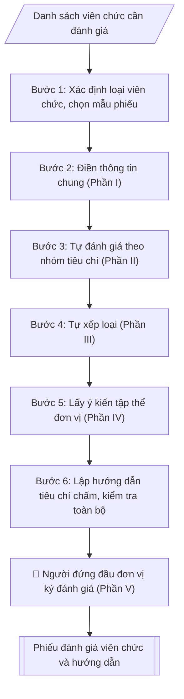

# Phiếu đánh giá, xếp loại viên chức

## Định dạng và file đầu ra
Định dạng đầu ra có thể chọn theo sản phẩm/yêu cầu: .docx, .pdf. Đọc mục “Định dạng bổ sung” trong quy cách đầu ra trước khi chọn.

**Phải tạo file thực tế để tải xuống, không chỉ trả nội dung trong chat.** Định dạng mặc định của skill: **.docx**. Nếu có bảng số liệu nghiệp vụ yêu cầu file bảng tính riêng, tạo thêm Excel theo yêu cầu; không tự tạo file kiểm tra. Không chờ người dùng yêu cầu xuất file lần nữa. Ưu tiên định dạng người dùng chỉ định; đọc quy tắc xuất file tại references/quy-cach-dau-ra.md.

## Quy cách đầu ra và thông tin thiếu
Khi dựng file Word/Excel, áp dụng mục “Thể thức và bảng biểu khi dựng file” trong quy cách đầu ra (cỡ chữ từng thành phần, bảng nhiều trang, số trang, phụ lục). Đọc [quy cách và cấu trúc sản phẩm](references/quy-cach-dau-ra.md) trước khi soạn/xuất. File giao chỉ gồm sản phẩm nghiệp vụ được yêu cầu; kiểm tra nội bộ không xuất kèm. Thiếu thông tin thì giữ nguyên trường/mục và chỗ điền theo mẫu gốc (dòng dấu chấm, dấu gạch hoặc ô trống); không tự điền dữ liệu mẫu, số 0, mã chờ xác minh hay dòng chờ ký. Mẫu chuyên ngành còn áp dụng được ưu tiên về cấu trúc, mã biểu và người ký. Bản đầy đủ: [quy tắc chung](references/quy-tac-chung.md).

## Kiểm soát áp dụng và phê duyệt
Trước khi chạy, xác định `ngay_ap_dung`, `loai_hinh_truong`, `quy_che_noi_bo`, `nguon_du_lieu`, `nguoi_kiem_duyet`; chỉ hỏi thông tin liên quan nghiệp vụ, không dùng giá trị giả định thay dữ liệu bắt buộc. Đối chiếu căn cứ pháp lý với văn bản gốc, hiệu lực, điều khoản áp dụng và chuyển tiếp. Bản đầy đủ: [quy tắc chung](references/quy-tac-chung.md).

Nếu có cập nhật pháp lý dưới đây, đọc [căn cứ và điều kiện áp dụng](references/phap-ly.md) trước khi làm. Quy trình dưới đây giữ nghiệp vụ từ bản gốc; mọi viện dẫn văn bản, mẫu biểu, điều khoản phải theo căn cứ đã chọn trong phap-ly.md, không theo văn bản cũ.

## Giới hạn và human gate
AI hỗ trợ chuẩn bị và đối chiếu; cán bộ phụ trách kiểm tra dữ liệu/căn cứ, người có thẩm quyền duyệt và ký. Không đánh dấu đã ký, đã duyệt, đã công bố khi chưa có chứng cứ. Dữ liệu sinh viên, sức khỏe, nhân sự, tài chính chỉ dùng theo mục đích và phân quyền, che thông tin định danh khi dùng ví dụ (Luật 91/2025/QH15, hiệu lực 01/01/2026); không tải dữ liệu lên dịch vụ ngoài khi chưa có quyền. Bản đầy đủ: [quy tắc chung](references/quy-tac-chung.md).

## Khi nào dùng
Khi tổ chức đánh giá, xếp loại viên chức hằng năm (thường vào tháng 11–12) tại các đơn vị:
viên chức tự đánh giá → tập thể đơn vị nhận xét → người đứng đầu đơn vị đánh giá →
Hội đồng đánh giá của trường tổng hợp, trình Hiệu trưởng quyết định xếp loại.

## Đầu vào (Input)
| Trường | Mô tả | Bắt buộc |
|---|---|---|
| `loai_vien_chuc` | Quản lý (giữ chức vụ lãnh đạo, quản lý) / Không giữ chức vụ quản lý | Có |
| `ho_ten` | Họ tên viên chức được đánh giá | Có |
| `chuc_vu` | Chức vụ (nếu là viên chức quản lý) / chức danh nghề nghiệp | Có |
| `don_vi` | Đơn vị công tác | Có |
| `nam_danh_gia` | Năm đánh giá | Có |
| `nhiem_vu_chu_yeu` | Các nhiệm vụ chính được giao trong năm | Có |
| `ket_qua_thuc_hien` | Kết quả nổi bật đạt được trong năm | Không |

## Quy trình
**Ràng buộc pháp lý khi thực hiện** (trích references/phap-ly.md; đối chiếu toàn văn và hiệu lực tại ngày nghiệp vụ):
- Luật 129/2025/QH15; Nghị định 259/2026/NĐ-CP; phạm vi: Viên chức đơn vị sự nghiệp công lập; kiểm tra chuyển tiếp và quy định riêng về nhà giáo: Cập nhật căn cứ tuyển dụng, hợp đồng làm việc, bổ nhiệm, điều động và đào tạo viên chức. Không tái sử dụng số điều hoặc mẫu phiếu của NĐ 115. Phải yêu cầu ngày tuyển dụng, ngày phê duyệt kế hoạch, loại hợp đồng, trạng thái hồ sơ và bản văn NĐ 259 để chọn điều khoản chuyển tiếp; không tự áp dụng điều22 Luật Viên chức2010. Các văn bản cũ chỉ là căn cứ lịch sử khi chuyển tiếp cho phép.
- Nghị định 233/2026/NĐ-CP; phạm vi: Đánh giá đơn vị sự nghiệp công lập và viên chức: Dùng khung tiêu chí và quy chế đánh giá của đơn vị; bổ sung dữ liệu theo dõi/chấm điểm tháng hoặc quý, nhiệm vụ được giao, sản phẩm công việc, minh chứng, kết quả giám sát. Không tạo thang điểm từ trí nhớ, không tiếp tục ghi Mẫu03 của NĐ 90 là mẫu hiện hành. Tính điểm và xếp loại phải từ tiêu chí được phê duyệt; báo cáo liệt kê thiếu minh chứng.
- Luật Nhà giáo; Nghị định 93/2026/NĐ-CP; khoản 9 Điều 62 NĐ 259/2026; phạm vi: Viên chức là nhà giáo: Thêm input đối tượng là nhà giáo hay viên chức khác. Nếu pháp luật nhà giáo có quy định khác về thẩm quyền, tiêu chuẩn, điều kiện, trình tự, thủ tục tuyển dụng/sử dụng/quản lý, áp dụng quy định nhà giáo và hướng dẫn Bộ GDĐT thay vì quy tắc chung NĐ 259.
- Trước Bước 1: chọn căn cứ theo đối tượng, loại hình trường và chuyển tiếp; lập bảng văn bản / điều khoản / lý do áp dụng / bằng chứng. Thiếu văn bản gốc hoặc điều khoản thì ghi nhận nội bộ [CẦN XÁC MINH] (không đưa vào file giao), để trống phần tương ứng, chưa kết luận tuân thủ.
- Các con số, thời hạn, số điều, số mức xếp loại, hệ số và mẫu biểu nêu trong các bước dưới đây được giữ từ quy trình gốc (trước cập nhật pháp lý); chỉ dùng khi đã đối chiếu đúng với căn cứ đã chọn, khác thì theo căn cứ. Danh sách điểm cần đối chiếu: docs/DIEM_CAN_DOI_CHIEU_PHAP_LY.md.

**Bước 1. Xác định loại viên chức và chọn mẫu phiếu**
- Làm gì: phân loại viên chức: quản lý (giữ chức vụ lãnh đạo, quản lý) hay không giữ chức vụ quản lý; chọn đúng mẫu phiếu — viên chức quản lý dùng mẫu có thêm tiêu chí về năng lực lãnh đạo, quản lý và kết quả hoạt động của đơn vị được giao phụ trách; viên chức không quản lý đánh giá theo 4 nhóm tiêu chí chung + kết quả thực hiện nhiệm vụ.
- Dùng input: `loai_vien_chuc`, `chuc_vu`.
- Vai trò: Chuyên viên Phòng TCCB · AI hỗ trợ: phân tích input, xác định yêu cầu · ⏱ ~20–45 phút (ước tính)
- Lưu ý nghiệp vụ: dùng nhầm mẫu phiếu là lỗi phổ biến; viên chức quản lý kiêm nhiệm chuyên môn thì đánh giá cả hai vai trò.
- → Kết quả bước: mẫu phiếu đúng loại viên chức.

**Bước 2. Điền thông tin chung (Phần I)**
- Làm gì: điền họ tên, chức danh nghề nghiệp, đơn vị công tác, năm đánh giá; liệt kê các nhiệm vụ chính được giao trong năm (trích từ kế hoạch công tác / phân công nhiệm vụ đầu năm của đơn vị).
- Dùng input: `ho_ten`, `chuc_vu`, `don_vi`, `nam_danh_gia`, `nhiem_vu_chu_yeu`.
- Vai trò: Viên chức/Cá nhân liên quan (người điền thông tin) · AI hỗ trợ: hướng dẫn điền, kiểm tra đầy đủ các mục · ⏱ ~15–30 phút (ước tính)
- Lưu ý nghiệp vụ: nhiệm vụ phải là nhiệm vụ ĐÃ GIAO từ đầu năm, không tự kê thêm nhiệm vụ mới để "làm đẹp" hồ sơ.
- → Kết quả bước: Phần I – Thông tin chung hoàn chỉnh.

**Bước 3. Tự đánh giá theo nhóm tiêu chí (Phần II)**
- Làm gì: tự đánh giá lần lượt 5 nhóm tiêu chí: (1) Chính trị tư tưởng; (2) Đạo đức, lối sống; (3) Tác phong, lề lối làm việc; (4) Ý thức tổ chức kỷ luật; (5) Kết quả thực hiện chức trách, nhiệm vụ được giao — mỗi nhóm nêu nhận định kèm minh chứng cụ thể (số liệu, văn bản, kết quả đạt được).
- Dùng input: `nhiem_vu_chu_yeu`, `ket_qua_thuc_hien`.
- Vai trò: Viên chức (tự đánh giá/xếp loại) · AI hỗ trợ: gợi ý cách viết, kiểm tra tính đầy đủ các mục · ⏱ ~15–30 phút (ước tính)
- Lưu ý nghiệp vụ: mỗi nhận định phải có minh chứng đi kèm, tránh chung chung kiểu "hoàn thành tốt" mà không có số liệu; viên chức quản lý bổ sung phần đánh giá năng lực lãnh đạo, quản lý và kết quả hoạt động của đơn vị được giao phụ trách.
- → Kết quả bước: Phần II – Tự đánh giá có minh chứng cụ thể.

**Bước 4. Tự xếp loại (Phần III)**
- Làm gì: đối chiếu kết quả tự đánh giá với điều kiện 4 mức xếp loại theo văn bản hiện hành nêu tại phap-ly.md (Hoàn thành xuất sắc nhiệm vụ / Hoàn thành tốt nhiệm vụ / Hoàn thành nhiệm vụ / Không hoàn thành nhiệm vụ); chọn 01 mức và ghi lý do.
- Dùng input: `ket_qua_thuc_hien`.
- Vai trò: Viên chức (tự đánh giá/xếp loại) · AI hỗ trợ: gợi ý cách viết, kiểm tra tính đầy đủ các mục · ⏱ ~15–30 phút (ước tính)
- Lưu ý nghiệp vụ: viên chức bị xử lý kỷ luật trong năm đánh giá thì bắt buộc xếp "Không hoàn thành nhiệm vụ"; mức Hoàn thành xuất sắc nhiệm vụ yêu cầu hoàn thành 100% nhiệm vụ trong đó ≥ 50% vượt mức và có đổi mới, sáng tạo.
- → Kết quả bước: mức tự xếp loại + lý do.

**Bước 5. Lấy ý kiến tập thể đơn vị (Phần IV)**
- Làm gì: tổ chức họp đơn vị để tập thể nhận xét, bỏ phiếu (nếu có) đối với viên chức được đánh giá; ghi ý kiến của tập thể vào Phần IV; hoàn thiện phiếu để trình người đứng đầu đơn vị.
- Dùng input: `ho_ten`, `don_vi`.
- Vai trò: Tập thể/cá nhân được lấy ý kiến; Chuyên viên Phòng TCCB tổng hợp · AI hỗ trợ: tổng hợp ý kiến thành báo cáo · ⏱ ~15–30 phút (ước tính)
- Lưu ý nghiệp vụ: ý kiến tập thể phải được ghi trung thực, không "làm tròn" để né tránh; thiếu chữ ký xác nhận của tập thể thì trả về bổ sung.
- → Kết quả bước: phiếu đánh giá đã có ý kiến tập thể (Phần IV hoàn chỉnh).

**Bước 6. Lập hướng dẫn tiêu chí chấm và kiểm tra toàn bộ**
- Làm gì: soạn bản hướng dẫn tiêu chí chấm cho từng nhóm tiêu chí (nội dung đánh giá, căn cứ chấm/minh chứng) và điều kiện từng mức xếp loại theo văn bản hiện hành nêu tại phap-ly.md; kiểm tra lần cuối: đúng mẫu theo loại viên chức, đủ chữ ký các cấp (cá nhân → tập thể → người đứng đầu), thời gian đánh giá trong năm.
- Dùng input: `loai_vien_chuc`, `nam_danh_gia` (hướng dẫn tiêu chí căn cứ quy định văn bản hiện hành nêu tại phap-ly.md, không phụ thuộc trường input cụ thể).
- Vai trò: Chuyên viên Phòng TCCB (Trưởng phòng kiểm tra lại) · AI hỗ trợ: quét lỗi theo checklist · ⏱ ~15–30 phút (ước tính)
- Lưu ý nghiệp vụ: minh chứng bắt buộc đối với mức Hoàn thành xuất sắc nhiệm vụ; đơn vị chấm mức Xuất sắc còn cảm tính, thiếu minh chứng định lượng là tồn tại phổ biến cần chấn chỉnh.
- → Kết quả bước: bản hướng dẫn tiêu chí đánh giá + phiếu đã kiểm tra, sẵn sàng trình người đứng đầu ký đánh giá (Phần V).

## Luồng quy trình (Workflow)

## Đầu ra
- Phiếu tự đánh giá, xếp loại viên chức (theo đúng loại: quản lý / không quản lý).
- Bản hướng dẫn tiêu chí đánh giá và điều kiện từng mức xếp loại.

File nghiệp vụ thực tế theo định dạng mặc định ở đầu skill hoặc định dạng người dùng yêu cầu, kèm liên kết tải trong phản hồi cuối.

Sản phẩm nghiệp vụ hoàn chỉnh theo [quy cách và cấu trúc](references/quy-cach-dau-ra.md), giữ các trường chưa có dữ liệu ở trạng thái trống. Không xuất kèm checklist/phụ lục kiểm tra đầu ra.

## Kiểm tra nội bộ trước khi giao
Các tiêu chí sau dùng để tự đối chiếu; không sao chép vào file xuất. Mục thiếu dữ liệu được để trống, không đánh dấu đã đạt hoặc đã duyệt.

- [ ] Đủ các phần và đúng bố cục theo cấu trúc tại references/quy-cach-dau-ra.md (không theo cấu trúc của bản gốc).
- [ ] Nội dung và số liệu trong output khớp đúng với Input đã cho (không thêm, bớt hay suy diễn)
- [ ] Không bịa đặt số liệu, minh chứng, trích dẫn hay căn cứ
- [ ] Đúng thể thức và cấu trúc theo references/quy-cach-dau-ra.md và căn cứ đã chọn tại references/phap-ly.md.
- [ ] Căn cứ pháp lý được trích dẫn đầy đủ và còn hiệu lực
- [ ] Đã qua Human gate: người có thẩm quyền đã kiểm tra/duyệt trước khi phát hành
- [ ] Nhiệm vụ phải là nhiệm vụ ĐÃ GIAO từ đầu năm, không tự kê thêm nhiệm vụ mới để "làm đẹp" hồ sơ
- [ ] Mỗi nhận định phải có minh chứng đi kèm, tránh chung chung kiểu "hoàn thành tốt" mà không có số liệu
- [ ] Viên chức bị xử lý kỷ luật trong năm đánh giá thì bắt buộc xếp "Không hoàn thành nhiệm vụ"

## Căn cứ & lưu ý
- Căn cứ hiện hành: xem [căn cứ và điều kiện áp dụng](references/phap-ly.md); phải đối chiếu văn bản gốc, hiệu lực và chuyển tiếp tại ngày nghiệp vụ.
- Nghị định 30/2020/NĐ-CP về thể thức văn bản.
- Lưu ý: viên chức quản lý dùng mẫu phiếu riêng, có thêm tiêu chí về năng lực lãnh đạo,
  quản lý và kết quả hoạt động của đơn vị được giao phụ trách; viên chức bị xử lý kỷ luật
  trong năm đánh giá thì xếp loại không hoàn thành nhiệm vụ; thời gian đánh giá thực hiện
  trước ngày 15/12 hằng năm.
- Không dùng tên thật của trường/cá nhân khi mô phỏng.

## Tư liệu đối chiếu
Bản gốc trước cập nhật pháp lý (kèm ví dụ giả lập) lưu tại `references/quy-trinh-lich-su.md`, chỉ để đối chiếu hồ sơ lịch sử; không dùng căn cứ, mẫu hay số liệu trong đó làm chỉ dẫn hiện hành.

## Quản trị phiên bản
- Phiên bản gói `1.3.2` (cập nhật 2026-10-10); hồ sơ đầy đủ tại [references/version.json](references/version.json).
- Người phê duyệt nghiệp vụ: **chưa chỉ định**. Trạng thái: dự thảo nghiệp vụ; kiểm tra pháp lý trước thực thi. Ngày cập nhật không đồng nghĩa mọi văn bản đã được rà soát toàn văn.
- Giấy phép theo LICENSE của kho (bản quyền CES Global). Lịch sử thay đổi: CHANGELOG.md.
