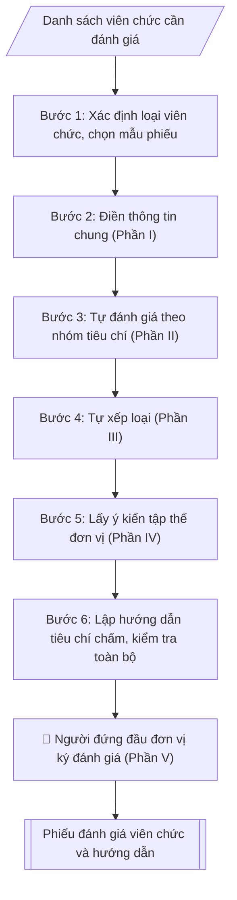

# Tư liệu lịch sử – không phải quy trình hiện hành

Nội dung từ phiên bản nguồn trước 1.1.0, giữ để đối chiếu dữ liệu đầu vào và thay đổi; căn cứ, điều kiện, mẫu và ví dụ có thể đã lỗi thời. Không dùng để thực hiện nghiệp vụ hiện tại.

## Khi nào dùng
Khi tổ chức đánh giá, xếp loại viên chức hằng năm (thường vào tháng 11–12) tại các đơn vị:
viên chức tự đánh giá → tập thể đơn vị nhận xét → người đứng đầu đơn vị đánh giá →
Hội đồng đánh giá của trường tổng hợp, trình Hiệu trưởng quyết định xếp loại.

## Đầu vào (Input)

| Trường | Mô tả | Bắt buộc |
|---|---|---|
| `loai_vien_chuc` | Quản lý (giữ chức vụ lãnh đạo, quản lý) / Không giữ chức vụ quản lý | Có |
| `ho_ten` | Họ tên viên chức được đánh giá | Có |
| `chuc_vu` | Chức vụ (nếu là viên chức quản lý) / chức danh nghề nghiệp | Có |
| `don_vi` | Đơn vị công tác | Có |
| `nam_danh_gia` | Năm đánh giá | Có |
| `nhiem_vu_chu_yeu` | Các nhiệm vụ chính được giao trong năm | Có |
| `ket_qua_thuc_hien` | Kết quả nổi bật đạt được trong năm | Không |

## Quy trình

**Bước 1. Xác định loại viên chức và chọn mẫu phiếu**
- Làm gì: phân loại viên chức: quản lý (giữ chức vụ lãnh đạo, quản lý) hay không giữ chức vụ quản lý; chọn đúng mẫu phiếu — viên chức quản lý dùng mẫu có thêm tiêu chí về năng lực lãnh đạo, quản lý và kết quả hoạt động của đơn vị được giao phụ trách; viên chức không quản lý đánh giá theo 4 nhóm tiêu chí chung + kết quả thực hiện nhiệm vụ.
- Dùng input: `loai_vien_chuc`, `chuc_vu`.
- Vai trò: Chuyên viên Phòng TCCB · AI hỗ trợ: phân tích input, xác định yêu cầu · ⏱ ~20–45 phút (ước tính)
- Lưu ý nghiệp vụ: dùng nhầm mẫu phiếu là lỗi phổ biến; viên chức quản lý kiêm nhiệm chuyên môn thì đánh giá cả hai vai trò.
- → Kết quả bước: mẫu phiếu đúng loại viên chức.

**Bước 2. Điền thông tin chung (Phần I)**
- Làm gì: điền họ tên, chức danh nghề nghiệp, đơn vị công tác, năm đánh giá; liệt kê các nhiệm vụ chính được giao trong năm (trích từ kế hoạch công tác / phân công nhiệm vụ đầu năm của đơn vị).
- Dùng input: `ho_ten`, `chuc_vu`, `don_vi`, `nam_danh_gia`, `nhiem_vu_chu_yeu`.
- Vai trò: Viên chức/Cá nhân liên quan (người điền thông tin) · AI hỗ trợ: hướng dẫn điền, kiểm tra đầy đủ các mục · ⏱ ~15–30 phút (ước tính)
- Lưu ý nghiệp vụ: nhiệm vụ phải là nhiệm vụ ĐÃ GIAO từ đầu năm, không tự kê thêm nhiệm vụ mới để "làm đẹp" hồ sơ.
- → Kết quả bước: Phần I – Thông tin chung hoàn chỉnh.

**Bước 3. Tự đánh giá theo nhóm tiêu chí (Phần II)**
- Làm gì: tự đánh giá lần lượt 5 nhóm tiêu chí: (1) Chính trị tư tưởng; (2) Đạo đức, lối sống; (3) Tác phong, lề lối làm việc; (4) Ý thức tổ chức kỷ luật; (5) Kết quả thực hiện chức trách, nhiệm vụ được giao — mỗi nhóm nêu nhận định kèm minh chứng cụ thể (số liệu, văn bản, kết quả đạt được).
- Dùng input: `nhiem_vu_chu_yeu`, `ket_qua_thuc_hien`.
- Vai trò: Viên chức (tự đánh giá/xếp loại) · AI hỗ trợ: gợi ý cách viết, kiểm tra tính đầy đủ các mục · ⏱ ~15–30 phút (ước tính)
- Lưu ý nghiệp vụ: mỗi nhận định phải có minh chứng đi kèm, tránh chung chung kiểu "hoàn thành tốt" mà không có số liệu; viên chức quản lý bổ sung phần đánh giá năng lực lãnh đạo, quản lý và kết quả hoạt động của đơn vị được giao phụ trách.
- → Kết quả bước: Phần II – Tự đánh giá có minh chứng cụ thể.

**Bước 4. Tự xếp loại (Phần III)**
- Làm gì: đối chiếu kết quả tự đánh giá với điều kiện 4 mức xếp loại theo NĐ 90/2020 (Hoàn thành xuất sắc nhiệm vụ / Hoàn thành tốt nhiệm vụ / Hoàn thành nhiệm vụ / Không hoàn thành nhiệm vụ); chọn 01 mức và ghi lý do.
- Dùng input: `ket_qua_thuc_hien`.
- Vai trò: Viên chức (tự đánh giá/xếp loại) · AI hỗ trợ: gợi ý cách viết, kiểm tra tính đầy đủ các mục · ⏱ ~15–30 phút (ước tính)
- Lưu ý nghiệp vụ: viên chức bị xử lý kỷ luật trong năm đánh giá thì bắt buộc xếp "Không hoàn thành nhiệm vụ"; mức Hoàn thành xuất sắc nhiệm vụ yêu cầu hoàn thành 100% nhiệm vụ trong đó ≥ 50% vượt mức và có đổi mới, sáng tạo.
- → Kết quả bước: mức tự xếp loại + lý do.

**Bước 5. Lấy ý kiến tập thể đơn vị (Phần IV)**
- Làm gì: tổ chức họp đơn vị để tập thể nhận xét, bỏ phiếu (nếu có) đối với viên chức được đánh giá; ghi ý kiến của tập thể vào Phần IV; hoàn thiện phiếu để trình người đứng đầu đơn vị.
- Dùng input: `ho_ten`, `don_vi`.
- Vai trò: Tập thể/cá nhân được lấy ý kiến; Chuyên viên Phòng TCCB tổng hợp · AI hỗ trợ: tổng hợp ý kiến thành báo cáo · ⏱ ~15–30 phút (ước tính)
- Lưu ý nghiệp vụ: ý kiến tập thể phải được ghi trung thực, không "làm tròn" để né tránh; thiếu chữ ký xác nhận của tập thể thì trả về bổ sung.
- → Kết quả bước: phiếu đánh giá đã có ý kiến tập thể (Phần IV hoàn chỉnh).

**Bước 6. Lập hướng dẫn tiêu chí chấm và kiểm tra toàn bộ**
- Làm gì: soạn bản hướng dẫn tiêu chí chấm cho từng nhóm tiêu chí (nội dung đánh giá, căn cứ chấm/minh chứng) và điều kiện từng mức xếp loại theo NĐ 90/2020; kiểm tra lần cuối: đúng mẫu theo loại viên chức, đủ chữ ký các cấp (cá nhân → tập thể → người đứng đầu), thời gian đánh giá trong năm.
- Dùng input: `loai_vien_chuc`, `nam_danh_gia` (hướng dẫn tiêu chí căn cứ quy định NĐ 90/2020, không phụ thuộc trường input cụ thể).
- Vai trò: Chuyên viên Phòng TCCB (Trưởng phòng kiểm tra lại) · AI hỗ trợ: quét lỗi theo checklist · ⏱ ~15–30 phút (ước tính)
- Lưu ý nghiệp vụ: minh chứng bắt buộc đối với mức Hoàn thành xuất sắc nhiệm vụ; đơn vị chấm mức Xuất sắc còn cảm tính, thiếu minh chứng định lượng là tồn tại phổ biến cần chấn chỉnh.
- → Kết quả bước: bản hướng dẫn tiêu chí đánh giá + phiếu đã kiểm tra, sẵn sàng trình người đứng đầu ký đánh giá (Phần V).

## Luồng quy trình (Workflow)



## Đầu ra (Output)
- Phiếu tự đánh giá, xếp loại viên chức (theo đúng loại: quản lý / không quản lý).
- Bản hướng dẫn tiêu chí đánh giá và điều kiện từng mức xếp loại.

**Cấu trúc output chuẩn** (Phiếu đánh giá, xếp loại viên chức):
1. Quốc hiệu – Tiêu ngữ;
2. Tên loại "PHIẾU ĐÁNH GIÁ, XẾP LOẠI VIÊN CHỨC" (ghi rõ năm đánh giá và loại viên chức);
3. Phần I – Thông tin chung (họ tên, chức danh nghề nghiệp, đơn vị công tác, nhiệm vụ chính được giao trong năm);
4. Phần II – Tự đánh giá (5 nhóm tiêu chí: chính trị tư tưởng; đạo đức, lối sống; tác phong, lề lối làm việc;
   ý thức tổ chức kỷ luật; kết quả thực hiện chức trách, nhiệm vụ — kèm minh chứng);
5. Phần III – Tự xếp loại (01 trong 04 mức + lý do);
6. Phần IV – Ý kiến của tập thể đơn vị;
7. Phần V – Đánh giá của người đứng đầu đơn vị (nhận xét, đề xuất mức xếp loại);
8. Chữ ký người tự đánh giá (ký, ghi rõ họ tên).

## Checklist nghiệm thu

Tiêu chí đạt: tất cả các ô dưới đây được đánh dấu.

- [ ] Đủ các phần theo Cấu trúc output chuẩn: Quốc hiệu – Tiêu ngữ; Tên loại "PHIẾU ĐÁNH GIÁ, XẾP LOẠI VIÊN CHỨC" (ghi rõ năm đánh giá…; Phần I – Thông tin chung (họ tên, chức danh nghề nghiệp, đơn vị côn…; Phần II – Tự đánh giá (5 nhóm tiêu chí: chính trị tư tưởng; đạo đức…; … (đủ 8 phần)
- [ ] Nội dung và số liệu trong output khớp đúng với Input đã cho (không thêm, bớt hay suy diễn)
- [ ] Không bịa đặt số liệu, minh chứng, trích dẫn hay căn cứ
- [ ] Đúng thể thức và định dạng theo Nghị định 90/2020/NĐ-CP về đánh giá, xếp loại chất lượng cán bộ, cô…
- [ ] Căn cứ pháp lý được trích dẫn đầy đủ và còn hiệu lực
- [ ] Đã qua Human gate: người có thẩm quyền đã kiểm tra/duyệt trước khi phát hành
- [ ] Nhiệm vụ phải là nhiệm vụ ĐÃ GIAO từ đầu năm, không tự kê thêm nhiệm vụ mới để "làm đẹp" hồ sơ
- [ ] Mỗi nhận định phải có minh chứng đi kèm, tránh chung chung kiểu "hoàn thành tốt" mà không có số liệu
- [ ] Viên chức bị xử lý kỷ luật trong năm đánh giá thì bắt buộc xếp "Không hoàn thành nhiệm vụ"

## Ví dụ mô phỏng (dữ liệu giả lập)

> Tất cả tên trường, cá nhân, số liệu dưới đây đều là **giả lập**, không liên quan tổ chức/cá nhân có thật.

### Input mẫu

| Trường | Giá trị |
|---|---|
| `loai_vien_chuc` | Không giữ chức vụ quản lý |
| `ho_ten` | ThS. Bùi Thị A |
| `chuc_vu` | Giảng viên hạng III |
| `don_vi` | Khoa Kinh tế |
| `nam_danh_gia` | 2026 |
| `nhiem_vu_chu_yeu` | Giảng dạy 540 giờ chuẩn/năm; chủ nhiệm 01 đề tài NCKH cấp trường; hướng dẫn 06 sinh viên NCKH; cố vấn học tập lớp K18-KT2 |
| `ket_qua_thuc_hien` | Hoàn thành 560 giờ giảng dạy; nghiệm thu đề tài đạt loại Khá; 02 bài báo đăng tạp chí trong nước; lớp cố vấn đạt danh hiệu tập thể tiên tiến |

### Output mẫu

```
CỘNG HÒA XÃ HỘI CHỦ NGHĨA VIỆT NAM
Độc lập – Tự do – Hạnh phúc
----------------

PHIẾU ĐÁNH GIÁ, XẾP LOẠI VIÊN CHỨC
(Năm 2026 – Viên chức không giữ chức vụ quản lý)

I. THÔNG TIN CHUNG
1. Họ và tên: Bùi Thị A
2. Chức danh nghề nghiệp: Giảng viên hạng III
3. Đơn vị công tác: Khoa Kinh tế – Trường Đại học A
4. Nhiệm vụ chính được giao trong năm:
   - Giảng dạy 540 giờ chuẩn/năm;
   - Chủ nhiệm 01 đề tài NCKH cấp trường;
   - Hướng dẫn 06 sinh viên NCKH; cố vấn học tập lớp K18-KT2.

II. TỰ ĐÁNH GIÁ
1. Chính trị tư tưởng: Chấp hành tốt chủ trương, đường lối của Đảng, chính sách,
pháp luật của Nhà nước; tích cực học tập nghị quyết, tham gia đầy đủ sinh hoạt chi bộ.
2. Đạo đức, lối sống: Có lối sống lành mạnh, trung thực, giản dị; giữ gìn đoàn kết
nội bộ; không vi phạm những điều viên chức không được làm.
3. Tác phong, lề lối làm việc: Tác phong sư phạm chuẩn mực, tận tâm với sinh viên;
phối hợp tốt với đồng nghiệp; ứng dụng công nghệ trong giảng dạy.
4. Ý thức tổ chức kỷ luật: Chấp hành nghiêm nội quy, giờ giấc; thực hiện đầy đủ
chế độ báo cáo; không vi phạm kỷ luật trong năm.
5. Kết quả thực hiện chức trách, nhiệm vụ:
   - Hoàn thành 560/540 giờ giảng dạy (103,7%);
   - Đề tài NCKH cấp trường nghiệm thu đạt loại Khá;
   - 02 bài báo đăng tạp chí khoa học trong nước;
   - Lớp cố vấn K18-KT2 đạt danh hiệu tập thể tiên tiến.

III. TỰ XẾP LOẠI: Hoàn thành tốt nhiệm vụ.

IV. Ý KIẾN CỦA TẬP THỂ ĐƠN VỊ
(Dành cho tập thể Khoa Kinh tế nhận xét, bỏ phiếu)

V. ĐÁNH GIÁ CỦA NGƯỜI ĐỨNG ĐẦU ĐƠN VỊ
(Dành cho Trưởng khoa ghi nhận xét và đề xuất mức xếp loại)

            Người tự đánh giá
           (Ký, ghi rõ họ tên)

              Bùi Thị A
```

### Hướng dẫn tiêu chí đánh giá (output kèm theo)

| Nhóm tiêu chí | Nội dung đánh giá | Căn cứ chấm |
|---|---|---|
| 1. Chính trị tư tưởng | Chấp hành chủ trương Đảng, pháp luật Nhà nước; học tập nghị quyết | Biên bản sinh hoạt chi bộ, xác nhận của cấp ủy |
| 2. Đạo đức, lối sống | Trung thực, giản dị, đoàn kết; không vi phạm điều cấm | Nhận xét tập thể, đơn thư (nếu có) |
| 3. Tác phong, lề lối làm việc | Tác phong sư phạm, tinh thần trách nhiệm, phối hợp đồng nghiệp | Phiếu khảo sát SV, nhận xét của đơn vị |
| 4. Ý thức tổ chức kỷ luật | Chấp hành nội quy, giờ giấc, chế độ báo cáo | Sổ điểm danh, quyết định kỷ luật (nếu có) |
| 5. Kết quả thực hiện nhiệm vụ | Mức độ hoàn thành khối lượng, chất lượng, tiến độ công việc | Giờ giảng, đề tài, bài báo, đánh giá của thủ trưởng |

**Điều kiện các mức xếp loại (tóm tắt theo NĐ 90/2020):**
- *Hoàn thành xuất sắc nhiệm vụ*: đáp ứng tốt mọi tiêu chí, có đổi mới sáng tạo,
  hoàn thành 100% nhiệm vụ trong đó ≥ 50% vượt mức; viên chức quản lý: đơn vị hoàn thành xuất sắc.
- *Hoàn thành tốt nhiệm vụ*: đáp ứng tốt các tiêu chí, hoàn thành 100% nhiệm vụ theo kế hoạch.
- *Hoàn thành nhiệm vụ*: đáp ứng các tiêu chí, hoàn thành ≥ 80% nhiệm vụ; có hạn chế nhưng không
  đến mức không hoàn thành.
- *Không hoàn thành nhiệm vụ*: vi phạm kỷ luật bị xử lý trong năm đánh giá, hoặc hoàn thành
  dưới 80% nhiệm vụ, hoặc có hành vi vi phạm nghiêm trọng.

## Căn cứ & lưu ý
- Nghị định 90/2020/NĐ-CP về đánh giá, xếp loại chất lượng cán bộ, công chức, viên chức.
- Nghị định 115/2020/NĐ-CP về tuyển dụng, sử dụng và quản lý viên chức.
- Nghị định 30/2020/NĐ-CP về thể thức văn bản.
- Lưu ý: viên chức quản lý dùng mẫu phiếu riêng, có thêm tiêu chí về năng lực lãnh đạo,
  quản lý và kết quả hoạt động của đơn vị được giao phụ trách; viên chức bị xử lý kỷ luật
  trong năm đánh giá thì xếp loại không hoàn thành nhiệm vụ; thời gian đánh giá thực hiện
  trước ngày 15/12 hằng năm.
- Không dùng tên thật của trường/cá nhân khi mô phỏng.
