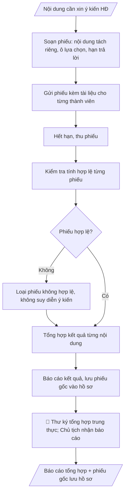

# Phiếu lấy ý kiến hội đồng

## Định dạng và file đầu ra

Định dạng đầu ra có thể chọn theo sản phẩm/yêu cầu: .docx, .pdf. Đọc mục “Định dạng bổ sung” trong quy cách đầu ra trước khi chọn.

**Phải tạo file thực tế để tải xuống, không chỉ trả nội dung trong chat.** Định dạng mặc định của skill: **.docx**. Nếu có bảng số liệu nghiệp vụ yêu cầu file bảng tính riêng, tạo thêm Excel theo yêu cầu; không tự tạo file kiểm tra. Không chờ người dùng yêu cầu xuất file lần nữa. Ưu tiên định dạng người dùng chỉ định; đọc quy tắc xuất file tại references/quy-cach-dau-ra.md.

## Quy cách đầu ra và thông tin thiếu

Đọc [quy cách và cấu trúc sản phẩm](references/quy-cach-dau-ra.md) trước khi soạn/xuất. File giao chỉ gồm văn bản hoặc sản phẩm nghiệp vụ được yêu cầu; kiểm tra nội bộ không xuất kèm. Thiếu thông tin giữ nguyên trường/mục và chỗ điền theo mẫu gốc (dòng dấu chấm, dấu gạch hoặc ô trống); không tự điền dữ liệu mẫu, số 0, mã chờ xác minh hoặc dòng chờ ký. Mẫu chuyên ngành còn áp dụng được ưu tiên về cấu trúc, mã biểu và người ký. Các trường “bắt buộc” là điều kiện hoàn thiện hồ sơ, không ngăn việc soạn bản có chỗ chừa để điền. Mọi chỉ dẫn “để trống” trong skill được hiểu là không điền dữ liệu và giữ cách chừa chỗ của mẫu gốc, không phải xóa dấu chấm của mẫu.

## Kiểm soát áp dụng và phê duyệt

Trước khi chạy quy trình, xác định `ngay_ap_dung`, `loai_hinh_truong`, `quy_che_noi_bo`, `nguon_du_lieu` và `nguoi_kiem_duyet`. Chỉ yêu cầu thông tin có liên quan đến nghiệp vụ; không dùng giá trị giả định thay dữ liệu bắt buộc. Đối chiếu nội bộ hồ sơ có yếu tố pháp lý với văn bản gốc, hiệu lực, điều khoản áp dụng và chuyển tiếp; không tự đính kèm bảng kiểm tra vào file giao.

## Giới hạn và human gate

AI hỗ trợ chuẩn bị và đối chiếu. Cán bộ phụ trách kiểm tra dữ liệu/căn cứ, người có thẩm quyền duyệt và ký. Văn bản soạn chưa được coi là đã ban hành; không tự chèn nhãn trạng thái kiểm duyệt vào file giao; không đánh dấu đã ký, đã duyệt hoặc đã công bố nếu chưa có chứng cứ. Dữ liệu sinh viên, sức khỏe, nhân sự và tài chính phải hạn chế theo mục đích, phân quyền và che thông tin định danh khi dùng ví dụ. Không tải dữ liệu lên dịch vụ ngoài khi chưa có quyền. Kiểm tra Luật 91/2025/QH15 về bảo vệ dữ liệu cá nhân (hiệu lực 01/01/2026) và quy định áp dụng trước xử lý/chia sẻ dữ liệu cá nhân.

## Khi nào dùng
Khi cần xin ý kiến Hội đồng KH&ĐT bằng văn bản (không họp tập trung): các nội dung phát sinh
giữa hai kỳ họp, nội dung đơn giản đã có đủ tài liệu, hoặc cần ý kiến nhanh. Không áp dụng cho
nội dung mà quy chế bắt buộc phải họp.

## Đầu vào (Input)

| Trường | Mô tả | Bắt buộc |
|---|---|---|
| `noi_dung_xin_y_kien` | Từng nội dung cần xin ý kiến, trình bày ngắn gọn rõ ràng | Có |
| `tai_lieu_kem` | Danh mục tài liệu gửi kèm để thành viên nghiên cứu | Có |
| `thanh_vien` | Danh sách thành viên được xin ý kiến | Có |
| `han_tra_loi` | Thời hạn trả lời phiếu | Có |
| `hinh_thuc_y_kien` | Đồng ý / Không đồng ý / Ý kiến khác (ghi rõ) | Không (mặc định: 3 ô trên) |

## Quy trình

**Bước 1. Soạn phiếu lấy ý kiến**
- Làm gì: soạn phiếu gồm tiêu đề; từng nội dung trong `noi_dung_xin_y_kien` tách riêng, trình bày ngắn gọn rõ ràng; danh mục `tai_lieu_kem`; các ô lựa chọn theo `hinh_thuc_y_kien` (mặc định: Đồng ý / Không đồng ý / Ý kiến khác + dòng ghi ý kiến); họ tên + chữ ký thành viên; `han_tra_loi` và nơi gửi lại.
- Dùng input: `noi_dung_xin_y_kien`, `tai_lieu_kem`, `han_tra_loi`, `hinh_thuc_y_kien`.
- Vai trò: Thư ký hội đồng (soạn phiếu theo đúng nội dung xin ý kiến) · AI hỗ trợ: soạn phiếu: nội dung tách riêng, ô lựa chọn, hạn trả lời, nơi gửi lại · ⏱ ~15–20 phút (ước tính)
- Lưu ý nghiệp vụ: mỗi nội dung chỉ hỏi một vấn đề, không gộp nhiều câu hỏi vào một ô; không dùng phiếu lấy ý kiến thay phiên họp đối với nội dung quy chế bắt buộc phải họp.
- → Kết quả bước: mẫu phiếu lấy ý kiến hoàn chỉnh.

**Bước 2. Gửi phiếu kèm tài liệu**
- Làm gì: gửi phiếu cho từng thành viên trong `thanh_vien` kèm đầy đủ `tai_lieu_kem` (bản giấy hoặc điện tử theo quy chế); ghi nhận thời điểm gửi và danh sách đã nhận.
- Dùng input: `thanh_vien`, `tai_lieu_kem`, kết quả bước 1.
- Vai trò: Văn thư (gửi phiếu kèm đầy đủ tài liệu cho toàn bộ thành viên) · AI hỗ trợ: lập danh sách gửi và theo dõi nhận/trả · ⏱ ~15–30 phút (ước tính)
- Lưu ý nghiệp vụ: kiểm tra không sót thành viên; lưu bằng chứng đã gửi để xác định phiếu gửi trễ hạn khi tổng hợp.
- → Kết quả bước: phiếu đã gửi đến toàn bộ thành viên + danh sách theo dõi nhận/trả.

**Bước 3. Thu phiếu và kiểm tra tính hợp lệ**
- Làm gì: hết `han_tra_loi`, thu phiếu về; kiểm tra từng phiếu: có chữ ký thành viên, gửi trong hạn, ý kiến ghi rõ ràng; loại phiếu không hợp lệ (thiếu chữ ký, trễ hạn, ý kiến mơ hồ).
- Dùng input: `han_tra_loi`, kết quả bước 2.
- Vai trò: Thư ký hội đồng (thu phiếu, kiểm tra tính hợp lệ, loại phiếu không hợp lệ) · AI hỗ trợ: tổng hợp trước danh sách phiếu thu được theo hạn trả lời, hỗ trợ đối chiếu chữ ký · ⏱ ~30 phút–1 giờ (tùy số phiếu) (ước tính)
- Lưu ý nghiệp vụ: tuyệt đối không suy diễn ý kiến từ phiếu không ghi rõ hoặc phiếu trễ hạn; phiếu không hợp lệ phải loại khỏi tổng hợp và ghi rõ lý do.
- → Kết quả bước: tập phiếu hợp lệ + danh sách phiếu bị loại (kèm lý do).

**Bước 4. Tổng hợp kết quả từng nội dung**
- Làm gì: đếm số phiếu phát ra/thu về; với mỗi nội dung, tổng hợp số đồng ý/không đồng ý/ý kiến khác; trích nguyên văn các ý kiến khác (nếu có); lập bảng tổng hợp.
- Dùng input: kết quả bước 3.
- Vai trò: Thư ký hội đồng (tổng hợp kết quả chỉ từ phiếu hợp lệ) · AI hỗ trợ: đếm và tổng hợp kết quả từng nội dung, trích nguyên văn ý kiến khác · ⏱ ~15–30 phút (ước tính)
- Lưu ý nghiệp vụ: chỉ tổng hợp phiếu hợp lệ; không công bố kết quả khi chưa đủ số phiếu hợp lệ theo quy định; trích ý kiến khác phải nguyên văn, không diễn giải lại.
- → Kết quả bước: bảng tổng hợp kết quả từng nội dung.

**Bước 5. Báo cáo kết quả và lưu hồ sơ**
- Làm gì: lập báo cáo tổng hợp kết quả trình Chủ tịch hội đồng; lưu phiếu gốc vào hồ sơ như biên bản họp.
- Dùng input: kết quả bước 4.
- Vai trò: Chủ tịch hội đồng (nhận báo cáo); Thư ký lưu phiếu gốc vào hồ sơ · AI hỗ trợ: lập báo cáo tổng hợp kết quả trình Chủ tịch · ⏱ ~20–30 phút (ước tính)
- Lưu ý nghiệp vụ: báo cáo phải nêu rõ kết luận từng nội dung (được đa số tán thành hay không) và ý kiến cần tiếp thu; phiếu gốc lưu đầy đủ, không thất lạc.
- → Kết quả bước: báo cáo tổng hợp trình Chủ tịch + phiếu gốc lưu hồ sơ.
## Luồng quy trình (Workflow)

## Đầu ra

File nghiệp vụ thực tế theo định dạng mặc định ở đầu skill hoặc định dạng người dùng yêu cầu, kèm liên kết tải trong phản hồi cuối.

Sản phẩm nghiệp vụ hoàn chỉnh theo [quy cách và cấu trúc](references/quy-cach-dau-ra.md), giữ các trường chưa có dữ liệu ở trạng thái trống. Không xuất kèm checklist/phụ lục kiểm tra đầu ra.

## Kiểm tra nội bộ trước khi giao

- [ ] Bố cục khớp mẫu áp dụng và cấu trúc tại references/quy-cach-dau-ra.md.
- [ ] Mỗi nội dung chỉ hỏi một vấn đề, không gộp nhiều câu hỏi vào một ô; nội dung quy chế bắt buộc phải họp không dùng phiếu lấy ý kiến thay phiên họp.
- [ ] Phiếu gửi đúng toàn bộ thành viên kèm đầy đủ tài liệu (bản giấy hoặc điện tử theo quy chế); lưu bằng chứng đã gửi để xác định phiếu gửi trễ hạn.
- [ ] Chỉ tổng hợp phiếu hợp lệ (có chữ ký thành viên, gửi trong hạn, ý kiến ghi rõ ràng); phiếu không hợp lệ loại khỏi tổng hợp và ghi rõ lý do.
- [ ] Bảng tổng hợp: số phiếu phát ra/thu về + số đồng ý/không đồng ý/ý kiến khác từng nội dung; ý kiến khác trích nguyên văn, không diễn giải lại.
- [ ] Không công bố kết quả khi chưa đủ số phiếu hợp lệ theo quy định.
- [ ] Báo cáo nêu rõ kết luận từng nội dung (được đa số tán thành hay không) và ý kiến cần tiếp thu; phiếu gốc lưu đầy đủ như biên bản họp, không thất lạc.
- [ ] Đã qua Human gate: Chủ tịch quyết định áp dụng hình thức lấy ý kiến bằng văn bản (chỉ nội dung quy chế cho phép); thư ký tổng hợp trung thực.

> Tiêu chí đạt: tất cả các ô được đánh dấu.

## Human gate (người kiểm duyệt)
- **Chủ tịch hội đồng** quyết định áp dụng hình thức lấy ý kiến bằng văn bản (chỉ cho nội dung
  quy chế cho phép, không thay phiên họp bắt buộc).
- **Thư ký hội đồng** tổng hợp trung thực, báo cáo kết quả trình Chủ tịch.

## Giới hạn (guardrails)
- KHÔNG dùng phiếu lấy ý kiến thay cho phiên họp đối với nội dung quy chế bắt buộc phải họp
  (VD: thông qua chương trình đào tạo, xét học hàm... — theo quy chế từng trường).
- KHÔNG suy diễn ý kiến từ phiếu không ghi rõ hoặc phiếu gửi trễ hạn.
- KHÔNG công bố kết quả khi chưa đủ số phiếu hợp lệ theo quy định.

## Căn cứ & lưu ý
- Quy chế tổ chức và hoạt động của Hội đồng KH&ĐT (quy định về hình thức lấy ý kiến).
- Phiếu gốc phải được lưu hồ sơ đầy đủ như biên bản họp.
- Không dùng tên thật của trường/cá nhân khi mô phỏng.

## Quản trị phiên bản

- Phiên bản gói: `1.3.1`; ngày cập nhật: `2026-10-10`.
- Kho nguồn: https://github.com/phamtruong91/university-skills-framework
- Người duy trì trên GitHub: `phamtruong91` (Phạm Văn Trường). Người phê duyệt nghiệp vụ: **chưa chỉ định**.
- Commit nguồn trước cập nhật: `346719e6b0318ed034b4b016703f79733aa575e7`. Commit chứa phiên bản này xem bằng `git log -1 -- skills/phieu-lay-y-kien-hoi-dong`; không tự gán SHA chưa tạo.
- Giấy phép: theo LICENSE của kho; bản quyền CES Global.
- Lịch sử 1.1.0: bổ sung metadata giao diện, kiểm soát áp dụng, quản trị phiên bản.
- Trạng thái: dự thảo nghiệp vụ; kiểm tra pháp lý trước thực thi. Ngày cập nhật không đồng nghĩa mọi văn bản đã được rà soát toàn văn.
