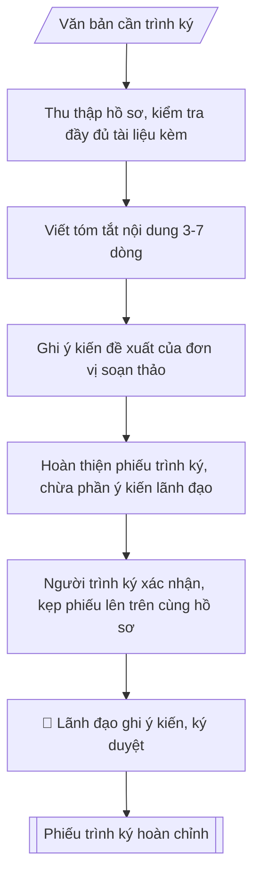

# Skill: Lập phiếu trình ký

## Khi nào dùng
Khi trình ký mọi văn bản, hồ sơ cần lãnh đạo trường ký duyệt: quyết định, kế hoạch,
báo cáo, tờ trình, hợp đồng...

## Đầu vào (Input)

| Trường | Mô tả | Bắt buộc |
|---|---|---|
| `van_ban_trinh` | Tên văn bản / hồ sơ trình ký (kèm số ký hiệu dự thảo nếu có) | Có |
| `don_vi_soan` | Đơn vị soạn thảo, người trình | Có |
| `tom_tat` | Tóm tắt nội dung chính của văn bản (3–7 dòng) | Có |
| `de_xuat` | Ý kiến đề xuất của đơn vị (đề nghị ký ban hành / phê duyệt / cho ý kiến...) | Có |
| `tai_lieu_kem` | Danh mục tài liệu kèm theo | Không |

## Quy trình

**Bước 1. Thu thập hồ sơ trình ký, kiểm tra đầy đủ**
- Làm gì: tập hợp đầy đủ `van_ban_trinh` (bản dự thảo) và `tai_lieu_kem`; kiểm tra có đủ chữ ký người soạn thảo, số lượng bản theo quy định, thể thức văn bản đúng Nghị định 30/2020/NĐ-CP; loại hồ sơ thiếu tài liệu kèm thì yêu cầu bổ sung trước khi lập phiếu trình.
- Dùng input: `van_ban_trinh`, `don_vi_soan`, `tai_lieu_kem`.
- Vai trò: Chuyên viên Phòng HCTH chuẩn bị, Hiệu trưởng phê duyệt · AI hỗ trợ: tổng hợp hồ sơ, soạn phiếu trình/tờ trình đầy đủ · ⏱ ~15–30 phút chuẩn bị + chờ duyệt (ước tính)
- Lưu ý nghiệp vụ: văn bản trình ký phải là bản sạch, không còn lỗi chính tả; tài liệu kèm phải đánh số thứ tự và liệt kê đầy đủ — bẫy thường gặp là trình thiếu phụ lục, danh sách kèm theo.
- → Kết quả bước: bộ hồ sơ đủ điều kiện trình ký.

**Bước 2. Viết tóm tắt nội dung văn bản**
- Làm gì: từ `tom_tat`, viết đoạn tóm tắt 3–7 dòng nêu rõ: văn bản giải quyết việc gì, căn cứ pháp lý chính, nội dung cốt lõi (quyết định gì / phê duyệt gì / ban hành gì).
- Dùng input: `tom_tat`, `van_ban_trinh`.
- Vai trò: Chuyên viên Phòng HCTH · AI hỗ trợ: soạn dự thảo đúng thể thức · ⏱ ~20–45 phút (ước tính)
- Lưu ý nghiệp vụ: tóm tắt để lãnh đạo nắm nhanh — bẫy là chép lại dài dòng gần như toàn văn; mỗi ý một dòng, dùng câu ngắn; bắt buộc nêu căn cứ pháp lý nếu văn bản có tính quy phạm/quyết định.
- → Kết quả bước: đoạn tóm tắt nội dung chuẩn 3–7 dòng.

**Bước 3. Ghi ý kiến đề xuất của đơn vị soạn thảo**
- Làm gì: từ `de_xuat`, viết ý kiến đề xuất theo công thức chuẩn: "Kính đề nghị Hiệu trưởng (Phó Hiệu trưởng) xem xét, ký ban hành / phê duyệt / cho ý kiến chỉ đạo..." — phải chọn đúng một động từ phù hợp loại văn bản trình.
- Dùng input: `de_xuat`, `van_ban_trinh`.
- Vai trò: Chuyên viên Phòng HCTH · AI hỗ trợ: soạn dự thảo đúng thể thức · ⏱ ~20–45 phút (ước tính)
- Lưu ý nghiệp vụ: đề xuất phải dứt khoát, không viết mập mờ kiểu "xin ý kiến" chung chung; phân biệt rõ "ký ban hành" (văn bản đã hoàn chỉnh), "phê duyệt" (đề án, kế hoạch), "cho ý kiến chỉ đạo" (vấn đề chưa ngã ngũ).
- → Kết quả bước: mục ý kiến đề xuất rõ ràng, đúng thẩm quyền.

**Bước 4. Hoàn thiện phiếu trình ký theo khung chuẩn**
- Làm gì: ghép các phần theo đúng thứ tự khung chuẩn (tiêu đề đơn vị – PHIẾU TRÌNH KÝ – kính gửi – thông tin văn bản – đơn vị soạn – tóm tắt – tài liệu kèm – ý kiến đề xuất – ngày tháng và chữ ký người trình); chừa phần "Ý KIẾN CỦA LÃNH ĐẠO" trống 4–6 dòng để lãnh đạo ghi tay.
- Dùng input: tất cả các trường (`van_ban_trinh`, `don_vi_soan`, `tom_tat`, `de_xuat`, `tai_lieu_kem`).
- Vai trò: Chuyên viên Phòng HCTH chuẩn bị, Hiệu trưởng phê duyệt · AI hỗ trợ: tổng hợp hồ sơ, soạn phiếu trình/tờ trình đầy đủ · ⏱ ~15–30 phút chuẩn bị + chờ duyệt (ước tính)
- Lưu ý nghiệp vụ: phần ý kiến lãnh đạo tuyệt đối để trống, không được viết sẵn gợi ý; ghi đúng chức danh người nhận (Hiệu trưởng / Phó Hiệu trưởng phụ trách lĩnh vực).
- → Kết quả bước: phiếu trình ký dự thảo hoàn chỉnh.

**Bước 5. Kiểm tra thể thức, kẹp vào hồ sơ**
- Làm gì: người trình (`don_vi_soan`) ký xác nhận đã kiểm tra thể thức, tính chính xác của hồ sơ; kẹp phiếu trình lên trên cùng của bộ hồ sơ; đánh số thứ tự tài liệu kèm khớp với danh mục đã liệt kê.
- Dùng input: `don_vi_soan` (người trình ký xác nhận).
- Vai trò: Chuyên viên Phòng HCTH (Trưởng phòng kiểm tra lại) · AI hỗ trợ: quét lỗi theo checklist · ⏱ ~15–30 phút (ước tính)
- Lưu ý nghiệp vụ: người trình chịu trách nhiệm về tính chính xác, đầy đủ của toàn bộ hồ sơ — ký xác nhận không phải thủ tục hình thức; kiểm tra lần cuối số ký hiệu, ngày tháng trên văn bản trình.
- → Kết quả bước: bộ hồ sơ trình ký sẵn sàng (phiếu trình ở trên cùng).

**Bước 6. Lãnh đạo ghi ý kiến, ký duyệt**
- Làm gì: chuyển hồ sơ tới lãnh đạo; lãnh đạo đọc phiếu trình, ghi ý kiến vào phần để trống (đồng ý / yêu cầu chỉnh sửa / không đồng ý kèm lý do), ký tên, ghi ngày.
- Dùng input: (không dùng thêm input — đây là bước human gate).
- Vai trò: Hiệu trưởng (người ký) · AI hỗ trợ: chuẩn bị hồ sơ trình ký đầy đủ để xem xét nhanh · ⏱ ~0.5–1 ngày làm việc (ước tính)
- Lưu ý nghiệp vụ: nếu lãnh đạo yêu cầu chỉnh sửa thì quay lại Bước 1 với nội dung đã sửa; lưu phiếu trình đã ký cùng hồ sơ để làm căn cứ thực hiện.
- → Kết quả bước: phiếu trình ký hoàn chỉnh (có ý kiến và chữ ký lãnh đạo).

## Luồng quy trình (Workflow)



## Đầu ra (Output)
- Phiếu trình ký hoàn chỉnh (kèm phần ý kiến lãnh đạo để trống).

**Cấu trúc output chuẩn:** khung mẫu cố định của phiếu trình ký, theo đúng thứ tự:
1. Tiêu đề đơn vị (tên trường, tên đơn vị soạn thảo);
2. Tiêu đề "PHIẾU TRÌNH KÝ";
3. Kính gửi: (chức danh lãnh đạo nhận trình);
4. Thông tin văn bản trình ký (tên văn bản, số ký hiệu dự thảo nếu có);
5. Đơn vị soạn thảo, người trình;
6. Tóm tắt nội dung (3–7 dòng: giải quyết việc gì, căn cứ chính, nội dung cốt lõi);
7. Tài liệu kèm theo (danh mục liệt kê);
8. Ý kiến đề xuất của đơn vị soạn thảo;
9. Địa danh, ngày tháng; chữ ký người trình (chức danh, họ tên);
10. Phần "Ý KIẾN CỦA LÃNH ĐẠO" để trống (4–6 dòng) + địa danh, ngày tháng, chữ ký lãnh đạo.

## Checklist nghiệm thu

Tiêu chí đạt: tất cả các ô dưới đây được đánh dấu.

- [ ] Đủ các phần theo Cấu trúc output chuẩn: Tiêu đề đơn vị (tên trường, tên đơn vị soạn thảo); Tiêu đề "PHIẾU TRÌNH KÝ"; Kính gửi: (chức danh lãnh đạo nhận trình); Thông tin văn bản trình ký (tên văn bản, số ký hiệu dự thảo nếu có); … (đủ 10 phần)
- [ ] Nội dung và số liệu trong output khớp đúng với Input đã cho (không thêm, bớt hay suy diễn)
- [ ] Không bịa đặt số liệu, minh chứng, trích dẫn hay căn cứ
- [ ] Đúng thể thức và định dạng theo Phiếu trình ký giúp lãnh đạo nắm nhanh nội dung, không phải đọc toà…
- [ ] Căn cứ pháp lý được trích dẫn đầy đủ và còn hiệu lực
- [ ] Đã qua Human gate: người có thẩm quyền đã kiểm tra/duyệt trước khi phát hành
- [ ] Văn bản trình ký phải là bản sạch, không còn lỗi chính tả
- [ ] Tài liệu kèm phải đánh số thứ tự và liệt kê đầy đủ — bẫy thường gặp là trình thiếu phụ lục, danh sách kèm theo
- [ ] Bắt buộc nêu căn cứ pháp lý nếu văn bản có tính quy phạm/quyết định

## Ví dụ mô phỏng (dữ liệu giả lập)

> Tất cả tên trường, cá nhân, số liệu dưới đây đều là **giả lập**, không liên quan tổ chức/cá nhân có thật.

### Input mẫu

| Trường | Giá trị |
|---|---|
| `van_ban_trinh` | Dự thảo Quyết định thành lập Ban Tổ chức Hội thảo khoa học sinh viên toàn trường năm 2026 |
| `don_vi_soan` | Phòng Khoa học công nghệ và Hợp tác quốc tế – TS. Đỗ Thị A |
| `tom_tat` | Thành lập Ban Tổ chức 09 thành viên để triển khai Hội thảo khoa học SV toàn trường năm 2026 (dự kiến tháng 12/2026). Căn cứ: Quy chế tổ chức và hoạt động của Trường; Tờ trình số 45/TTr-KHCN. |
| `de_xuat` | Kính đề nghị Hiệu trưởng xem xét, ký ban hành Quyết định |
| `tai_lieu_kem` | Dự thảo Quyết định; danh sách thành viên Ban Tổ chức |

### Output mẫu

```
TRƯỜNG ĐẠI HỌC A
PHÒNG KHCN & HTQT

PHIẾU TRÌNH KÝ
(Dữ liệu giả lập)

Kính gửi: Hiệu trưởng

1. Văn bản trình ký: Dự thảo Quyết định thành lập Ban Tổ chức Hội thảo khoa
   học sinh viên toàn trường năm 2026.
2. Đơn vị soạn thảo: Phòng Khoa học công nghệ và Hợp tác quốc tế.
3. Tóm tắt nội dung: Thành lập Ban Tổ chức gồm 09 thành viên để triển khai
   Hội thảo khoa học sinh viên toàn trường năm 2026 (dự kiến tháng 12/2026).
   Căn cứ: Quy chế tổ chức và hoạt động của Trường; Tờ trình số 45/TTr-KHCN
   ngày 01/10/2026.
4. Tài liệu kèm theo: Dự thảo Quyết định; danh sách thành viên Ban Tổ chức.
5. Ý kiến đề xuất: Kính đề nghị Hiệu trưởng xem xét, ký ban hành Quyết định.

Thành phố C, ngày 08 tháng 10 năm 2026
NGƯỜI TRÌNH (đã ký)

TS. Đỗ Thị A

Ý KIẾN CỦA LÃNH ĐẠO:
........................................................................
........................................................................

Thành phố C, ngày ... tháng ... năm ...
HIỆU TRƯỞNG
```

## Căn cứ & lưu ý
- Phiếu trình ký giúp lãnh đạo nắm nhanh nội dung, không phải đọc toàn bộ hồ sơ.
- Người trình chịu trách nhiệm về tính chính xác, đầy đủ của hồ sơ trình ký.
- Không dùng tên thật của trường/cá nhân khi mô phỏng.
