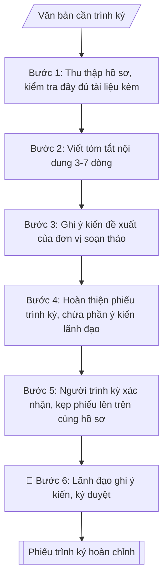

# Lập phiếu trình ký

## Định dạng và file đầu ra

Định dạng đầu ra có thể chọn theo sản phẩm/yêu cầu: .docx, .pdf. Đọc mục “Định dạng bổ sung” trong quy cách đầu ra trước khi chọn.

**Phải tạo file thực tế để tải xuống, không chỉ trả nội dung trong chat.** Định dạng mặc định của skill: **.docx**. Nếu có bảng số liệu nghiệp vụ yêu cầu file bảng tính riêng, tạo thêm Excel theo yêu cầu; không tự tạo file kiểm tra. Không chờ người dùng yêu cầu xuất file lần nữa. Ưu tiên định dạng người dùng chỉ định; đọc quy tắc xuất file tại references/quy-cach-dau-ra.md.

## Quy cách đầu ra và thông tin thiếu
Đọc [quy cách và cấu trúc sản phẩm](references/quy-cach-dau-ra.md) trước khi soạn/xuất. File giao chỉ gồm sản phẩm nghiệp vụ được yêu cầu; kiểm tra nội bộ không xuất kèm. Thiếu thông tin thì giữ nguyên trường/mục và chỗ điền theo mẫu gốc (dòng dấu chấm, dấu gạch hoặc ô trống); không tự điền dữ liệu mẫu, số 0, mã chờ xác minh hay dòng chờ ký. Mẫu chuyên ngành còn áp dụng được ưu tiên về cấu trúc, mã biểu và người ký. Bản đầy đủ: [quy tắc chung](references/quy-tac-chung.md).

## Kiểm soát áp dụng và phê duyệt
Trước khi chạy, xác định `ngay_ap_dung`, `loai_hinh_truong`, `quy_che_noi_bo`, `nguon_du_lieu`, `nguoi_kiem_duyet`; chỉ hỏi thông tin liên quan nghiệp vụ, không dùng giá trị giả định thay dữ liệu bắt buộc. Đối chiếu căn cứ pháp lý với văn bản gốc, hiệu lực, điều khoản áp dụng và chuyển tiếp. Bản đầy đủ: [quy tắc chung](references/quy-tac-chung.md).

## Giới hạn và human gate
AI hỗ trợ chuẩn bị và đối chiếu; cán bộ phụ trách kiểm tra dữ liệu/căn cứ, người có thẩm quyền duyệt và ký. Không đánh dấu đã ký, đã duyệt, đã công bố khi chưa có chứng cứ. Dữ liệu sinh viên, sức khỏe, nhân sự, tài chính chỉ dùng theo mục đích và phân quyền, che thông tin định danh khi dùng ví dụ (Luật 91/2025/QH15, hiệu lực 01/01/2026); không tải dữ liệu lên dịch vụ ngoài khi chưa có quyền. Bản đầy đủ: [quy tắc chung](references/quy-tac-chung.md).

## Khi nào dùng
Khi trình ký mọi văn bản, hồ sơ cần lãnh đạo trường ký duyệt: quyết định, kế hoạch,
báo cáo, tờ trình, hợp đồng...

## Đầu vào (Input)

| Trường | Mô tả | Bắt buộc |
|---|---|---|
| `van_ban_trinh` | Tên văn bản / hồ sơ trình ký (kèm số ký hiệu dự thảo nếu có) | Có |
| `don_vi_soan` | Đơn vị soạn thảo, người trình | Có |
| `tom_tat` | Tóm tắt nội dung chính của văn bản (3–7 dòng) | Có |
| `de_xuat` | Ý kiến đề xuất của đơn vị (đề nghị ký ban hành / phê duyệt / cho ý kiến...) | Có |
| `tai_lieu_kem` | Danh mục tài liệu kèm theo | Không |

## Quy trình

**Bước 1. Thu thập hồ sơ trình ký, kiểm tra đầy đủ**
- Làm gì: tập hợp đầy đủ `van_ban_trinh` (bản dự thảo) và `tai_lieu_kem`; kiểm tra có đủ chữ ký người soạn thảo, số lượng bản theo quy định, thể thức văn bản đúng Nghị định 30/2020/NĐ-CP; loại hồ sơ thiếu tài liệu kèm thì yêu cầu bổ sung trước khi lập phiếu trình.
- Dùng input: `van_ban_trinh`, `don_vi_soan`, `tai_lieu_kem`.
- Vai trò: Chuyên viên đơn vị trình chuẩn bị · AI hỗ trợ: tổng hợp hồ sơ, soạn phiếu trình/tờ trình đầy đủ · ⏱ ~15–30 phút chuẩn bị + chờ duyệt (ước tính)
- Lưu ý nghiệp vụ: văn bản trình ký phải là bản sạch, không còn lỗi chính tả; tài liệu kèm phải đánh số thứ tự và liệt kê đầy đủ — bẫy thường gặp là trình thiếu phụ lục, danh sách kèm theo.
- → Kết quả bước: bộ hồ sơ đủ điều kiện trình ký.

**Bước 2. Viết tóm tắt nội dung văn bản**
- Làm gì: từ `tom_tat`, viết đoạn tóm tắt 3–7 dòng nêu rõ: văn bản giải quyết việc gì, căn cứ pháp lý chính, nội dung cốt lõi (quyết định gì / phê duyệt gì / ban hành gì).
- Dùng input: `tom_tat`, `van_ban_trinh`.
- Vai trò: Chuyên viên Phòng HCTH · AI hỗ trợ: soạn dự thảo đúng thể thức · ⏱ ~20–45 phút (ước tính)
- Lưu ý nghiệp vụ: tóm tắt để lãnh đạo nắm nhanh — bẫy là chép lại dài dòng gần như toàn văn; mỗi ý một dòng, dùng câu ngắn; bắt buộc nêu căn cứ pháp lý nếu văn bản có tính quy phạm/quyết định.
- → Kết quả bước: đoạn tóm tắt nội dung chuẩn 3–7 dòng.

**Bước 3. Ghi ý kiến đề xuất của đơn vị soạn thảo**
- Làm gì: từ `de_xuat`, viết ý kiến đề xuất theo công thức chuẩn: "Kính đề nghị Hiệu trưởng (Phó Hiệu trưởng) xem xét, ký ban hành / phê duyệt / cho ý kiến chỉ đạo..." — phải chọn đúng một động từ phù hợp loại văn bản trình.
- Dùng input: `de_xuat`, `van_ban_trinh`.
- Vai trò: Chuyên viên Phòng HCTH · AI hỗ trợ: soạn dự thảo đúng thể thức · ⏱ ~20–45 phút (ước tính)
- Lưu ý nghiệp vụ: đề xuất phải dứt khoát, không viết mập mờ kiểu "xin ý kiến" chung chung; phân biệt rõ "ký ban hành" (văn bản đã hoàn chỉnh), "phê duyệt" (đề án, kế hoạch), "cho ý kiến chỉ đạo" (vấn đề chưa ngã ngũ).
- → Kết quả bước: mục ý kiến đề xuất rõ ràng, đúng thẩm quyền.

**Bước 4. Hoàn thiện phiếu trình ký theo khung chuẩn**
- Làm gì: ghép các phần theo đúng thứ tự khung chuẩn (tiêu đề đơn vị – PHIẾU TRÌNH KÝ – kính gửi – thông tin văn bản – đơn vị soạn – tóm tắt – tài liệu kèm – ý kiến đề xuất – ngày tháng và chữ ký người trình); chừa phần "Ý KIẾN CỦA LÃNH ĐẠO" trống 4–6 dòng để lãnh đạo ghi tay.
- Dùng input: tất cả các trường (`van_ban_trinh`, `don_vi_soan`, `tom_tat`, `de_xuat`, `tai_lieu_kem`).
- Vai trò: Chuyên viên đơn vị trình chuẩn bị · AI hỗ trợ: tổng hợp hồ sơ, soạn phiếu trình/tờ trình đầy đủ · ⏱ ~15–30 phút chuẩn bị + chờ duyệt (ước tính)
- Lưu ý nghiệp vụ: phần ý kiến lãnh đạo tuyệt đối để trống, không được viết sẵn gợi ý; ghi đúng chức danh người nhận (Hiệu trưởng / Phó Hiệu trưởng phụ trách lĩnh vực).
- → Kết quả bước: phiếu trình ký dự thảo hoàn chỉnh.

**Bước 5. Kiểm tra thể thức, kẹp vào hồ sơ**
- Làm gì: người trình (`don_vi_soan`) ký xác nhận đã kiểm tra thể thức, tính chính xác của hồ sơ; kẹp phiếu trình lên trên cùng của bộ hồ sơ; đánh số thứ tự tài liệu kèm khớp với danh mục đã liệt kê.
- Dùng input: `don_vi_soan` (người trình ký xác nhận).
- Vai trò: Chuyên viên Phòng HCTH (Trưởng phòng kiểm tra lại) · AI hỗ trợ: quét lỗi theo checklist · ⏱ ~15–30 phút (ước tính)
- Lưu ý nghiệp vụ: người trình chịu trách nhiệm về tính chính xác, đầy đủ của toàn bộ hồ sơ — ký xác nhận không phải thủ tục hình thức; kiểm tra lần cuối số ký hiệu, ngày tháng trên văn bản trình.
- → Kết quả bước: bộ hồ sơ trình ký sẵn sàng (phiếu trình ở trên cùng).

**Bước 6. Lãnh đạo ghi ý kiến, ký duyệt**
- Làm gì: chuyển hồ sơ tới lãnh đạo; lãnh đạo đọc phiếu trình, ghi ý kiến vào phần để trống (đồng ý / yêu cầu chỉnh sửa / không đồng ý kèm lý do), ký tên, ghi ngày.
- Dùng input: (không dùng thêm input — đây là bước human gate).
- Vai trò: Hiệu trưởng (người ký) · AI hỗ trợ: chuẩn bị hồ sơ trình ký đầy đủ để xem xét nhanh · ⏱ ~0.5–1 ngày làm việc (ước tính)
- Lưu ý nghiệp vụ: nếu lãnh đạo yêu cầu chỉnh sửa thì quay lại Bước 1 với nội dung đã sửa; lưu phiếu trình đã ký cùng hồ sơ để làm căn cứ thực hiện.
- → Kết quả bước: phiếu trình ký hoàn chỉnh (có ý kiến và chữ ký lãnh đạo).

## Luồng quy trình (Workflow)

## Đầu ra

File nghiệp vụ thực tế theo định dạng mặc định ở đầu skill hoặc định dạng người dùng yêu cầu, kèm liên kết tải trong phản hồi cuối.

Sản phẩm nghiệp vụ hoàn chỉnh theo [quy cách và cấu trúc](references/quy-cach-dau-ra.md), giữ các trường chưa có dữ liệu ở trạng thái trống. Không xuất kèm checklist/phụ lục kiểm tra đầu ra.

## Kiểm tra nội bộ trước khi giao

Các tiêu chí sau dùng để tự đối chiếu; không sao chép vào file xuất. Mục thiếu dữ liệu được để trống, không đánh dấu đã đạt hoặc đã duyệt.

- [ ] Bố cục khớp mẫu áp dụng và cấu trúc tại references/quy-cach-dau-ra.md.
- [ ] Nội dung và số liệu trong output khớp đúng với Input đã cho (không thêm, bớt hay suy diễn)
- [ ] Không bịa đặt số liệu, minh chứng, trích dẫn hay căn cứ
- [ ] Đúng khung phiếu trình ký tại references/quy-cach-dau-ra.md; văn bản trình kèm đúng thể thức Nghị định 30/2020/NĐ-CP (đối chiếu hiệu lực tại ngày nghiệp vụ).
- [ ] Căn cứ pháp lý được trích dẫn đầy đủ và còn hiệu lực
- [ ] Không coi bản soạn là đã ký/đã duyệt; việc phê duyệt thuộc người có thẩm quyền trước phát hành
- [ ] Văn bản trình ký phải là bản sạch, không còn lỗi chính tả
- [ ] Tài liệu kèm phải đánh số thứ tự và liệt kê đầy đủ — bẫy thường gặp là trình thiếu phụ lục, danh sách kèm theo
- [ ] Bắt buộc nêu căn cứ pháp lý nếu văn bản có tính quy phạm/quyết định

## Căn cứ & lưu ý
- Phiếu trình ký giúp lãnh đạo nắm nhanh nội dung, không phải đọc toàn bộ hồ sơ.
- Người trình chịu trách nhiệm về tính chính xác, đầy đủ của hồ sơ trình ký.
- Không dùng tên thật của trường/cá nhân khi mô phỏng.

## Quản trị phiên bản
- Phiên bản gói `1.3.2` (cập nhật 2026-10-10); hồ sơ đầy đủ tại [references/version.json](references/version.json).
- Người phê duyệt nghiệp vụ: **chưa chỉ định**. Trạng thái: dự thảo nghiệp vụ; kiểm tra pháp lý trước thực thi. Ngày cập nhật không đồng nghĩa mọi văn bản đã được rà soát toàn văn.
- Giấy phép theo LICENSE của kho (bản quyền CES Global). Lịch sử thay đổi: CHANGELOG.md.
