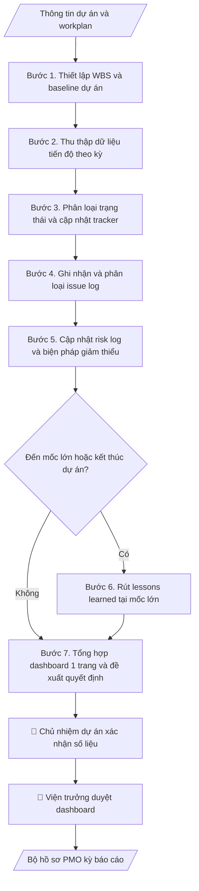

# Quản trị dự án (PMO)

## Kiểm soát áp dụng và phê duyệt

Trước khi chạy quy trình, xác định `ngay_ap_dung`, `loai_hinh_truong`, `quy_che_noi_bo`, `nguon_du_lieu` và `nguoi_kiem_duyet`. Chỉ yêu cầu thông tin có liên quan đến nghiệp vụ; không dùng giá trị giả định thay dữ liệu bắt buộc. Hồ sơ có yếu tố pháp lý phải kèm văn bản gốc, tình trạng hiệu lực, điều khoản áp dụng và chuyển tiếp.

## Giới hạn và human gate

AI hỗ trợ chuẩn bị và đối chiếu. Cán bộ phụ trách kiểm tra dữ liệu/căn cứ, người có thẩm quyền duyệt và ký. Mọi đầu ra mặc định là **DỰ THẢO – CHỜ KIỂM DUYỆT**; không đánh dấu đã ký, đã duyệt hoặc đã công bố nếu chưa có chứng cứ. Dữ liệu sinh viên, sức khỏe, nhân sự và tài chính phải hạn chế theo mục đích, phân quyền và che thông tin định danh khi dùng ví dụ. Không tải dữ liệu lên dịch vụ ngoài khi chưa có quyền. Kiểm tra Luật 91/2025/QH15 về bảo vệ dữ liệu cá nhân (hiệu lực 01/01/2026) và quy định áp dụng trước xử lý/chia sẻ dữ liệu cá nhân.

## Khi nào dùng
Khi Viện ĐMST & CGCN (hoặc đơn vị tương đương) cần quản trị một dự án: theo dõi tiến độ các gói
việc, ghi nhận vấn đề/rủi ro, rút bài học kinh nghiệm, tổng hợp dashboard báo cáo.

## Đầu vào (Input)

| Trường | Mô tả | Bắt buộc |
|---|---|---|
| `ten_du_an` | Tên dự án + mã dự án | Có |
| `chu_du_an` | Chủ nhiệm / quản lý dự án | Có |
| `muc_tieu` | Mục tiêu và phạm vi dự án | Có |
| `workplan` | Danh sách gói việc: tên, mốc hoàn thành, người phụ trách | Có |
| `ngan_sach` | Tổng ngân sách và phân bổ theo gói việc | Không |
| `ky_bao_cao` | Chu kỳ cập nhật (tuần/tháng) | Không (mặc định: tháng) |

## Quy trình

**Bước 1. Thiết lập WBS và baseline dự án**
- Làm gì: Chia dự án thành các gói việc (WP) từ `workplan`; mỗi gói việc ghi rõ: tên, mốc
  hoàn thành (ngày cụ thể), người phụ trách, sản phẩm bàn giao đo đếm được, ngân sách phân
  bổ (nếu có `ngan_sach`). Chốt bảng này làm "baseline" (kế hoạch gốc) để mọi kỳ sau so sánh.
- Dùng input: `ten_du_an`, `chu_du_an`, `muc_tieu`, `workplan`, `ngan_sach`.
- Vai trò: Chủ nhiệm dự án · AI hỗ trợ: soạn bảng WBS dự thảo từ workplan · ⏱ 2–3 giờ (ước tính)
- Lưu ý nghiệp vụ: mỗi gói việc phải có deliverable kiểm chứng được (tránh gói việc chung
  chung kiểu "hoàn thành giai đoạn"); một người không nên phụ trách quá nhiều gói việc
  cùng kỳ; baseline sau khi chốt chỉ đổi khi có phê duyệt thay đổi phạm vi.
- → Kết quả bước: Bảng WBS (mã gói việc, tên, mốc, người phụ trách, deliverable, ngân sách)
  — baseline cố định của dự án.

**Bước 2. Thu thập dữ liệu tiến độ theo kỳ**
- Làm gì: Đến mỗi kỳ (`ky_bao_cao`: tuần/tháng), thu thập % hoàn thành thực tế từng gói
  việc từ người phụ trách, yêu cầu kèm minh chứng (biên bản, file sản phẩm, ảnh hiện
  trường). Đối chiếu với baseline bước 1, ghi chênh lệch.
- Dùng input: `ky_bao_cao`, `workplan`.
- Vai trò: Chuyên viên PMO Viện ĐMST · AI hỗ trợ: soạn biểu mẫu và tổng hợp số liệu đối chiếu · ⏱ 1–2 giờ mỗi kỳ (ước tính)
- Lưu ý nghiệp vụ: % tiến độ phải gắn minh chứng, không nhận số ước lượng miệng; phát
  hiện sớm dấu hiệu chậm (trượt mốc quá 10% thời lượng gói việc thì báo ngay chủ nhiệm).
- → Kết quả bước: Bảng dữ liệu tiến độ thô theo kỳ (gói việc, % kế hoạch, % thực tế,
  minh chứng).

**Bước 3. Phân loại trạng thái và cập nhật tracker**
- Làm gì: Đánh dấu trạng thái mỗi gói việc theo 4 mức: Đúng tiến độ / Chậm / Có nguy cơ
  chậm / Hoàn thành. Với gói "Chậm" hoặc "Có nguy cơ chậm": ghi nguyên nhân và mức chênh
  lệch so với baseline.
- Dùng input: `workplan`, `ky_bao_cao`.
- Vai trò: Chủ nhiệm dự án · AI hỗ trợ: tính chênh lệch và gợi ý phân loại trạng thái · ⏱ 30–60 phút (ước tính)
- Lưu ý nghiệp vụ: trạng thái dựa trên số liệu bước 2, không "làm đẹp" số liệu; trạng
  thái do chủ nhiệm dự án xác nhận trước khi đưa vào báo cáo.
- → Kết quả bước: Bảng tracker tiến độ kỳ hiện tại (chuẩn để báo cáo).

**Bước 4. Ghi nhận và phân loại issue log**
- Làm gì: Thu thập vấn đề phát sinh trong kỳ từ chủ nhiệm/người phụ trách; mỗi issue ghi:
  mô tả, mức độ (nghiêm trọng/trung bình/nhẹ), người xử lý, hạn xử lý, trạng thái
  (mở/đang xử lý/đóng). Rà soát issue kỳ trước: issue nào quá hạn chưa đóng thì đánh dấu
  và yêu cầu giải trình.
- Dùng input: `ten_du_an`, `chu_du_an`.
- Vai trò: Chủ nhiệm dự án · AI hỗ trợ: soạn dự thảo issue log và rà soát issue quá hạn · ⏱ 30–60 phút (ước tính)
- Lưu ý nghiệp vụ: issue "nghiêm trọng" phải có người xử lý và hạn xử lý ngay trong ngày
  ghi nhận; không đóng issue khi chưa có minh chứng đã xử lý xong.
- → Kết quả bước: Issue log cập nhật (phân loại theo mức độ, trạng thái, hạn xử lý).

**Bước 5. Cập nhật risk log và biện pháp giảm thiểu**
- Làm gì: Rà soát risk log kỳ trước: rủi ro nào đã xảy ra (chuyển thành issue), rủi ro mới
  nào xuất hiện; mỗi rủi ro ghi: mô tả, xác suất (cao/trung bình/thấp), mức tác động,
  biện pháp giảm thiểu, người theo dõi, thời hạn rà soát lại.
- Dùng input: `ten_du_an`, `workplan` (xem gói việc sắp đến mốc để đoán rủi ro).
- Vai trò: Chủ nhiệm dự án · AI hỗ trợ: rà soát risk log và đề xuất rủi ro mới · ⏱ 30–60 phút (ước tính)
- Lưu ý nghiệp vụ: với mỗi gói việc sắp đến mốc, đặt câu hỏi "điều gì có thể làm trượt
  mốc này"; biện pháp giảm thiểu phải có người chịu trách nhiệm và thời hạn cụ thể.
- → Kết quả bước: Risk log cập nhật (rủi ro + biện pháp giảm thiểu có chủ sở hữu).

**Bước 6. Rút lessons learned tại mốc lớn**
- Làm gì: Tại mỗi mốc lớn hoặc khi kết thúc dự án: chọn 3–5 sự kiện đáng chú ý (sự cố
  hoặc thành công bất ngờ); phân tích theo khung: tình huống → nguyên nhân gốc → bài
  học → khuyến nghị cụ thể cho dự án sau (ai áp dụng, áp dụng khi nào).
- Dùng input: `ten_du_an` + issue log (kết quả bước 4), risk log (kết quả bước 5).
- Vai trò: Chuyên viên PMO Viện ĐMST · AI hỗ trợ: tổng hợp khung sự kiện từ issue/risk log · ⏱ 1–2 giờ (ước tính)
- Lưu ý nghiệp vụ: khuyến nghị phải hành động được, tránh chung chung kiểu "cần phối
  hợp tốt hơn"; ghi cả bài học tích cực (điều làm tốt nên lặp lại).
- → Kết quả bước: Bảng lessons learned (tình huống → bài học → khuyến nghị).

**Bước 7. Tổng hợp dashboard 1 trang và đề xuất quyết định**
- Làm gì: Gộp kết quả các bước 3–6 thành dashboard 1 trang: tiến độ tổng thể (%), top 3
  vấn đề nghiêm trọng nhất, top 3 rủi ro, danh sách quyết định cần lãnh đạo viện (nội
  dung, phương án đề xuất, hạn quyết định). Kiểm tra số liệu nhất quán giữa tracker,
  issue log, risk log.
- Dùng input: `ten_du_an`, `chu_du_an`, `ngan_sach` (tình hình giải ngân nếu có).
- Vai trò: Viện trưởng · AI hỗ trợ: soạn dashboard 1 trang và kiểm tra nhất quán số liệu · ⏱ 1–2 giờ (ước tính)
- Lưu ý nghiệp vụ: mỗi "quyết định cần lãnh đạo" phải nêu: vấn đề gì, đề xuất phương án
  gì, cần quyết trước ngày nào và hậu quả nếu không quyết; không đưa việc nhóm tự xử
  lý được lên lãnh đạo.
- → Kết quả bước: Dashboard tóm tắt 1 trang (sản phẩm trình lãnh đạo).

## Luồng quy trình (Workflow)

## Đầu ra (Output)
- Bảng tracker tiến độ (markdown).
- Issue log và Risk log.
- Bảng lessons learned.
- Dashboard tóm tắt 1 trang.

**Cấu trúc output chuẩn** (bộ hồ sơ PMO của một kỳ báo cáo — các phần theo đúng thứ tự):
1. Bảng tracker tiến độ: gói việc, mốc, người phụ trách, % kế hoạch, % thực tế, trạng thái.
2. Issue log: mã, vấn đề, mức độ, người xử lý, hạn xử lý, trạng thái.
3. Risk log: mã, rủi ro, xác suất, mức tác động, biện pháp giảm thiểu, người theo dõi.
4. Bảng lessons learned: tình huống → nguyên nhân → bài học → khuyến nghị (chỉ khi đến
   mốc lớn hoặc kết thúc dự án).
5. Dashboard tóm tắt 1 trang: tiến độ tổng thể, top 3 vấn đề, top 3 rủi ro, quyết định
   cần lãnh đạo viện (nội dung, phương án đề xuất, hạn quyết định).

## Checklist nghiệm thu

- [ ] Đủ các phần theo "Cấu trúc output chuẩn": bảng tracker tiến độ, issue log, risk log, bảng lessons learned (khi đến mốc lớn), dashboard tóm tắt 1 trang.
- [ ] Số liệu trong tracker, issue log, risk log khớp với Input (workplan, tiến độ theo kỳ) đã cho.
- [ ] Không bịa đặt số liệu tiến độ, minh chứng, biên bản không có thật.
- [ ] Trạng thái gói việc (đúng tiến độ / chậm / nguy cơ chậm / hoàn thành) dựa trên số liệu, không "làm đẹp".
- [ ] Mỗi gói việc trong tracker có deliverable đo đếm được và người phụ trách cụ thể.
- [ ] Baseline (WBS) cố định; mọi thay đổi so với baseline đều có phê duyệt thay đổi phạm vi.
- [ ] Mỗi quyết định cần lãnh đạo viện đều nêu rõ: vấn đề, phương án đề xuất, hạn quyết định.
- [ ] Đã qua Human gate: chủ nhiệm dự án xác nhận số liệu, viện trưởng duyệt dashboard.

Tiêu chí đạt = tất cả các ô được đánh dấu.

## Ví dụ mô phỏng (dữ liệu giả lập)

> Tất cả tên trường, cá nhân, tổ chức, số liệu dưới đây đều là **giả lập**.

### Input mẫu

| Trường | Giá trị |
|---|---|
| `ten_du_an` | Nền tảng số hóa di sản văn hóa (mã ĐHA-DMST-2026-03) |
| `chu_du_an` | TS. Trần Văn D |
| `muc_tieu` | Số hóa 500 hiện vật, xây dựng cổng tra cứu trực tuyến trong 12 tháng |
| `workplan` | WP1 Khảo sát & thiết kế (T1–T3, ThS. Bùi Thị A); WP2 Số hóa hiện vật (T4–T9, TS. Trần Văn D); WP3 Cổng tra cứu (T7–T11, KS. Ngô Văn C); WP4 Nghiệm thu & bàn giao (T12) |
| `ngan_sach` | 1.200 triệu đồng |
| `ky_bao_co` | Tháng |

### Output mẫu

**TRACKER TIẾN ĐỘ — ĐHA-DMST-2026-03 (cập nhật hết tháng 6/2026)**

| Gói việc | Mốc | Phụ trách | % HT | Trạng thái |
|---|---|---|---|---|
| WP1 Khảo sát & thiết kế | T3 | ThS. Bùi Thị A | 100% | Hoàn thành |
| WP2 Số hóa hiện vật | T9 | TS. Trần Văn D | 45% | Đúng tiến độ |
| WP3 Cổng tra cứu | T11 | KS. Ngô Văn C | 20% | Có nguy cơ chậm |
| WP4 Nghiệm thu & bàn giao | T12 | TS. Trần Văn D | 0% | Chưa tới hạn |

**ISSUE LOG**

| # | Vấn đề | Mức độ | Người xử lý | Hạn | Trạng thái |
|---|---|---|---|---|---|
| I-01 | Máy scan 3D hỏng, chờ linh kiện thay thế | Nghiêm trọng | KS. Ngô Văn C | 15/07/2026 | Đang xử lý |
| I-02 | Thiếu 02 cộng tác viên nhập liệu | Trung bình | ThS. Bùi Thị A | 30/06/2026 | Đã đóng |

**RISK LOG**

| # | Rủi ro | Xác suất | Tác động | Giảm thiểu | Theo dõi |
|---|---|---|---|---|---|
| R-01 | Chậm tiến độ WP3 do phụ thuộc API đơn vị đối tác | Trung bình | Cao | Ký biên bản phối hợp, có phương án dự phòng | TS. Trần Văn D |

**LESSONS LEARNED (giữa kỳ)**

| Tình huống | Bài học | Khuyến nghị |
|---|---|---|
| Máy scan hỏng làm gián đoạn WP2 | Cần hợp đồng bảo trì thiết bị ngay từ đầu dự án | Đưa chi phí bảo trì vào dự toán mọi dự án có thiết bị |

**DASHBOARD TÓM TẮT** — Viện ĐMST & CGCN, Trường Đại học A: Tiến độ tổng thể 41% (đúng kế hoạch). Cần quyết định: phê duyệt mua linh kiện máy scan 3D (120 triệu đồng) trước 10/07/2026.

## Human gate (người kiểm duyệt)
- **Chủ nhiệm dự án** xác nhận tính chính xác của trạng thái tiến độ, issue, risk trước mỗi kỳ báo cáo.
- **Viện trưởng Viện ĐMST & CGCN** duyệt dashboard và các quyết định cần lãnh đạo trước khi trình lên Ban Giám hiệu/đối tác.

## Giới hạn (guardrails)
- KHÔNG tự động gửi báo cáo cho khách hàng/đối tác.
- KHÔNG tự ý đổi trạng thái, mốc thời gian trên hệ thống quản lý khi chưa có xác nhận của chủ nhiệm.
- KHÔNG cam kết tiến độ/kinh phí thay mặt nhà trường với đối tác.

## Căn cứ & lưu ý
- Quy chế quản lý dự án nội bộ của Viện/trường (nếu có); thông lệ PMO (PMBOK rút gọn).
- Dữ liệu dự án có thể nhạy cảm — không đưa thông tin mật lên hệ thống ngoài khi chưa được phép.
- Không dùng tên thật của trường/cá nhân/tổ chức khi mô phỏng.

## Quản trị phiên bản

- Phiên bản gói: `1.1.0`; ngày cập nhật: `2026-10-09`.
- Kho nguồn: https://github.com/phamtruong91/dh-skills
- Người duy trì trên GitHub: `phamtruong91` (Phạm Văn Trường). Người phê duyệt nghiệp vụ: **chưa chỉ định**.
- Commit nguồn trước cập nhật: `78fd1d51b8acd1a724d9b9af6c488460bc7551ad`. Commit chứa phiên bản này xem bằng `git log -1 -- skills/pmo-quan-tri-du-an`; không tự gán SHA chưa tạo.
- Giấy phép: theo LICENSE của kho; bản quyền CES Global.
- Lịch sử 1.1.0: bổ sung metadata giao diện, kiểm soát áp dụng, quản trị phiên bản.
- Trạng thái: dự thảo nghiệp vụ; kiểm tra pháp lý trước thực thi. Ngày cập nhật không đồng nghĩa mọi văn bản đã được rà soát toàn văn.
